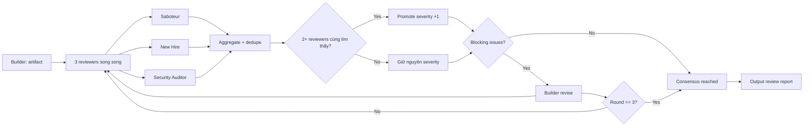

# Adversarial Consensus Protocol (C3)

> Quality Control layer cho AHD — review đối kháng bằng 3 persona độc lập.
> Phase B component — tích hợp vào Plan phase (Step 2: DESIGN) và Execute phase (Step 3: VERIFY).

## Cách gọi

```
/adversarial-consensus <artifact_path>      # Review file cụ thể (SDD, plan, code)
/adversarial-consensus review <module>      # Review module/thành phần
/adversarial-consensus <mô tả task>         # Review artifact theo mô tả
```

**Ví dụ:**
```
/adversarial-consensus docs/plans/auth/SOLUTION_DESIGN.md
/adversarial-consensus review the auth module
/adversarial-consensus review src/checkout/ for security issues
```

## Khi nào tự trigger (model)

Skill tự trigger khi:
- Plan phase Step 2 (DESIGN): sau khi ARCHITECT xuất SDD → tự động C3 review
- Execute phase Step 3 (VERIFY): sau khi BUILDER hoàn thành code → tự động C3 review
- User gọi `/adversarial-consensus` trực tiếp

## 1. Overview — C3 Pattern

Builder produces artifact → **3 independent reviewers** check → Dissenter actively seeks flaws → Issues found by 2+ reviewers promoted in severity → Builder revises → Repeat (max 3 rounds).



**Nguyên lý cốt lõi:**
- **Maker ≠ Checker** — builder không bao giờ tự verify artifact của mình
- **Adversarial, not collaborative** — mỗi reviewer cố tình tìm lỗi, không "đồng thuận dễ dãi"
- **Convergence by evidence** — consensus đạt được khi KHÔNG còn blocking issues, không phải khi hết thời gian
- **Promotion by corroboration** — issue do 2+ reviewer độc lập tìm thấy = tín hiệu mạnh, tự động tăng severity

## 2. 6+ Personas (load từ `.devin/agents/personas/`)

| Persona | File | Câu hỏi gốc | Tìm gì |
|---------|------|-------------|--------|
| **Saboteur** | `saboteur.md` | "How do I break this in production?" | Operational failure modes — race conditions, resource exhaustion, error cascade, data corruption |
| **New Hire** | `new_hire.md` | "Can I understand this with zero context?" | Cognitive gaps — unclear naming, missing context, implicit assumptions, magic numbers |
| **Security Auditor** | `security_auditor.md` | "Can an attacker exploit this?" | Security holes — OWASP Top 10, prompt injection, data leakage, privilege escalation |
| **Architect** | `architect.md` | "Is this design scalable and maintainable?" | Design smells — coupling, cohesion, SOLID violations, scalability issues |
| **Code Reviewer** | `code_reviewer.md` | "Will this code be maintainable?" | Code quality — complexity, naming, abstraction leaks, dead code |
| **Git Workflow Master** | `git_workflow_master.md` | "What merge conflicts will this cause?" | Git impact — branch strategy, history cleanliness, merge conflict risk |

> Mỗi persona có **mandate bắt buộc**: phải tìm ít nhất 1 real issue, hoặc nói "CLEAN" một cách tường minh.
> Không được "pass" im lặng — silence = failure.

## 2.5. Dynamic Attack Scenarios (MỚI — Zero-Command Max)

Ngoài 6 persona cố định, generate thêm attack scenarios động dựa trên task context:

| Task keyword | Dynamic scenario | Câu hỏi |
|--------------|-----------------|---------|
| database/db/sql | DATA_CORRUPTION_ATTACKER | "How can I corrupt data? What transactions fail silently?" |
| database/db/sql | SQL_INJECTION_TESTER | "Where can I inject SQL? Are all inputs parameterized?" |
| api/endpoint/rest | RATE_LIMIT_BREAKER | "Can I overwhelm this API? DoS vectors?" |
| api/endpoint/rest | INPUT_FUZZER | "What malformed inputs crash the API?" |
| auth/login/token | PRIVILEGE_ESCALATION_TESTER | "Can I escalate privileges? Missing auth checks?" |
| auth/login/token | TOKEN_FORGER | "Can I forge tokens? Weak signing? Replay attacks?" |
| file/upload/storage | PATH_TRAVERSAL_ATTACKER | "Can I access files outside intended directories?" |
| performance/cache | RESOURCE_EXHAUSTER | "How can I exhaust memory/CPU/connections?" |
| concurrent/async | RACE_CONDITION_EXPLOITER | "What race conditions exist? TOCTOU bugs?" |
| (generic fallback) | EDGE_CASE_HUNTER | "What extreme inputs break this? Empty? Max size? Null?" |
| (generic fallback) | FAILURE_CASCADE_ANALYST | "What happens when dependencies fail? Error cascade?" |

Dynamic scenarios được generate bởi `plan_fsm/missions.py:dynamic_scenarios()`.

## 3. Workflow

### Step 1 — Builder produces artifact
Artifact có thể là:
- SDD (Software Design Document) — Plan phase Step 2: DESIGN
- Implementation plan — Plan phase
- Code diff / module — Execute phase Step 3: VERIFY

Tag output: `[ARTIFACT] <artifact_name> | <type> | <path>`

### Step 2 — Dispatch 6+ reviewers in parallel
Mỗi reviewer chạy độc lập, không thấy output của nhau (tránh anchoring bias).

```
subagent_explore(persona=saboteur,           background=true, target=artifact)
subagent_explore(persona=new_hire,           background=true, target=artifact)
subagent_explore(persona=security_auditor,   background=true, target=artifact)
subagent_explore(persona=architect,          background=true, target=artifact)
subagent_explore(persona=code_reviewer,      background=true, target=artifact)
subagent_explore(persona=git_workflow_master, background=true, target=artifact)
# + dynamic scenarios (context-generated)
```

Mỗi reviewer output theo format:
```
[DISSENT:BLOCKING] finding | evidence | mitigation
[DISSENT:ADVISORY] finding | evidence | mitigation
```

Hoặc nếu sạch:
```
[REVIEW:PASS] CLEAN — no issues found in <focus area>
```

### Step 3 — Aggregate findings, deduplicate, promote
1. **Collect** — gom tất cả findings từ 3 reviewers
2. **Deduplicate** — issues trùng nhau (cùng root cause) nhóm lại
3. **Corroboration check** — đếm số reviewer độc lập tìm thấy cùng issue
4. **Promotion** — issue do 2+ reviewers tìm thấy → tự động tăng 1 severity level
5. **Classify** — gán severity cuối cùng (BLOCKING / ADVISORY / INFO)

### Step 4 — If blocking issues → Builder revises → back to Step 2
- Builder nhận review report, sửa tất cả BLOCKING issues
- Output revision: `[REVISION] round <N> | <changes summary>`
- Quay lại Step 2 với artifact đã sửa
- **Max 3 rounds** — nếu sau 3 vòng vẫn còn BLOCKING → escalate to human, không auto-approve

### Step 5 — If no blocking issues → consensus reached
- Tất cả reviewers trả về `[REVIEW:PASS]` hoặc chỉ còn ADVISORY/INFO
- Output review report (xem section 7)

## 4. Message tags

| Tag | Ý nghĩa | Ai dùng |
|-----|---------|---------|
| `[ARTIFACT]` | Builder công bố artifact cần review | Builder |
| `[REVIEW:PASS]` | Reviewer không tìm thấy issue | Reviewer |
| `[REVIEW:CONCERNS]` | Reviewer tìm thấy issue nhưng không blocking | Reviewer |
| `[DISSENT:BLOCKING]` | Issue blocking — must fix | Reviewer |
| `[DISSENT:ADVISORY]` | Issue advisory — should fix | Reviewer |
| `[REVISION]` | Builder đã sửa, gửi lại artifact | Builder |

## 5. Severity levels

| Level | Ý nghĩa | Action |
|-------|---------|--------|
| **BLOCKING** | Must fix — artifact không thể accept ở trạng thái này | Builder bắt buộc sửa trước khi accept |
| **ADVISORY** | Should fix — artifact accept được nhưng nên fix sớm | Fix trong revision tiếp theo hoặc ghi TODO |
| **INFO** | Nice to know — ghi nhận để tham khảo | Không yêu cầu action |

## 6. Promotion rule

**Issue found by 2+ personas (độc lập) → auto-promote one severity level.**

| Tìm bởi | Severity gốc | Severity sau promotion |
|---------|-------------|----------------------|
| 1 persona | ADVISORY | ADVISORY (giữ nguyên) |
| 2 personas | ADVISORY | **BLOCKING** |
| 3+ personas | ADVISORY | **BLOCKING** |
| 2 personas | INFO | **ADVISORY** |
| 3+ personas | INFO | **ADVISORY** |
| 2+ personas | BLOCKING | BLOCKING (strong consensus) |

> Promotion chỉ áp dụng khi 2+ reviewers tìm thấy **cùng root cause**, không phải cùng symptom ở các chỗ khác nhau.
> Aggregator phải verify root cause trùng nhau trước khi promote.

## 7. Output

Review report lưu tại:
```
docs/plans/ADVERSARIAL_REVIEW_<artifact_name>.md
```

Template:
```markdown
# Adversarial Review — <artifact_name>

**Artifact**: <path>
**Type**: SDD | plan | code
**Date**: <ISO date>
**Rounds**: <N>/3
**Status**: CONSENSUS | ESCALATED

## Round <N> summary

### Findings by persona

#### Saboteur
- [DISSENT:BLOCKING] <finding> | <evidence> | <mitigation>
- [DISSENT:ADVISORY] <finding> | <evidence> | <mitigation>

#### New Hire
- [DISSENT:ADVISORY] <finding> | <evidence> | <mitigation>

#### Security Auditor
- [REVIEW:PASS] CLEAN

### Promoted issues (2+ reviewers)
- <issue> — found by Saboteur + Security Auditor → ADVISORY promoted to **BLOCKING**

### Final severity tally
- BLOCKING: <count>
- ADVISORY: <count>
- INFO: <count>

## Revision history
- Round 1: <changes>
- Round 2: <changes>

## Consensus decision
[CONSENSUS] No blocking issues remain. Artifact accepted.
OR
[ESCALATED] Blocking issues remain after 3 rounds. Human review required.
```

## 8. Integration

| Phase | Step | Khi nào trigger |
|-------|------|----------------|
| **Plan** | Step 2: DESIGN | Sau khi Builder xuất SDD → chạy C3 review trước khi approve plan |
| **Execute** | Step 3: VERIFY | Sau khi Builder hoàn thành code → chạy C3 review trước khi mark done |

**Trigger condition**: skill auto-triggers khi `model` detect artifact cần review ở 2 step trên.
Manual trigger: `/adversarial-consensus <artifact_path>`

## 9. Guardrails

- **Max 7 rounds (convergence-based: 2 vòng liên tiếp không giảm BLOCKING → escalate)** — không loop vô tận; escalate nếu không converge
- **Reviewers độc lập** — không share context giữa reviewers trong cùng round
- **CLEAN phải tường minh** — silence không tính là pass
- **Promotion cần root cause match** — không promote dựa trên symptom khác nhau
- **Builder không vote** — chỉ reviewers có quyền BLOCKING
- **No auto-approve** — nếu hết 3 rounds vẫn BLOCKING → human quyết định
