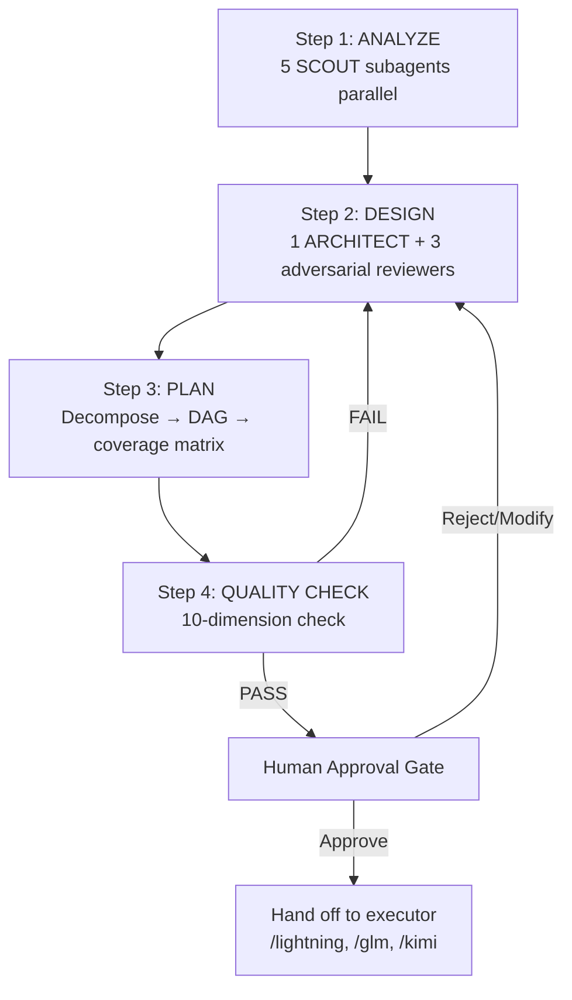

# Mission

This skill implements **Phase 1 (PLAN)** of the AHD 3-Phase architecture:

```
Phase 1: PLAN     →  Phase 2: APPROVE  →  Phase 3: EXECUTE
(this skill)         (human gate)         (/lightning, /glm, /kimi)
```

It produces two contract documents — `SOLUTION_DESIGN.md` and `IMPLEMENTATION_PLAN.md` — then waits for explicit human approval before any code is written. No execution happens inside this skill.

Optimize in this order:

1. Correctness and completeness of the design
2. Coverage of every stated requirement
3. Adversarial robustness (break-resistance, readability, security)
4. Traceability (every task links to a REQ ID)
5. Minimal scope (no speculative features)

Do not trade thoroughness for speed. A bad plan costs more in rework than a slow plan costs in latency.

# Overview

The Plan phase runs four sequential steps — **Analyze → Design → Plan → Quality Check** — and ends at a human approval gate. Each step produces evidence that feeds the next. If the quality check fails, the workflow loops back to Design (max 3 rounds).



# Workflow

## Step 1 — ANALYZE

Dispatch **5 SCOUT subagents in parallel** using `run_subagent` with `profile: subagent_explore` and `is_background: true`. Launch all five in a single round so they run concurrently, then collect each result with `read_subagent`.

| Scout | Mission | Output |
|-------|---------|--------|
| SCOUT-1 | Scan codebase structure — directory tree, module boundaries, entry points, build system | Structure map + dependency graph |
| SCOUT-2 | Find relevant files + dependencies for the target feature — trace call paths, locate interfaces | File list with relevance rationale |
| SCOUT-3 | Research cutting-edge solutions via `web_search` — patterns, libraries, prior art, pitfalls | External research brief |
| SCOUT-4 | Analyze test coverage gaps — existing tests, untested paths, test infrastructure | Coverage gap report |
| SCOUT-5 | Check constraints — security policies, performance budgets, compatibility matrix, compliance | Constraint ledger |

Aggregate all five findings into a single **analysis context** block. This context is the input to Step 2.

> *Lưu ý: 5 SCOUT chạy song song (background) để tiết kiệm wall-clock time. Thu thập kết quả bằng `read_subagent` theo từng agent ID.*

## Step 2 — DESIGN

### 2a — Architect

Dispatch **1 ARCHITECT** subagent using `run_subagent` with `profile: glm-executor` and `is_background: false` (foreground so write approvals can be requested). The architect designs the complete solution using the SDD template at `docs/templates/SDD_TEMPLATE.md`.

The work order to the architect must include:

- the full analysis context from Step 1
- the user's original objective and acceptance criteria
- the SDD template path to follow
- explicit instruction: **design only, no code**

### 2b — Adversarial Review

Once the architect returns a draft SDD, dispatch **3 adversarial reviewers in parallel** using `run_subagent` with `profile: subagent_explore` and `is_background: true`:

| Reviewer | Persona | Core question |
|----------|---------|---------------|
| SABOTEUR | Hostile attacker | "How do I break this design? What inputs crash it? What edge cases fail?" |
| NEW_HIRE | Junior engineer, first day | "Can I understand this design without asking anyone? Where is it ambiguous?" |
| SECURITY_AUDITOR | OWASP-aligned auditor | "Scan for OWASP Top 10 risks. What attack surfaces does this design open?" |

Collect all three reviews. **Promote any issue found by 2 or more reviewers** to a must-fix list. Issues found by only one reviewer go to an optional list.

### 2c — Revision Loop

If the must-fix list is non-empty, send the issues back to the architect (resume same agent ID) for revision. Re-run adversarial review on the revised draft. **Maximum 3 revision rounds.** If issues remain after 3 rounds, escalate to the human with the unresolved issues clearly listed.

### 2d — Output

Finalize and write:

- `docs/plans/SOLUTION_DESIGN_[task_name].md`

> *Vòng sửa tối đa 3 lần. Sau 3 vòng vẫn còn vấn đề → escalate lên human, không tự ý bỏ qua.*

## Step 3 — PLAN

Decompose the approved solution design into **atomic tasks**. Each task record must contain:

| Field | Description |
|-------|-------------|
| `ID` | Unique task identifier (e.g., `T01`, `T02.1`) |
| `description` | One-sentence statement of what the task does |
| `file_paths` | Exact files the task will create or modify |
| `function_names` | Functions/classes/interfaces the task touches |
| `acceptance_criteria` | Observable, testable conditions that mark the task done |
| `REQ_ID` | Requirement ID this task satisfies (traceability) |
| `risk_tier` | R0 (trivial) / R1 (low) / R2 (medium) / R3 (high) / R4 (critical) |

Then:

1. **Build a dependency DAG** — order tasks so no task starts before its prerequisites complete. Detect cycles; abort if any cycle is found.
2. **Generate a coverage matrix** — map every REQ ID to the task(s) that implement it. Any REQ with zero tasks is a gap; loop back to Step 2.
3. **Define test strategy** — unit tests, integration tests, edge cases, and the specific commands to run for verification.
4. **Define rollback plan** — for each risk tier R2 and above, state the rollback steps if the task fails in production.

Write the output using the plan template at `docs/templates/PLAN_TEMPLATE.md`:

- `docs/plans/IMPLEMENTATION_PLAN_[task_name].md`

> *Mỗi task phải có REQ_ID để đảm bảo traceability (truy vết yêu cầu). Coverage matrix đảm bảo không requirement nào bị bỏ sót.*

## Step 4 — QUALITY CHECK

Run the 10-dimension quality check script:

```bash
python .devin/scripts/plan_quality_check.py docs/plans/IMPLEMENTATION_PLAN_[task_name].md
```

The script evaluates the plan across 10 dimensions (D1–D10):

| Dim | Name | What it checks |
|-----|------|----------------|
| D1 | Requirement coverage | Every REQ ID has at least one task |
| D2 | Task atomicity | Each task is small enough to implement in one session |
| D3 | Dependency acyclicity | DAG has no cycles |
| D4 | Acceptance criteria clarity | Every task has observable, testable criteria |
| D5 | Risk classification | Every task has a risk tier; R3+ tasks have mitigation |
| D6 | Test strategy completeness | Test plan covers unit + integration + edge cases |
| D7 | Rollback plan | R2+ tasks have rollback steps |
| D8 | File path specificity | Every task names exact files, not vague references |
| D9 | Traceability | Every task links to a REQ ID; no orphan tasks |
| D10 | Scope minimality | No speculative tasks outside stated requirements |

### Decision

- **If any dimension FAIL** → loop back to Step 2 (DESIGN). The failed dimension determines what to redesign.
- **If all dimensions PASS** → write the quality report and proceed to the Human Approval Gate.

Write the quality report:

- `docs/plans/QUALITY_REPORT_[task_name].md`

> *Quality check là bắt buộc. Không được bỏ qua dù task có vẻ đơn giản. Nếu script chưa tồn tại, báo cho user biết.*

# Human Approval Gate

After the quality check passes, present a plan summary to the user. **DO NOT proceed to execution without explicit approval.**

Present the summary in this exact format:

```markdown
## Plan Summary
- Feature: [name]
- Complexity: [Low/Medium/High]
- Risk Tier: [R0-R4]
- Files to change: [count]
- Requirements covered: [X]%
- Quality score: [D1-D10 scorecard]

## Approval Decision
- [ ] Approve — proceed to execute
- [ ] Approve with modifications
- [ ] Reject
- [ ] Request more information
```

Wait for the user's decision:

| Decision | Action |
|----------|--------|
| **Approve** | Proceed to hand off. Inform user they can trigger execution with `/lightning`, `/glm`, or `/kimi`. |
| **Approve with modifications** | Apply requested modifications (loop back to Step 2 or 3 as needed), re-run quality check, re-present. |
| **Reject** | Stop. Ask for the reason and store it in memory for future reference. |
| **Request more information** | Answer the question, then re-present the gate. |

### R0 Auto-Approve Exception

If **every task** in the plan is risk tier **R0** (trivial — a few low-risk lines in known files), the plan may auto-approve without waiting for human input. State clearly that auto-approve was applied and why. Any task at R1 or above requires the human gate.

> *Human approval gate là red line. Không được tự ý bỏ qua trừ khi toàn bộ task ở mức R0 (tầm thường, rủi ro thấp).*

# Output Files

| File | Purpose | Step |
|------|---------|------|
| `docs/plans/SOLUTION_DESIGN_[task_name].md` | Solution Design Document — architecture, components, data flow, decisions | Step 2 |
| `docs/plans/IMPLEMENTATION_PLAN_[task_name].md` | Implementation Plan — atomic tasks, DAG, coverage matrix, test + rollback | Step 3 |
| `docs/plans/QUALITY_REPORT_[task_name].md` | Quality Report — D1–D10 scorecard, pass/fail per dimension | Step 4 |

All three files use `[task_name]` derived from the user's objective (slugified, lowercase, hyphen-separated).

# Guardrails

- **DO NOT write any code during the Plan phase.** This skill produces documents only. Code is written in Phase 3 (EXECUTE) by an executor skill.
- **DO NOT skip the quality check.** The 10-dimension check is mandatory for every plan, regardless of complexity.
- **DO NOT proceed without human approval** — except the R0 auto-approve exception defined above.
- **DO NOT skip adversarial review.** Minimum 3 personas (SABOTEUR, NEW_HIRE, SECURITY_AUDITOR). Fewer is a quality check failure.
- **Maximum 3 revision rounds.** After 3 rounds with unresolved issues, escalate to the human. Do not silently ship a flawed design.
- **DO NOT edit files outside `docs/plans/`.** This skill's write scope is limited to plan documents.
- **Preserve pre-existing user changes.** Before writing any plan file, check the working tree for uncommitted changes and note them.

# Integration

After approval, the user triggers execution with one of the executor skills:

| Command | Executor | When |
|---------|----------|------|
| `/lightning <task>` | SWE-1.7 Lightning | Speed-critical (1000 tok/s) |
| `/glm <task>` | GLM-5.2 | Free tier, high reasoning |
| `/kimi <task>` | Kimi K2.7 | Free tier, open-source |

The executor reads `docs/plans/IMPLEMENTATION_PLAN_[task_name].md` as its **contract** — the plan is the source of truth for what to build, in what order, and how to verify. The executor should not redesign; it implements the approved plan.

If the executor discovers a plan defect during implementation, it must stop and report back. The user then re-triggers `/plan` to revise the design rather than allowing the executor to improvise.

> *Plan là contract (hợp đồng). Executor chỉ thực thi, không tự ý thay đổi thiết kế. Nếu phát hiện lỗi trong plan → dừng, báo lại, chạy lại /plan.*
