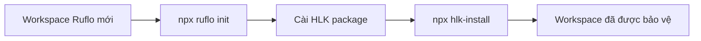

# Cài đặt HLK vào Ruflo Workspace

> Hướng dẫn cài đặt, cập nhật, và đóng gói **HLK (Harness & Logic Knowledge Layer)** cho Ruflo / Claude Flow.

---

## 1. Tổng quan

HLK được đóng gói thành npm package `hlk-ruflo`. Package này chứa:

- Các wrapper, security module, custom hooks, docs.
- 4 lệnh CLI: `hlk-install`, `hlk-update`, `hlk-pack`, `hlk-status`.

Luồng sử dụng:



---

## 1B. Cách nhanh nhất: Setup MAX POWER tự động

> **Khuyến nghị cho người mới**: Dùng script `setup-max-power.mjs` để cài đặt + cấu hình Ruflo + HLK + 3 CLI (Claude Code, Devin CLI, Antigravity CLI) + tinh chỉnh provider — tất cả trong một lệnh.

### 1B.1 Cài mới (setup)

```bash
# Trong repo Loop_harness_ruflo
node scripts/setup-max-power.mjs
```

Script sẽ **hỏi từng tham số** (đường dẫn workspace, chế độ cài, provider, tính năng bật/tắt) — mỗi câu đều có **đề xuất mặc định**, bấm Enter để chấp nhận.

**Headless (không hỏi, dùng mặc định):**

```bash
# Mặc định: cài CỤC BỘ, provider claude, mọi tính năng bật
node scripts/setup-max-power.mjs --yes

# Chỉ định path + provider
node scripts/setup-max-power.mjs --path D:/my-app --provider codex --yes
```

### 1B.2 Cập nhật (update)

```bash
# Re-patch config (không upgrade ruflo)
node scripts/update-max-power.mjs

# Upgrade ruflo lên version mới
node scripts/update-max-power.mjs --upgrade --yes

# Đổi provider
node scripts/update-max-power.mjs --provider gemini --yes
```

### 1B.3 Hai chế độ cài

| Chế độ | Ý nghĩa | Khi nào dùng |
|--------|---------|--------------|
| **Local** (mặc định) | Cài ruflo vào `devDependencies` của workspace | Test thử, không ảnh hưởng máy |
| **Global** | Dùng ruflo đã cài toàn máy hoặc `npx -y` | Đã cài ruflo toàn máy, dùng cho nhiều workspace |

### 1B.4 MAX POWER bật gì?

| Thành phần | MAX POWER |
|-----------|-----------|
| Topology | `hierarchical-mesh` (phân cấp + mesh) |
| Agent tối đa | 15 (đầy đủ vai trò) |
| Memory | hybrid + HNSW + learning bridge + memory graph |
| Neural | SONA (tự học) |
| Daemon | autoStart + 10 workers |
| Agent Teams | đầy đủ (auto-assign, mailbox, train patterns) |
| Security | autoScan + scanOnEdit + cveCheck + threatModel |
| Hooks | đủ 8 loại |
| Skills/Commands/Agents/MCP | tất cả bật (kể cả consensus + hiveMind) |

### 1B.5 Chi tiết đầy đủ

Xem tài liệu chuyên biệt: **[docs/10-setup-max-power.md](./docs/10-setup-max-power.md)** — hướng dẫn đầy đủ về script, provider tuning, troubleshooting, verify.

---

## 2. Cách 1: Cài từ tarball (offline, đơn giản nhất)

### 2.1 Đóng gói HLK

Trên máy có source HLK:

```bash
node HLK/bin/hlk-pack.mjs
```

Hoặc:

```bash
cd HLK
npm run pack
```

Kết quả: `HLK/dist/hlk-ruflo-3.0.0.tgz`.

### 2.2 Cài HLK package

Chuyển file `.tgz` sang máy/workspace mới.

**Global install (khuyến nghị):**

```bash
npm install -g /path/to/hlk-ruflo-3.0.0.tgz
```

**Hoặc install vào workspace:**

```bash
cd /my-ruflo-workspace
npm install --save-dev /path/to/hlk-ruflo-3.0.0.tgz
```

### 2.3 Áp dụng HLK vào workspace

```bash
cd /my-ruflo-workspace
npx hlk-install
```

Sau đó:

1. Mở `HLK/config/secrets.env` và điền API keys.
2. Khởi động lại Claude Code.
3. Kiểm tra: `npx hlk-status`.

---

## 3. Cách 2: Cài từ GitHub (có mạng)

Nếu HLK được publish lên private registry hoặc GitHub package:

```bash
# Từ GitHub repo (cần quyền truy cập)
npm install -g github:thanhnt-sm/Loop_harness_ruflo/HLK

# Hoặc từ npm registry
npm install -g hlk-ruflo
```

> **Lưu ý**: `github:...` syntax không hỗ trợ subfolder trực tiếp. Bạn cần publish package hoặc dùng tarball.

---

## 4. Workflow cài mới (new workspace)

### Bước 1: Cài Ruflo

```bash
mkdir my-project && cd my-project
npx ruflo@3.34.0 init --name my-project
```

### Bước 2: Cài HLK

```bash
# Nếu đã global install hlk-ruflo
npx hlk-install

# Hoặc nếu dùng tarball
npm install -g /path/to/hlk-ruflo-3.0.0.tgz
npx hlk-install
```

### Bước 3: Cấu hình secrets

```bash
cp HLK/config/secrets.env.example HLK/config/secrets.env
# Sửa file HLK/config/secrets.env
```

### Bước 4: Verify

```bash
npx hlk-status
node HLK/wrappers/hlk-verify-integrity.js
```

---

## 5. Workflow cập nhật (update)

### 5.1 Cập nhật Ruflo

```bash
npx ruflo@3.34.0 init upgrade --add-missing
```

### 5.2 Cập nhật HLK

Nếu có bản HLK mới (tarball mới hoặc npm version mới):

```bash
# Cập nhật package
npm install -g /path/to/hlk-ruflo-3.0.1.tgz

# Áp dụng vào workspace
cd /my-ruflo-workspace
npx hlk-update
```

Hoặc nếu HLK package đã cài trong workspace:

```bash
cd /my-ruflo-workspace
npm install --save-dev /path/to/hlk-ruflo-3.0.1.tgz
npx hlk-update
```

`hlk-update` sẽ:

- Backup HLK cũ.
- Copy code mới.
- Giữ `hlk.config.json` và `secrets.env` của user.
- Merge các trường mới từ package default.
- Re-apply patch `.claude/settings.json` và `.gitattributes`.
- Run verify.

---

## 6. Workflow phát triển (development)

### 6.1 Sửa HLK trong repo gốc

Sửa file trong `HLK/`, test xong.

### 6.2 Đóng gói lại

```bash
node HLK/bin/hlk-pack.mjs
```

### 6.3 Cài bản mới vào workspace test

```bash
cd /my-ruflo-workspace
npm install -g /path/to/Loop_harness_ruflo/HLK/dist/hlk-ruflo-3.0.0.tgz
npx hlk-update
```

---

## 7. Các lệnh CLI

| Lệnh | Mục đích | Ví dụ |
|------|----------|-------|
| `npx hlk-install` | Cài HLK vào workspace hiện tại | `npx hlk-install` |
| `npx hlk-update` | Cập nhật HLK trong workspace hiện tại | `npx hlk-update` |
| `npx hlk-pack` | Đóng gói HLK thành `.tgz` | `npx hlk-pack` |
| `npx hlk-status` | Kiểm tra trạng thái HLK | `npx hlk-status` |
| `npx hlk-status --self-test` | Self-test package | `npx hlk-status --self-test` |

---

## 8. Cấu trúc package

```
hlk-ruflo/
├── package.json
├── README.md
├── INSTALL.md
├── bin/
│   ├── hlk-install.mjs
│   ├── hlk-update.mjs
│   ├── hlk-pack.mjs
│   └── hlk-status.mjs
├── config/
│   ├── hlk.config.json
│   └── secrets.env.example
├── wrappers/
│   ├── hlk-loader.js
│   ├── hlk-hook-bridge.mjs
│   ├── hlk-verify-integrity.js
│   ├── ruflo-hlk.mjs
│   ├── ruflo-hlk-mcp.mjs
│   ├── ruflo-hlk.ps1
│   └── ruflo-hlk.cmd
├── security/
│   ├── sanitizer.js
│   └── vault-bridge.js
├── custom-hooks/
│   ├── README.md
│   ├── pre-argv/
│   ├── post-sanitize/
│   └── agent-tool/
├── docs/
│   ├── README.md
│   ├── 01-tong-quan-va-kien-truc.md
│   ├── 02-thanh-phan-va-luong-hoat-dong.md
│   ├── 03-cau-hinh-best-practice.md
│   ├── 05-van-hanh-runbook-va-playbook.md
│   └── 06-checklist-va-khac-phuc-su-co.md
├── prompts/
├── reports/
└── loop/
```

---

## 9. Lưu ý bảo mật

- **Không commit** `HLK/config/secrets.env`.
- **Không commit** `HLK/dist/*.tgz` vào repo công khai nếu tarball chứa code riêng tư.
- Đảm bảo `.gitignore` bao gồm `HLK/dist/`, `HLK/logs/`, `HLK/config/secrets.*`.

---

## 10. Khắc phục

### Lỗi `npx hlk-install` không tìm thấy workspace

```text
❌ Thư mục hiện tại không giống workspace Ruflo
```

Giải pháp: đảm bảo bạn chạy trong thư mục đã `npx ruflo init`.

### Lỗi `npm pack` không tạo file

Giải pháp: kiểm tra `HLK/package.json` tồn tại, chạy `node HLK/bin/hlk-pack.mjs`.

### Lỗi HLK hook không chạy sau cài

Giải pháp: khởi động lại Claude Code để load `.claude/settings.json` mới.
