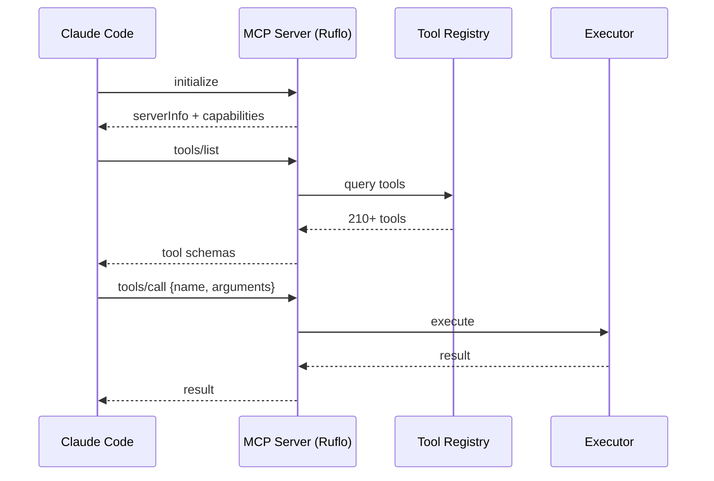
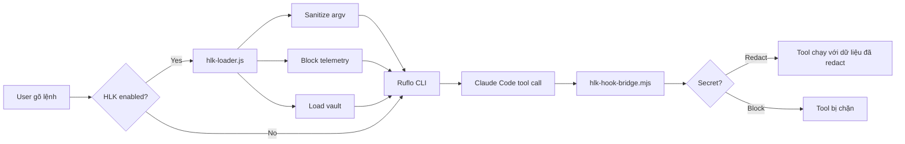

# 01 — Tổng quan và kiến trúc

> Giải thích Ruflo/Claude Flow V3 là gì, HLK (Harness & Logic Knowledge Layer) đóng vai trò gì, và kiến trúc tổng thể của hệ thống.

---

## 1. Ruflo là gì?

**Ruflo** (trước đây gọi là **Claude Flow**) là một **agent meta-harness** (lớp điều phối) cho Claude Code và OpenAI Codex.

Triết lý cốt lõi:

```text
Agent = Model + Harness
Model viết code; Harness cung cấp tools, memory, loops, sandboxes, và controls.
```

Ruflo bổ sung cho Claude Code các khả năng:

| Khả năng | Mô tả |
|----------|-------|
| **100+ agents chuyên biệt** | coder, tester, reviewer, security-architect, memory-specialist, v.v. |
| **Swarm coordination** | Điều phối nhiều agent song song với consensus, chống drift |
| **Vector memory (AgentDB + HNSW)** | Ghi nhớ ngữ cảnh, pattern, quyết định giữa các session |
| **Self-learning / SONA** | Học từ các tác vụ thành công, dự đoán pattern tối ưu |
| **MCP server** | Cung cấp 210+ tools qua giao thức Model Context Protocol |
| **Federation** | Agent trên nhiều máy hợp tác qua zero-trust |
| **Enterprise security** | Input validation, path security, CVE remediation, audit log |

---

## 2. HLK là gì?

**HLK (Harness & Logic Knowledge Layer)** là lớp bảo vệ và tùy chỉnh cục bộ được xây dựng **bên ngoài source tree của Ruflo**.

Mục tiêu:

1. **Bảo vệ dữ liệu nhạy cảm** — redact API key, token, password trước khi gửi đến tool/MCP.
2. **Chặn telemetry** — tắt OpenTelemetry, LangSmith, Langfuse nếu cần.
3. **Quản lý secrets riêng** — tách biệt với source code, dùng `HLK/config/secrets.env`.
4. **Can thiệp runtime** — PreToolUse hook + custom hooks.
5. **Không xung đột khi cập nhật** — HLK tồn tại trong thư mục riêng, dùng `merge=ours`.

---

## 3. Kiến trúc tổng thể

```mermaid
graph TB
    subgraph "User Layer"
        A[Claude Code CLI]
        B[OpenAI Codex CLI]
    end

    subgraph "HLK Layer"
        C[hlk-loader.js<br/>process preload]
        D[hlk-hook-bridge.mjs<br/>PreToolUse hook]
        E[sanitizer.js]
        F[vault-bridge.js]
        G[custom-hooks/]
    end

    subgraph "V3 Packages"
        H[@claude-flow/cli]
        I[@claude-flow/memory]
        J[@claude-flow/hooks]
        K[@claude-flow/security]
        L[@claude-flow/swarm]
        M[@claude-flow/mcp]
        N[@claude-flow/neural]
        O[@claude-flow/guidance]
    end

    subgraph "Ruflo Core"
        P[MCP Bridge]
        Q[RuVocal Chat UI]
        R[MongoDB]
        S[Nginx]
    end

    subgraph "Data Layer"
        T[AgentDB .rvf]
        U[Swarm .db]
        V[.swarm/memory.db]
    end

    A --> C
    B --> C
    C --> H
    C --> E
    C --> F
    A --> D
    D --> H
    H --> I
    H --> J
    H --> K
    H --> L
    H --> M
    H --> N
    H --> O
    M --> P
    P --> R
    Q --> R
    I --> T
    I --> U
    I --> V
```

### Giải thích các tầng

| Tầng | Vai trò | Ví dụ |
|------|---------|-------|
| **User Layer** | Nơi người dùng ra lệnh | Claude Code, Codex CLI, Ruflo CLI |
| **HLK Layer** | Bảo vệ, sanitize, vault, custom logic | `hlk-loader.js`, `hlk-hook-bridge.mjs` |
| **V3 Packages** | Core logic của Ruflo | `@claude-flow/cli`, `memory`, `swarm` |
| **Ruflo Core** | Docker stack, MCP bridge, chat UI | `ruflo/docker-compose.yml` |
| **Data Layer** | Dữ liệu bền vững | `agentdb.rvf`, `.swarm/memory.db` |

---

## 4. Phiên bản hiện tại

| Component | Version | Nguồn |
|-----------|---------|-------|
| Root package (`claude-flow`) | `3.34.0` | `package.json` |
| `@claude-flow/cli` | `3.34.0` | `v3/@claude-flow/cli/package.json` |
| `.claude/settings.json` (claudeFlow.version) | `3.34.0` (đã cập nhật) | `.claude/settings.json` |
| HLK | `3.0.0` | `HLK/config/hlk.config.json` |
| HLK `ruflo_version_tested` | `3.34.0` | `HLK/config/hlk.config.json` |

> Lưu ý: giữa `.claude/settings.json`, `package.json`, và `hlk.config.json` phải đồng nhất phiên bản để tránh lỗi kỳ lạ khi MCP khởi động.

---

## 5. Các khái niệm cốt lõi

### 5.1 MCP (Model Context Protocol)

**MCP** là giao thức chuẩn để Claude Code giao tiếp với các external tool.

Luồng cơ bản:



### 5.2 AgentDB + HNSW

**AgentDB** là vector database nhúng trong Ruflo.
- **Backend**: Hybrid SQLite + AgentDB.
- **Index**: HNSW (Hierarchical Navigable Small World) — cấu trúc đồ thị phân cấp để tìm kiếm gần đúng (approximate nearest neighbor).
- **Lưu trữ**: `agentdb.rvf` (gitignored, không commit).

**HNSW** đo đạc tại repo này:
- ~1.9x nhanh hơn brute force tại N=20k.
- ~3.2x–4.7x tại N=5k với recall@10 ~0.99.

### 5.3 Swarm / Anti-Drift

**Swarm** là nhóm agent chạy song song.
- **Topology** (cấu trúc liên kết): `hierarchical`, `hierarchical-mesh`, `mesh`, `ring`, `star`, `adaptive`.
- **Consensus** (đồng thuận): `raft`, `byzantine`, `gossip`, `crdt`, `quorum`.
- **Anti-drift**: giới hạn số agent, phân rõ vai trò (`specialized`), queen coordinator kiểm soát.

### 5.4 SONA / Neural Learning

**SONA (Self-Optimizing Neural Architecture)**: hệ thống học pattern từ các tác vụ, tối ưu chiến lược điều phối.

---

## 6. Vai trò của HLK trong kiến trúc

HLK can thiệp ở **hai điểm** quan trọng:

| Điểm can thiệp | File | Thời điểm | Tác dụng |
|----------------|------|-----------|----------|
| **Process preload** | `HLK/wrappers/hlk-loader.js` | Trước khi `bin/cli.js` chạy | Sanitize `process.argv`, block telemetry, load vault |
| **Agent runtime hook** | `HLK/wrappers/hlk-hook-bridge.mjs` | PreToolUse trong Claude Code | Redact tool input, block Bash/ApplyPatch chứa secret |



---

## 7. Tính năng HLK

| Feature | Mô tả | Trạng thái |
|---------|-------|------------|
| `knowledge_protection` | Bảo vệ tri thức dự án, tránh leak nội bộ | ✅ Bật |
| `data_sanitization` | Redact API keys, tokens, passwords, connection strings, private keys | ✅ Bật |
| `secret_vault_override` | Quản lý secrets qua `process.env` + `HLK/config/secrets.env` | ✅ Bật |
| `telemetry_blocker` | Tắt OpenTelemetry, LangSmith, Langfuse | ✅ Bật |
| `custom_hooks_injection` | Cho phép chèn custom hooks vào runtime | ✅ Bật |
| `post_merge_verify` | Kiểm tra HLK sau khi merge | ✅ Bật |

---

## 8. Các nhóm người dùng

| Nhóm | Trọng tâm |
|------|-----------|
| **Developer** | Dùng Claude Code + Ruflo để code. Cần biết cách gọi `memory store/search`, swarm. |
| **Ops / DevOps** | Triển khai `ruflo/docker-compose.yml`, quản lý secrets, firewall. |
| **Security** | Giám sát `hlk.config.json`, custom hooks, audit log, CVE. |
| **Maintainer** | Nâng cấp Ruflo/HLK, giải quyết xung đột, maintain HLK. |

---

## 9. Nguyên tắc thiết kế

1. **Tách biệt HLK và Ruflo core**: HLK không nằm trong `v3/` hay `ruflo/`, nên không bị ghi đè khi cập nhật.
2. **Fail-open an toàn**: Nếu HLK gặp lỗi, hành vi mặc định là cho phép tiếp tục (trừ khi custom hook chủ động `block: true`).
3. **Tôn trọng env**: HLK chỉ set env var nếu nó chưa tồn tại.
4. **Không log secret**: Mọi log phải ghi ra `stderr`, không bao giờ in secret.
5. **Bật/tắt tổng thể**: `hlk_enabled: false` biến HLK thành no-op hoàn toàn.
