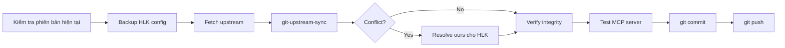

# 04 — Nâng cấp và đồng bộ upstream

> Quy trình cập nhật Ruflo phiên bản mới mà **không gây lỗi, không xung đột**, bảo vệ HLK và custom config.

---

## 1. Vấn đề khi cập nhật Ruflo

Ruflo phát triển nhanh. Khi upstream (`ruvnet/ruflo` hay `ruvnet/claude-flow`) ra bản mới, merge về có thể:

- Ghi đè `.claude/settings.json`.
- Thay đổi `CLAUDE.md`, `AGENTS.md`.
- Thêm/xóa `v3/@claude-flow/*` packages.
- Thay đổi `docker-compose.yml`.
- Thay đổi cấu trúc hook.

HLK được thiết kế để **tồn tại bên ngoài source tree** và dùng `merge=ours` để tránh xung đột.

---

## 2. Nguyên tắc tránh xung đột

### 2.1 Tách biệt HLK

- HLK nằm trong `HLK/`.
- Ruflo upstream không có thư mục `HLK/`.
- `.gitattributes` set `merge=ours` cho mọi file HLK.

### 2.2 Bảo vệ `.claude/settings.json`

- File này bị upstream thay đổi thường xuyên.
- Đã thêm `.claude/settings.json merge=ours` trong `.gitattributes`.
- Lý do: giữ HLK PreToolUse hook + MCP wrapper.

### 2.3 Backup trước merge

`HLK/wrappers/git-upstream-sync.ps1` / `.sh` tự động backup `hlk.config.json` trước merge.

### 2.4 Verify sau merge

`HLK/wrappers/hlk-verify-integrity.js` chạy sau merge để đảm bảo:

- Các file HLK tồn tại.
- `hlk.config.json` hợp lệ.
- `.gitignore` / `.gitattributes` đúng.
- Không có file `.rvf` bị track lại.

---

## 3. Quy trình cập nhật upstream

### 3.1 Tự động (khuyến nghị)

Windows:

```powershell
powershell -File HLK\wrappers\git-upstream-sync.ps1
```

Linux/macOS:

```bash
bash HLK/wrappers/git-upstream-sync.sh
```

Các bước script:

1. Kiểm tra remote `upstream`.
2. Nếu chưa có, thêm `https://github.com/ruvnet/ruflo.git`.
3. Fetch `upstream/main`.
4. Backup `hlk.config.json` vào `HLK/logs/`.
5. `git merge --no-ff upstream/main`.
6. Resolve conflict theo `merge=ours` cho HLK và `.claude/settings.json`.
7. Chạy `hlk-verify-integrity.js`.
8. Ghi log.

### 3.2 Thủ công

```bash
# 1. Kiểm tra remote
git remote -v

# 2. Thêm upstream nếu chưa có
git remote add upstream https://github.com/ruvnet/ruflo.git

# 3. Fetch
git fetch upstream

# 4. Backup HLK config
cp HLK/config/hlk.config.json HLK/logs/hlk.config.json.backup.$(date +%s).json

# 5. Merge
git merge --no-ff upstream/main

# 6. Nếu conflict, ưu tiên local cho HLK và .claude/settings.json
git checkout --ours HLK/config/hlk.config.json
git add HLK/config/hlk.config.json

git checkout --ours .claude/settings.json
git add .claude/settings.json

# 7. Hoàn tất merge
git commit -m "chore: merge upstream ruflo $(date +%F)"

# 8. Verify
node HLK/wrappers/hlk-verify-integrity.js

# 9. Kiểm tra loop
node HLK/loop/hlk-loop.mjs --status
```

Windows PowerShell:

```powershell
# Backup
$ts = [DateTimeOffset]::UtcNow.ToUnixTimeSeconds()
Copy-Item HLK\config\hlk.config.json HLK\logs\hlk.config.json.backup.$ts.json

# Merge
git merge --no-ff upstream/main

# Resolve ours nếu cần
git checkout --ours HLK/config/hlk.config.json
git add HLK/config/hlk.config.json
git checkout --ours .claude/settings.json
git add .claude/settings.json

git commit -m "chore: merge upstream ruflo $(Get-Date -Format yyyy-MM-dd)"

# Verify
node HLK/wrappers/hlk-verify-integrity.js
node HLK/loop/hlk-loop.mjs --status
```

---

## 4. `merge=ours` chi tiết

### 4.1 Cấu hình `.gitattributes`

```text
# HLK — always keep ours
HLK/** merge=ours
HLK/config/hlk.config.json merge=ours
HLK/wrappers/** merge=ours
HLK/security/** merge=ours
HLK/prompts/** merge=ours
HLK/README.md merge=ours
HLK/loop/** merge=ours
HLK/reports/** merge=ours
HLK/docs/** merge=ours

# Claude settings — keep HLK hooks
.claude/settings.json merge=ours
```

### 4.2 Giải thích

Khi Git gặp conflict trên file có `merge=ours`, nó tự động lấy **phiên bản của branch hiện tại** (local), bỏ qua upstream.

> Lưu ý: `merge=ours` chỉ hoạt động khi merge conflict thực sự xảy ra. Nếu upstream không đụng chạm file, file local vẫn được merge bình thường.

### 4.3 Hạn chế

- Nếu upstream có tính năng mới trong `.claude/settings.json`, bạn sẽ không tự động nhận được.
- Giải pháp: sau merge, so sánh `.claude/settings.json` với upstream qua `git show upstream/main:.claude/settings.json`.

---

## 5. Version pinning

### 5.1 Tại sao pin version?

`.claude/settings.json` cũ dùng:

```json
"command": "npx",
"args": ["-y", "ruflo@latest", "mcp", "start"]
```

Vấn đề:

- `latest` có thể khác version local.
- Có thể kéo bản bị lỗi hoặc chứa CVE chưa fix.
- Khó reproduce lỗi.

### 5.2 Cách pin

Sau khi xác định version đã test, pin trong `hlk.config.json`:

```json
"ruflo_version_tested": "3.34.0"
```

Và trong `mcpServers` wrapper, giữ `npx -y ruflo@latest` nhưng có cơ chế fallback:

- `ruflo-hlk-mcp.mjs` spawn `npx -y ruflo@latest`.
- Muốn pin: sửa thành `npx -y ruflo@3.34.0` hoặc dùng `package-lock`.

### 5.3 Dùng local built CLI thay vì npx (nâng cao)

Nếu bạn build local:

```bash
cd v3/@claude-flow/cli
npm install
npm run build
```

Sau đó có thể dùng `HLK/wrappers/ruflo-hlk.mjs`:

```bash
node HLK/wrappers/ruflo-hlk.mjs mcp start
```

Ưu điểm: khớp chính xác source local.
Nhược điểm: phải build sau mỗi lần update upstream.

---

## 6. Chiến lược nâng cấp theo môi trường

### 6.1 Development / local

- Dùng `git-upstream-sync` để merge `upstream/main`.
- Không cần pin version.
- Test `npx ruflo@latest init upgrade --add-missing` khi cần cập nhật skills.

### 6.2 Staging

- Merge upstream vào branch `staging`.
- Chạy test suite: `npm run test:security`, `npm run security:audit`.
- Kiểm tra `hlk-verify-integrity.js`.
- Chạy `docker compose -f ruflo/docker-compose.yml up -d` với `.env`.

### 6.3 Production

1. Tạo tag/release trên branch `main`.
2. Pin version trong `mcpServers` hoặc dùng local build đã verify.
3. Backup `HLK/config/hlk.config.json` và `.env`.
4. Blue-green hoặc rolling update.
5. Kiểm tra health: `npx ruflo@<version> status`, `docker compose ps`.
6. Audit AgentDB pattern store sau update.

---

## 7. Xử lý lỗi thường gặp khi update

### 7.1 Merge conflict không tự resolve

Nếu conflict không được `merge=ours` xử lý:

```bash
git status
# Xem file conflict

git checkout --ours <file>
git add <file>

# Hoặc nếu muốn giữ upstream
git checkout --theirs <file>
git add <file>

git commit -m "chore: resolve merge conflicts"
```

### 7.2 `.claude/helpers/hook-handler.cjs` bị thay đổi

Nếu ruflo update sửa `hook-handler.cjs` và bạn muốn giữ HLK PreToolUse:

1. Kiểm tra diff: `git diff --ours .claude/helpers/hook-handler.cjs`.
2. Nếu upstream thay đổi logic quan trọng, merge thủ công.
3. Đảm bảo HLK hook vẫn nằm đầu trong `PreToolUse`.

### 7.3 `package.json` hoặc `pnpm-lock.yaml` conflict

- Không dùng `merge=ours` cho lockfile.
- Regenerate sau update:

```bash
rm -rf node_modules package-lock.json pnpm-lock.yaml
npm install
# hoặc
pnpm install
```

### 7.4 `bin/cli.js` hoặc `v3/@claude-flow/cli/bin/cli.js` thay đổi

`bin/cli.js` chỉ là wrapper import. Nếu upstream thay đổi entry, `ruflo-hlk.mjs` cần cập nhật `CLI_PATH`.

---

## 8. Sử dụng `npx ruflo init upgrade --add-missing`

Ruflo cung cấp lệnh nâng cấp riêng:

```bash
# Cập nhật helpers và statusline, giữ data
npx ruflo@latest init upgrade

# Cập nhật và thêm skills/agents/commands mới
npx ruflo@latest init upgrade --add-missing
```

### 8.1 Tác động

Lệnh này thường sửa:

- `.claude/helpers/`
- `.claude/settings.json`
- `.claude/commands/`
- `.claude/agents/`

### 8.2 Best practice

1. Chạy sau khi đã merge upstream.
2. Chạy `git diff` ngay sau đó.
3. Nếu `init upgrade` ghi đè `.claude/settings.json`, restore phần HLK:

```bash
# Lấy phiên bản local của PreToolUse/MCP
git checkout HEAD -- .claude/settings.json
```

4. Kiểm tra lại `hlk-hook-bridge.mjs` trong PreToolUse.

---

## 9. Kiểm thử sau nâng cấp

### 9.1 Kiểm tra HLK integrity

```bash
node HLK/wrappers/hlk-verify-integrity.js
```

Kết quả mong đợi:

```text
All HLK integrity checks PASSED!
```

### 9.2 Kiểm tra HLK loop

```bash
node HLK/loop/hlk-loop.mjs --status
```

Kết quả mong đợi:

```text
[HLK Loop] All 7 steps completed.
```

### 9.3 Kiểm tra MCP server

```bash
# Khởi động MCP server
node HLK/wrappers/ruflo-hlk-mcp.mjs mcp start

# Trong terminal khác, gửi initialize
echo '{"jsonrpc":"2.0","id":1,"method":"initialize","params":{"protocolVersion":"2024-11-05","capabilities":{},"clientInfo":{"name":"test","version":"0.0.1"}}}' | node HLK/wrappers/ruflo-hlk-mcp.mjs mcp start
```

### 9.4 Kiểm tra redact

```bash
node HLK/wrappers/ruflo-hlk.mjs memory store -k demo -v "sk-abc123def456ghijk789lmno01234567"
```

Kết quả: CLI sẽ nhận `[REDACTED]` thay vì `sk-...`.

---

## 10. Runbook nâng cấp từng bước



### Checklist nâng cấp

| # | Bước | Lệnh/kiểm tra |
|---|------|---------------|
| 1 | Backup `hlk.config.json` | `cp HLK/config/hlk.config.json HLK/logs/...` |
| 2 | Fetch upstream | `git fetch upstream` |
| 3 | Merge | `git merge --no-ff upstream/main` |
| 4 | Resolve conflict ours | `git checkout --ours HLK/** .claude/settings.json` |
| 5 | Verify HLK | `node HLK/wrappers/hlk-verify-integrity.js` |
| 6 | Test HLK loader | `node HLK/wrappers/ruflo-hlk.mjs --version` |
| 7 | Test MCP | `node HLK/wrappers/ruflo-hlk-mcp.mjs mcp start` |
| 8 | Chạy loop status | `node HLK/loop/hlk-loop.mjs --status` |
| 9 | Commit | `git commit` |
| 10 | Push | `git push origin main` |

---

## 11. Cách theo dõi release upstream

### 11.1 GitHub Releases

Truy cập: https://github.com/ruvnet/ruflo/releases

### 11.2 GitHub Advisories

Truy cập: https://github.com/ruvnet/ruflo/security/advisories

### 11.3 Đăng ký theo dõi

```bash
# Lấy tag mới nhất
git ls-remote --tags upstream | tail -n 5
```

### 11.4 CVE cần lưu ý

| CVE | Mô tả | Fix version |
|-----|-------|-------------|
| CVE-2026-59726 (GHSA-c4hm-4h84-2cf3) | Unauthenticated RCE trong MCP bridge | `>= 3.16.3` |
| CVE-2025-59536 | RCE qua project config file trong Claude Code | Cập nhật Claude Code |
| CVE-2026-21852 | Redirect traffic qua `ANTHROPIC_BASE_URL` | Kiểm soát env |

---

## 12. Lưu trữ lịch sử nâng cấp

`HLK/logs/` được dùng để lưu:

- Backup `hlk.config.json`.
- Log merge upstream.
- Kết quả verify.

Đảm bảo `HLK/logs/` đã bị `.gitignore`.
