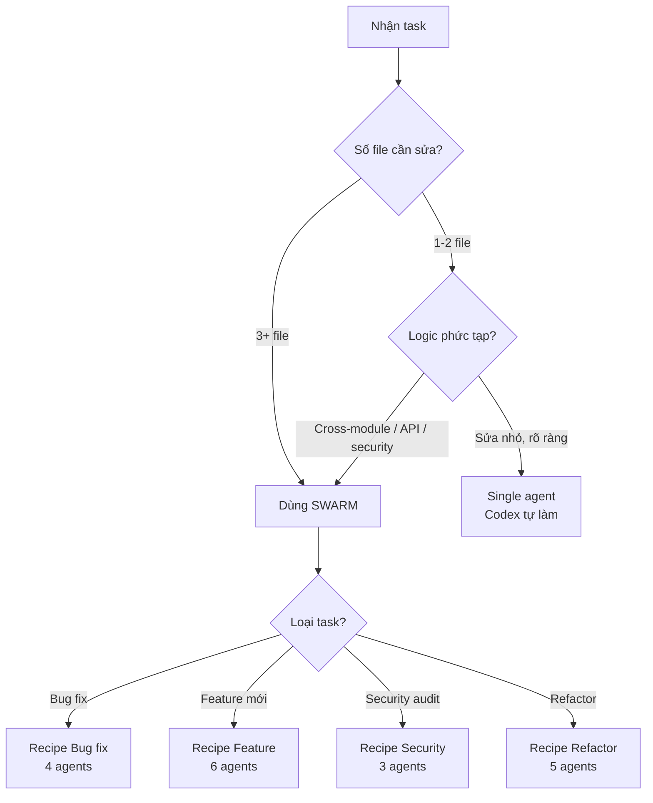
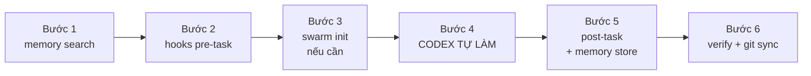
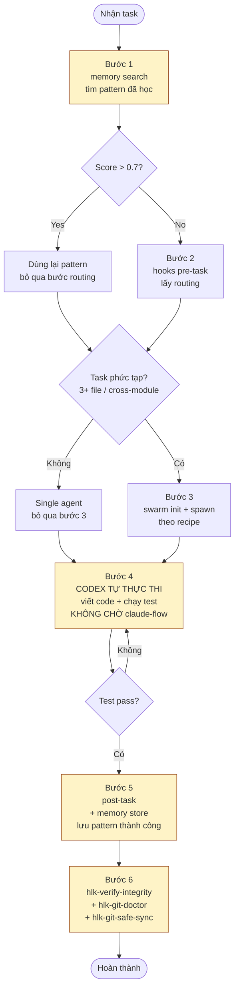

# 04 — Workflow Ruflo best practice: copy-paste dùng ngay

> Tài liệu mô tả **flow/quy trình làm việc chuẩn với Ruflo** — từ lúc nhận task đến khi commit. Mọi lệnh đều copy-paste được, có recipe theo loại task, có anti-pattern cần tránh.
>
> **Nguyên tắc cốt lõi**: Ruflo = ORCHESTRATOR (theo dõi state, lưu memory, phối hợp). Codex = EXECUTOR (viết code, chạy lệnh, tạo file). **Sau khi gọi lệnh Ruflo, BẮT BUỘC tự làm tiếp — không chờ Ruflo "thực thi" vì nó không chạy code.**

---

## Mục lục

| Mục | Nội dung |
|-----|----------|
| [1. Quyết định dùng gì](#1-quyết-định-dùng-gì) | Single agent vs swarm, chọn topology |
| [2. Flow chuẩn 6 bước](#2-flow-chuẩn-6-bước) | Quy trình cho mọi task |
| [3. Recipes copy-paste](#3-recipes-copy-paste) | Bug fix / feature / security / refactor |
| [4. Anti-patterns](#4-anti-patterns-cần-tránh) | Lỗi thường gặp phải né |
| [5. Cheat sheet](#5-cheat-sheet) | Toàn bộ lệnh trong 1 trang |
| [6. Sơ đồ tổng thể](#6-sơ-đồ-tổng-thể) | Mermaid flow đầy đủ |

---

## 1. Quyết định dùng gì

### 1.1 Single agent vs swarm



### 1.2 Bảng chọn topology

| Loại task | Topology | Max agents | Lý do |
|-----------|----------|------------|-------|
| Bug fix 1 file | (skip swarm) | 1 | Đơn giản, không cần phối hợp |
| Bug fix cross-module | `hierarchical` | 4 | Có coordinator + researcher + coder + tester |
| Feature mới | `hierarchical` | 6-8 | Cần architect + 2 coder + tester + reviewer |
| Security audit | `hierarchical` | 3-4 | Coordinator + security-architect + reviewer |
| Refactor lớn | `hierarchical-mesh` | 8 | Cần phối hợp song song + consensus |
| Research / khám phá | `mesh` | 3-5 | Phẳng, chia sẻ findings |
| Performance tuning | `hierarchical` | 4 | Coordinator + perf-engineer + coder + tester |

> **Khuyến nghị mặc định**: `hierarchical` + `maxAgents <= 8` + `strategy: specialized`. Chỉ dùng `mesh` khi cần chia sẻ findings ngang hàng.

---

## 2. Flow chuẩn 6 bước

Áp dụng cho **mọi task** — dù nhỏ hay lớn. Bước 1, 2, 5, 6 là bắt buộc; bước 3 chỉ khi cần swarm.



### Bước 1 — Tìm pattern đã học (BẮT BUỘC)

> Tránh làm lại từ đầu. Ruflo lưu các pattern thành công vào namespace `patterns`.

```bash
# Linux/macOS
npx ruflo memory search --query "<từ khóa task>" --namespace patterns

# Windows PowerShell
npx ruflo memory search --query "<từ khóa task>" --namespace patterns
```

**Quy tắc**: nếu có kết quả **score > 0.7** → dùng lại pattern đó, không reinvent.

```bash
# Liệt kê toàn bộ pattern đã lưu
npx ruflo memory list --namespace patterns
```

### Bước 2 — Lấy routing recommendation (BẮT BUỘC)

```bash
# Lấy gợi ý tool/skill/agent cho task
npx ruflo hooks pre-task --description "<mô tả task ngắn>"

# Nếu có MCP tool guidance_brain đã đăng ký:
# Dùng MCP tool `guidance_brain` với mode "recommend"
```

Đầu ra cho biết: nên dùng skill nào, agent nào, topology nào, acceptance criteria gợi ý.

### Bước 3 — Khởi tạo swarm (CHỈ KHI CẦN)

> Bỏ qua nếu task chỉ chạm 1-2 file, logic đơn giản.

```bash
# Khởi swarm hierarchical, tối đa 8 agent
npx claude-flow swarm init --topology hierarchical --max-agents 8

# Spawn agent theo recipe (xem mục 3)
npx claude-flow agent spawn --type coordinator --name lead
npx claude-flow agent spawn --type coder --name coder-1
# ... thêm agent theo recipe

# Khởi động swarm với objective
npx claude-flow swarm start --objective "<mô tả task>" --strategy development
```

> ⚠️ **CẢNH BÁO**: Sau lệnh `swarm start`, BẮT BUỘC chuyển ngay sang Bước 4. Không chờ swarm "làm xong" — swarm không tự chạy code.

### Bước 4 — CODEX TỰ THỰC THI (BẮT BUỘC, ĐÂY LÀ NƠI XẢY RA WORK)

Đây là phần **quan trọng nhất**: Codex (bạn) trực tiếp viết code, chạy test, tạo file. Ruflo chỉ theo dõi.

```bash
# Ví dụ: implement feature
# 1. Tạo/sửa file
#    (dùng editor, không qua ruflo)

# 2. Chạy test cục bộ
npm test

# 3. Chạy lint / typecheck
npm run lint
npm run typecheck

# 4. Nếu lỗi → sửa → chạy lại (vòng lặp)
```

> **Quy tắc bất di bất dịch**: Sau **mọi** lệnh claude-flow/ruflo, **ngay lập tức** tiếp tục bằng công việc của mình. Không dừng, không chờ.

### Bước 5 — Lưu kết quả vào memory (BẮT BUỘC)

> Sau khi task thành công, lưu pattern để lần sau dùng lại.

```bash
# Lưu pattern thành công
npx ruflo memory store \
  --namespace patterns \
  --key "<pattern-name>" \
  --value "<mô tả ngắn gọn cách làm + lệnh chính>"

# Ghi task completion
npx ruflo hooks post-task \
  --task-id "<id>" \
  --success true \
  --store-results true

# Kích hoạt worker tối ưu nếu cần
npx ruflo hooks worker dispatch --trigger optimize
```

PowerShell:

```powershell
npx ruflo memory store `
  --namespace patterns `
  --key "<pattern-name>" `
  --value "<mô tả ngắn gọn cách làm + lệnh chính>"

npx ruflo hooks post-task `
  --task-id "<id>" `
  --success true `
  --store-results true
```

### Bước 6 — Verify + git sync (BẮT BUỘC)

```bash
# 1. Verify HLK integrity (sau khi sửa code)
node HLK/wrappers/hlk-verify-integrity.js

# 2. Kiểm tra repo (chặn secrets, kiểm tra gitignore)
npx hlk-git-doctor

# 3. Tự sửa vấn đề an toàn
npx hlk-git-doctor --fix --yes

# 4. Commit + push một lệnh
npx hlk-git-safe-sync -m "feat: <mô tả>" --yes
```

PowerShell:

```powershell
node HLK\wrappers\hlk-verify-integrity.js
npx hlk-git-doctor
npx hlk-git-doctor --fix --yes
npx hlk-git-safe-sync -m "feat: <mô tả>" --yes
```

> ⚠️ **Không tự `git commit` / `git push` / `svn commit`** nếu chưa được user xác nhận. Dùng `hlk-git-safe-sync` đã có chặn secrets + không force push.

---

## 3. Recipes copy-paste

### 3.1 Recipe Bug fix (4 agents)

Dùng khi: bug cross-module, cần điều tra + sửa + verify.

```bash
# === BƯỚC 1: TÌM PATTERN ===
npx ruflo memory search --query "fix <loại bug>" --namespace patterns

# === BƯỚC 2: ROUTING ===
npx ruflo hooks pre-task --description "Fix <tên bug>"

# === BƯỚC 3: SWARM 4 AGENT ===
npx claude-flow swarm init --topology hierarchical --max-agents 4
npx claude-flow agent spawn --type coordinator --name lead
npx claude-flow agent spawn --type researcher --name debug
npx claude-flow agent spawn --type coder --name fix
npx claude-flow agent spawn --type tester --name verify
npx claude-flow swarm start --objective "Fix <tên bug>" --strategy development

# === BƯỚC 4: CODEX TỰ LÀM (KHÔNG CHỜ) ===
# 1. debug agent → tìm root cause (đọc code, log)
# 2. fix agent → sửa code
# 3. verify agent → chạy test
# 4. lead agent → tổng hợp

# === BƯỚC 5: LƯU PATTERN ===
npx ruflo memory store --namespace patterns \
  --key "fix-<tên-bug>" \
  --value "Root cause: ...; Fix: ...; Test: ..."

# === BƯỚC 6: VERIFY + GIT ===
npx hlk-git-doctor --fix --yes
npx hlk-git-safe-sync -m "fix: <tên bug>" --yes
```

### 3.2 Recipe Feature mới (6 agents)

Dùng khi: feature mới cần 3+ file, có API + test.

```bash
# === BƯỚC 1 ===
npx ruflo memory search --query "implement <loại feature>" --namespace patterns

# === BƯỚC 2 ===
npx ruflo hooks pre-task --description "Implement <tên feature>"

# === BƯỚC 3: SWARM 6 AGENT ===
npx claude-flow swarm init --topology hierarchical --max-agents 8
npx claude-flow agent spawn --type coordinator --name lead
npx claude-flow agent spawn --type architect --name arch
npx claude-flow agent spawn --type coder --name impl-1
npx claude-flow agent spawn --type coder --name impl-2
npx claude-flow agent spawn --type tester --name test
npx claude-flow agent spawn --type reviewer --name review
npx claude-flow swarm start --objective "Implement <tên feature>" --strategy development

# === BƯỚC 4: CODEX TỰ LÀM ===
# arch → thiết kế API + schema
# impl-1 → viết core logic
# impl-2 → viết integration
# test → viết unit + integration test
# review → review code
# lead → tổng hợp + merge

# === BƯỚC 5 ===
npx ruflo memory store --namespace patterns \
  --key "feature-<tên>" \
  --value "Architecture: ...; Files: ...; Tests: ..."

# === BƯỚC 6 ===
npx hlk-git-doctor --fix --yes
npx hlk-git-safe-sync -m "feat: <tên feature>" --yes
```

### 3.3 Recipe Security audit (3 agents)

Dùng khi: audit code có auth, payment, user data, API.

```bash
# === BƯỚC 1 ===
npx ruflo memory search --query "security audit <module>" --namespace patterns

# === BƯỚC 2 ===
npx ruflo hooks pre-task --description "Security audit <module>"

# === BƯỚC 3: SWARM 3 AGENT ===
npx claude-flow swarm init --topology hierarchical --max-agents 4
npx claude-flow agent spawn --type coordinator --name lead
npx claude-flow agent spawn --type security-architect --name audit
npx claude-flow agent spawn --type reviewer --name review
npx claude-flow swarm start --objective "Security audit <module>" --strategy development

# === BƯỚC 4: CODEX TỰ LÀM ===
# audit → quét CVE, OWASP top 10, input validation
# review → review findings + đề xuất fix
# lead → tổng hợp report

# === BƯỚC 5: LƯU FINDINGS VÀO NAMESPACE security ===
npx ruflo memory store --namespace security \
  --key "audit-<module>-<date>" \
  --value "Findings: ...; Severity: ...; Fix: ..."

# === BƯỚC 6 ===
npx hlk-git-doctor --fix --yes
npx hlk-git-safe-sync -m "security: audit <module>" --yes
```

### 3.4 Recipe Refactor lớn (5 agents)

Dùng khi: refactor cross-module, cần bảo toàn behavior + test regression.

```bash
# === BƯỚC 1 ===
npx ruflo memory search --query "refactor <module>" --namespace patterns

# === BƯỚC 2 ===
npx ruflo hooks pre-task --description "Refactor <module>"

# === BƯỚC 3: SWARM 5 AGENT (hierarchical-mesh cho consensus) ===
npx claude-flow swarm init --topology hierarchical-mesh --max-agents 8
npx claude-flow agent spawn --type coordinator --name lead
npx claude-flow agent spawn --type architect --name arch
npx claude-flow agent spawn --type coder --name refactor-1
npx claude-flow agent spawn --type coder --name refactor-2
npx claude-flow agent spawn --type tester --name regression
npx claude-flow swarm start --objective "Refactor <module>" --strategy development

# === BƯỚC 4: CODEX TỰ LÀM ===
# arch → vẽ target design + impact analysis
# refactor-1/2 → chia module theo bounded context
# regression → chạy full test suite trước + sau
# lead → consensus + merge

# === BƯỚC 5 ===
npx ruflo memory store --namespace patterns \
  --key "refactor-<module>" \
  --value "Before: ...; After: ...; Tests passed: ..."

# === BƯỚC 6 ===
npx hlk-git-doctor --fix --yes
npx hlk-git-safe-sync -m "refactor: <module>" --yes
```

### 3.5 Recipe Single agent (task nhỏ)

Dùng khi: sửa 1-2 file, logic rõ ràng, không cần phối hợp.

```bash
# === BƯỚC 1 ===
npx ruflo memory search --query "<task>" --namespace patterns

# === BƯỚC 2 ===
npx ruflo hooks pre-task --description "<task>"

# === BƯỚC 3: BỎ QUA — không cần swarm ===

# === BƯỚC 4: CODEX TỰ LÀM ===
# Sửa file trực tiếp, chạy test

# === BƯỚC 5 ===
npx ruflo memory store --namespace patterns \
  --key "<task-key>" \
  --value "<cách làm>"

# === BƯỚC 6 ===
npx hlk-git-doctor --fix --yes
npx hlk-git-safe-sync -m "chore: <task>" --yes
```

---

## 4. Anti-patterns cần tránh

### 4.1 ❌ Dừng sau khi gọi claude-flow

```bash
# SAI: gọi xong rồi chờ
npx claude-flow swarm start --objective "Build API"
# ❌ Dừng ở đây → không có gì xảy ra, swarm không tự chạy code
```

```bash
# ĐÚNG: gọi xong → tự làm ngay
npx claude-flow swarm start --objective "Build API"
# ✅ Ngay lập tức:
mkdir -p src/api
# ... viết code
npm test
```

### 4.2 ❌ Chạy 2 writer trong 1 worktree

```bash
# SAI: 2 codex cùng sửa file trong cùng worktree → conflict
# Terminal 1: codex sửa src/api.ts
# Terminal 2: codex sửa src/api.ts  # ❌ ghi đè lẫn nhau
```

```bash
# ĐÚNG: mỗi writer 1 worktree riêng
git worktree add ../project-writer1 -b feat/api-1
git worktree add ../project-writer2 -b feat/api-2
# Mỗi codex làm trong worktree riêng, merge sau
```

### 4.3 ❌ Coi `swarm start` là "bắt đầu làm việc"

`swarm start` **chỉ tạo record coordination**. Nó không spawn process, không chạy code, không dispatch agent. Codex phải tự làm.

### 4.4 ❌ Bỏ qua bước `memory search`

Không search → làm lại từ đầu → mất lợi thế chính của Ruflo. **Luôn search trước khi bắt đầu task mới.**

### 4.5 ❌ Bỏ qua bước `memory store` sau khi thành công

Không store → pattern mất → lần sau vẫn phải làm lại. **Luôn store sau khi task pass test.**

### 4.6 ❌ Tự `git commit` / `git push` / `svn commit` không qua safe-sync

```bash
# SAI: commit trực tiếp, có thể leak secret
git add . && git commit -m "..." && git push

# ĐÚNG: qua hlk-git-safe-sync (chặn secrets + không force)
npx hlk-git-safe-sync -m "feat: ..." --yes
```

### 4.7 ❌ Dùng `ruflo@latest` ở production

```bash
# SAI: version trôi, có thể vỡ bất cứ lúc nào
npx ruflo@latest init

# ĐÚNG: pin version cụ thể
npx ruflo@3.34.0 init
```

### 4.8 ❌ Bind MCP bridge ra internet không có auth

```bash
# SAI: 0.0.0.0 mà không có MCP_AUTH_TOKEN
MCP_BIND_HOST=0.0.0.0 docker compose up

# ĐÚNG: local-only mặc định, hoặc có auth nếu public
MCP_BIND_HOST=127.0.0.1 docker compose up
# Hoặc nếu cần public:
MCP_BIND_HOST=0.0.0.0 MCP_AUTH_TOKEN=<random> docker compose up
```

---

## 5. Cheat sheet

Toàn bộ lệnh trong 1 trang — copy-paste dùng ngay.

```bash
# === MEMORY ===
npx ruflo memory search --query "<task>" --namespace patterns
npx ruflo memory list --namespace patterns
npx ruflo memory store --namespace patterns --key "<key>" --value "<value>"
npx ruflo memory retrieve --key "<key>"

# === HOOKS ===
npx ruflo hooks pre-task --description "<task>"
npx ruflo hooks post-task --task-id "<id>" --success true --store-results true
npx ruflo hooks worker dispatch --trigger optimize

# === SWARM ===
npx claude-flow swarm init --topology hierarchical --max-agents 8
npx claude-flow agent spawn --type coder --name coder-1
npx claude-flow swarm start --objective "<task>" --strategy development
npx claude-flow swarm status
npx claude-flow agent list
npx claude-flow swarm stop

# === AGENT TYPES ===
# coordinator | coder | tester | reviewer | architect
# researcher | security-architect | performance-engineer

# === VERIFY ===
node HLK/wrappers/hlk-verify-integrity.js
npx hlk-git-doctor
npx hlk-git-doctor --fix --yes

# === GIT (an toàn) ===
npx hlk-git-commit -m "feat: ..." --yes
npx hlk-git-push --yes
npx hlk-git-safe-sync -m "feat: ..." --yes   # doctor + commit + push

# === HLK STATUS ===
npx hlk-status
node HLK/loop/hlk-loop.mjs --status
```

PowerShell tương đương (chỉ khác dấu `\`):

```powershell
# === MEMORY ===
npx ruflo memory search --query "<task>" --namespace patterns
npx ruflo memory store --namespace patterns --key "<key>" --value "<value>"

# === HOOKS ===
npx ruflo hooks pre-task --description "<task>"
npx ruflo hooks post-task --task-id "<id>" --success true --store-results true

# === SWARM ===
npx claude-flow swarm init --topology hierarchical --max-agents 8
npx claude-flow agent spawn --type coder --name coder-1
npx claude-flow swarm start --objective "<task>" --strategy development

# === VERIFY + GIT ===
node HLK\wrappers\hlk-verify-integrity.js
npx hlk-git-doctor --fix --yes
npx hlk-git-safe-sync -m "feat: ..." --yes
```

---

## 6. Sơ đồ tổng thể



> Các bước **vàng** (Search, Work, Store, Git) là **bắt buộc** với mọi task.

---

## 7. Liên quan

- Cấu hình chi tiết: [03-cau-hinh-best-practice.md](./03-cau-hinh-best-practice.md)
- Runbook hàng ngày + playbook sự cố: [05-van-hanh-runbook-va-playbook.md](./05-van-hanh-runbook-va-playbook.md)
- Lifecycle cài đặt/đóng gói HLK: [09-ruflo-hlk-lifecycle.md](./09-ruflo-hlk-lifecycle.md)
- Git tools an toàn: [08-git-tools.md](./08-git-tools.md)
- Checklist + troubleshooting: [06-checklist-va-khac-phuc-su-co.md](./06-checklist-va-khac-phuc-su-co.md)
