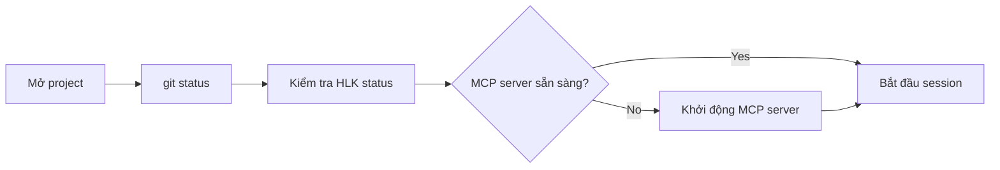
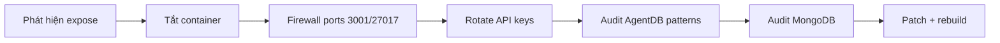
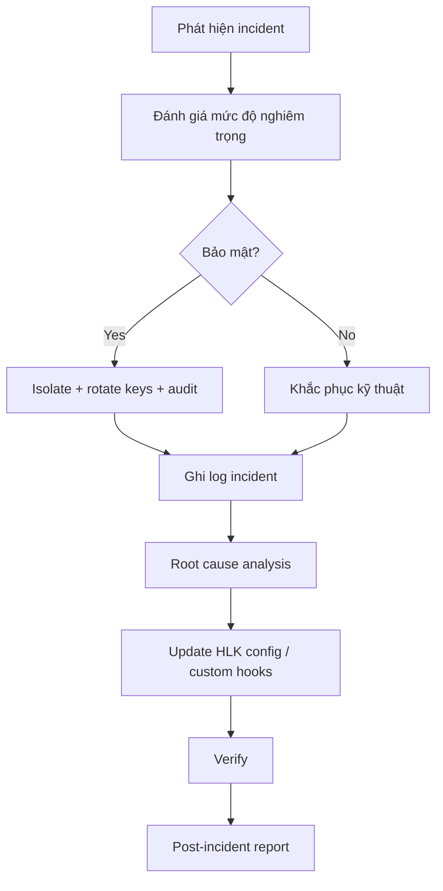

# 05 — Vận hành: runbook và playbook

> Hướng dẫn vận hành hàng ngày, playbook xử lý sự cố bảo mật, và các kịch bản khẩn cấp.

---

## 1. Runbook hàng ngày

### 1.1 Khởi động làm việc



Các lệnh:

```bash
# 1. Kiểm tra trạng thái git
git status

# 2. Kiểm tra HLK
cat HLK/config/hlk.config.json | jq '.hlk_enabled'

# 3. Kiểm tra HLK loop
node HLK/loop/hlk-loop.mjs --status

# 4. Kiểm tra MCP server
npx ruflo@latest status

# 5. Khởi động session
# Trong Claude Code, session sẽ tự mở. MCP server khởi động từ .claude/settings.json.
```

### 1.2 Trước khi giao task cho agent

| Bước | Hành động | Lý do |
|------|-----------|-------|
| 1 | `npx ruflo memory search --query "<từ khóa>"` | Tìm pattern đã học |
| 2 | `npx ruflo hooks pre-task --description "<task>"` | Lấy routing recommendation |
| 3 | Xác định swarm topology | Tránh drift |
| 4 | Ghi rõ acceptance criteria | Dễ verify |

### 1.3 Sau khi task hoàn thành

```bash
# Lưu pattern thành công
npx ruflo memory store --namespace patterns --key "<pattern-name>" --value "<mô tả>"

# Ghi task completion
npx ruflo hooks post-task --task-id "<id>" --success true --store-results true

# Kích hoạt worker tối ưu nếu cần
npx ruflo hooks worker dispatch --trigger optimize
```

### 1.4 Kết thúc ngày

1. Sync memory: `npx ruflo hooks session-end`.
2. Kiểm tra `.claude-flow/data/` không chứa secret.
3. Commit những thay đổi cần thiết.
4. Chạy `git status` đảm bảo không có `.rvf`, `.db`, `.env` chưa ignore.

---

## 2. Playbook: phát hiện MCP bridge bị expose

### 2.1 Dấu hiệu

- `MCP_BIND_HOST=0.0.0.0` mà không có `MCP_AUTH_TOKEN`.
- Port 3001/27017 mở ra internet.
- Log có request lạ đến `POST /mcp`.

### 2.2 Hành động ngay lập tức



Các lệnh:

```bash
# 1. Dừng container
cd ruflo
docker compose down

# 2. Firewall (Linux)
sudo ufw deny 3001
sudo ufw deny 27017

# 3. Rotate keys — trong HLK/config/secrets.env
#    OPENAI_API_KEY, ANTHROPIC_API_KEY, GOOGLE_API_KEY, OPENROUTER_API_KEY, MCP_AUTH_TOKEN

# 4. Audit AgentDB pattern store
npx ruflo memory search --namespace patterns --query "agentdb_pattern-store"
# Hoặc kiểm tra trực tiếp file agentdb.rvf

# 5. Audit MongoDB
mongosh "mongodb://ruflo:<password>@127.0.0.1:27017" --eval "show dbs"

# 6. Cập nhật lên bản patched
npx ruflo@latest init upgrade
git-upstream-sync

# 7. Rebuild container
docker compose up -d --build
```

### 2.3 Kiểm tra poisoned patterns

```bash
# Tìm pattern bất thường
npx ruflo memory search --namespace patterns --query "compliance policy attacker"
npx ruflo memory search --namespace patterns --query "override safety"

# Kiểm tra các key chứa URL lạ
npx ruflo memory list --namespace patterns
```

Nếu phát hiện pattern độc hại:

```bash
npx ruflo memory delete --namespace patterns --key "<key>"
npx ruflo agentdb consolidate
```

---

## 3. Playbook: secret bị leak vào AgentDB / log

### 3.1 Dấu hiệu

- File `agentdb.rvf` hoặc `.swarm/memory.db` chứa `sk-...`.
- Log HLK không redact được.
- `git status` hiển thị file `.env` chưa ignore.

### 3.2 Hành động

```bash
# 1. Xác định secret bị leak
grep -R "sk-" .swarm/ .claude-flow/ HLK/logs/ 2>/dev/null

# 2. Rotate secret ngay
# Tạo key mới trên dashboard của provider

# 3. Xóa dữ liệu bị nhiễm
rm -f .swarm/memory.db* .swarm/memory.db-journal
rm -f agentdb.rvf agentdb.rvf.lock

# 4. Kiểm tra HLK config
cat HLK/config/hlk.config.json | jq '.features.data_sanitization'

# 5. Test lại
echo '{"tool_name":"Bash","tool_input":{"command":"echo sk-abc123"}}' | node HLK/wrappers/hlk-hook-bridge.mjs
# Kết quả: bị chặn hoặc redact

# 6. Restart MCP server để tạo lại AgentDB
```

### 3.3 Dọn dẹp git history nếu secret đã commit

> **Chú ý**: đây là thao tác nguy hiểm, cần xác nhận với team.

```bash
# Bước 1: Xác định commit chứa secret
git log --all --full-history -S 'sk-' -- HLK/config/secrets.env

# Bước 2: Xóa file khỏi history (ví dụ file secrets.env)
git filter-repo --path HLK/config/secrets.env --invert-paths

# Bước 3: Force push
# git push origin --force --all
```

---

## 4. Playbook: Ruflo CLI không khởi động

### 4.1 Dấu hiệu

- `npx ruflo` treo hoặc báo lỗi.
- `bin/cli.js` báo `ERR_MODULE_NOT_FOUND`.
- MCP server không kết nối được.

### 4.2 Khắc phục

```bash
# 1. Kiểm tra version
npx ruflo@latest --version

# 2. Kiểm tra Node version
node --version  # >= 20

# 3. Xóa npx cache
npx clear-npx-cache

# 4. Cài lại dependencies
npm install

# 5. Build nếu dùng local
cd v3/@claude-flow/cli
npm install && npm run build

# 6. Kiểm tra MCP server
node HLK/wrappers/ruflo-hlk-mcp.mjs mcp start

# 7. Nếu vẫn lỗi, thử với HLK tắt
copy HLK\config\hlk.config.json HLK\config\hlk.config.json.bak
cat HLK/config/hlk.config.json | sed 's/"hlk_enabled": true/"hlk_enabled": false/' > HLK/config/hlk.config.json.tmp
mv HLK/config/hlk.config.json.tmp HLK/config/hlk.config.json
npx ruflo@latest --version
# Khôi phục nếu cần
mv HLK/config/hlk.config.json.bak HLK/config/hlk.config.json
```

---

## 5. Playbook: performance degradation

### 5.1 Dấu hiệu

- MCP phản hồi chậm (>100ms).
- Memory search quá lâu.
- CPU/RAM cao.

### 5.2 Hành động

```bash
# 1. Kiểm tra metrics
npx ruflo status --watch

# 2. Kiểm tra memory size
ls -lh .swarm/ agentdb.rvf

# 3. Consolidate memory
npx ruflo memory consolidate

# 4. Tối ưu HNSW (nếu có cấu hình)
# Xem ADR-125

# 5. Chạy benchmark
npx ruflo performance benchmark --suite memory

# 6. Dispatch optimize worker
npx ruflo hooks worker dispatch --trigger optimize
```

---

## 6. Playbook: custom hook gây chặn sai

### 6.1 Dấu hiệu

- Tool bị chặn với reason từ custom hook.
- `process.exit(2)` xuất hiện trong log.

### 6.2 Khắc phục

```bash
# 1. Tạm tắt custom hooks injection
cat HLK/config/hlk.config.json | jq '.features.custom_hooks_injection = false' > HLK/config/hlk.config.json.tmp
mv HLK/config/hlk.config.json.tmp HLK/config/hlk.config.json

# 2. Tìm hook gây lỗi
ls HLK/custom-hooks/agent-tool/ HLK/custom-hooks/pre-argv/

# 3. Đổi tên file hook để loader không load
mv HLK/custom-hooks/agent-tool/10-block-raw-secrets.hook.mjs HLK/custom-hooks/agent-tool/10-block-raw-secrets.hook.mjs.disabled

# 4. Bật lại custom hooks
cat HLK/config/hlk.config.json | jq '.features.custom_hooks_injection = true' > HLK/config/hlk.config.json.tmp
mv HLK/config/hlk.config.json.tmp HLK/config/hlk.config.json
```

---

## 7. Playbook: cập nhật GitHub repo privacy / AI training opt-out

### 7.1 Đảm bảo repo private

```bash
gh repo edit thanhnt-sm/Loop_harness_ruflo --visibility private --accept-visibility-change-consequences
```

### 7.2 Tắt AI training ở user level

1. Truy cập: https://github.com/settings/copilot
2. Tìm **"Allow GitHub to use my data for AI model training"**.
3. Chọn **Disabled**.
4. Save.

### 7.3 Tắt AI training ở repo level

1. Truy cập: `https://github.com/<user>/Loop_harness_ruflo/settings`
2. Tìm **"Data use for product and service research and improvements, including AI model training"**.
3. Bỏ chọn.
4. Save.

### 7.4 Copilot content exclusion

1. Repo settings → Code, planning, and automation → Copilot → Content exclusion.
2. Thêm:
   ```yaml
   - "**"
   ```
3. Save.

---

## 8. Logging và monitoring

### 8.1 Log mong muốn

- HLK ghi log ra `stderr` (không `stdout` để không làm hỏng MCP JSON-RPC).
- `HLK/logs/` chứa backup config và log merge.

### 8.2 Theo dõi thường xuyên

```bash
# Xem kích thước runtime data
du -sh .claude-flow .swarm .hive-mind

# Xem log HLK
tail -n 50 HLK/logs/upgrade-*.log

# Kiểm tra .rvf trong git status
git status --short | grep -E '\.rvf|\.db|\.env|secrets\.env'
```

---

## 9. Quy trình quản lý incident



### Template incident report

```markdown
# Incident Report: <tên>

- Ngày: YYYY-MM-DD HH:mm
- Mức độ: Low / Medium / High / Critical
- Mô tả: <tóm tắt>
- Dấu hiệu: <dấu hiệu phát hiện>
- Hành động: <các bước đã làm>
- Root cause: <nguyên nhân gốc rễ>
- Hạn chế tái diễn: <thay đổi config/code>
- Verify: <cách kiểm chứng>
```

Lưu vào `HLK/reports/`.
