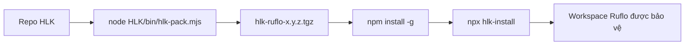
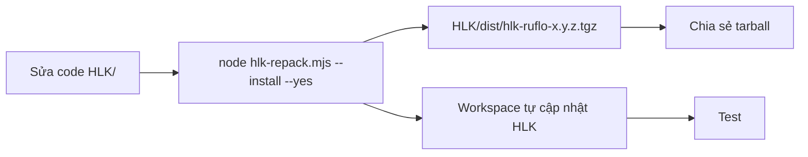

# 07 — Đóng gói và cài đặt HLK

> Hướng dẫn đóng gói HLK thành npm package, cài đặt vào workspace Ruflo mới, cập nhật, và rebuild package khi HLK có thay đổi.

---

## 1. Tại sao đóng gói?

Trước đây HLK tồn tại như một thư mục trong repo Ruflo. Khi chuyển workspace:

- Khó copy đúng các file.
- Dễ quên patch `.claude/settings.json`.
- Dễ quên `.gitattributes` merge=ours.

Giải pháp: **HLK package** (`hlk-ruflo`) chứa sẵn installer. Cài bằng `npx hlk-install`.



---

## 2. Cấu trúc package

```
HLK/
├── package.json              # Package hlk-ruflo
├── INSTALL.md                # Hướng dẫn cài nhanh
├── bin/                      # CLI chính
│   ├── hlk-install.mjs
│   ├── hlk-update.mjs
│   ├── hlk-pack.mjs
│   ├── hlk-repack.mjs
│   ├── hlk-status.mjs
│   └── hlk-lifecycle.mjs
├── git-tools/                # Bộ công cụ git
│   ├── hlk-git-doctor.mjs
│   ├── hlk-git-commit.mjs
│   ├── hlk-git-push.mjs
│   └── hlk-git-safe-sync.mjs
├── config/
├── wrappers/
├── security/
├── custom-hooks/
├── docs/
├── prompts/
├── reports/
└── loop/
```

Package được tạo bằng `npm pack` trong thư mục `HLK/`.

---

## 3. Đóng gói HLK lần đầu

### 3.1 Yêu cầu

- Node >= 14 (khuyến nghị >= 18 để có `fs.cpSync` gốc)
- `npm` đã cài

### 3.2 Lệnh copy-paste

```bash
# Trong repo gốc
node HLK/bin/hlk-pack.mjs
```

PowerShell:

```powershell
node HLK\bin\hlk-pack.mjs
```

Output:

```text
HLK/dist/hlk-ruflo-3.0.0.tgz
```

`hlk-pack.mjs` thực hiện:

- Kiểm tra `package.json` version đồng nhất với `hlk.config.json`.
- Kiểm tra các file bắt buộc.
- Syntax check các script.
- Chạy `npm pack`.
- Di chuyển tarball vào `HLK/dist/`.

---

## 4. Rebuild package khi HLK có cập nhật

### 4.1 Khi nào cần repack?

- Bạn sửa code trong `HLK/`.
- Bạn thêm script mới.
- Bạn muốn tăng version và phát hành.

### 4.2 Lệnh copy-paste

> Lưu ý: `hlk-repack --install` phải chạy trong **workspace Ruflo riêng**, không phải trong chính repo gốc của package.

**Repack tự động bump patch version và cài vào workspace hiện tại:**

```bash
node HLK/bin/hlk-repack.mjs --install --yes
```

PowerShell:

```powershell
node HLK\bin\hlk-repack.mjs --install --yes
```

Các bước `hlk-repack.mjs` thực hiện:

1. Self-test package.
2. Bump version (patch, minor, hoặc major).
3. Pack thành `.tgz`.
4. Cài package mới vào workspace hiện tại:
   - Nếu HLK chưa có → `npx hlk-install`.
   - Nếu HLK đã có → `npx hlk-update`.

### 4.3 Không tăng version

```bash
node HLK/bin/hlk-repack.mjs --no-bump --install --yes
```

### 4.4 Bump minor/major

```bash
node HLK/bin/hlk-repack.mjs --bump minor --install --yes
node HLK/bin/hlk-repack.mjs --bump major --install --yes
```

### 4.5 Flow phát triển HLK



---

## 5. Cài HLK vào workspace mới

### 5.1 Cách A: Cài thủ công

#### Bước 1: Cài Ruflo

```bash
mkdir my-project && cd my-project
npx ruflo@3.34.0 init
```

PowerShell:

```powershell
New-Item -ItemType Directory my-project; Set-Location my-project
npx ruflo@3.34.0 init
```

#### Bước 2: Cài HLK package

Global install (khuyến nghị):

```bash
npm install -g /path/to/hlk-ruflo-3.0.0.tgz
```

PowerShell:

```powershell
npm install -g C:\path\to\hlk-ruflo-3.0.0.tgz
```

#### Bước 3: Áp dụng HLK

```bash
npx hlk-install
```

PowerShell:

```powershell
npx hlk-install
```

#### Bước 4: Cấu hình secrets

```bash
cp HLK/config/secrets.env.example HLK/config/secrets.env
# Sửa HLK/config/secrets.env
```

PowerShell:

```powershell
Copy-Item HLK\config\secrets.env.example HLK\config\secrets.env
# Sửa HLK\config\secrets.env
```

#### Bước 5: Verify

```bash
npx hlk-status
```

### 5.2 Cách B: Dùng script full `hlk-lifecycle`

Tạo workspace mới trong một lệnh:

```bash
node HLK/bin/hlk-lifecycle.mjs --init my-project --hlk-tgz /path/to/hlk-ruflo-3.0.0.tgz --yes
```

PowerShell:

```powershell
node HLK\bin\hlk-lifecycle.mjs --init my-project --hlk-tgz C:\path\to\hlk-ruflo-3.0.0.tgz --yes
```

Script sẽ:

1. Tạo thư mục `my-project/`.
2. Chạy `npx ruflo@3.34.0 init`.
3. Cài HLK từ tarball.
4. Chạy `npx hlk-install`.

Nếu HLK đã global install:

```bash
node HLK/bin/hlk-lifecycle.mjs --init my-project --hlk-global --yes
```

---

## 6. Cập nhật HLK

### 6.1 Cập nhật thủ công

#### Bước 1: Cập nhật Ruflo

```bash
npx ruflo@3.34.0 init upgrade --add-missing
```

#### Bước 2: Cập nhật HLK

```bash
npm install -g /path/to/hlk-ruflo-3.0.1.tgz
npx hlk-update
```

PowerShell:

```powershell
npm install -g C:\path\to\hlk-ruflo-3.0.1.tgz
npx hlk-update
```

### 6.2 Dùng script full `hlk-lifecycle --update`

```bash
node HLK/bin/hlk-lifecycle.mjs --update --hlk-tgz /path/to/hlk-ruflo-3.0.1.tgz --yes
```

PowerShell:

```powershell
node HLK\bin\hlk-lifecycle.mjs --update --hlk-tgz C:\path\to\hlk-ruflo-3.0.1.tgz --yes
```

Nếu Ruflo đã được cài thủ công hoặc không dùng `npx ruflo`:

```bash
node HLK/bin/hlk-lifecycle.mjs --update --skip-ruflo --hlk-tgz /path/to/hlk-ruflo-3.0.1.tgz --yes
```

PowerShell:

```powershell
node HLK\bin\hlk-lifecycle.mjs --update --skip-ruflo --hlk-tgz C:\path\to\hlk-ruflo-3.0.1.tgz --yes
```

---

## 7. Các lệnh CLI

| Lệnh | Mục đích |
|------|----------|
| `npx hlk-install` | Cài HLK vào workspace hiện tại |
| `npx hlk-update` | Cập nhật HLK trong workspace hiện tại |
| `npx hlk-pack` | Đóng gói HLK thành `.tgz` |
| `npx hlk-repack` | Bump version, pack, và cài lại vào workspace |
| `npx hlk-lifecycle` | Cài mới / cập nhật Ruflo + HLK |
| `npx hlk-status` | Kiểm tra trạng thái HLK |
| `npx hlk-status --self-test` | Self-test package |

---

## 8. Publish lên registry (tùy chọn)

Nếu muốn cài từ npm registry:

```bash
cd HLK
npm publish --access private
```

Hoặc publish lên npm registry tương thích:

```bash
cd HLK
npm publish
```

> Đảm bảo không publish `secrets.env` — `.gitignore` và `files` field đã loại trừ.

---

## 9. Cài từ GitHub repo (không publish)

```bash
# Trên máy build
cd Loop_harness_ruflo
node HLK/bin/hlk-repack.mjs --no-bump
cp HLK/dist/hlk-ruflo-3.0.0.tgz /workspace/shared/

# Trên máy khác
npm install -g /workspace/shared/hlk-ruflo-3.0.0.tgz
npx hlk-install
```

PowerShell:

```powershell
# Trên máy build
Set-Location Loop_harness_ruflo
node HLK\bin\hlk-repack.mjs --no-bump
Copy-Item HLK\dist\hlk-ruflo-3.0.0.tgz C:\workspace\shared\

# Trên máy khác
npm install -g C:\workspace\shared\hlk-ruflo-3.0.0.tgz
npx hlk-install
```

---

## 10. Checklist triển khai package

| # | Hạng mục | Kiểm tra |
|---|----------|----------|
| 1 | `hlk-pack.mjs` tạo `.tgz` | `ls HLK/dist/` |
| 2 | `hlk-repack.mjs` tự bump + cài | `node HLK/bin/hlk-repack.mjs --install --yes` |
| 3 | Tarball chứa `bin/`, `config/`, `wrappers/`, `git-tools/` | `tar -tzf HLK/dist/*.tgz` |
| 4 | Global install thành công | `npx hlk-status --self-test` |
| 5 | `hlk-install` chạy trong workspace | `npx hlk-install` |
| 6 | `hlk-lifecycle --init` tạo workspace | `node HLK/bin/hlk-lifecycle.mjs --init test-project --yes` |
| 7 | `hlk-lifecycle --update` cập nhật | `node HLK/bin/hlk-lifecycle.mjs --update --yes` |
| 8 | HLK verify pass | `npx hlk-status` |
| 9 | `.claude/settings.json` đã patch | `grep hlk-hook-bridge .claude/settings.json` |
| 10 | `.gitattributes` đã patch | `grep 'merge=ours' .gitattributes` |
