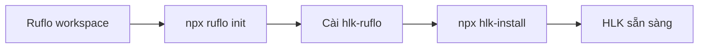

# 07 — Đóng gói và cài đặt HLK

> Hướng dẫn đóng gói HLK thành npm package, cài đặt vào workspace Ruflo mới, và cập nhật.

---

## 1. Tại sao đóng gói?

Trước đây HLK tồn tại như một thư mục trong repo Ruflo. Khi chuyển workspace:

- Khó copy đúng các file.
- Dễ quên patch `.claude/settings.json`.
- Dễ quên `.gitattributes` merge=ours.

Giải pháp: **HLK package** (`hlk-ruflo`) chứa sẵn installer. Cài bằng `npx hlk-install`.



---

## 2. Cấu trúc package

```
HLK/
├── package.json              # Package hlk-ruflo
├── INSTALL.md                # Hướng dẫn cài
├── bin/
│   ├── hlk-install.mjs
│   ├── hlk-update.mjs
│   ├── hlk-pack.mjs
│   └── hlk-status.mjs
├── config/
├── wrappers/
├── security/
├── custom-hooks/
├── docs/
├── prompts/
├── reports/
└── loop/
```

Package được tạo bằng `npm pack` trong thư mục `HLK/`.

---

## 3. Đóng gói HLK

### 3.1 Yêu cầu

- Node >= 20
- `npm` đã cài

### 3.2 Lệnh

```bash
# Trong repo gốc
node HLK/bin/hlk-pack.mjs

# Hoặc
npm run pack --prefix HLK
```

Output:

```text
HLK/dist/hlk-ruflo-3.0.0.tgz
```

`hlk-pack.mjs` sẽ:

- Kiểm tra `package.json` version đồng nhất với `hlk.config.json`.
- Kiểm tra file bắt buộc.
- Syntax check các script.
- Chạy `npm pack`.
- Di chuyển tarball vào `HLK/dist/`.

---

## 4. Cài HLK vào workspace mới

### 4.1 Cài Ruflo

```bash
mkdir my-project && cd my-project
npx ruflo@3.34.0 init
```

### 4.2 Cài package

#### Cách A: Global install (khuyến nghị)

```bash
npm install -g /path/to/hlk-ruflo-3.0.0.tgz
```

Sau đó trong bất kỳ workspace nào:

```bash
npx hlk-install
```

#### Cách B: Local install trong workspace

```bash
cd /my-ruflo-workspace
npm install --save-dev /path/to/hlk-ruflo-3.0.0.tgz
npx hlk-install
```

### 4.3 Kết quả

`hlk-install` thực hiện:

- Copy `HLK/` vào workspace.
- Patch `.claude/settings.json` với PreToolUse hook + MCP wrapper.
- Patch `.gitattributes` với `merge=ours`.
- Patch `.gitignore` bảo vệ secrets.
- Tạo `HLK/config/secrets.env` từ example.
- Chạy `hlk-verify-integrity.js`.

### 4.4 Cấu hình secrets

```bash
cp HLK/config/secrets.env.example HLK/config/secrets.env
# Sửa HLK/config/secrets.env
```

### 4.5 Verify

```bash
npx hlk-status
```

---

## 5. Cập nhật HLK

### 5.1 Cập nhật Ruflo

Dùng cách bạn chọn:

```bash
npx ruflo@3.34.0 init upgrade --add-missing
# hoặc
bash HLK/wrappers/git-upstream-sync.sh
```

### 5.2 Cập nhật HLK

```bash
npm install -g /path/to/hlk-ruflo-3.0.1.tgz
cd /my-ruflo-workspace
npx hlk-update
```

`hlk-update`:

- Backup HLK cũ.
- Copy code mới.
- Giữ `hlk.config.json` và `secrets.env` của user.
- Merge trường mới từ package default.
- Re-apply patch.
- Run verify.

---

## 6. Các lệnh CLI

| Lệnh | Mục đích |
|------|----------|
| `npx hlk-install` | Cài HLK vào workspace hiện tại |
| `npx hlk-update` | Cập nhật HLK trong workspace hiện tại |
| `npx hlk-pack` | Đóng gói HLK thành `.tgz` |
| `npx hlk-status` | Kiểm tra trạng thái HLK |
| `npx hlk-status --self-test` | Self-test package |

---

## 7. Publish lên registry (tùy chọn)

Nếu muốn cài từ npm registry:

```bash
cd HLK
npm publish --access private
```

Hoặc publish lên GitHub Packages:

```bash
cd HLK
npm publish --registry=https://npm.pkg.github.com
```

> Đảm bảo không publish `secrets.env` — `.gitignore` và `files` field đã loại trừ.

---

## 8. Cài từ GitHub repo (không publish)

Nếu không publish npm, bạn có thể tạo tarball từ repo rồi cài:

```bash
cd Loop_harness_ruflo
node HLK/bin/hlk-pack.mjs
cp HLK/dist/hlk-ruflo-3.0.0.tgz /workspace/shared/

# Trên máy khác
npm install -g /workspace/shared/hlk-ruflo-3.0.0.tgz
```

---

## 9. Checklist triển khai package

| # | Hạng mục | Kiểm tra |
|---|----------|----------|
| 1 | `hlk-pack.mjs` tạo `.tgz` | `ls HLK/dist/` |
| 2 | Tarball chứa `bin/`, `config/`, `wrappers/` | `tar -tzf HLK/dist/*.tgz` |
| 3 | Global install thành công | `npx hlk-status --self-test` |
| 4 | `hlk-install` chạy trong workspace | `npx hlk-install` |
| 5 | HLK verify pass | `npx hlk-status` |
| 6 | Secrets.env được tạo | `ls HLK/config/secrets.env` |
| 7 | `.claude/settings.json` đã patch | `grep hlk-hook-bridge` |
| 8 | `.gitattributes` đã patch | `grep 'merge=ours'` |
