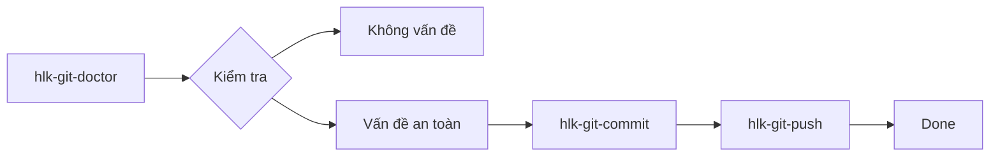
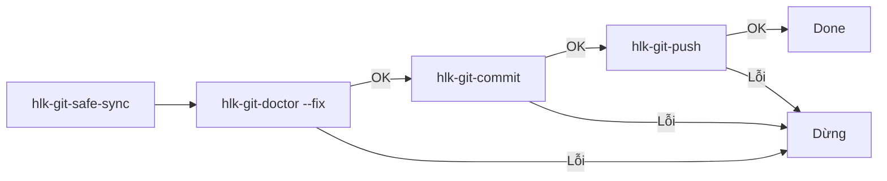

# 08 — Git Tools: commit, push, sync an toàn

> Hướng dẫn copy-paste sử dụng `HLK/git-tools/` để kiểm tra repo, commit, push, và đồng bộ một cách an toàn.

---

## 1. Tại sao cần git tools?

Git rất linh hoạt, nhưng cũng dễ:

- Commit nhầm secret.
- Force push xóa history.
- Quên set upstream.
- Không biết branch diverged.
- Không để ý file `.env`, `.rvf`, `.pem` bị staged.

HLK git tools giúp tự động kiểm tra và ngăn chặn các lỗi trên.



---

## 2. Khởi động

### Cách 1: Dùng `npx` (nếu HLK đã global install)

```bash
npx hlk-git-doctor
npx hlk-git-commit -m "feat: ..."
npx hlk-git-push
```

PowerShell:

```powershell
npx hlk-git-doctor
npx hlk-git-commit -m "feat: ..."
npx hlk-git-push
```

### Cách 2: Dùng đường dẫn local

```bash
node HLK/git-tools/hlk-git-doctor.mjs
node HLK/git-tools/hlk-git-commit.mjs -m "feat: ..."
node HLK/git-tools/hlk-git-push.mjs
```

PowerShell:

```powershell
node HLK\git-tools\hlk-git-doctor.mjs
node HLK\git-tools\hlk-git-commit.mjs -m "feat: ..."
node HLK\git-tools\hlk-git-push.mjs
```

---

## 3. `hlk-git-doctor` — kiểm tra sức khỏe repo

### 3.1 Chỉ kiểm tra

```bash
node HLK/git-tools/hlk-git-doctor.mjs
```

### 3.2 Tự động sửa vấn đề an toàn

```bash
node HLK/git-tools/hlk-git-doctor.mjs --fix --yes
```

PowerShell:

```powershell
node HLK\git-tools\hlk-git-doctor.mjs --fix --yes
```

### 3.3 Các vấn đề được xử lý

| Vấn đề | Hành động khi `--fix --yes` |
|--------|-----------------------------|
| Branch `master` | Đổi thành `main` |
| Không track remote | Set upstream `origin/main` |
| Detached HEAD | Checkout `main` |
| Sensitive file staged | Unstage |
| Secret trong staged | Unstage |
| Tarball HLK bị staged | Unstage |
| Merge conflict | Offer abort (không tự abort) |
| Divergent branch | Offer pull --rebase |
| Embedded git repo | Đổi tên `.git` thành `.git-embedded-backup` |
| File >100MB | Báo lỗi, không tự xử lý |
| File nhạy cảm đã track trong history | Báo lỗi, hướng dẫn `git filter-repo` |

---

## 4. `hlk-git-commit` — commit an toàn

### 4.1 Commit với message

```bash
node HLK/git-tools/hlk-git-commit.mjs -m "feat: update HLK"
```

PowerShell:

```powershell
node HLK\git-tools\hlk-git-commit.mjs -m "feat: update HLK"
```

### 4.2 Commit không hỏi xác nhận

```bash
node HLK/git-tools/hlk-git-commit.mjs -m "feat: update HLK" --yes
```

PowerShell:

```powershell
node HLK\git-tools\hlk-git-commit.mjs -m "feat: update HLK" --yes
```

### 4.3 Các kiểm tra trước commit

Script sẽ:

- Kiểm tra file nhạy cảm staged (`.env`, `.rvf`, `.pem`, `.key`, `secrets.env`).
- Quét secret trong staged files (`sk-...`, `ghp_...`, private key, JWT, connection string).
- Kiểm tra file >100MB.
- Kiểm tra tarball HLK bị staged.
- Tự động unstage nếu phát hiện sensitive file.
- Từ chối commit nếu tìm thấy secret.

### 4.4 Bypass kiểm tra (KHÔNG khuyến nghị)

```bash
node HLK/git-tools/hlk-git-commit.mjs -m "feat: ..." --no-verify --yes
```

> Chỉ dùng khi bạn chắc chắn kiểm tra sai. Nhớ review diff kỹ.

---

## 5. `hlk-git-push` — push an toàn

### 5.1 Push thường

```bash
node HLK/git-tools/hlk-git-push.mjs
```

PowerShell:

```powershell
node HLK\git-tools\hlk-git-push.mjs
```

### 5.2 Push không hỏi xác nhận

```bash
node HLK/git-tools/hlk-git-push.mjs --yes
```

PowerShell:

```powershell
node HLK\git-tools\hlk-git-push.mjs --yes
```

### 5.3 Các kiểm tra trước push

- Branch phải có remote.
- Nếu branch chưa track remote → set upstream `origin/<branch>`.
- Nếu branch behind → đề xuất `pull --rebase`.
- Nếu branch diverged (behind & ahead) → bắt buộc `pull --rebase`.
- **Không hỗ trợ `--force`**. Sẽ báo lỗi nếu bạn cố truyền `-f`.

---

## 6. `hlk-git-safe-sync` — một lệnh duy nhất

### 6.1 Sync doctor → commit → push

```bash
node HLK/git-tools/hlk-git-safe-sync.mjs -m "feat: update HLK"
```

PowerShell:

```powershell
node HLK\git-tools\hlk-git-safe-sync.mjs -m "feat: update HLK"
```

### 6.2 Không hỏi xác nhận

```bash
node HLK/git-tools/hlk-git-safe-sync.mjs -m "feat: update HLK" --yes
```

PowerShell:

```powershell
node HLK\git-tools\hlk-git-safe-sync.mjs -m "feat: update HLK" --yes
```

### 6.3 Chỉ doctor + commit, không push

```bash
node HLK/git-tools/hlk-git-safe-sync.mjs -m "feat: update HLK" --yes --no-push
```

PowerShell:

```powershell
node HLK\git-tools\hlk-git-safe-sync.mjs -m "feat: update HLK" --yes --no-push
```

### 6.4 Flow



---

## 7. Workflow hàng ngày

### Mỗi ngày trước khi làm việc

```bash
npx hlk-git-doctor
```

### Sau khi sửa code

```bash
npx hlk-git-safe-sync -m "feat: ..."
```

### Hoặc từng bước

```bash
npx hlk-git-doctor --fix --yes
npx hlk-git-commit -m "feat: ..." --yes
npx hlk-git-push --yes
```

PowerShell:

```powershell
npx hlk-git-doctor --fix --yes
npx hlk-git-commit -m "feat: ..." --yes
npx hlk-git-push --yes
```

---

## 8. Lưu ý an toàn

- **Không bao giờ force push** bằng các script này.
- Các script không tự xóa file nhạy cảm đã nằm trong git history.
- Nếu doctor phát hiện file nhạy cảm đã track, bạn cần dùng `git filter-repo` hoặc BFG.
- Các thao tác nguy hiểm yêu cầu xác nhận, trừ khi dùng `--yes`.

---

## 9. Copy-paste nhanh

```bash
# Kiểm tra
npx hlk-git-doctor

# Sửa vấn đề an toàn
npx hlk-git-doctor --fix --yes

# Commit
npx hlk-git-commit -m "feat: update HLK" --yes

# Push
npx hlk-git-push --yes

# Hoặc tất cả một lệnh
npx hlk-git-safe-sync -m "feat: update HLK" --yes
```
