# 09 — Vòng đời Ruflo + HLK: copy-paste đầy đủ

> Trang tổng hợp copy-paste cho toàn bộ vòng đời: cài mới, phát triển, cập nhật, đóng gói, commit, push.

---

## 1. Mục lục copy-paste

| Kịch bản | Lệnh |
|----------|------|
| [Cài workspace mới](#2-cài-workspace-mới) | `node HLK/bin/hlk-ruflo-setup.mjs --init ...` |
| [Cập nhật workspace](#3-cập-nhật-workspace) | `node HLK/bin/hlk-ruflo-setup.mjs --update ...` |
| [Build package HLK](#4-build-package-hlk) | `node HLK/bin/hlk-pack.mjs` |
| [Repack khi sửa HLK](#5-repack-khi-sửa-hlk) | `node HLK/bin/hlk-repack.mjs --install --yes` |
| [Kiểm tra repo](#6-kiểm-tra-repo) | `npx hlk-git-doctor` |
| [Commit + push](#7-commit--push) | `npx hlk-git-safe-sync -m "..." --yes` |

---

## 2. Cài workspace mới

### Cách 1: Một lệnh

```bash
node HLK/bin/hlk-ruflo-setup.mjs --init my-project --hlk-tgz /path/to/hlk-ruflo-3.0.0.tgz --yes
```

PowerShell:

```powershell
node HLK\bin\hlk-ruflo-setup.mjs --init my-project --hlk-tgz C:\path\to\hlk-ruflo-3.0.0.tgz --yes
```

### Cách 2: Từng bước

```bash
# 1. Tạo thư mục
mkdir my-project && cd my-project

# 2. Cài Ruflo
npx ruflo@3.34.0 init

# 3. Cài HLK package
cd ..
npm install -g /path/to/hlk-ruflo-3.0.0.tgz

# 4. Áp dụng HLK
cd my-project
npx hlk-install

# 5. Cấu hình secrets
cp HLK/config/secrets.env.example HLK/config/secrets.env
# Sửa HLK/config/secrets.env

# 6. Verify
npx hlk-status
```

PowerShell:

```powershell
# 1. Tạo thư mục
New-Item -ItemType Directory my-project; Set-Location my-project

# 2. Cài Ruflo
npx ruflo@3.34.0 init

# 3. Cài HLK package
Set-Location ..
npm install -g C:\path\to\hlk-ruflo-3.0.0.tgz

# 4. Áp dụng HLK
Set-Location my-project
npx hlk-install

# 5. Cấu hình secrets
Copy-Item HLK\config\secrets.env.example HLK\config\secrets.env
# Sửa HLK\config\secrets.env

# 6. Verify
npx hlk-status
```

---

## 3. Cập nhật workspace

### Cách 1: Một lệnh

```bash
node HLK/bin/hlk-ruflo-setup.mjs --update --hlk-tgz /path/to/hlk-ruflo-3.0.1.tgz --yes
```

PowerShell:

```powershell
node HLK\bin\hlk-ruflo-setup.mjs --update --hlk-tgz C:\path\to\hlk-ruflo-3.0.1.tgz --yes
```

### Cách 2: Với upstream sync

```bash
node HLK/bin/hlk-ruflo-setup.mjs --update --upstream-sync --hlk-tgz /path/to/hlk-ruflo-3.0.1.tgz --yes
```

PowerShell:

```powershell
node HLK\bin\hlk-ruflo-setup.mjs --update --upstream-sync --hlk-tgz C:\path\to\hlk-ruflo-3.0.1.tgz --yes
```

### Cách 3: Chỉ cập nhật HLK (bỏ qua Ruflo)

```bash
node HLK/bin/hlk-ruflo-setup.mjs --update --skip-ruflo --hlk-tgz /path/to/hlk-ruflo-3.0.1.tgz --yes
```

PowerShell:

```powershell
node HLK\bin\hlk-ruflo-setup.mjs --update --skip-ruflo --hlk-tgz C:\path\to\hlk-ruflo-3.0.1.tgz --yes
```

### Cách 4: Từng bước

```bash
# 1. Cập nhật Ruflo
npx ruflo@3.34.0 init upgrade --add-missing

# 2. Cập nhật HLK
npm install -g /path/to/hlk-ruflo-3.0.1.tgz
npx hlk-update

# 3. Verify
npx hlk-status
```

PowerShell:

```powershell
# 1. Cập nhật Ruflo
npx ruflo@3.34.0 init upgrade --add-missing

# 2. Cập nhật HLK
npm install -g C:\path\to\hlk-ruflo-3.0.1.tgz
npx hlk-update

# 3. Verify
npx hlk-status
```

---

## 4. Build package HLK

```bash
node HLK/bin/hlk-pack.mjs
```

PowerShell:

```powershell
node HLK\bin\hlk-pack.mjs
```

Output:

```text
HLK/dist/hlk-ruflo-3.0.0.tgz
```

---

## 5. Repack khi sửa HLK

### Bump patch + cài vào workspace hiện tại

```bash
node HLK/bin/hlk-repack.mjs --install --yes
```

PowerShell:

```powershell
node HLK\bin\hlk-repack.mjs --install --yes
```

### Chỉ pack, không tăng version

```bash
node HLK/bin/hlk-repack.mjs --no-bump
```

PowerShell:

```powershell
node HLK\bin\hlk-repack.mjs --no-bump
```

### Bump minor

```bash
node HLK/bin/hlk-repack.mjs --bump minor --install --yes
```

PowerShell:

```powershell
node HLK\bin\hlk-repack.mjs --bump minor --install --yes
```

### Sau khi repack, share tarball

```bash
# Copy sang thư mục share
cp HLK/dist/hlk-ruflo-3.0.1.tgz /workspace/shared/

# Trên máy khác
npm install -g /workspace/shared/hlk-ruflo-3.0.1.tgz
npx hlk-update
```

PowerShell:

```powershell
# Copy sang thư mục share
Copy-Item HLK\dist\hlk-ruflo-3.0.1.tgz C:\workspace\shared\

# Trên máy khác
npm install -g C:\workspace\shared\hlk-ruflo-3.0.1.tgz
npx hlk-update
```

---

## 6. Kiểm tra repo

```bash
# Kiểm tra
npx hlk-git-doctor

# Tự động sửa vấn đề an toàn
npx hlk-git-doctor --fix --yes
```

PowerShell:

```powershell
# Kiểm tra
npx hlk-git-doctor

# Tự động sửa vấn đề an toàn
npx hlk-git-doctor --fix --yes
```

---

## 7. Commit + push

### Một lệnh duy nhất

```bash
npx hlk-git-safe-sync -m "feat: update HLK" --yes
```

PowerShell:

```powershell
npx hlk-git-safe-sync -m "feat: update HLK" --yes
```

### Từng bước

```bash
npx hlk-git-doctor --fix --yes
npx hlk-git-commit -m "feat: update HLK" --yes
npx hlk-git-push --yes
```

PowerShell:

```powershell
npx hlk-git-doctor --fix --yes
npx hlk-git-commit -m "feat: update HLK" --yes
npx hlk-git-push --yes
```

---

## 8. Toàn bộ vòng đời trong một sơ đồ

```mermaid
flowchart TB
    subgraph "Phát triển"
        A[Sửa HLK/] --> B[node hlk-repack.mjs --install --yes]
        B --> C{Test OK?}
        C -->|No| A
        C -->|Yes| D[Copy tarball]
    end

    subgraph "Workspace mới"
        E[mkdir project] --> F[npx ruflo@3.34.0 init]
        F --> G[npm install -g hlk-ruflo-x.tgz]
        G --> H[npx hlk-install]
        H --> I[cp secrets.env.example]
    end

    subgraph "Cập nhật"
        J[npx ruflo init upgrade] --> K[npm install -g hlk-ruflo-x.tgz]
        K --> L[npx hlk-update]
    end

    subgraph "Git"
        M[npx hlk-git-doctor] --> N[npx hlk-git-commit]
        N --> O[npx hlk-git-push]
    end
```



---

## 9. Lệnh thường dùng — cheat sheet

```bash
# --- Build ---
node HLK/bin/hlk-pack.mjs
node HLK/bin/hlk-repack.mjs --install --yes

# --- Cài mới ---
node HLK/bin/hlk-ruflo-setup.mjs --init my-project --hlk-tgz HLK/dist/hlk-ruflo-3.0.0.tgz --yes

# --- Cập nhật ---
node HLK/bin/hlk-ruflo-setup.mjs --update --hlk-tgz HLK/dist/hlk-ruflo-3.0.1.tgz --yes
node HLK/bin/hlk-ruflo-setup.mjs --update --skip-ruflo --hlk-tgz HLK/dist/hlk-ruflo-3.0.1.tgz --yes

# --- Git ---
npx hlk-git-doctor
npx hlk-git-doctor --fix --yes
npx hlk-git-commit -m "feat: ..." --yes
npx hlk-git-push --yes
npx hlk-git-safe-sync -m "feat: ..." --yes

# --- Verify ---
npx hlk-status
node HLK/wrappers/hlk-verify-integrity.js
node HLK/loop/hlk-loop.mjs --status
```

PowerShell:

```powershell
# --- Build ---
node HLK\bin\hlk-pack.mjs
node HLK\bin\hlk-repack.mjs --install --yes

# --- Cài mới ---
node HLK\bin\hlk-ruflo-setup.mjs --init my-project --hlk-tgz HLK\dist\hlk-ruflo-3.0.0.tgz --yes

# --- Cập nhật ---
node HLK\bin\hlk-ruflo-setup.mjs --update --hlk-tgz HLK\dist\hlk-ruflo-3.0.1.tgz --yes
node HLK\bin\hlk-ruflo-setup.mjs --update --skip-ruflo --hlk-tgz HLK\dist\hlk-ruflo-3.0.1.tgz --yes

# --- Git ---
npx hlk-git-doctor
npx hlk-git-doctor --fix --yes
npx hlk-git-commit -m "feat: ..." --yes
npx hlk-git-push --yes
npx hlk-git-safe-sync -m "feat: ..." --yes

# --- Verify ---
npx hlk-status
node HLK\wrappers\hlk-verify-integrity.js
node HLK\loop\hlk-loop.mjs --status
```

---

## 10. Ghi nhớ

- **Build HLK**: `node HLK/bin/hlk-repack.mjs --install --yes`
- **Cài mới**: `node HLK/bin/hlk-ruflo-setup.mjs --init <dir> --hlk-tgz <tgz> --yes`
- **Cập nhật**: `node HLK/bin/hlk-ruflo-setup.mjs --update --hlk-tgz <tgz> --yes`
- **Cập nhật chỉ HLK**: `node HLK/bin/hlk-ruflo-setup.mjs --update --skip-ruflo --hlk-tgz <tgz> --yes`
- **Sync git**: `npx hlk-git-safe-sync -m "feat: ..." --yes`
