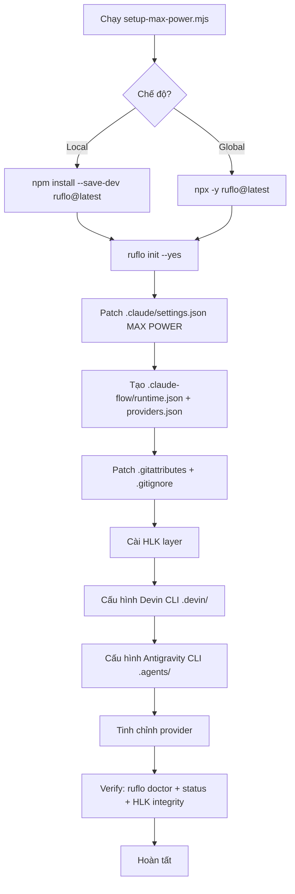

# 10 — Setup MAX POWER: Cài đặt & Cấu hình tự động

> Hướng dẫn dùng script `setup-max-power.mjs` và `update-max-power.mjs` để cài đặt, cấu hình Ruflo ở mức mạnh nhất ("MAX POWER") cho workspace bất kỳ — hỗ trợ 3 CLI (Claude Code, Devin CLI, Antigravity CLI) và tinh chỉnh cho từng AI provider.

---

## 1. MAX POWER là gì?

**MAX POWER** là cấu hình Ruflo đẩy **mọi thông số lên mức cao nhất**, bật **mọi tính năng**:

| Thành phần | MAX POWER |
|-----------|-----------|
| Topology (mô hình mạng agent) | `hierarchical-mesh` — kết hợp phân cấp + mesh, mạnh nhất |
| Số agent tối đa | `15` (đầy đủ mọi vai trò: queen, security, core, integration, quality, performance, deployment) |
| Memory (bộ nhớ) | `hybrid` + `HNSW` (tìm kiếm vector nhanh) + learning bridge + memory graph + agent scopes |
| Neural (mạng nơ-ron tự học) | Bật — SONA (Self-Optimizing Neural Architecture) |
| Daemon (tiến trình nền) | `autoStart` + **10 workers** (map, audit, optimize, consolidate, testgaps, ultralearn, deepdive, document, refactor, benchmark) |
| Agent Teams (nhóm agent) | Bật đầy đủ (auto-assign, mailbox, task list, train patterns) |
| Learning (tự học) | Bật + autoTrain + 3 patterns + retention 24h/30d |
| Security (bảo mật) | autoScan + scanOnEdit + cveCheck + threatModel |
| Skills/Commands/Agents/MCP | **Tất cả bật** (kể cả consensus + hiveMind — chịu lỗi Byzantine) |
| Hooks (móc nối vòng đời) | Đủ 8 loại (PreToolUse, PostToolUse, UserPromptSubmit, SessionStart, SessionEnd, Stop, PreCompact, SubagentStop) |
| Statusline | `detailed`, refresh 2 giây |

---

## 2. Hai chế độ cài: Local vs Global

| Chế độ | Ý nghĩa | Khi nào dùng |
|--------|---------|--------------|
| **Local** (mặc định) | Cài ruflo vào `devDependencies` của workspace — không ảnh hưởng máy | **Test thử**, workspace riêng, không muốn cài toàn máy |
| **Global** | Dùng ruflo đã cài toàn máy (`npm install -g`) hoặc `npx -y ruflo@latest` | Khi đã cài ruflo toàn máy và muốn dùng cho nhiều workspace |

**Khuyến nghị:** Bắt đầu với **Local** để test an toàn. Khi quen và muốn dùng cho nhiều dự án, chuyển sang Global.

---

## 3. Script `setup-max-power.mjs` — Cài mới

### 3.1 Vị trí script

```
<repo>/scripts/setup-max-power.mjs
```

### 3.2 Cách chạy

```bash
# Cách 1: Tương tác đầy đủ — hỏi từng tham số, có đề xuất mặc định
node scripts/setup-max-power.mjs

# Cách 2: Headless — dùng toàn bộ mặc định (local + claude + mọi tính năng bật)
node scripts/setup-max-power.mjs --yes

# Cách 3: Headless + ghi đè một số tham số
node scripts/setup-max-power.mjs --path D:/projects/my-app --provider codex --yes

# Cách 4: Tương tác nhưng đã chỉ định sẵn path
node scripts/setup-max-power.mjs --path D:/test-ws
```

### 3.3 Các câu hỏi khi chạy tương tác

Khi chạy không có flag nào, script hỏi lần lượt:

```
═══ Cấu hình thiết lập MAX POWER ═══

1. Đường dẫn workspace cần thiết lập? [mặc định: <thư mục hiện tại>]
   → Bấm Enter để dùng thư mục hiện tại, hoặc gõ đường dẫn khác

2. Chế độ cài Ruflo?
 → 1. Local (cài cục bộ trong workspace — khuyến nghị cho test)
    2. Global (dùng ruflo global hoặc npx)
   → Bấm Enter để chọn Local, hoặc gõ 2 để dùng Global

3. AI Provider mặc định?
 → 1. claude — Anthropic (reasoning, architecture, security) [khuyến nghị]
    2. codex — OpenAI Codex (implementation, optimization)
    3. gemini — Google (multimodal, research, long-context)
    4. openai — OpenAI GPT-4.1 (reasoning, general)
   → Bấm Enter để chọn claude, hoặc gõ số/tên provider

4. Version Ruflo? [mặc định: latest]
   → Bấm Enter để dùng latest, hoặc gõ version cụ thể

5. Các tính năng (bật/tắt):
   Cài/init Ruflo? [Y/n]                    → Enter = CÓ
   Cài HLK layer (security + hooks)? [Y/n]  → Enter = CÓ
   Cấu hình Devin CLI (.devin/)? [Y/n]      → Enter = CÓ
   Cấu hình Antigravity CLI (agy)? [Y/n]   → Enter = CÓ
   Tinh chỉnh Provider? [Y/n]               → Enter = CÓ

6. Xác nhận bắt đầu thiết lập? [Y/n]
   → Enter = bắt đầu, n = hủy
```

### 3.4 Các tham số dòng lệnh

| Flag | Ý nghĩa | Mặc định |
|------|---------|----------|
| `--path <dir>` | Đường dẫn workspace | Thư mục hiện tại |
| `--yes` | Không hỏi, dùng mặc định | `false` (hỏi) |
| `--local` | Cài ruflo CỤC BỘ | `true` (mặc định) |
| `--global` | Dùng ruflo global/npx | `false` |
| `--provider <name>` | Provider: `claude`/`codex`/`gemini`/`openai` | `claude` |
| `--ruflo-version <ver>` | Version ruflo | `latest` |
| `--skip-ruflo` | Bỏ qua cài Ruflo | `false` |
| `--skip-hlk` | Bỏ qua cài HLK layer | `false` |
| `--skip-devin` | Bỏ qua cấu hình Devin CLI | `false` |
| `--skip-agy` | Bỏ qua cấu hình Antigravity CLI | `false` |
| `--skip-providers` | Bỏ qua tinh chỉnh provider | `false` |
| `--help` | Hiện hướng dẫn | — |

> **Lưu ý:** Mọi flag truyền qua dòng lệnh sẽ **ghi đè mặc định và bỏ qua câu hỏi tương ứng**. Ví dụ `--provider codex` sẽ không hỏi provider nữa mà dùng codex luôn.

---

## 4. Script `update-max-power.mjs` — Cập nhật

### 4.1 Khi nào dùng?

- Khi muốn **re-patch** config (đảm bảo không bị drift sau khi chỉnh tay).
- Khi ruflo ra **version mới** và muốn upgrade.
- Khi muốn **đổi provider** mặc định.
- Khi HLK có **update upstream** và muốn pull + reinstall.

### 4.2 Cách chạy

```bash
# Tương tác đầy đủ
node scripts/update-max-power.mjs

# Headless — dùng mặc định (local, không upgrade, giữ provider hiện có)
node scripts/update-max-power.mjs --yes

# Upgrade ruflo lên version mới
node scripts/update-max-power.mjs --upgrade --yes

# Đổi provider
node scripts/update-max-power.mjs --provider gemini --yes

# Upgrade + đổi provider + path cụ thể
node scripts/update-max-power.mjs --path D:/my-app --upgrade --provider codex --yes
```

### 4.3 Khác biệt so với setup

| Đặc điểm | Setup | Update |
|----------|-------|--------|
| Cài ruflo | **Có** (mới) | Không (giữ nguyên, trừ khi `--upgrade`) |
| Hỏi workspace | Có | Có (đề xuất = thư mục hiện tại) |
| Hỏi upgrade | Không | **Có** (mặc định: KHÔNG) |
| Provider | Hỏi (mặc định: claude) | Hỏi (mặc định: **giữ nguyên hiện có**) |
| Re-patch config | Có | **Có** (qua setup `--skip-ruflo`) |
| HLK upstream pull | Không | **Có** (nếu không `--skip-hlk`) |

---

## 5. Các file được tạo/sửa

### 5.1 Claude Code (`.claude/`)

| File | Nội dung |
|------|----------|
| `.claude/settings.json` | MAX POWER settings — topology, agents, memory, neural, daemon, hooks, statusline |
| `.claude-flow/runtime.json` | Runtime config MAX |
| `.claude-flow/providers.json` | Provider routing (claude/codex/gemini/openai/openrouter + 3-tier) |

### 5.2 Devin CLI (`.devin/`)

| File | Nội dung |
|------|----------|
| `.devin/config.json` | Permissions (allow/deny) + `read_config_from` (import Claude/Cursor/Windsurf) |
| `.devin/mcp_config.json` | MCP server `claude-flow` qua HLK wrapper |
| `.devin/hooks.v1.json` | 6 lifecycle events (PreToolUse, PostToolUse, SessionStart, SessionEnd, Stop) |
| `.devin/skills/` | Copy HLK skills sang (nếu có) |
| `.devin/agents/` | Thư mục cho custom subagent profiles |

### 5.3 Antigravity CLI (`.agents/`)

| File | Nội dung |
|------|----------|
| `.agents/mcp_config.json` | MCP server workspace-level (agy đọc được) |
| `.agents/config.toml` | Codex CLI + agy config (chỉ tạo nếu chưa có, không ghi đè) |
| `AGENTS.md` | Project rules (tạo nếu chưa có — agy + Devin CLI đều đọc) |

> **Lưu ý bug agy:** Project-local `.antigravitycli/mcp_config.json` bị agy **ignore** (bug đã biết). Script dùng `.agents/mcp_config.json` (workspace-level, agy đọc được) để tránh bug. Nếu muốn MCP global cho agy, chạy thủ công: `agy mcp add claude-flow -- node HLK/wrappers/ruflo-hlk-mcp.mjs mcp start`.

### 5.4 Git & HLK

| File | Nội dung |
|------|----------|
| `.gitattributes` | `merge=ours` cho HLK config + `.claude/settings.json` |
| `.gitignore` | Bảo vệ secrets, `.env`, `*.rvf`, `*.key`, `*.pem` |
| `HLK/` | HLK layer (security + hooks + wrappers) — nếu không `--skip-hlk` |

---

## 6. Provider tuning — Tinh chỉnh cho từng AI

### 6.1 Bảng so sánh provider

| Provider | Mạnh về | Model mặc định | Vai trò phù hợp |
|----------|---------|----------------|-----------------|
| **Claude** (Anthropic) | reasoning, architecture, security | `claude-sonnet-5` | architect, reviewer, security-architect, tester |
| **Codex** (OpenAI) | implementation, optimization, bulk transforms | `gpt-5.3-codex` | coder, optimizer, refactorer |
| **Gemini** (Google) | multimodal, research, long-context (1M tokens) | `gemini-2.5-pro` | researcher, docs, scout-explorer |
| **OpenAI** (direct) | reasoning, general, tool-use | `gpt-4.1` | planner, architect, reviewer |
| **OpenRouter** | fallback multi-provider | `claude-sonnet-5` | coordinator, load-balancer |

### 6.2 Routing rules (luật tự động)

Script tạo `.claude-flow/providers.json` với routing rules — ruflo swarm **tự route** task đến provider phù hợp:

```
architecture    → claude
security        → claude
planning        → claude
testing-strategy → claude
implementation  → codex
optimization    → codex
refactoring     → codex
research        → gemini
documentation   → gemini
multimodal      → gemini
vision          → gemini
fallback        → openrouter
```

### 6.3 3-tier model routing (ADR-026, ADR-143)

| Tier | Handler | Độ trễ | Chi phí | Dùng khi |
|------|---------|--------|---------|----------|
| 1 | codemod | ~1ms | $0 | Transform đơn giản (var-to-const, remove-console) |
| 2 | haiku | ~500ms | $0.0002 | Complexity < 30% |
| 3 | sonnet/opus | 2-5s | $0.003-0.015 | Complexity > 30% |

### 6.4 Đổi provider sau khi setup

```bash
# Đổi sang codex
node scripts/update-max-power.mjs --provider codex --yes

# Đổi sang gemini
node scripts/update-max-power.mjs --provider gemini --yes

# Giữ nguyên provider hiện tại (mặc định)
node scripts/update-max-power.mjs --yes
```

---

## 7. Quy trình đầy đủ (end-to-end)



---

## 8. Verify sau khi cài

### 8.1 Kiểm tra ruflo

```bash
# Trong workspace đã setup
npx ruflo doctor    # Kiểm tra sức khỏe
npx ruflo status     # Trạng thái swarm + memory + daemon
```

### 8.2 Kiểm tra HLK

```bash
node HLK/wrappers/hlk-verify-integrity.js
```

### 8.3 Test swarm (15 agent)

```bash
npx ruflo swarm init --topology hierarchical-mesh --max-agents 15
npx ruflo agent spawn --type coordinator --name queen
npx ruflo agent spawn --type coder --name coder-1
npx ruflo swarm status
```

### 8.4 Test memory

```bash
npx ruflo memory store --key test --value "hello" --namespace patterns
npx ruflo memory search --query "hello"
```

### 8.5 Test daemon

```bash
npx ruflo daemon status
```

---

## 9. Các bước tiếp theo sau setup

1. **Mở `HLK/config/secrets.env`** và điền API keys / tokens thật (ANTHROPIC_API_KEY, OPENAI_API_KEY, GOOGLE_API_KEY...).
2. **Đặt env vars** cho provider đã chọn (xem `.claude-flow/providers.json` để biết env vars cần thiết).
3. **Khởi động lại** Claude Code / Devin CLI / agy để MCP server load cấu hình mới.
4. **Test** swarm, memory, daemon (xem mục 8).
5. **Đọc** `AGENTS.md` / `CLAUDE.md` để hiểu workflow full chain.
6. **Update** định kỳ: `node scripts/update-max-power.mjs` (hoặc `npm run update:max-power`).

---

## 10. Troubleshooting (Khắc phục sự cố)

### 10.1 Ruflo init thất bại

```
✗ Ruflo init thất bại — sẽ tạo settings.json thủ công ở bước sau.
```

**Nguyên nhân:** Thường do mạng chậm khi `npx` tải ruflo lần đầu, hoặc Node < 20.

**Khác phục:**
- Kiểm tra Node >= 20: `node --version`
- Thử cài ruflo trước: `npm install -g ruflo@latest` (global) hoặc `npm install --save-dev ruflo@latest` (local)
- Chạy lại script — phần patch thủ công sẽ tự tạo `.claude/settings.json` dù init fail

### 10.2 MCP server không load trong agy

**Nguyên nhân:** Bug agy — project-local `.antigravitycli/mcp_config.json` bị ignore.

**Khác phục:** Script đã dùng `.agents/mcp_config.json` (workspace-level) để tránh bug. Nếu vẫn không load:
```bash
# Thêm MCP global cho agy
agy mcp add claude-flow -- node HLK/wrappers/ruflo-hlk-mcp.mjs mcp start
```

### 10.3 HLK install lỗi

```
⚠ HLK install gặp lỗi — tiếp tục (HLK là tùy chọn).
```

**Nguyên nhân:** Không tìm thấy `HLK/setup/install.mjs` (chạy script từ repo khác).

**Khắc phục:** Clone repo `Loop_harness_ruflo` rồi chạy script từ đó, hoặc dùng `--skip-hlk` nếu chỉ cần config mà không cần HLK.

### 10.4 Provider không có API key

**Khắc phục:** Mở `HLK/config/secrets.env` và điền key tương ứng:

```env
ANTHROPIC_API_KEY=sk-ant-...
OPENAI_API_KEY=sk-...
GOOGLE_API_KEY=AIza...
GEMINI_API_KEY=AIza...
OPENROUTER_API_KEY=sk-or-...
```

### 10.5 Config bị drift sau khi chỉnh tay

**Khắc phục:** Chạy update để re-patch:
```bash
node scripts/update-max-power.mjs --yes
```

---

## 11. Tham khảo nhanh

### 11.1 Lệnh thường dùng

```bash
# Cài mới
npm run setup:max-power
# hoặc
node scripts/setup-max-power.mjs

# Update
npm run update:max-power
# hoặc
node scripts/update-max-power.mjs

# Update + upgrade ruflo
node scripts/update-max-power.mjs --upgrade --yes

# Headless (không hỏi)
node scripts/setup-max-power.mjs --yes

# Chỉ định path + provider
node scripts/setup-max-power.mjs --path D:/my-app --provider gemini --yes
```

### 11.2 File config quan trọng

| File | Vai trò |
|------|---------|
| `.claude/settings.json` | Claude Code settings MAX POWER |
| `.claude-flow/runtime.json` | Ruflo runtime config |
| `.claude-flow/providers.json` | Provider routing (claude/codex/gemini/openai) |
| `.devin/config.json` | Devin CLI permissions |
| `.devin/mcp_config.json` | Devin CLI MCP servers |
| `.devin/hooks.v1.json` | Devin CLI lifecycle hooks |
| `.agents/config.toml` | Codex CLI + agy config |
| `.agents/mcp_config.json` | agy workspace MCP |
| `AGENTS.md` | Project rules (agy + Devin CLI đọc) |
| `HLK/config/hlk.config.json` | HLK config |
| `HLK/config/secrets.env` | API keys (KHÔNG commit) |

### 11.3 Liên kết tài liệu liên quan

- [03-cau-hinh-best-practice.md](./03-cau-hinh-best-practice.md) — Cấu hình `.claude/settings.json` chi tiết
- [04-workflow-ruflo-best-practice.md](./04-workflow-ruflo-best-practice.md) — Workflow Ruflo best practice
- [07-dong-goi-va-cai-dat.md](./07-dong-goi-va-cai-dat.md) — Đóng gói HLK package
- [09-ruflo-hlk-lifecycle.md](./09-ruflo-hlk-lifecycle.md) — Vòng đời Ruflo + HLK

---

## 12. Hướng dẫn thực hiện thủ công (manual)

> Phần này hướng dẫn **tự làm từng bước** mà không dùng script `setup-max-power.mjs` — dành cho trường hợp script lỗi, muốn hiểu rõ từng bước, hoặc muốn tùy chỉnh tinh.

### 12.1 Điều kiện trước

```bash
# Kiểm tra Node >= 20
node --version

# Kiểm tra npm
npm --version

# Kiểm tra git (tùy chọn nhưng khuyến nghị)
git --version
```

### 12.2 Bước 1 — Cài Ruflo

**Cục bộ (local — khuyến nghị cho test):**

```bash
cd /my-workspace

# Tạo package.json tối thiểu nếu chưa có
npm init -y

# Cài ruflo cục bộ
npm install --save-dev ruflo@latest

# Init ruflo
npx ruflo init --yes
```

**Toàn máy (global):**

```bash
npm install -g ruflo@latest
ruflo init --yes    # chạy trong workspace
```

### 12.3 Bước 2 — Tạo `.claude/settings.json` MAX POWER

Tạo file `.claude/settings.json` với nội dung sau (đây là cấu hình MAX POWER đầy đủ):

```json
{
  "model": "claude-sonnet-5",
  "env": {
    "CLAUDE_CODE_EXPERIMENTAL_AGENT_TEAMS": "1",
    "CLAUDE_FLOW_V3_ENABLED": "true",
    "CLAUDE_FLOW_HOOKS_ENABLED": "true",
    "CLAUDE_FLOW_MODE": "v3",
    "CLAUDE_FLOW_TOPOLOGY": "hierarchical-mesh",
    "CLAUDE_FLOW_MAX_AGENTS": "15",
    "CLAUDE_FLOW_MEMORY_BACKEND": "hybrid",
    "CLAUDE_FLOW_HNSW_ENABLED": "true",
    "CLAUDE_FLOW_NEURAL_ENABLED": "true",
    "CLAUDE_FLOW_DAEMON_AUTOSTART": "true"
  },
  "permissions": {
    "allow": [
      "Bash(npx ruflo:*)",
      "Bash(npx claude-flow:*)",
      "Bash(node:*)",
      "Bash(npm run:*)",
      "Bash(npm test:*)",
      "Bash(git status)",
      "Bash(git diff:*)",
      "Bash(git log:*)",
      "Bash(git add:*)",
      "Bash(git commit:*)",
      "Bash(git push)",
      "mcp__claude-flow__*"
    ],
    "deny": ["Read(./.env)", "Read(./.env.*)", "Bash(rm -rf /)"]
  },
  "claudeFlow": {
    "enabled": true,
    "swarm": { "topology": "hierarchical-mesh", "maxAgents": 15 },
    "memory": {
      "backend": "hybrid",
      "enableHNSW": true,
      "learningBridge": { "enabled": true },
      "memoryGraph": { "enabled": true }
    },
    "neural": { "enabled": true },
    "daemon": {
      "autoStart": true,
      "workers": ["map","audit","optimize","consolidate","testgaps","ultralearn","deepdive","document","refactor","benchmark"]
    },
    "agentTeams": { "enabled": true, "teammateMode": "auto", "taskListEnabled": true, "mailboxEnabled": true },
    "learning": { "enabled": true, "autoTrain": true, "patterns": ["coordination","optimization","prediction"] },
    "security": { "autoScan": true, "scanOnEdit": true, "cveCheck": true, "threatModel": true }
  },
  "mcpServers": {
    "claude-flow": {
      "command": "node",
      "args": ["HLK/wrappers/ruflo-hlk-mcp.mjs", "mcp", "start"]
    }
  }
}
```

> **Lưu ý:** Đây là phiên bản rút gọn. Phiên bản đầy đủ (8 hooks, statusline, skills/commands/agents all) xem trong script `setup-max-power.mjs` hàm `buildMaxPowerSettings()`.

### 12.4 Bước 3 — Tạo `.claude-flow/runtime.json`

```json
{
  "version": "3.34.0",
  "mode": "v3",
  "topology": "hierarchical-mesh",
  "maxAgents": 15,
  "memoryBackend": "hybrid",
  "enableHNSW": true,
  "enableNeural": true,
  "daemon": { "autoStart": true },
  "agentTeams": { "enabled": true },
  "learning": { "enabled": true, "autoTrain": true },
  "security": { "autoScan": true, "scanOnEdit": true, "cveCheck": true }
}
```

### 12.5 Bước 4 — Cấu hình Devin CLI (`.devin/`)

Tạo 3 file:

**`.devin/config.json`:**
```json
{
  "permissions": {
    "allow": ["Exec(npx ruflo:*)", "Exec(node:*)", "Exec(npm run:*)", "Read(src/**)"],
    "deny": ["Exec(sudo)", "Read(.env)"]
  },
  "read_config_from": { "claude": true }
}
```

**`.devin/mcp_config.json`:**
```json
{
  "mcpServers": {
    "claude-flow": {
      "command": "node",
      "args": ["HLK/wrappers/ruflo-hlk-mcp.mjs", "mcp", "start"]
    }
  }
}
```

**`.devin/hooks.v1.json`:**
```json
{
  "PreToolUse": [
    { "matcher": "exec", "hooks": [{ "type": "command", "command": "node \"$CLAUDE_PROJECT_DIR/HLK/wrappers/hlk-hook-bridge.mjs\"", "timeout": 5 }] }
  ],
  "PostToolUse": [
    { "matcher": "edit|write", "hooks": [{ "type": "command", "command": "node \"$CLAUDE_PROJECT_DIR/.claude/helpers/hook-handler.cjs\" post-edit", "timeout": 10 }] }
  ],
  "SessionStart": [
    { "hooks": [{ "type": "command", "command": "node \"$CLAUDE_PROJECT_DIR/.claude/helpers/hook-handler.cjs\" session-restore", "timeout": 15 }] }
  ],
  "SessionEnd": [
    { "hooks": [{ "type": "command", "command": "node \"$CLAUDE_PROJECT_DIR/.claude/helpers/hook-handler.cjs\" session-end", "timeout": 10 }] }
  ]
}
```

### 12.6 Bước 5 — Cấu hình Antigravity CLI (`.agents/`)

**`.agents/mcp_config.json`:**
```json
{
  "mcpServers": {
    "claude-flow": {
      "command": "node",
      "args": ["HLK/wrappers/ruflo-hlk-mcp.mjs", "mcp", "start"]
    }
  }
}
```

**`.agents/config.toml** (chỉ tạo nếu chưa có):
```toml
model = "claude-sonnet-5"
approval_policy = "on-request"
sandbox_mode = "workspace-write"

[mcp_servers.claude-flow]
command = "node"
args = ["HLK/wrappers/ruflo-hlk-mcp.mjs", "mcp", "start"]
enabled = true

[neural]
sona_enabled = true
hnsw_enabled = true

[swarm]
default_topology = "hierarchical-mesh"
consensus = "raft"
```

> **Bug agy:** `.antigravitycli/mcp_config.json` project-local bị ignore. Dùng `.agents/mcp_config.json` (workspace-level) mới load được.

### 12.7 Bước 6 — Tạo `AGENTS.md`

```markdown
# Project Agent Guide

## Workflow
- Dùng ruflo cho orchestration: npx ruflo swarm init --topology hierarchical-mesh --max-agents 15
- Memory: npx ruflo memory store --key <k> --value <v> --namespace patterns
- Hooks: HLK PreToolUse hook tự kiểm tra secrets trước mỗi tool call.

## Rules
- KHÔNG commit secrets, .env, *.rvf, *.key, *.pem.
- Luôn đọc file trước khi edit.
- Test trước khi commit.
```

### 12.8 Bước 7 — Cài HLK layer

```bash
# Nếu có repo Loop_harness_ruflo
node HLK/setup/install.mjs --path /my-workspace --yes

# Hoặc qua npm package
npx hlk-install
```

### 12.9 Bước 8 — Patch `.gitattributes` + `.gitignore`

**`.gitattributes`** (thêm nếu chưa có):
```
HLK/config/hlk.config.json merge=ours
HLK/wrappers/** merge=ours
.claude/settings.json merge=ours
```

**`.gitignore`** (thêm nếu chưa có):
```
HLK/config/secrets.*
HLK/config/*.local.json
HLK/logs/
*.rvf
*.rvf.lock
.env
.env.*
!.env.example
HLK/dist/*.tgz
```

### 12.10 Bước 9 — Kích hoạt git hooks (nếu có .git)

```bash
cd /my-workspace
git config core.hooksPath .githooks
```

### 12.11 Bước 10 — Provider tuning (`.claude-flow/providers.json`)

Tạo file `.claude-flow/providers.json` — xem nội dung đầy đủ trong script `setupProviders()` của `setup-max-power.mjs`. Bản rút gọn:

```json
{
  "default": "claude",
  "claude": {
    "models": { "default": "claude-sonnet-5", "fast": "claude-haiku-4-5-20251001" },
    "strengths": ["reasoning", "architecture", "security"],
    "env": { "ANTHROPIC_API_KEY": "${ANTHROPIC_API_KEY}" }
  },
  "codex": {
    "models": { "default": "gpt-5.3-codex" },
    "strengths": ["implementation", "optimization"],
    "env": { "OPENAI_API_KEY": "${OPENAI_API_KEY}" }
  },
  "gemini": {
    "models": { "default": "gemini-2.5-pro", "fast": "gemini-2.5-flash" },
    "strengths": ["multimodal", "research", "long-context"],
    "env": { "GOOGLE_API_KEY": "${GOOGLE_API_KEY}" }
  },
  "routing": {
    "architecture": "claude",
    "implementation": "codex",
    "research": "gemini"
  }
}
```

### 12.12 Bước 11 — Verify

```bash
# Ruflo
npx ruflo doctor
npx ruflo status

# HLK
node HLK/wrappers/hlk-verify-integrity.js

# Test swarm
npx ruflo swarm init --topology hierarchical-mesh --max-agents 15
npx ruflo swarm status

# Test memory
npx ruflo memory store --key test --value "hello" --namespace patterns
npx ruflo memory search --query "hello"
```

### 12.13 Bước 12 — Điền API keys

```bash
cp HLK/config/secrets.env.example HLK/config/secrets.env
# Sửa file HLK/config/secrets.env:
#   ANTHROPIC_API_KEY=sk-ant-...
#   OPENAI_API_KEY=sk-...
#   GOOGLE_API_KEY=AIza...
```

### 12.14 Tóm tắt thủ công vs script

| Tiêu chí | Thủ công | Script `setup-max-power.mjs` |
|----------|----------|------------------------------|
| Tốc độ | Chậm (12 bước) | Nhanh (1 lệnh) |
| Kiểm soát | Tối đa | Vừa (có flag ghi đè) |
| Rủi ro quên bước | Cao | Thấp (tự động hết) |
| Tùy chỉnh | Tự do | Giới hạn trong script |
| Khi nào dùng | Script lỗi, muốn hiểu rõ | Mặc định (khuyến nghị) |

> **Khuyến nghị:** Dùng script làm mặc định. Chỉ làm thủ công khi script lỗi hoặc muốn tùy chỉnh sâu.
