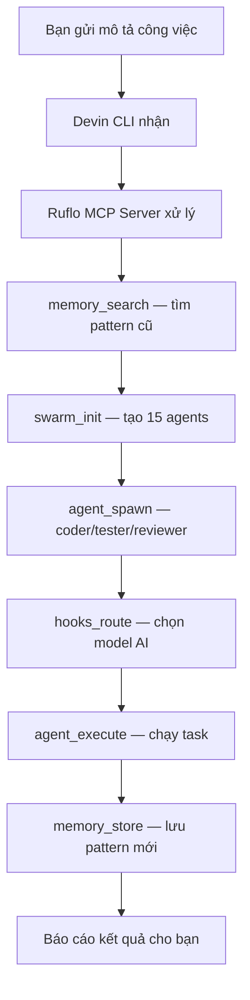
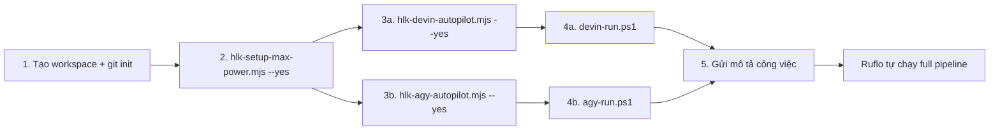

# Hướng dẫn cài đặt đầy đủ — Ruflo MAX POWER + Devin CLI Autopilot

> Tài liệu hướng dẫn từ đầu đến cuối: chạy 2 lệnh script xong là sẵn sàng gửi mô tả công việc cho AI.
> Ruflo tự động chạy full pipeline: swarm → agents → memory → execute → report.

---

## 0. Tổng quan — Chuyện gì xảy ra sau khi cài?



**Bạn chỉ cần làm 2 việc:**
1. Chạy 2 lệnh cài đặt (chỉ 1 lần)
2. Gửi mô tả công việc vào chat Devin CLI

**Ruflo tự động làm mọi thứ còn lại:**
- Khởi tạo swarm (đàn agent phối hợp)
- Tạo agent chuyên biệt (coder, tester, reviewer, architect...)
- Tìm pattern tương tự từ memory (học từ quá khứ)
- Chọn model AI phù hợp cho từng task
- Lưu kết quả vào memory (học cho lần sau)
- Báo cáo kết quả

---

## 1. Yêu cầu hệ thống

| Yêu cầu | Tối thiểu | Khuyến nghị |
|---------|-----------|-------------|
| Hệ điều hành | Windows 10 64-bit | Windows 11 |
| RAM | 4 GB | 8 GB+ |
| Disk | 500 MB trống | 1 GB |
| Git | đã cài | đã cài |
| Node.js | Không cần (script tự cài Node 22 portable) | — |
| Devin CLI | đã cài (`devin --version`) | v3000+ |
| Internet | Cần (tải Node 22 + ruflo) | — |

### Kiểm tra Devin CLI đã cài chưa

```powershell
devin --version
# Nếu chưa cài, tải từ https://devin.ai/downloads
```

---

## 2. Cài đặt — 2 lệnh, xong trong 5 phút

### Bước 1: Chuẩn bị thư mục workspace

```powershell
# Tạo thư mục workspace (nếu chưa có)
mkdir D:\path\to\your\workspace
cd D:\path\to\your\workspace

# Khởi tạo git (ruflo cần git)
git init
git config user.email "you@example.com"
git config user.name "Your Name"

# Tạo package.json tối thiểu
'{"name":"my-workspace","version":"1.0.0","private":true}' | Out-File -FilePath package.json -Encoding utf8

# Tạo .gitignore tối thiểu
"node_modules/`n.env`n*.log`n" | Out-File -FilePath .gitignore -Encoding utf8

# Commit đầu tiên
git add -A
git commit -m "init"
```

### Bước 2: Chạy script MAX POWER setup

```powershell
# Thay <HLK_REPO> bằng đường dẫn đến repo Loop_harness_ruflo
# Thay <WORKSPACE> bằng đường dẫn workspace của bạn

node <HLK_REPO>\HLK\bin\hlk-setup-max-power.mjs --path <WORKSPACE> --yes --provider claude
```

**Ví dụ thực tế:**
```powershell
node D:\100.Software\Github\Loop_harness_new\Loop_harness_ruflo\HLK\bin\hlk-setup-max-power.mjs --path D:\100.Software\TMP_Source\08_Bot --yes --provider claude
```

**Script tự động làm:**
- Cài Node 22.22.3 portable vào `.tools/node/` (không ảnh hưởng Node hệ thống)
- Tạo `activate.ps1` + `activate.cmd` (bật Node 22 cho workspace)
- Cài ruflo 3.34+ vào workspace (`npm install --save-dev ruflo`)
- Cấu hình `.claude/settings.json` — MAX POWER (15 agents, hybrid+HNSW)
- Cấu hình `.devin/` — MCP + permissions + hooks + skills
- Cấu hình `.agents/` — Antigravity CLI
- Cài HLK layer (security, telemetry blocker, vault bridge)
- Cài Git hooks
- Chạy `ruflo doctor` (health check)
- Chạy `ruflo status` (kiểm tra)
- Chạy `HLK integrity verify`

### Bước 3: Chạy script Devin Autopilot

```powershell
node <HLK_REPO>\HLK\bin\hlk-devin-autopilot.mjs --path <WORKSPACE> --yes
```

**Ví dụ thực tế:**
```powershell
node D:\100.Software\Github\Loop_harness_new\Loop_harness_ruflo\HLK\bin\hlk-devin-autopilot.mjs --path D:\100.Software\TMP_Source\08_Bot --yes
```

**Script tự động làm:**
- Tự cài Node 22 portable (nếu chưa có, đảm bảo MCP server chạy được)
- Cấu hình `.devin/mcp_config.json` — Devin CLI gọi ruflo MCP qua Node 22
- Cấu hình `.devin/config.json` — permissions (cho ruflo + node + git)
- Tạo `.devin/skills/ruflo-autopilot/SKILL.md` — skill hướng Devin tự gọi ruflo
- Tạo `AGENTS.md` — hướng dẫn autopilot
- Tạo `devin-run.ps1` + `devin-run.cmd` — wrapper chạy Devin với Node 22

> **Note (2026 update)**: `ruflo-autopilot` hiện đã **DEPRECATED**. Cho task coding thông thường,
> dùng `/lightning` (SWE-1.7 Lightning, nhanh, $2.5/$12.5 MTok) hoặc `/glm` (GLM-5.2, **free tier**,
> capable tier ~Opus-4.8 class). Cả 2 dùng native Devin subagents — rẻ hơn, nhanh hơn autopilot MCP.
> `ruflo-autopilot` chỉ giữ cho manual MCP orchestration (swarm, memory CRUD).

### Bước 3b: Chạy script Antigravity Autopilot (tùy chọn, nếu dùng agy)

```powershell
node <HLK_REPO>\HLK\bin\hlk-agy-autopilot.mjs --path <WORKSPACE> --yes
```

**Ví dụ thực tế:**
```powershell
node D:\100.Software\Github\Loop_harness_new\Loop_harness_ruflo\HLK\bin\hlk-agy-autopilot.mjs --path D:\100.Software\TMP_Source\08_Bot --yes
```

**Script tự động làm:**
- Tự cài Node 22 portable (nếu chưa có)
- Cấu hình `.agents/mcp_config.json` — agy gọi ruflo MCP qua Node 22
- Cấu hình `.agents/config.toml` — MCP server + MAX POWER settings
- Tạo `.agents/skills/ruflo-autopilot/SKILL.md` — skill hướng agy tự gọi ruflo
- Tạo `AGENTS.md` — hướng dẫn autopilot
- Tạo `agy-run.ps1` + `agy-run.cmd` — wrapper chạy agy với Node 22

---

## 3. Sẵn sàng dùng — Gửi mô tả công việc

### Cách 1A: Devin CLI — Interactive (chat trong terminal)

```powershell
cd D:\path\to\your\workspace

# Chạy Devin CLI với Node 22 portable
.\devin-run.ps1

# Hoặc CMD:
devin-run.cmd
```

Sau khi Devin CLI mở, gõ mô tả công việc:
```
Tạo API REST cho quản lý user với JWT auth, gồm login, register, get profile, update profile.
Viết test cho tất cả endpoints, coverage > 80%.
```

Ruflo tự động chạy full pipeline và báo cáo.

### Cách 1B: Antigravity CLI — Interactive (chat trong terminal)

```powershell
cd D:\path\to\your\workspace

# Chạy agy với Node 22 portable
.\agy-run.ps1

# Hoặc CMD:
agy-run.cmd
```

Sau khi agy mở, gõ mô tả công việc (như trên). Ruflo tự động chạy full pipeline.

### Cách 2A: Devin CLI — Non-interactive (tự động hoàn toàn)

```powershell
cd D:\path\to\your\workspace

.\devin-run.ps1 -p --permission-mode dangerous -- "mô tả công việc của bạn"
```

**Ví dụ:**
```powershell
.\devin-run.ps1 -p --permission-mode dangerous -- "Tạo file hello.js với nội dung console.log('Hello from ruflo autopilot!'). Dùng ruflo MCP tools: swarm_init, agent_spawn (type coder), memory_store (key hello-result, value success, namespace results). Báo cáo kết quả."
```

### Cách 2B: Antigravity CLI — Non-interactive (tự động hoàn toàn)

```powershell
cd D:\path\to\your\workspace

.\agy-run.ps1 -p --dangerously-skip-permissions -- "mô tả công việc của bạn"
```

**Ví dụ:**
```powershell
.\agy-run.ps1 -p --dangerously-skip-permissions -- "Tạo file hello.js với nội dung console.log('Hello from agy autopilot!'). Dùng ruflo MCP tools: swarm_init, agent_spawn (type coder), memory_store (key agy-result, value success, namespace results). Báo cáo kết quả."
```

### So sánh 3 CLI

| CLI | Cấu hình | Wrapper | Non-interactive flag | Auto-approve flag |
|-----|----------|---------|----------------------|-------------------|
| **Claude Code** | `.claude/settings.json` | `claude` (trực tiếp) | `-p` | `--dangerously-skip-permissions` |
| **Devin CLI** | `.devin/mcp_config.json` | `devin-run.ps1` / `.cmd` | `-p` | `--permission-mode dangerous` |
| **Antigravity CLI** | `.agents/mcp_config.json` + `config.toml` | `agy-run.ps1` / `.cmd` | `-p` | `--dangerously-skip-permissions` |

> Cả 3 CLI đều gọi **cùng 1 ruflo MCP server** (333 tools), cùng 1 swarm, cùng 1 memory.
> Bạn có thể dùng bất kỳ CLI nào — ruflo chạy full pipeline như nhau.

---

## 4. Cấu trúc workspace sau khi cài

```
your-workspace/
├── .tools/
│   └── node/                        ← Node 22.22.3 portable (không commit)
│       ├── node.exe
│       ├── npm.cmd
│       └── npx.cmd
├── .claude/
│   ├── settings.json                ← MAX POWER config (15 agents, hybrid+HNSW)
│   ├── skills/                      ← 133 skills (ruflo 34 + ClaudeKit + HLK)
│   ├── agents/                      ← 23 agent personas
│   ├── commands/                    ← 18 commands
│   └── helpers/                     ← hook handlers
├── .devin/
│   ├── mcp_config.json              ← MCP server (Node 22 portable tuyệt đối)
│   ├── config.json                  ← permissions
│   ├── hooks.v1.json                ← 6 lifecycle events
│   └── skills/
│       └── ruflo-autopilot/
│           └── SKILL.md             ← Skill hướng Devin tự gọi ruflo
├── .agents/
│   ├── mcp_config.json              ← Antigravity CLI MCP
│   ├── config.toml
│   └── AGENTS.md
├── .claude-flow/
│   ├── config.yaml                  ← Ruflo config
│   ├── runtime.json                 ← Runtime MAX
│   └── providers.json               ← 5 providers (claude+codex+gemini+openai+openrouter)
├── .swarm/
│   └── memory.db                    ← AgentDB memory (SQLite + HNSW vector search)
├── HLK/
│   ├── bin/                         ← HLK scripts
│   ├── wrappers/                    ← MCP wrapper, loader, hook bridge
│   ├── security/                    ← Sanitizer, vault bridge
│   ├── config/                      ← HLK config
│   └── prompts/                     ← 6 prompt files
├── .githooks/                       ← Git hooks
├── activate.ps1                     ← Bật Node 22 cho PowerShell
├── activate.cmd                     ← Bật Node 22 cho CMD
├── devin-run.ps1                    ← Chạy Devin CLI với Node 22
├── devin-run.cmd                    ← Chạy Devin CLI với Node 22 (CMD)
├── AGENTS.md                        ← Hướng dẫn autopilot cho Devin
├── CLAUDE.md                        ← Project rules
├── package.json                     ← Ruflo trong devDependencies
└── .gitignore                       ← Đã có .tools/node/, node_modules/, .env
```

---

## 5. 15 agent types của ruflo — Chuyên môn từng agent

| # | Loại agent | Chuyên làm gì |
|---|-----------|---------------|
| 1 | **coder** | Viết code |
| 2 | **researcher** | Nghiên cứu, tìm tài liệu, phân tích |
| 3 | **tester** | Viết test, chạy test, automation |
| 4 | **reviewer** | Review code, kiểm tra chất lượng |
| 5 | **architect** | Thiết kế hệ thống, enterprise patterns |
| 6 | **coordinator** | Điều phối nhiều agent |
| 7 | **analyst** | Phân tích hiệu năng |
| 8 | **optimizer** | Tối ưu performance, tìm bottleneck |
| 9 | **security-architect** | Thiết kế bảo mật, threat modeling |
| 10 | **security-auditor** | Kiểm tra CVE, lỗ hổng security |
| 11 | **memory-specialist** | Quản lý AgentDB (150x faster) |
| 12 | **swarm-specialist** | Quản lý swarm coordination |
| 13 | **performance-engineer** | Tối ưu performance targets |
| 14 | **core-architect** | Domain-driven design |
| 15 | **test-architect** | TDD London School methodology |

### Chọn số agent theo độ phức tạp task

| Loại task | Số agent | Lý do |
|-----------|----------|-------|
| Task nhỏ (1 file, fix bug đơn giản) | 5 | Nhanh, ít tốn token |
| Task trung bình (feature mới, vài file) | 10 | Cân bằng tốc độ + chất lượng |
| Task lớn (refactor, multi-module) | 15 (mặc định) | Dùng đầy đủ mọi loại agent |
| Task cực lớn (enterprise, multi-team) | 20–50 | Maximum parallelism |

---

## 6. 333 MCP tools của ruflo — Nhóm tool chính

### Swarm & Agent (điều phối)
| Tool | Chức năng |
|------|-----------|
| `swarm_init` | Khởi tạo swarm (topology, maxAgents) |
| `swarm_status` | Trạng thái swarm |
| `swarm_shutdown` | Dừng swarm |
| `agent_spawn` | Tạo agent chuyên biệt |
| `agent_execute` | Chạy task trên agent |
| `agent_terminate` | Xóa agent |
| `agent_list` | Liệt kê agents |
| `agent_status` | Trạng thái 1 agent |

### Memory (học từ quá khứ)
| Tool | Chức năng |
|------|-----------|
| `memory_store` | Lưu pattern/kết quả |
| `memory_search` | Tìm pattern tương tự (vector search) |
| `memory_retrieve` | Lấy theo key |
| `memory_list` | Liệt kê theo namespace |
| `memory_stats` | Thống kê memory |
| `memory_export` | Export memory |
| `memory_import` | Import memory |

### Hooks (tự động hóa)
| Tool | Chức năng |
|------|-----------|
| `hooks_route` | Chọn model AI phù hợp cho task |
| `hooks_pre-task` | Hook trước task |
| `hooks_post-task` | Hook sau task |
| `hooks_metrics` | Metrics |
| `hooks_list` | Liệt kê hooks |

### Config & Policy
| Tool | Chức năng |
|------|-----------|
| `config_get` | Đọc config |
| `config_set` | Ghi config |
| `config_list` | Liệt kê config |

---

## 7. Topology swarm — Chọn kiểu phối hợp

| Topology | Mô tả | Khi nào dùng |
|----------|-------|-------------|
| **hierarchical-mesh** | V3 15-agent queen + peer communication (recommended) | Task lớn, multi-role |
| **hierarchical** | Queen-led coordination with worker agents | Task trung bình |
| **mesh** | Fully connected peer-to-peer | Task cần phối hợp chặt |
| **ring** | Circular communication pattern | Task tuần tự |
| **star** | Central coordinator with spoke agents | Task đơn giản |
| **hybrid** | Hierarchical mesh for maximum flexibility | Task phức tạp |
| **pheromone-adaptive** | Role-aware dynamic eligibility with quorum safety | Task cần adaptive |

---

## 8. Skills có sẵn (133 skills)

### Ruflo skills (34)
`swarm-orchestration`, `swarm-advanced`, `agentdb-learning`, `agentdb-vector-search`,
`agentdb-optimization`, `v3-security-overhaul`, `v3-core-implementation`,
`v3-ddd-architecture`, `github-code-review`, `github-project-management`,
`sparc-methodology`, `pair-programming`, `verification-quality`,
`hooks-automation`, `stream-chain`, ...

### ClaudeKit skills
`ck-plan`, `ck-cook`, `ck-fix`, `ck-debug`, `ck-security`, `ck-loop`,
`ck-predict`, `ck-scenario`, `ck-autoresearch`, ...

### HLK skills
`hlk-git-tools`, `hlk-integrity-check`, `hlk-upstream-pull`, `hlk-loop`,
`hlk-commit-msg`, `hlk-handoff`, `hlk-metric`, ...

### Dev skills
`frontend-development`, `backend-development`, `databases`, `devops`,
`mobile-development`, `react-best-practices`, `tanstack`, ...

---

## 9. Lệnh thường dùng

### Ruflo CLI (chạy sau khi activate)

```powershell
# Bật Node 22
.\activate.ps1

# Swarm
npx ruflo swarm init --topology hierarchical-mesh --max-agents 15
npx ruflo swarm status
npx ruflo swarm shutdown

# Agent
npx ruflo agent spawn --type coder --name my-coder
npx ruflo agent list
npx ruflo agent status <agent-id>

# Memory
npx ruflo memory store --key "pattern-x" --value "what worked" --namespace patterns
npx ruflo memory search --query "task keywords"
npx ruflo memory list --namespace patterns

# Health check
npx ruflo doctor
npx ruflo status

# Daemon
npx ruflo daemon start
npx ruflo daemon status
npx ruflo daemon stop
```

### Devin CLI

```powershell
# Interactive
.\devin-run.ps1

# Non-interactive
.\devin-run.ps1 -p --permission-mode dangerous -- "mô tả công việc"

# MCP management
devin mcp list
devin mcp get claude-flow
```

---

## 10. Cập nhật sau

```powershell
# Cập nhật ruflo + cấu hình MAX POWER
node <HLK_REPO>\HLK\bin\hlk-update-max-power.mjs --path <WORKSPACE> --yes

# Hoặc qua npm script (nếu có)
npm run update:max-power -- --path <WORKSPACE>
```

---

## 11. Xử lý sự cố

### Lỗi: `crypto is not defined`

**Nguyên nhân:** Node 18 mặc định trong PATH, ruflo cần Node 20+.

**Sửa:**
```powershell
# Bật Node 22 portable
.\activate.ps1

# Hoặc chạy lại script autopilot (tự cài Node portable)
node <HLK_REPO>\HLK\bin\hlk-devin-autopilot.mjs --path <WORKSPACE> --yes
```

### Lỗi: `Failed to connect to MCP server 'claude-flow'`

**Nguyên nhân:** Devin CLI spawn MCP server bằng Node sai version.

**Sửa:** Kiểm tra `.devin/mcp_config.json` dùng Node 22 portable tuyệt đối:
```json
{
  "mcpServers": {
    "claude-flow": {
      "command": "D:\\path\\to\\workspace\\.tools\\node\\node.exe",
      "args": ["D:\\path\\to\\workspace\\HLK\\wrappers\\ruflo-hlk-mcp.mjs", "mcp", "start"]
    }
  }
}
```

### Lỗi: `npx ruflo` không chạy

**Sửa:**
```powershell
# Kiểm tra Node version
node --version  # phải >= 20

# Nếu Node 18, bật portable
.\activate.ps1

# Kiểm tra ruflo đã cài
npm list ruflo  # phải có ruflo trong devDependencies
```

### Lỗi: HLK integrity verify FAILED

**Sửa:**
```powershell
# Xem file nào thiếu
node HLK/wrappers/hlk-verify-integrity.js

# Chạy lại setup MAX POWER
node <HLK_REPO>\HLK\bin\hlk-setup-max-power.mjs --path <WORKSPACE> --yes
```

---

## 12. Test đã chạy thành công (workspace 08_Bot)

| Test | Kết quả |
|------|---------|
| `hlk-setup-max-power.mjs --yes` | ✓ Ruflo v3.34.0 cài, 14 passed, 12 warnings |
| `hlk-devin-autopilot.mjs --yes` | ✓ Node 22 portable tự cài, MCP config OK |
| `activate.cmd && npx ruflo swarm init` | ✓ Swarm swarm-1785735583168-yaxh28 |
| `activate.cmd && npx ruflo memory store` | ✓ Stored, 384-dim vector |
| `activate.cmd && npx ruflo status` | ✓ Status hiển thị |
| `devin -p -- "swarm_init + agent_spawn + memory_store"` | ✓ 3 MCP tools gọi thành công |
| `hlk-agy-autopilot.mjs --yes` | ✓ .agents/ config OK, skill + wrapper tạo |
| `MCP server qua Node 22 portable` | ✓ initialize + tools/list trả 333 tools |

---

## 13. Tóm tắt — Bạn cần làm gì



**3 lệnh cài đặt (chạy 1 lần):**
```powershell
# Bước 1: Cài MAX POWER (Ruflo + HLK + 3 CLI configs)
node <HLK_REPO>\HLK\bin\hlk-setup-max-power.mjs --path <WORKSPACE> --yes --provider claude

# Bước 2a: Cài Devin Autopilot (nếu dùng Devin CLI)
node <HLK_REPO>\HLK\bin\hlk-devin-autopilot.mjs --path <WORKSPACE> --yes

# Bước 2b: Cài Antigravity Autopilot (nếu dùng agy)
node <HLK_REPO>\HLK\bin\hlk-agy-autopilot.mjs --path <WORKSPACE> --yes
```

**1 lệnh dùng hàng ngày — chọn 1 trong 3 CLI:**
```powershell
cd <WORKSPACE>

# Claude Code (trực tiếp):
claude

# Devin CLI:
.\devin-run.ps1

# Antigravity CLI:
.\agy-run.ps1

# Gõ mô tả công việc → ruflo tự chạy full pipeline
```
