# Báo Cáo 01 — Phân Tích Codebase Ruflo & Điểm Bám Cho HLK Middleware

> **Pipeline HLK — Prompt 01: Codebase Scanning & Architecture Mapping**
> Phân tích trên repo cục bộ: `Loop_harness_ruflo` (package `claude-flow` v3.34.0, tên thương hiệu *Ruflo*).
> Mục tiêu: xác định các **hook point** (điểm bám) để lớp trung gian HLK (`HLK/wrappers/hlk-loader.js`) gắn vào **mà không sửa file core** của ruflo.

---

## 1. Tổng Quan Cấu Trúc Codebase

### 1.1. Các thư mục chính

| Thư mục | Vai trò | Ghi chú quan trọng cho HLK |
|---|---|---|
| `bin/` | Entrypoint umbrella của CLI. `bin/cli.js` (11 dòng) chỉ **proxy** sang `v3/@claude-flow/cli/bin/cli.js`. Kèm `npx-safe-launch.js`, `npx-repair.js` (đều là wrapper mỏng). | Lớp vỏ mỏng nhất, dễ chèn wrapper nhất |
| `v3/@claude-flow/` | Monorepo lõi (~25 package): `cli`, `cli-core`, `hooks`, `memory`, `guidance`, `security`, `mcp`, `neural`, `codex`, `providers`, `plugins`... | Toàn bộ logic thật nằm ở đây |
| `v3/@claude-flow/cli/` | CLI 26 lệnh, 140+ lệnh con. `bin/cli.js` (build sẵn) tự phát hiện chế độ MCP stdio; chế độ thường thì `import('../dist/src/index.js')` → `new CLI().run()`. | Điểm hội tụ mọi luồng thực thi |
| `v3/@claude-flow/hooks/` | Hệ thống hooks tự học: 17 hooks + 12 background workers (`src/workers`, `src/daemons`, `src/registry`, `src/executor`). | Cơ chế hook chính thức của ruflo |
| `v3/@claude-flow/memory/` + `cli/src/memory/` | AgentDB + HNSW vector search. File then chốt: `memory-bridge.ts` (~3100 dòng, 86 tham chiếu agentdb), `memory-initializer.ts`. Dữ liệu lưu ở `agentdb.rvf` gốc repo. | Nơi dữ liệu nhạy cảm đi vào bộ nhớ — mục tiêu sanitize |
| `plugins/` | 38 plugin dạng **Claude Code plugin** (`ruflo-core`, `ruflo-observability`, `ruflo-security-audit`...), mỗi plugin có `.claude-plugin/`, `agents/`, `commands/`, `skills/`, `scripts/`. | Khe cắm plugin khai báo (markdown + manifest), không cần sửa core |
| `services/` | Chỉ có `cognitum-analytics` (README) — service runtime thực tế nằm trong `v3/@claude-flow/cli/src/services/` (headless-worker-executor, harness-canary, global-ai-budget...). | Telemetry/budget nằm ở đây |
| `scripts/` | ~40 script audit/benchmark (`audit-supply-chain.mjs`, `audit-plugin-manifest.mjs`, `audit-env-var-precedence.mjs`...). | Mẫu tốt để HLK viết script verify riêng |
| `.claude/` | Cấu hình Claude Code: `settings.json` có mục **`hooks`** (PreToolUse/PostToolUse gọi `.claude/helpers/hook-handler.cjs`) + biến môi trường. | Hook point cấp "agent runtime", không đụng code ruflo |
| `HLK/` | Lớp HLK hiện có: `wrappers/hlk-loader.js` (v2.0.0, ESM, toggle qua `config/hlk.config.json`), `security/sanitizer.js`, `security/vault-bridge.js`, `wrappers/hlk-verify-integrity.js`. | Middleware cần gắn vào |

### 1.2. Đặc điểm hlk-loader.js hiện tại

- Là **module ESM tự khởi tạo khi import**: đọc `HLK/config/hlk.config.json`, nếu `hlk_enabled=true` thì (1) bơm biến môi trường chặn telemetry (`OTEL_TRACES_EXPORTER=none`, `DISABLE_TELEMETRY=1`...), (2) nạp sanitizer che giấu secret, (3) nạp vault-bridge quản lý khóa API.
- Vì hành vi chính là **side-effect khi import** (đặt env var trước khi core load), nên chỉ cần đảm bảo nó được **import TRƯỚC** `v3/@claude-flow/cli` là đủ kích hoạt phần telemetry-blocker và vault — đây là ràng buộc thiết kế quan trọng nhất.

---

## 2. Luồng Dữ Liệu (Dataflow)

### 2.1. Chuỗi khởi động CLI

1. `npx claude-flow ...` → npm gọi `bin/cli.js` (umbrella, theo trường `"bin"` trong `package.json`).
2. `bin/cli.js` dùng `await import(...)` nạp `v3/@claude-flow/cli/bin/cli.js`.
3. File này **cài console filter trước mọi import khác** (chống lộ noise ra stdout MCP), rồi:
   - Nếu stdin là pipe + không có args → chạy **MCP stdio server** (JSON-RPC `tools/list`, `tools/call` → `callMCPTool`).
   - Ngược lại → `import('../dist/src/index.js')` → `new CLI().run()` (commander, 26 lệnh).
4. Lệnh chạm memory (`memory store/search`, hooks, swarm...) đi qua `cli/src/memory/memory-bridge.ts` → thư viện `agentdb` (optionalDependency) → file `agentdb.rvf` + SQLite hybrid.
5. Gọi API ngoài / telemetry: `cli/src/funnel/*` (event-transport, consent, enrollment — telemetry sản phẩm), `cli/src/services/*` (headless-worker-executor, harness-canary, global-ai-budget), provider LLM qua `@claude-flow/providers` / `agentic-flow`; điều khiển bằng **biến môi trường OTEL/telemetry** (override được — root `package.json` pin `@opentelemetry/*`).

### 2.2. Sơ đồ kiến trúc + điểm bám HLK

```mermaid
flowchart TD
    subgraph ENTRY["Điểm vào"]
        NPX["npx claude-flow / ruflo"] --> BIN["bin/cli.js<br/>(umbrella proxy, 11 dòng)"]
        BIN --> V3BIN["v3/@claude-flow/cli/bin/cli.js<br/>(console filter + auto-detect MCP)"]
    end

    subgraph CORE["Lõi CLI (v3/@claude-flow/cli/dist)"]
        V3BIN -->|"CLI mode"| CLIRUN["CLI().run()<br/>26 lệnh / 140+ lệnh con"]
        V3BIN -->|"stdin pipe"| MCPSRV["MCP stdio server<br/>tools/list · tools/call"]
        CLIRUN --> HOOKS["@claude-flow/hooks<br/>17 hooks + 12 workers"]
        CLIRUN --> PLUGMGR["PluginManager<br/>.claude-flow/plugins/installed.json"]
    end

    subgraph DATA["Dữ liệu & Bộ nhớ"]
        CLIRUN --> MEMBR["memory-bridge.ts"]
        MEMBR --> AGENTDB[("AgentDB<br/>agentdb.rvf + SQLite + HNSW")]
    end

    subgraph EXT["Ra ngoài"]
        CLIRUN --> FUNNEL["funnel/* — telemetry sản phẩm<br/>(consent, event-transport)"]
        CLIRUN --> PROV["Providers / agentic-flow<br/>→ API LLM (Anthropic, OpenAI...)"]
        FUNNEL --> NET(("Internet"))
        PROV --> NET
    end

    subgraph HLK["Lớp HLK (không sửa core)"]
        LOADER["HLK/wrappers/hlk-loader.js"]
        SAN["sanitizer.js"]
        VAULT["vault-bridge.js"]
        LOADER --> SAN
        LOADER --> VAULT
    end

    LOADER -.->|"H1: shim bin/ mới import loader trước core"| BIN
    LOADER -.->|"H2: NODE_OPTIONS=--import (preload)"| NPX
    LOADER -.->|"H3: env override chặn OTEL/funnel"| FUNNEL
    SAN -.->|"H4: hooks PreToolUse/PostToolUse<br/>.claude/settings.json"| HOOKS
    LOADER -.->|"H5: plugin hlk trong plugins/ hoặc PluginManager"| PLUGMGR
    SAN -.->|"H6: sanitize trước khi ghi memory<br/>(qua hook post-edit/post-task)"| MEMBR
```

---

## 3. Đánh Giá Khả Năng Mở Rộng (Extensibility)

Ruflo có **nhiều tầng mở rộng chính thức**, rất thuận lợi cho HLK:

1. **Wrapper bin mỏng**: `bin/cli.js` chỉ là proxy 11 dòng — pattern "wrapper chồng wrapper" đã được chính ruflo dùng (`npx-safe-launch.js` cũng proxy y hệt). Thêm một shim nữa là hoàn toàn đúng "văn hóa" codebase.
2. **Node.js preload chuẩn**: vì toàn bộ là ESM + Node ≥ 20, cờ `NODE_OPTIONS="--import=<file>"` nạp module trước mọi code ứng dụng — cơ chế của chính Node, không đụng ruflo byte nào.
3. **Điều khiển bằng biến môi trường**: telemetry/OTel/funnel đều đọc env var (root package.json quản lý version OTel qua `overrides`; có cả script `audit-env-var-precedence.mjs` chứng tỏ env là kênh cấu hình hạng nhất).
4. **Hệ hooks 2 tầng**: (a) hooks tự học của ruflo (`hooks pre-task/post-edit...` — 17 hooks), (b) hooks của Claude Code trong `.claude/settings.json` (`PreToolUse`/`PostToolUse` gọi lệnh shell bất kỳ) — HLK chèn lệnh sanitize/kiểm tra tại đây không cần sửa code.
5. **Hệ plugin kép**: (a) `plugins/` — 38 Claude-Code-plugin dạng khai báo (manifest + markdown + scripts); (b) `PluginManager` runtime (`cli/src/plugins/manager.ts`) cài plugin npm vào `.claude-flow/plugins/`, có trạng thái enable/disable, load module — HLK có thể đóng gói thành plugin `ruflo-hlk`.
6. **Điểm cần lưu ý**: `memory-bridge.ts` không có API middleware/interceptor công khai — muốn sanitize dữ liệu vào AgentDB *sâu* thì phải đi qua tầng hook (post-edit/post-task) hoặc monkey-patch lúc preload, không có "khe cắm" chính thức.

---

## 4. Bảng Hook Points Xếp Hạng Theo Mức Độ Không Xâm Lấn

*Xếp hạng: 1 = ít xâm lấn nhất, an toàn nhất khi merge upstream.*

| # | Hook point | Cách gắn | Không xâm lấn | Độ phủ | Rủi ro khi upstream đổi | Khuyến nghị |
|---|---|---|---|---|---|---|
| 1 | **`NODE_OPTIONS=--import` preload** | Đặt `NODE_OPTIONS="--import=file://.../HLK/wrappers/hlk-loader.js"` (qua shell profile, `.npmrc`, hoặc script khởi chạy). Loader chạy trước cả console-filter của ruflo. | ⭐⭐⭐⭐⭐ (0 file ruflo bị đụng) | Toàn bộ process Node, kể cả MCP mode và child process kế thừa env | Gần như 0 — cơ chế của Node, không phụ thuộc cấu trúc ruflo | **Chính** — bật telemetry-blocker + vault sớm nhất |
| 2 | **Shim launcher mới trong HLK/** (vd. `HLK/wrappers/ruflo-hlk.js`): `import hlk-loader.js` rồi `import bin/cli.js` | Tạo file MỚI, trỏ alias/`bin` riêng (`ruflo-hlk`) hoặc dạy user gọi `node HLK/wrappers/ruflo-hlk.js` | ⭐⭐⭐⭐⭐ (file mới, không sửa gì) | CLI mode + MCP mode | Thấp — chỉ phụ thuộc đường dẫn `v3/@claude-flow/cli/bin/cli.js` (ổn định, được ghi trong `package.json.bin`) | **Chính** — bản "cài đặt rõ ràng" của #1 |
| 3 | **Hooks Claude Code trong `.claude/settings.json`** (`PreToolUse`/`PostToolUse`) | Thêm entry hook gọi `node HLK/security/sanitizer.js` / verify script (settings.json là file cấu hình người dùng, không phải core code) | ⭐⭐⭐⭐ (sửa config, không sửa code) | Mọi tool-call của agent (Bash, Write, Edit) — chặn secret TRƯỚC khi vào memory/log | Trung bình-thấp — schema settings do Claude Code định nghĩa; upstream có thể merge-conflict settings.json | **Chính** — tuyến sanitize dữ liệu runtime |
| 4 | **Plugin `ruflo-hlk` trong `plugins/`** (Claude-Code-plugin: manifest + commands + scripts) | Thêm thư mục mới `plugins/ruflo-hlk/` theo chuẩn 38 plugin sẵn có | ⭐⭐⭐⭐ (thư mục mới) | Lệnh/skill/agent HLK hiển thị chính thức trong hệ plugin | Thấp — có `audit-plugin-manifest.mjs` bảo vệ schema | Phụ — kênh phân phối lệnh HLK cho user |
| 5 | **Ruflo hooks system** (`hooks pre-task/post-edit/post-task` của `@claude-flow/hooks`) | Đăng ký worker/hook gọi sanitize + verify qua CLI hooks, không sửa package | ⭐⭐⭐ (dựa API hooks, cấu hình được) | Vòng đời task/edit của swarm — điểm chặn trước khi ghi pattern vào AgentDB | Trung bình — API hooks đang phát triển nhanh (17 hooks, alpha) | Phụ — sanitize luồng learning/memory |
| 6 | **postinstall / prepare script ở `HLK`-side** (kiểm tra integrity + nhắc bật NODE_OPTIONS; ruflo có sẵn `preinstall.cjs` no-op làm tiền lệ) | Script riêng của HLK (vd. gọi `hlk-verify-integrity.js`), KHÔNG thêm vào root package.json để tránh conflict | ⭐⭐⭐ | Thời điểm cài đặt/cập nhật | Trung bình — nếu ghi vào root `package.json.scripts` sẽ conflict khi merge upstream | Phụ — chỉ chạy thủ công hoặc qua git hook `.githooks/` |
| 7 | **Sửa trực tiếp `bin/cli.js`** (chèn `import hlk-loader` vào dòng đầu) | Sửa 1 dòng file core | ⭐ (xâm lấn — vi phạm yêu cầu) | CLI mode | Cao — mất khi merge upstream, phải re-apply | **Tránh** — chỉ là phương án cuối |

### 4.1. Kiến trúc gắn kết khuyến nghị (tổng hợp #1 + #2 + #3)

- **Tầng process**: `NODE_OPTIONS --import` hoặc shim `ruflo-hlk.js` → hlk-loader chạy trước core → env telemetry bị khóa, vault sẵn sàng.
- **Tầng runtime agent**: hook `PreToolUse`/`PostToolUse` trong `.claude/settings.json` → sanitizer quét lệnh Bash / nội dung Write-Edit trước khi thực thi/ghi.
- **Tầng dữ liệu**: hook `post-edit`/`post-task` của ruflo hooks → sanitize payload trước khi `memory store` ghi vào AgentDB.
- Ba tầng độc lập, tắt/bật riêng qua `hlk.config.json.features` (đã có sẵn cờ `custom_hooks_injection`, `telemetry_blocker`, `data_sanitization`).

---

## 5. Nhận Diện Điểm Cần Theo Dõi (cho các prompt sau)

- `cli/src/funnel/` — telemetry sản phẩm có consent/enrollment/event-transport: cần red-team ở Prompt 02 (kiểm chứng env override có chặn hết không).
- `memory-bridge.ts` (~3100 dòng) — không có interceptor chính thức; nếu cần sanitize sâu phải cân nhắc monkey-patch tại preload (đánh đổi độ bền khi upstream đổi).
- `headless-worker-executor.ts`, `global-ai-budget.ts` — child process/worker có thể KHÔNG kế thừa preload nếu spawn với env tùy biến → cần kiểm chứng.
- File `agentdb.rvf` nằm ngay gốc repo (kèm `.lock`) — dữ liệu memory tồn tại dạng file, cần đưa vào phạm vi quét của sanitizer/gitignore-audit.

---

## Learnings

- **Ruflo dùng pattern "proxy mỏng chồng lớp" ở bin/**: `bin/cli.js` và `npx-safe-launch.js` đều chỉ re-import `v3/@claude-flow/cli/bin/cli.js` — nghĩa là thêm một shim HLK bên ngoài là hoàn toàn đồng nhất với thiết kế gốc, và đường dẫn `v3/@claude-flow/cli/bin/cli.js` là contract ổn định (được khai báo trong `package.json.files`).
- **Thứ tự import quyết định hiệu lực middleware**: core CLI cài console-filter "TRƯỚC mọi import khác" để chặn noise stdout phá MCP JSON-RPC — HLK cũng phải chạy trước điểm này (qua `--import` preload) thì telemetry-blocker mới chắc chắn có hiệu lực; đồng thời HLK KHÔNG được in ra stdout ở MCP mode (log phải ra stderr) kẻo phá khung JSON-RPC.
- **Ruflo có 2 hệ plugin + 2 hệ hooks song song**: (plugins/ khai báo cho Claude Code vs PluginManager runtime cài npm vào `.claude-flow/plugins/`) và (ruflo hooks 17-hook tự học vs Claude Code hooks trong `.claude/settings.json`) — khi thiết kế điểm bám phải nói rõ đang dùng hệ nào, tránh nhầm lẫn ở các prompt sau.
- **Telemetry điều khiển được hoàn toàn bằng env var**: các exporter OTel bị pin version qua `overrides` và đọc `OTEL_*_EXPORTER`; ngoài ra còn tầng telemetry sản phẩm riêng ở `cli/src/funnel/` (consent-based) — chặn OTel thôi là CHƯA đủ, phải audit thêm funnel.
- **AgentDB không có khe middleware chính thức**: mọi sanitize dữ liệu memory phải đi vòng qua tầng hooks (post-edit/post-task) hoặc monkey-patch lúc preload — đây là giới hạn kiến trúc cần ghi nhận khi hứa hẹn "che secret trong memory".
- **Codebase tự trang bị script audit (`scripts/audit-*.mjs`) làm guard-rail**: HLK nên bắt chước mẫu này (đã có `hlk-verify-integrity.js`) và chạy audit sau mỗi lần merge upstream thay vì tin cậy merge tự động — chính sách `verify_hlk_after_merge` trong config đã đúng hướng.
- **Child process là lỗ hổng phủ sóng của preload**: env `NODE_OPTIONS` kế thừa sang child process theo mặc định, nhưng các executor (headless-worker) có thể ghi đè env khi spawn — mọi giải pháp preload cần kèm bài test xác minh phủ sóng đến worker con.
