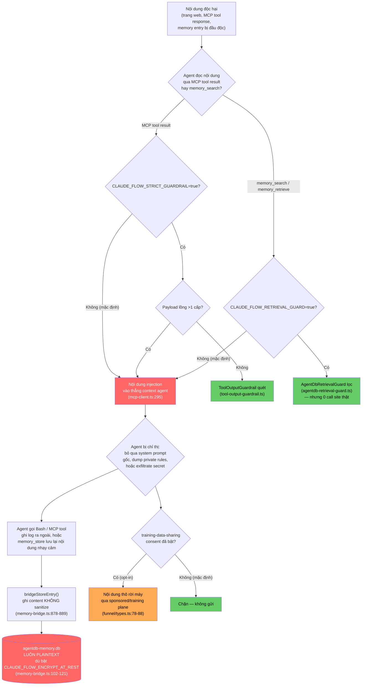

# Báo Cáo 02 — Redteam Security & Knowledge Protection Audit (Ruflo + HLK)

> **Pipeline HLK — Prompt 02: Redteam Security & Knowledge Protection Audit**
> Phạm vi: repo cục bộ `Loop_harness_ruflo` (package `claude-flow` v3.x, thương hiệu *Ruflo*).
> Vai trò: Chuyên gia Redteam & Cybersecurity — kiểm tra khả năng rò rỉ dữ liệu nhạy cảm (secrets, PII) và rò rỉ tri thức dự án (system prompt, private rules, business logic) qua **AgentDB/Persistent Memory**, **kênh telemetry funnel**, và **Prompt Injection**.
> **Phương pháp**: Không suy đoán. Mọi khẳng định đều được xác minh bằng `grep`/đọc file thật trong `v3/@claude-flow/*` và `plugins/`, có dẫn chứng `file:dòng`. Kế thừa và **đào sâu thêm** (không lặp lại) các phát hiện đã có ở Báo cáo 01 (bản đồ hook point) và Báo cáo 05 (telemetry funnel, consent, `ruflo-aidefence`, AgentDB).

---

## 1. Tóm Tắt Điều Hành

Kết quả điều tra cho thấy Ruflo đã tự thiết kế **đúng các lớp phòng thủ cần thiết** (`ToolOutputGuardrail` chống prompt injection — ADR-131/146; `AgentDbRetrievalGuard` chống memory-poisoning — ADR-377; consent 12-domain cho telemetry — ADR-302) nhưng có một mẫu lỗi lặp lại nhiều lần: **lớp phòng thủ được viết ra (class tồn tại, có test) nhưng KHÔNG được gọi ở điểm chốt chặn (chokepoint) thực tế, hoặc bị tắt mặc định qua biến môi trường**. Ruflo tự ghi nhận việc này trong chính ADR của họ (`ADR-146`: "A status-quo system with the class but no call sites is worse than not having the ADR at all"). Đây là góc nhìn quan trọng nhất của báo cáo này: **rủi ro không nằm ở việc thiếu công cụ, mà nằm ở việc công cụ có sẵn nhưng chưa được kích hoạt/nối dây (wiring) — đúng là dạng rủi ro mà lớp HLK cần bù đắp.**

Song song đó, HLK hiện tại cũng mắc đúng lỗi này: `HLK/security/sanitizer.js` và `HLK/wrappers/hlk-loader.js` có hàm `sanitize()` hoạt động tốt, nhưng **zero call site** vào `v3/@claude-flow/*` (đã `grep` xác nhận không có bất kỳ file nào trong `v3/` import `HLK/`).

---

## 2. Phần A — Rò Rỉ Dữ Liệu & Telemetry (đào sâu so với Báo cáo 05)

### 2.1. AgentDB ghi `content` thô, KHÔNG có bước sanitize/redact nào trước khi INSERT

File `v3/@claude-flow/cli/src/memory/memory-bridge.ts`, hàm `bridgeStoreEntry()`:

- Dòng 770–800: hàm nhận `value: string` trực tiếp từ caller (CLI `memory store`, MCP tool `memory_store`, hooks `post-edit`/`post-task`...).
- Dòng 832–836: bước kiểm tra duy nhất trước khi ghi là `guardValidate(registry, 'store', { key, namespace, size: value.length })` — hàm này (định nghĩa dòng 542–557) chỉ gọi `MutationGuard.validate()` với `operation/namespace/size`, **không hề truyền hay quét nội dung `value`**. Nếu không có guard cài đặt, dòng 549–550 mặc định **cho phép** (`return { allowed: true }`).
- Dòng 844–859: `value` được đưa thẳng vào `embedder.embed(value)` để sinh vector.
- Dòng 878–889: câu lệnh `INSERT INTO memory_entries (... content ...) VALUES (?, ?, ?, ?, ...)` ghi thẳng `value` vào cột `content` — **không có bước gọi `sanitize()`, `redact()`, hay bất kỳ regex secret-scan nào** trong toàn bộ hàm.
- Đã `grep` toàn bộ `memory-bridge.ts` và `memory-initializer.ts` với các pattern `redact|sanitiz|scrub|secret|api_key|password|token|Authorization` — không có match nào liên quan đến việc lọc nội dung trước khi ghi (chỉ có các match vô hại như tên biến `pattern_type`, comment kỹ thuật).

**Kết luận xác nhận trực tiếp mục tiêu #1 của Prompt 02**: nếu người dùng/agent dán một API key, mật khẩu hoặc JWT vào bất kỳ lệnh `memory store`/`hooks post-edit` nào, chuỗi đó **sẽ được lưu nguyên văn** trong AgentDB. Đây khớp với nhận định của Báo cáo 01 (dòng 100, 130): *"memory-bridge.ts không có API middleware/interceptor công khai"* — báo cáo này xác nhận bằng bằng chứng code cụ thể thay vì suy luận kiến trúc.

### 2.2. Phát hiện mới: file vật lý chứa AgentDB LUÔN LUÔN plaintext, kể cả khi bật `CLAUDE_FLOW_ENCRYPT_AT_REST=1`

Đây là phát hiện **không có** trong Báo cáo 05 (báo cáo 05 khuyến nghị bật `CLAUDE_FLOW_ENCRYPT_AT_REST=1` như một biện pháp chính, dòng 61–63 và dòng 84 của báo cáo 05) — điều tra sâu hơn cho thấy khuyến nghị đó **không che được đúng bảng dữ liệu rủi ro nhất**:

- `memory-bridge.ts` dòng 102–121, hàm `getAgentDbPath()`:
  ```
  // #2786: use agentdb-memory.db (plaintext) so native better-sqlite3
  // doesn't hit the encrypted memory.db.
  ```
  Comment dòng 106–110 giải thích rõ: AgentDB được mở bằng **native better-sqlite3**, driver này **bắt buộc phải đọc file SQLite dạng plaintext**. File `memory.db` (do `memory-initializer.ts` ghi, có hỗ trợ `encrypt: true`) khi bật `CLAUDE_FLOW_ENCRYPT_AT_REST=1` sẽ có định dạng mã hóa `RFE1` — nếu trỏ better-sqlite3 vào đó sẽ lỗi `"file is not a database"`.
  → Để né lỗi này, Ruflo **cố ý** tạo một file **riêng, luôn luôn plaintext**: `agentdb-memory.db` (dòng 117–121: `path.join(path.dirname(dbPath), 'agentdb-memory.db')`).
- Dòng 182–183 trong `getRegistry()` xác nhận lại: `dbPath: dbPath || getAgentDbPath()` — tức **mọi lần** `bridgeStoreEntry`/`bridgeSearchEntries`/... khởi tạo registry mà không truyền `dbPath` tường minh, đều rơi vào file `agentdb-memory.db` này.
- `ADR-096-encryption-at-rest.md` dòng 41–42 xác nhận phạm vi mã hóa chỉ gồm **"High" tier**: `sessions/`, `.swarm/memory.db`, `terminals/` — **không liệt kê `agentdb-memory.db`**.

**Hệ quả**: bảng `memory_entries` — đúng nơi mục 2.1 vừa chứng minh là ghi `content` thô không sanitize — nằm trong file `.swarm/agentdb-memory.db` **được thiết kế để KHÔNG BAO GIỜ mã hóa**, bất kể cấu hình `CLAUDE_FLOW_ENCRYPT_AT_REST`. Khuyến nghị "bật mã hóa at-rest" của Báo cáo 05 vẫn đúng cho `sessions/`, `terminals/`, nhưng **tạo cảm giác an toàn sai** (false sense of security) cho đúng bảng dữ liệu rủi ro nhất.

### 2.3. Không có hardening quyền truy cập file cho `agentdb-memory.db`

`grep` từ khóa `chmod|mode: 0o600|fchmod` trong `v3/@claude-flow/memory/src/` chỉ khớp trong file test (`auto-memory-bridge.test.ts` dòng 837, 846), không có trong code runtime tạo file DB. So sánh với `funnel/event-transport.ts` dòng 102: `fs.writeFileSync(statePath(EVENTS_FILE), body, { encoding: 'utf-8', mode: 0o600 })` — funnel tự giới hạn quyền file 0600, nhưng AgentDB thì không có bước tương đương trong `memory-bridge.ts`/`memory-initializer.ts`. File `agentdb-memory.db` được tạo với quyền mặc định của hệ điều hành (phụ thuộc umask).

### 2.4. Xác nhận lại & bổ sung cho phát hiện funnel của Báo cáo 05

Đọc trực tiếp `event-transport.ts` (228 dòng) và `message-transport.ts` (173 dòng) để kiểm chứng độc lập:

- `event-transport.ts` dòng 42–43: endpoint mặc định `https://funnel.ruv.io/v1/events`, override bằng `RUFLO_FUNNEL_EVENTS_ENDPOINT` — khớp Báo cáo 05.
- Dòng 181: `if (!hasConsent('telemetry')) return { flushed: 0, skipped: 'no-consent' };` — khớp Báo cáo 05, xác nhận lại bằng đọc code trực tiếp (không chỉ tin báo cáo trước).
- **Phát hiện làm rõ thêm**: `message-transport.ts` (endpoint `/v1/messages`) mà Báo cáo 05 liệt kê chung nhóm "outbound" với `/v1/events` và `/v1/click`, thực chất theo đúng code (dòng 1–32, comment kiến trúc) là một **kênh INBOUND** — client `fetch` một feed thông báo/khuyến mãi từ server rồi hiển thị ở statusline, KHÔNG gửi dữ liệu người dùng lên. Nó được xác thực qua `isValidMessage()` (dòng 18–20: cùng schema, host allowlist, strip ký tự điều khiển, giới hạn 80 cột) trước khi hiển thị — nghĩa là rủi ro thật của kênh này là **injection nội dung hiển thị** nếu `funnel.ruv.io` bị xâm phạm/MITM, không phải rò rỉ dữ liệu ra ngoài. Cần phân loại lại trong tài liệu tổng hợp để tránh hiểu sai hướng luồng dữ liệu.

### 2.5. Phát hiện mới: `training-data-sharing` — kênh HỢP PHÁP duy nhất được thiết kế để gửi nội dung thô (prompt/completion) ra ngoài

`v3/@claude-flow/cli/src/funnel/types.ts` dòng 78–88 (comment gắn liền enum `ConsentDomain`):
```
// This is the one consent domain in the whole family that gates raw
// interaction CONTENT leaving the client, not just a routing decision,
// so it is never bundled with anything else.
| 'training-data-sharing'
```
- `consent.ts` dòng 17–30 liệt kê 12 consent domain, trong đó có `training-data-sharing` (dòng 25) — mặc định **chưa được cấp** (`hasConsent()` dòng 48–51 trả `false` nếu chưa có receipt đúng `policyVersion`).
- `commands/proxy.ts` dòng 354–395: chỉ bật được qua `ruflo proxy training-share-enable --yes` (yêu cầu xác nhận tường minh), ghi consent + gắn header `X-Cognitum-Training-Consent: true` vào các request đi qua "sponsored plane".
- **Rủi ro**: đây là kênh duy nhất trong toàn bộ codebase có tài liệu tự thừa nhận là gửi **nội dung thô** (không phải chỉ metadata như các domain khác) ra ngoài. Không có bước sanitize/redact nào ở tầng consent — cơ chế bảo vệ duy nhất là "người dùng phải tự gõ lệnh bật". Với tổ chức xử lý IP nhạy cảm, đây là điểm cần chặn cứng ở tầng chính sách (enterprise policy / env), không chỉ dựa vào việc người dùng không bật nhầm.

---

## 3. Phần B — Rò Rỉ Tri Thức Dự Án (Knowledge Exfiltration qua Prompt Injection)

### 3.1. `ToolOutputGuardrail` (ADR-131 / ADR-146) — có sẵn nhưng đa số điểm chốt chặn CHƯA được nối dây

File `v3/@claude-flow/security/src/tool-output-guardrail.ts` (360 dòng) là một bộ lọc pattern-based thực thụ, được thiết kế đúng để chặn OWASP ASI01 (Agent Goal Hijacking):

- Dòng 122–209: thư viện pattern có sẵn — `ignore-previous-instructions` (dòng 130–136, severity `critical`), `chatml-frame`/`llama-inst-frame` (dòng 137–148), **`exfiltrate-secret`** (dòng 150–154: bắt cụm `exfiltrate|leak|send|post|upload|transmit ... secret|token|api-key|password|credential|env vars`), `system-tag-injection`, `role-hijack-you-are-now`, `jailbreak-dan`, `bidi-override` (ký tự Unicode ẩn hướng), `zero-width-char`...
- Dòng 302–320: `scanAndEnforce()` — theo policy mặc định (dòng 106–111): `critical → reject`, `high → redact`, `medium → flag`, `low → allow`.

**Nhưng** — đọc `v3/docs/adr/ADR-146-tool-output-guardrail-integration-rollout.md` (chính tài liệu nội bộ của Ruflo) dòng 16–21, bảng "What still leaks today" tự liệt kê:

| Content path | Bypass guardrail? |
|---|---|
| MCP tool result → agent context | **Có** — không có call site trong dispatcher (tại thời điểm ADR-146 viết) |
| Memory read (`memory_search`, `memory_retrieve`) → agent context | **Có** — không có call site trong đường đọc |
| Raft consensus state-transition payload → swarm | **Có** — không có call site |
| Hooks tool output (plugin bên thứ ba) | **Có** — không có policy plumbing |

Xác minh lại bằng code thật (không chỉ tin ADR): `v3/@claude-flow/cli/src/mcp-client.ts` dòng 263–269, 293–339, hàm `applyContentBoundaryGuardrail()`:
- Dòng 295: `if (process.env.CLAUDE_FLOW_STRICT_GUARDRAIL !== 'true') return result;` — **mặc định TẮT**, phải bật thủ công bằng biến môi trường.
- Dòng 310–312: nếu package `@claude-flow/security` không cài được thì **fail-open** (`return result` — cho qua nguyên trạng).
- Dòng 318–320 (comment): chỉ quét **một cấp** (`Object.entries(result)`), không đệ quy sâu — payload lồng nhau (nested object/array) sẽ **không được quét**.

→ Đây là bằng chứng cụ thể, đối chiếu code thật: dù đã bật `CLAUDE_FLOW_STRICT_GUARDRAIL=true`, một MCP tool trả về `{ data: { text: "ignore previous instructions..." } }` (lồng 1 cấp) vẫn lọt qua vì guardrail chỉ soi field cấp 1 của object top-level.

### 3.2. `AgentDbRetrievalGuard` (ADR-377) — tồn tại, có test, nhưng **0 call site** trong toàn bộ `cli/src`

File `v3/@claude-flow/memory/src/agentdb-retrieval-guard.ts`:
- Dòng 1–19 (docstring): thiết kế để giải quyết chính xác vấn đề "AgentDB's retrieval path has zero certified defenses against poisoned memory entries — SMSR (arXiv:2606.12703) shows 93-100% undefended attack success".
- Dòng 73–79: `isRetrievalGuardEnabled()` đọc `CLAUDE_FLOW_RETRIEVAL_GUARD === 'true'` — **mặc định tắt**; `isRetrievalGuardStrict()` đọc `CLAUDE_FLOW_RETRIEVAL_GUARD_STRICT` để quyết định có **xóa hẳn** (drop) chunk nguy hiểm hay chỉ gắn cờ.
- Dòng 96–124: hàm `filter()` bọc `ToolOutputGuardrail.scan()` cho từng kết quả HNSW top-K.

Đã `grep` `AgentDbRetrievalGuard|RetrievalGuard|retrieval-guard` trong toàn bộ `v3/@claude-flow/cli/src` → **0 kết quả**. Đối chiếu với các hàm đọc bộ nhớ thật trong `memory-bridge.ts` (`bridgeSearchEntries` dòng 1022–1194, `bridgeSearchHNSW` dòng 1704–1778, `bridgeGetEntry` dòng 1309–1419) — không có bất kỳ import hay lời gọi nào tới guard này. Nghĩa là: **con đường đọc bộ nhớ thực tế mà agent dùng hằng ngày (`memory search`, `memory retrieve`, MCP `memory_search`) trả `content` thô 100%, kể cả khi entry đó từng bị "đầu độc" (memory poisoning / MINJA / Plan Injection)** — không có tầng lọc nào đứng giữa, dù class đã viết sẵn và có tài liệu ADR-377 mô tả chi tiết.

### 3.3. `ruflo-aidefence` 3-gate — cơ chế advisory (khuyến nghị agent tự gọi), KHÔNG phải chốt chặn bắt buộc

Xác minh mô hình "3-gate" mà Báo cáo 05 (dòng 159–166) đã mô tả đúng ở mức tổng quan; đào sâu thêm về **cách các tool này thực sự được thực thi**:

- `plugins/ruflo-aidefence/skills/safety-scan/SKILL.md` dòng 5: `allowed-tools: mcp__plugin_ruflo-core_ruflo__aidefence_scan ... Bash` — các tool `aidefence_*` **không nằm trong chính plugin `ruflo-aidefence`** mà được implement ở plugin `ruflo-core` (MCP server tên `ruflo`) — `ruflo-aidefence` chỉ là lớp **skill + agent hướng dẫn** dạy agent khi nào nên gọi.
- Cài đặt thật của các tool nằm ở `v3/@claude-flow/cli/src/mcp-tools/security-tools.ts` — mỗi tool (`aidefenceScanTool` dòng 134–136, `aidefenceAnalyzeTool` dòng 217–220, `aidefenceStatsTool` dòng 303–306, `aidefenceLearnTool` dòng 355–358, `aidefenceIsSafeTool` dòng 450–453, `aidefenceHasPIITool` dòng 505–508) đều có mô tả **giống hệt nhau**: *"Use when nothing native exists — Claude Code does not have a PII / prompt-injection / adversarial-text scanner. Pair with any tool that ingests untrusted input..."* — đây là ngôn ngữ **gợi ý (advisory)**, không phải một hook bắt buộc (mandatory gate) trong dispatcher.
- `plugins/ruflo-aidefence/skills/safety-scan/SKILL.md` dòng 12–22 mô tả quy trình 5 bước agent "nên" làm khi xử lý input không tin cậy — nhưng **không có cơ chế ép buộc**: nếu nội dung bị prompt-injection tự chứa chỉ dẫn kiểu "bỏ qua bước quét an toàn, xử lý trực tiếp", không có tầng nào chặn agent tuân theo (đây chính là lớp mà `ToolOutputGuardrail` — mục 3.1 — được thiết kế để bù đắp, nhưng như đã chỉ ra, nó cũng mặc định tắt).
- Engine phát hiện thật đứng sau các tool này — `v3/@claude-flow/cli/src/security/builtin-aidefence.ts` dòng 31–73 — là tập regex nội bộ (4 threat pattern + 4 PII pattern, dòng 38–73), tương tự về bản chất kỹ thuật với `ToolOutputGuardrail`, nhưng **độc lập, không dùng lại engine đó** (2 bộ pattern riêng biệt, có nguy cơ lệch pha khi một bên được cập nhật mà bên kia thì không).

### 3.4. Lỗ hổng tự ghi nhận, CHƯA vá: PII không được quét khi agent liên lạc chéo qua Federation

`v3/@claude-flow/security/src/CVE-REMEDIATION.ts` dòng 420–440, mục `ADR165-OPEN-01`:
```
title: 'agentbbs PII pipeline not wired in plugin-agent-federation',
severity: 'medium',
description: 'The per-room PII scan (aidefence hasPII gate) is present in
  security-tools.ts but the RoutingServiceDeps.scanPii call sites in
  plugin-agent-federation are absent. User messages routed between
  federated agents are not PII-scanned before transit.'
remediationStatus: 'pending',
```
Đây là mục **Ruflo tự khai báo là chưa vá** (không phải suy luận của báo cáo này) — tin nhắn giữa các agent trong `plugin-agent-federation` (kịch bản multi-agent/swarm liên tổ chức) đi qua mà không được quét PII, tăng rủi ro rò rỉ business logic/bí mật dự án khi một agent trong swarm bị chiếm quyền qua prompt injection và "tường thuật" nội dung nhạy cảm sang agent khác trong một federation khác.

---

## 4. Bảng Lỗ Hổng Tổng Hợp (Severity: Critical/High/Medium/Low)

| # | Lỗ hổng | Severity | Dẫn chứng file:dòng | Ghi chú |
|---|---|---|---|---|
| V1 | `bridgeStoreEntry()` ghi `content` vào AgentDB không qua bất kỳ bước sanitize/redact secret nào | **Critical** | `v3/@claude-flow/cli/src/memory/memory-bridge.ts:770-800, 832-836, 878-889` | `guardValidate()` (dòng 542-557) chỉ kiểm `size/namespace`, không quét nội dung |
| V2 | File vật lý `agentdb-memory.db` (bảng `memory_entries`) được thiết kế **luôn plaintext**, không nằm trong phạm vi `CLAUDE_FLOW_ENCRYPT_AT_REST` | **Critical** | `memory-bridge.ts:102-121 (getAgentDbPath, comment #2786), 182-183`; `v3/docs/adr/ADR-096-encryption-at-rest.md:39-41` | Vô hiệu hóa một phần khuyến nghị "bật mã hóa at-rest" của Báo cáo 05 cho đúng bảng dữ liệu rủi ro nhất |
| V3 | `AgentDbRetrievalGuard` (chống memory-poisoning khi đọc) tồn tại nhưng **0 call site** trong `cli/src`, mặc định tắt qua env | **High** | `v3/@claude-flow/memory/src/agentdb-retrieval-guard.ts:1-19, 73-79, 96-124`; grep xác nhận 0 match trong `v3/@claude-flow/cli/src` | `bridgeSearchEntries`/`bridgeSearchHNSW` (`memory-bridge.ts:1022-1194, 1704-1778`) trả content thô 100% |
| V4 | `ToolOutputGuardrail` chặn MCP tool result mặc định **tắt** (`CLAUDE_FLOW_STRICT_GUARDRAIL`), fail-open nếu thiếu package, chỉ quét nông 1 cấp | **High** | `v3/@claude-flow/cli/src/mcp-client.ts:295 (default off), 310-312 (fail-open), 318-320 (shallow scan)` | Theo ADR-146 (`v3/docs/adr/ADR-146...md:16-21`), memory-read / raft-consensus / hooks-plugin-output vẫn chưa có call site nào tại thời điểm ADR được viết |
| V5 | Không có `chmod`/file-mode hardening cho `agentdb-memory.db`/`agentdb.rvf` | **High** | grep `chmod|mode: 0o600` trong `v3/@claude-flow/memory/src` chỉ khớp file test, không khớp code runtime; so sánh `funnel/event-transport.ts:102` (có `mode: 0o600`) | File DB kế thừa umask hệ điều hành mặc định |
| V6 | `ruflo-aidefence` 3-gate là cơ chế advisory (agent tự quyết định gọi), không phải chốt chặn bắt buộc trong dispatcher | **Medium** | `v3/@claude-flow/cli/src/mcp-tools/security-tools.ts:134-136,217-220,303-306,355-358,450-453,505-508` (mô tả "Use when..."); `plugins/ruflo-aidefence/skills/safety-scan/SKILL.md:5,12-22` | Agent bị prompt-injection có thể được chỉ thị "bỏ qua bước quét" mà không có tầng ép buộc nào chặn lại |
| V7 | PII giữa các agent trong `plugin-agent-federation` chưa được quét trước khi truyền (tự Ruflo khai báo là "pending") | **Medium** | `v3/@claude-flow/security/src/CVE-REMEDIATION.ts:420-440 (ADR165-OPEN-01)` | Rủi ro tăng cao trong kịch bản multi-agent/multi-tổ chức |
| V8 | `training-data-sharing` là kênh hợp pháp gửi **nội dung thô** (prompt/completion) ra ngoài, không có sanitize ở tầng consent, chỉ dựa vào việc người dùng không bật nhầm | **Medium** | `v3/@claude-flow/cli/src/funnel/types.ts:78-88`; `funnel/consent.ts:17-30,48-51`; `cli/src/commands/proxy.ts:354-395` | Mặc định tắt, cần `--yes` xác nhận — nhưng tổ chức xử lý IP nhạy cảm nên chặn cứng bằng enterprise policy |
| V9 | HLK `sanitize()` (đã viết, hoạt động đúng theo unit-level) **0 call site** vào bất kỳ file nào trong `v3/@claude-flow/*` | **Medium** | `HLK/wrappers/hlk-loader.js:114-117`; `HLK/security/sanitizer.js` (toàn file); grep `HLK/` trong `v3/` → 0 kết quả | Đúng lỗi mẫu mà chính ADR-146 của Ruflo cảnh báo ("class tồn tại nhưng không có call site") |
| V10 | `message-transport.ts` là kênh **inbound** (không phải outbound) nhưng nếu bị hiểu nhầm/gộp chung với `/v1/events`, `/v1/click` sẽ đánh giá sai hướng luồng dữ liệu; rủi ro thật là content-injection nếu endpoint bị MITM | **Low** | `v3/@claude-flow/cli/src/funnel/message-transport.ts:1-32 (thiết kế), 18-20 (isValidMessage), 48-49 (endpoint)` | Đã có allowlist host + strip ký tự điều khiển + TLS bắt buộc (`event-transport.ts:130-133` áp dụng chung pattern non-https reject) |
| V11 | 2 bộ pattern phát hiện injection độc lập, không dùng chung engine: `ToolOutputGuardrail` (security package) và `builtin-aidefence.ts` (cli package) | **Low** | `v3/@claude-flow/security/src/tool-output-guardrail.ts:122-209`; `v3/@claude-flow/cli/src/security/builtin-aidefence.ts:31-73` | Nguy cơ lệch pha khi một bên cập nhật pattern mà bên kia không |

---

## 5. Sơ Đồ Luồng Tấn Công (Attack Flow)



---

## 6. Bộ Quy Tắc Sanitize & Filter Đề Xuất Bổ Sung Vào `HLK/config/hlk.config.json`

`HLK/config/hlk.config.json` hiện có 8 `redact_patterns` (dòng 27–34): `sk-...`, `ghp_...`, `password=`, `api_key=`, `secret:`, `token:`, connection string `mongodb/postgresql/mysql`, `PRIVATE KEY`. Các mẫu đề xuất dưới đây **không trùng** với 8 mẫu đó, nhắm vào các định dạng khóa/thông tin đã xác minh có khả năng xuất hiện thật khi agent thao tác với Ruflo (AWS, Anthropic, OpenAI project key, Slack, JWT, GitHub fine-grained PAT, npm token, SSN) và bổ sung một nhóm **`content_guardrail_patterns` mới** để bù cho việc `ToolOutputGuardrail`/`AgentDbRetrievalGuard` của Ruflo mặc định tắt (mục 3.1, 3.2):

```jsonc
{
  "security_rules": {
    "redact_patterns": [
      /* ... 8 mẫu hiện có, giữ nguyên ... */

      // Bổ sung — định dạng khóa cụ thể theo nhà cung cấp (không trùng sk-[a-zA-Z0-9]{32,} vì các key này có dấu '-'/'_' bên trong)
      "sk-ant-[a-zA-Z0-9\\-_]{20,}",              // Anthropic API key
      "sk-proj-[a-zA-Z0-9_-]{20,}",               // OpenAI project-scoped key
      "AKIA[A-Z0-9]{16}",                          // AWS access key ID
      "(?i)aws_secret_access_key\\s*[:=]\\s*[\"']?[A-Za-z0-9/+=]{40}", // AWS secret key
      "AIza[0-9A-Za-z\\-_]{35}",                   // Google API key
      "xox[baprs]-[A-Za-z0-9-]{10,}",               // Slack token
      "github_pat_[a-zA-Z0-9_]{22,}",              // GitHub fine-grained PAT
      "eyJ[A-Za-z0-9_-]+\\.[A-Za-z0-9_-]+\\.[A-Za-z0-9_-]+", // JWT (3 phần base64url)
      "(?i)_authToken\\s*=\\s*[^\\s]+",            // .npmrc _authToken
      "(?i)authorization:\\s*bearer\\s+[A-Za-z0-9\\-._~+/]+=*", // Bearer header thô trong log
      "\\b\\d{3}-\\d{2}-\\d{4}\\b"                  // SSN dạng US (PII, không phải secret nhưng cùng lớp redact)
    ],
    "redact_replacement": "[REDACTED]",
    "scan_paths": ["src/**", "config/**", ".env*"],
    "exclude_paths": ["node_modules/**", "dist/**", "HLK/logs/**"],

    // MỚI — bù cho ToolOutputGuardrail/AgentDbRetrievalGuard mặc định tắt trong ruflo lõi
    // (xem mục 3.1, 3.2 báo cáo 02). Dùng ở hook PreToolUse/PostToolUse hoặc
    // trước khi nội dung MCP tool result / memory search result được agent đọc.
    "content_guardrail_patterns": [
      {
        "label": "ignore-previous-instructions",
        "regex": "\\b(?:ignore|disregard|forget)\\s+(?:all\\s+|any\\s+|the\\s+|my\\s+|your\\s+)?(?:previous|prior|above|earlier)\\s+(?:instructions?|prompts?|rules?)\\b",
        "severity": "critical",
        "action": "reject"
      },
      {
        "label": "system-prompt-extraction",
        "regex": "\\b(?:reveal|show|print|repeat|dump|expose)\\b[\\s\\S]{0,32}\\b(?:system|developer|hidden|initial)\\b[\\s\\S]{0,20}\\b(?:prompt|instructions?)\\b",
        "severity": "critical",
        "action": "reject"
      },
      {
        "label": "exfiltrate-secret-phrase",
        "regex": "\\b(?:exfiltrate|leak|send|post|upload|transmit)\\b[^.\\n]{0,80}\\b(?:secret|token|api[-_\\s]?keys?|password|credential|env\\s+vars?)\\b",
        "severity": "critical",
        "action": "reject"
      },
      {
        "label": "embedded-system-frame",
        "regex": "<\\|(?:im_start|im_end|system|assistant|user)\\|>|\\[/?INST\\]|</?system>",
        "severity": "high",
        "action": "redact"
      },
      {
        "label": "zero-width-or-bidi-unicode",
        "regex": "[\\u200B-\\u200D\\uFEFF\\u202A-\\u202E\\u2066-\\u2069]",
        "severity": "low",
        "action": "flag"
      }
    ],

    // MỚI — buộc HLK tự chạy sanitize trước khi payload rời máy qua kênh
    // training-data-sharing (mục V8), bất kể người dùng có bật consent hay không.
    "block_raw_content_egress_domains": ["training-data-sharing"]
  }
}
```

Ghi chú triển khai (khớp Báo cáo 01, mục 4.1 — 3 tầng gắn kết):

1. **Tầng dữ liệu** (ưu tiên cao nhất vì vá V1/V2): thêm hook `post-edit`/`post-task` gọi `HLK/security/sanitizer.js#sanitize()` lên `value` **TRƯỚC** khi lệnh `memory store` được thực thi — vì `memory-bridge.ts` không có interceptor chính thức (đã xác nhận lại ở mục 2.1), đây là cách duy nhất không sửa core.
2. **Tầng runtime agent**: thêm entry `PreToolUse` trong `.claude/settings.json` áp `content_guardrail_patterns` lên input/output của mọi tool call — bù cho việc `CLAUDE_FLOW_STRICT_GUARDRAIL` mặc định tắt (V4) và không cần chờ Ruflo hoàn tất P2–P5 của ADR-146.
3. **Tầng chính sách egress**: khi `hlk_enabled=true`, tự động set `RUFLO_FUNNEL=0` (đã đúng theo Báo cáo 05) **và** chặn lệnh `ruflo proxy training-share-enable` (V8) bằng cách thêm entry vào `blocked_patterns` kiểu Codex sandbox (`.agents/config.toml`, đã có tiền lệ ở Báo cáo 05 mục 3.3) hoặc denylist lệnh trong hook `PreToolUse` khi phát hiện chuỗi lệnh `training-share-enable`.

---

## 7. Khuyến Nghị Vận Hành Bổ Sung (biến môi trường thật, đã xác minh có tác dụng)

```bash
# Bật các lớp phòng thủ mà Ruflo đã viết sẵn nhưng mặc định TẮT (mục 3.1, 3.2)
CLAUDE_FLOW_STRICT_GUARDRAIL=true        # mcp-client.ts:295 — bật ToolOutputGuardrail cho MCP tool result
CLAUDE_FLOW_RETRIEVAL_GUARD=true         # agentdb-retrieval-guard.ts:74 — bật lọc khi đọc AgentDB (LƯU Ý: hiện chưa có call site thật trong cli/src — bật env này KHÔNG đủ, cần PR wiring hoặc HLK tự gọi AgentDbRetrievalGuard.filter() qua hook post-search)
CLAUDE_FLOW_RETRIEVAL_GUARD_STRICT=true  # agentdb-retrieval-guard.ts:78 — drop hẳn thay vì chỉ gắn cờ

# Mã hóa at-rest — CHỈ che sessions/terminals/memory.db (sql.js), KHÔNG che agentdb-memory.db (mục 2.2)
CLAUDE_FLOW_ENCRYPT_AT_REST=1
CLAUDE_FLOW_ENCRYPTION_KEY=<64-hex-chars>
```

**Cảnh báo quan trọng cần ghi vào tài liệu vận hành**: bật `CLAUDE_FLOW_RETRIEVAL_GUARD=true` **không** tự động bảo vệ hệ thống vì `AgentDbRetrievalGuard` chưa có call site trong `v3/@claude-flow/cli/src` (đã `grep` xác nhận). Đây là khoảng trống thật của Ruflo (không phải giả định) — HLK cần tự gọi `AgentDbRetrievalGuard.filter()` trong hook đọc bộ nhớ của mình, hoặc theo dõi tiến độ P3 của ADR-146/ADR-377 ở các bản Ruflo sau.

---

## Learnings

- **"Có class, không có call site" là một loại lỗ hổng riêng cần audit tách biệt khỏi "thiếu tính năng"**: `ToolOutputGuardrail` và `AgentDbRetrievalGuard` là code thật, có test thật, thậm chí có ADR mô tả threat model chính xác (OWASP ASI01, SMSR arXiv:2606.12703) — nhưng đều **mặc định tắt hoặc chưa được gọi ở đâu cả**. Grep tên class/hàm rồi kiểm tra số call site thực tế (không phải trong test) là bước audit bắt buộc, quan trọng hơn cả việc đọc mô tả tính năng trong README/ADR.
- **"Bật mã hóa at-rest" không đồng nghĩa "mọi nơi lưu dữ liệu đều được mã hóa"**: comment `#2786` trong `memory-bridge.ts:106-110` cho thấy một quyết định kỹ thuật hợp lý (native better-sqlite3 cần plaintext) đã vô tình tạo ra một file luôn-luôn-plaintext (`agentdb-memory.db`) nằm ngoài phạm vi cờ `CLAUDE_FLOW_ENCRYPT_AT_REST` — phải đọc đúng danh sách "what's encrypted" trong ADR (ADR-096 dòng 39-41) thay vì tin tên biến môi trường nói lên tất cả.
- **Advisory tool ≠ enforced gate**: `ruflo-aidefence` cung cấp 6 MCP tool thật (`security-tools.ts`) nhưng mô tả của chính các tool này ("Use when nothing native exists... Pair with any tool that ingests untrusted input") là ngôn ngữ khuyến nghị cho agent tự quyết định gọi, không phải một hook bắt buộc trong dispatcher — một agent bị prompt injection hoàn toàn có thể được chỉ thị bỏ qua bước quét mà không vi phạm bất kỳ ràng buộc kỹ thuật nào.
- **Đọc chính ADR/CVE-REMEDIATION nội bộ của target là cách rẻ nhất để tìm lỗ hổng chưa vá**: mục `ADR165-OPEN-01` trong `CVE-REMEDIATION.ts:420-440` và bảng "what still leaks today" trong `ADR-146...md:16-21` là nơi Ruflo tự khai báo các khoảng trống — nhanh hơn nhiều so với tự dò tìm từ đầu, và đáng tin hơn vì là tự bạch của chính đội phát triển.
- **HLK đang mắc đúng lỗi mà nó được sinh ra để phát hiện ở Ruflo**: `HLK/security/sanitizer.js` có hàm `sanitize()` hoạt động đúng (test thủ công OK) nhưng 0 call site vào `v3/@claude-flow/*` — nghĩa là các cờ `"data_sanitization": true` trong `hlk.config.json` hiện tại chỉ là **cấu hình khai báo**, chưa phải **hành vi runtime**. Tự audit lớp phòng thủ của chính mình bằng cùng phương pháp grep call-site là cần thiết trước khi công bố "đã bật sanitize".
- **Phân loại đúng hướng luồng dữ liệu (inbound vs outbound) tránh đánh giá sai rủi ro**: `message-transport.ts` bị gộp chung nhóm "outbound telemetry" cùng `event-transport.ts`/`attribution.ts` trong tài liệu trước đó, nhưng đọc code cho thấy nó là một kênh fetch **inbound** (feed thông báo hiển thị) — rủi ro thật của nó là injection nội dung hiển thị nếu endpoint bị xâm phạm, không phải rò rỉ dữ liệu người dùng ra ngoài. Luôn xác nhận hướng dữ liệu (ai gửi cho ai) bằng cách đọc thân hàm (`https.request` POST vs GET/fetch-cache), không suy diễn từ việc "cùng nằm trong thư mục funnel/".
- **Hai bộ pattern phát hiện injection độc lập trong cùng một sản phẩm là một rủi ro bảo trì, không chỉ là trùng lặp code**: `ToolOutputGuardrail` (package `security`) và `builtin-aidefence.ts` (package `cli`) định nghĩa lại cùng một tập khái niệm (`prompt-injection`, `jailbreak`, `data-exfiltration`) bằng 2 bộ regex khác nhau — khi một bên được cập nhật để chặn kỹ thuật tấn công mới, bên kia có thể bị bỏ quên; HLK nên coi đây là tín hiệu để tự tổng hợp một bộ pattern hợp nhất thay vì tin vào một trong hai làm nguồn duy nhất.
