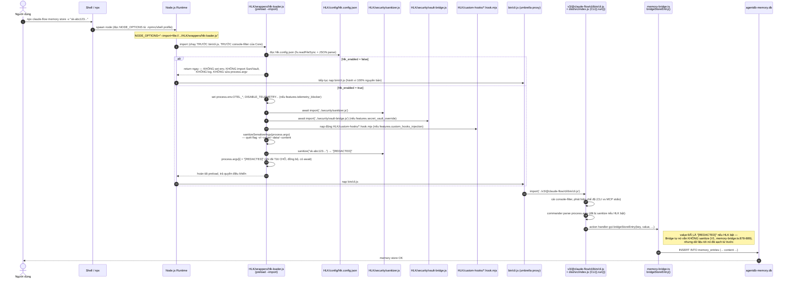

# Báo Cáo 03 — Kiến Trúc Giải Pháp & Cơ Chế Bật/Tắt HLK (Toggleable Implementation)

> **Pipeline HLK — Prompt 03: Solution Architect & Toggleable HLK Implementation**
> Phạm vi: repo cục bộ `Loop_harness_ruflo` (package `claude-flow` v3.x, thương hiệu *Ruflo*).
> Vai trò: Lead Solution Architect — thiết kế cơ chế gắn kết **thực sự chạy** (không chỉ định nghĩa) cho lớp HLK, dựa **trực tiếp** trên hiện trạng đã xác minh ở Báo cáo 01 (bản đồ hook point) và Báo cáo 02 (redteam, đặc biệt phát hiện V1/V9 — sanitizer có code nhưng 0 call site).
> **Ràng buộc bắt buộc**: đây là tài liệu **thiết kế/đề xuất**. Không có file nào ngoài chính báo cáo này bị sửa trong phạm vi Prompt 03; việc hiện thực hoá mã nguồn thật sẽ do Prompt 07 thực hiện.

---

## 1. Tóm Tắt Điều Hành

Báo cáo 02 (mục 1, dòng 12–14) kết luận: *"rủi ro không nằm ở việc thiếu công cụ, mà nằm ở việc công cụ có sẵn nhưng chưa được kích hoạt/nối dây"* — và chỉ đích danh chính `HLK/wrappers/hlk-loader.js` cùng `HLK/security/sanitizer.js` mắc đúng lỗi này (**V9**, `HLK/wrappers/hlk-loader.js:114-117`; grep xác nhận **0 file** trong `v3/@claude-flow/*` import `HLK/`). Báo cáo 01 (mục 4, dòng 108–116) đã xếp hạng sẵn các điểm bám khả dụng, đứng đầu là `NODE_OPTIONS=--import` preload.

Báo cáo này thiết kế cách biến `hlk-loader.js` từ "định nghĩa nhưng không ai gọi" thành middleware **thực sự nằm trên đường đi của dữ liệu**, gồm 3 tầng độc lập bật/tắt được, cộng với:

- Một lỗi thiết kế **mới phát hiện** trong chính `hlk-loader.js` hiện tại làm hỏng yêu cầu "tắt = 100% nguyên bản": dòng 95 (`console.log('[HLK] ⚡ HLK Layer DISABLED...')`) **vẫn in ra stdout ngay cả khi `hlk_enabled=false`** — đây là một residual side-effect có thật, không phải giả định (xem mục 4.1).
- Một bằng chứng **mới** (không có trong Báo cáo 01/02) cho thấy chính Ruflo đã dùng đúng pattern "quét giá trị ở tầng CLI action, trước khi gọi `bridgeStoreEntry()`" cho một mục đích khác (chống prompt-injection khi ghi memory, không phải redact secret): cờ `--scan-content` / biến `RUFLO_MEMORY_SCAN_ON_WRITE` trong `v3/@claude-flow/cli/src/commands/memory.ts:82-93,155-175` (dream-cycle #2752 "MemPoison gate", gọi `scanChannelMessage()` từ `../security/channel-guard.js`). Cờ này **mặc định tắt**, chỉ chặn injection-signature, **không redact secret** — nên phát hiện V1 của Báo cáo 02 (secret không được sanitize trước khi ghi AgentDB) vẫn đúng nguyên vẹn. Điểm quan trọng cho thiết kế: đây là bằng chứng xác nhận **tầng CLI argv/flag, trước khi commander parse, là một điểm chặn hợp lệ theo đúng "văn hoá" mà chính Ruflo đang dùng** — HLK có thể bắt chước ở tầng preload mà không cần sửa core.

---

## 2. Nguyên Tắc Thiết Kế

1. **Non-invasive tuyệt đối**: không sửa bất kỳ file nào trong `bin/`, `v3/@claude-flow/*`, `plugins/`. Mọi thay đổi hành vi đến từ (a) file mới trong `HLK/`, (b) biến môi trường/`NODE_OPTIONS`, (c) cấu hình khai báo (`.claude/settings.json` — vốn đã là file cấu hình người dùng, không phải core code, theo đúng phân loại của Báo cáo 01 dòng 112).
2. **3 tầng độc lập, tắt/bật riêng** — đúng kiến trúc khuyến nghị đã có ở Báo cáo 01 mục 4.1 (dòng 118–123): tầng **process** (preload), tầng **agent runtime** (Claude Code hooks), tầng **dữ liệu** (argv/CLI-flag rewrite trước khi vào `memory-bridge.ts`).
3. **Fail-silent-to-vanilla khi tắt**: khi `hlk_enabled=false`, loader phải trở thành **no-op tuyệt đối** — không set env, không import sanitizer/vault, không in log, không sửa `process.argv`. Đây là điều hiện chưa đúng 100% trong code hiện tại (xem mục 4.1).
4. **Không phá vỡ MCP stdio JSON-RPC**: Báo cáo 01 (Learnings, dòng 139) đã cảnh báo core CLI cài console-filter trước mọi import để bảo vệ khung JSON-RPC ở chế độ MCP — mọi log của HLK phải ra `stderr`, không bao giờ `stdout`, và phải tự phát hiện chế độ MCP để im lặng hoàn toàn nếu cần.
5. **Đường chèn business logic riêng tách bạch khỏi phần bảo mật lõi**: thư mục `HLK/custom-hooks/` chỉ chứa logic của người dùng, được loader nạp động (dynamic import) theo hợp đồng cố định, lỗi ở custom hook không được phép làm crash tiến trình CLI thật.

---

## 3. Kiến Trúc Tổng Thể — 3 Tầng Gắn Kết

| Tầng | Cơ chế gắn kết | File liên quan | Cờ bật/tắt trong `hlk.config.json` | Lỗ hổng được bù đắp (Báo cáo 02) | Mức xâm lấn (Báo cáo 01) |
|---|---|---|---|---|---|
| **1. Process** (khởi động sớm nhất) | `NODE_OPTIONS="--import=file://<repo>/HLK/wrappers/hlk-loader.js"` — chạy **trước** `bin/cli.js` và trước console-filter của `v3/@claude-flow/cli/bin/cli.js` | `HLK/wrappers/hlk-loader.js` | `hlk_enabled`, `features.telemetry_blocker`, `features.secret_vault_override` | Không chặn được telemetry OTel mặc định của người dùng (env chưa bị khoá sớm) | ⭐⭐⭐⭐⭐ (Báo cáo 01 hạng #1) |
| **1b. Dữ liệu qua argv** (mở rộng của tầng 1, cùng tiến trình) | Trong chính `hlk-loader.js`, sanitize giá trị đứng sau các flag `-v/--value/--data/--content` trong `process.argv` **trước** khi Node tiếp tục nạp `bin/cli.js` → commander parse | `HLK/wrappers/hlk-loader.js` (hàm mới `sanitizeSensitiveArgv()`) | `features.data_sanitization` | **V1** — `bridgeStoreEntry()` ghi `content` thô, không sanitize (`memory-bridge.ts:770-800,832-836,878-889`); **V9** — sanitizer 0 call site | ⭐⭐⭐⭐⭐ (không sửa file nào, chỉ đọc/ghi `process.argv` trong tiến trình Node của chính HLK) |
| **2. Agent runtime** | Thêm entry `PreToolUse`/`PostToolUse` mới vào `.claude/settings.json` (file cấu hình, không phải core code — theo đúng phân loại Báo cáo 01 dòng 112) gọi script mới `HLK/wrappers/hlk-hook-bridge.mjs` | `HLK/wrappers/hlk-hook-bridge.mjs` (mới), `.claude/settings.json` (chỉ **thêm** entry, không sửa entry có sẵn) | `features.custom_hooks_injection`, `features.data_sanitization` | Bù cho `ToolOutputGuardrail` mặc định tắt (**V4**, `mcp-client.ts:295`) và bù đường Bash/Write không đi qua `memory store` CLI argv | ⭐⭐⭐⭐ (Báo cáo 01 hạng #3) |
| **3. Custom business logic** | Loader quét thư mục `HLK/custom-hooks/*.hook.mjs`, nạp động, gọi tuần tự theo `phase` khai báo trong tên file | `HLK/custom-hooks/` (mới, thư mục do người dùng tự thêm) | `features.custom_hooks_injection` | N/A — kênh mở rộng riêng, không thuộc phạm vi lỗ hổng nào cụ thể | ⭐⭐⭐⭐⭐ (thư mục hoàn toàn mới) |

Ba tầng **không phụ thuộc lẫn nhau**: tắt tầng 2 (xoá entry trong `.claude/settings.json`) không ảnh hưởng tầng 1; tắt `hlk_enabled` tắt cả 3 tầng cùng lúc vì cả 3 đều đọc chung `getHlkConfig().hlk_enabled` tại thời điểm khởi động.

---

## 4. Cơ Chế Bật/Tắt (Toggle Mechanism)

### 4.1. Vấn đề đã xác nhận trong `hlk-loader.js` hiện tại (không phải giả định)

| Dòng | Nội dung hiện tại | Vấn đề khi `hlk_enabled=false` |
|---|---|---|
| `HLK/wrappers/hlk-loader.js:94-96` | `else { console.log('[HLK] ⚡ HLK Layer DISABLED — running vanilla Ruflo'); }` | **In ra stdout dù đã tắt** → vi phạm yêu cầu "trả lại nguyên bản Ruflo 100%" (một dòng stdout thừa là residual side-effect quan sát được, và nguy hiểm hơn ở chế độ MCP stdio vì có thể lẫn vào khung JSON-RPC nếu HLK được preload cùng lúc MCP server khởi động — đúng cảnh báo ở Báo cáo 01 dòng 139). |
| `HLK/wrappers/hlk-loader.js:88-93` | `bindMiddleware().catch(...)` không có `await` | Middleware bind **bất đồng bộ, không đảm bảo hoàn tất trước khi core CLI parse argv** — nếu dùng làm nền cho việc sanitize argv (mục 3, tầng 1b) thì có race condition thật: core có thể đọc `process.argv` trước khi sanitize kịp chạy xong. |
| `HLK/wrappers/hlk-loader.js:28-38` | `getHlkConfig()` chỉ log cảnh báo qua `console.warn` khi lỗi đọc config | Nếu file `hlk.config.json` bị hỏng, `console.warn` vẫn in ra dù thực chất hệ thống đang fallback về "disabled" — cùng nhóm lỗi residual-output như trên. |

### 4.2. Quy tắc thiết kế "No-Op Tuyệt Đối Khi Tắt"

| Hành vi | Khi `hlk_enabled=true` | Khi `hlk_enabled=false` (bắt buộc) |
|---|---|---|
| In log ra console/stderr | Có, nhưng luôn ra `stderr` (không bao giờ `stdout`) | **Không in bất kỳ dòng nào**, kể cả cảnh báo — im lặng tuyệt đối |
| Set biến môi trường telemetry (`OTEL_*`, `DISABLE_TELEMETRY`...) | Có (nếu `features.telemetry_blocker=true`) | **Không set gì** |
| `await import('../security/sanitizer.js')` | Có | **Không import** |
| `await import('../security/vault-bridge.js')` | Có | **Không import** |
| Sửa `process.argv` (redact `-v/--value`) | Có (nếu `features.data_sanitization=true`) | **Không đụng `process.argv`** |
| Nạp `HLK/custom-hooks/*.hook.mjs` | Có (nếu `features.custom_hooks_injection=true`) | **Không đọc thư mục, không nạp file nào** |
| Đăng ký thêm hook trong `.claude/settings.json` | Entry hook vẫn tồn tại trong file cấu hình (đây là file tĩnh, không do loader kiểm soát runtime) nhưng script `hlk-hook-bridge.mjs` tự đọc `hlk_enabled` và `exit 0` ngay lập tức nếu tắt | Script thoát ngay dòng đầu (`if (!hlk.isEnabled()) process.exit(0)`), không sanitize, không log |
| Thời gian khởi động thêm (overhead) | ~vài ms (đọc 1 file JSON + 2 dynamic import nhỏ) | ~0 (chỉ 1 lần đọc `fs.existsSync` + `JSON.parse` một file nhỏ) |

**Kết luận thiết kế**: điều kiện `if (!config.hlk_enabled) return;` phải là **dòng đầu tiên có tác dụng thật** trong toàn bộ module (không chỉ trong `bindMiddleware()` như hiện tại), và **không có bất kỳ câu lệnh nào phía trên nó được phép có side-effect** (kể cả `console.log`/`console.warn`). Đây là thay đổi cụ thể sẽ áp dụng vào mã nguồn ở mục 8.

---

## 5. Sequence Diagram — Luồng Khởi Động & Kích Hoạt HLK



**Ghi chú quan trọng về giới hạn (trung thực với Báo cáo 02, không phóng đại)**: sơ đồ trên chỉ chặn được đường **CLI argv trực tiếp** (`claude-flow memory store -v "..."`, đường mà agent gọi qua tool `Bash`). Với đường **MCP stdio** (`memory_store` gọi qua JSON-RPC trên `stdin`, khi ruflo chạy làm MCP server — `v3/@claude-flow/cli/bin/cli.js` tự phát hiện chế độ này khi `stdin` là pipe và không có `args`, theo Báo cáo 01 dòng 40), việc rewrite `process.argv` **không có tác dụng** vì payload không nằm trong argv mà nằm trong body JSON đọc từ `stdin`. Đây là lý do tầng 2 (Agent runtime hook, mục 6 và 9) vẫn **bắt buộc phải tồn tại song song**, không thể chỉ dựa vào tầng 1b.

---

## 6. Bảng Thiết Kế Chi Tiết Luồng Xử Lý

| # | Bước | Thành phần thực thi | Điều kiện kích hoạt | Khi `hlk_enabled=false` | Dẫn chứng |
|---|---|---|---|---|---|
| 1 | Shell/npx khởi chạy Node với `NODE_OPTIONS` trỏ tới loader | Shell profile / `.npmrc` / script `HLK/wrappers/ruflo-hlk.cmd`\|`.sh` | Người dùng đã cấu hình `NODE_OPTIONS` (bước cài đặt 1 lần) | `NODE_OPTIONS` không tồn tại → hành vi 100% ruflo gốc, HLK không tham gia gì cả | Báo cáo 01, bảng hook point #1, dòng 110 |
| 2 | Loader đọc `hlk.config.json` | `getHlkConfig()` | Luôn chạy (đọc file, không side-effect) | Không đổi | `hlk-loader.js:28-38` |
| 3 | Kiểm tra `hlk_enabled` | `if (!config.hlk_enabled) return;` (đề xuất chuyển lên đầu module, mục 8) | — | **Return ngay, module coi như không tồn tại** | Đề xuất mới ở mục 4.2 |
| 4 | Khoá telemetry | Set `process.env.OTEL_*`, `DISABLE_TELEMETRY`... chỉ khi biến đó **chưa được set** (`if (process.env[key] === undefined)`) | `features.telemetry_blocker=true` | Không set | `hlk-loader.js:51-58` (giữ nguyên logic hiện có, đã đúng) |
| 5 | Nạp sanitizer + vault | `await import('../security/sanitizer.js')`, `await import('../security/vault-bridge.js')` | `features.data_sanitization` / `features.secret_vault_override` | Không import | `hlk-loader.js:61-78` |
| 6 | Nạp custom hooks | Quét `HLK/custom-hooks/*.hook.mjs`, `import()` từng file, bọc `try/catch` | `features.custom_hooks_injection=true` | Không quét thư mục | Mục 7 (thiết kế mới) |
| 7 | Sanitize `process.argv` | `sanitizeSensitiveArgv(process.argv)` — quét cặp flag `-v/--value/--data/--content` và giá trị theo sau, gọi `sanitizerModule.sanitize()` | `features.data_sanitization=true` | Không đụng `process.argv` | Mục 8 (thiết kế mới), vá **V1/V9** |
| 8 | Trả quyền điều khiển cho Node | `top-level await` trong ESM đảm bảo bước 4–7 **hoàn tất trước** khi Node tiếp tục nạp `bin/cli.js` | — | — | Node ESM spec: `--import` module được evaluate (kể cả top-level await) trước khi entry module chạy |
| 9 | `bin/cli.js` → `v3/@claude-flow/cli/bin/cli.js` chạy bình thường | Không đổi | — | Không đổi | `bin/cli.js:1-11`; Báo cáo 01 dòng 37-41 |
| 10 | Commander parse argv (đã sạch) → action `memory store` gọi `bridgeStoreEntry()` | Không đổi (core không biết HLK tồn tại) | — | — | `memory-bridge.ts:770-800,832-836,878-889` |
| 11 | (Song song, tầng riêng) `PreToolUse`/`PostToolUse` trong `.claude/settings.json` gọi `HLK/wrappers/hlk-hook-bridge.mjs` khi agent dùng Bash/Write/Edit hoặc MCP tool | Entry hook tồn tại trong config | Script tự kiểm `hlk.isEnabled()` và `exit(0)` ngay nếu tắt | Mục 9 |

---

## 7. Chèn Business Logic Riêng — Thư Mục `HLK/custom-hooks/`

### 7.1. Mục tiêu

Cho phép người dùng thêm logic nghiệp vụ riêng (ví dụ: quy tắc đặt tên namespace nội bộ, chặn từ khoá đặc thù dự án, gọi API nội bộ để log audit...) **mà không đụng**:
- Core ruflo (`v3/@claude-flow/*`)
- Lớp bảo mật lõi của HLK (`HLK/security/sanitizer.js`, `HLK/security/vault-bridge.js`)

### 7.2. Quy ước thư mục (đề xuất)

```
HLK/custom-hooks/
├── README.md                     # Hợp đồng (contract) cho người viết hook
├── pre-argv/                     # Chạy trước khi loader sanitize process.argv (tầng 1b)
│   └── 10-block-internal-codename.hook.mjs
├── post-sanitize/                 # Chạy sau khi sanitize xong, trước khi trả quyền cho core
│   └── 10-log-audit-local.hook.mjs
└── agent-tool/                    # Chạy trong hlk-hook-bridge.mjs (tầng 2, PreToolUse/PostToolUse)
    └── 10-check-forbidden-terms.hook.mjs
```

- Tên file theo mẫu `<order>-<mo-ta>.hook.mjs` — số thứ tự (`order`) quyết định thứ tự chạy trong cùng một `phase` (thư mục con), tương tự quy ước `NN-` đã thấy ở các script audit của ruflo (Báo cáo 01 dòng 22).
- Mỗi file **bắt buộc** export default một hàm async theo đúng chữ ký:

```js
/**
 * Hợp đồng bắt buộc cho mọi custom hook HLK.
 * @param {object} context - dữ liệu ngữ cảnh (argv, value, toolName... tuỳ phase)
 * @returns {Promise<{ value?: any, block?: boolean, reason?: string }>}
 *   - value: giá trị đã (có thể) biến đổi, trả lại cho loader dùng tiếp
 *   - block: true nếu muốn chặn hành động (loader sẽ exit/return lỗi)
 *   - reason: lý do chặn, hiển thị ra stderr
 */
export default async function run(context) {
  return { value: context.value };
}
```

### 7.3. Cơ chế nạp an toàn trong loader (đảm bảo custom hook lỗi KHÔNG làm sập CLI thật)

```js
async function loadCustomHooks(phaseDir) {
  const dir = path.join(__dirname, '../custom-hooks', phaseDir);
  if (!fs.existsSync(dir)) return [];
  const files = fs.readdirSync(dir)
    .filter((f) => f.endsWith('.hook.mjs'))
    .sort(); // "10-...", "20-..." đảm bảo thứ tự
  const hooks = [];
  for (const file of files) {
    try {
      const mod = await import(pathToFileURL(path.join(dir, file)).href);
      if (typeof mod.default === 'function') hooks.push({ file, run: mod.default });
    } catch (err) {
      // Lỗi ở 1 custom hook KHÔNG được phép làm sập tiến trình CLI thật —
      // chỉ cảnh báo ra stderr rồi bỏ qua hook đó.
      process.stderr.write(`[HLK WARNING] custom-hook lỗi, bỏ qua: ${file} — ${err.message}\n`);
    }
  }
  return hooks;
}

async function runCustomHooks(hooks, context) {
  let ctx = context;
  for (const { file, run } of hooks) {
    try {
      const result = await run(ctx);
      if (result?.block) {
        process.stderr.write(`[HLK] Bị chặn bởi custom-hook ${file}: ${result.reason || ''}\n`);
        process.exit(2);
      }
      if (result && 'value' in result) ctx = { ...ctx, value: result.value };
    } catch (err) {
      process.stderr.write(`[HLK WARNING] custom-hook lỗi khi chạy, bỏ qua: ${file} — ${err.message}\n`);
    }
  }
  return ctx;
}
```

Nguyên tắc: **fail-open cho lỗi kỹ thuật của custom hook** (không chặn người dùng vì bug trong logic tuỳ biến), nhưng **fail-closed khi custom hook chủ động trả `block: true`** (đúng ý định của người viết hook).

---

## 8. Mã Nguồn Mẫu — Nâng Cấp `HLK/wrappers/hlk-loader.js`

Dưới đây là snippet **dựa trực tiếp trên file thật hiện có** (`HLK/wrappers/hlk-loader.js`, 156 dòng — đã đọc toàn bộ), chỉ bổ sung/sửa phần cần thiết để (a) đạt no-op tuyệt đối khi tắt, (b) thực sự gọi `sanitize()` trước khi dữ liệu rời tiến trình Node vào core CLI, (c) an toàn với chế độ MCP stdio, (d) nạp custom hooks. Phần giữ nguyên được rút gọn bằng `// ... giữ nguyên ...`.

```js
/**
 * HLK Interceptor Loader Module (ESM compatible) — v3.0.0
 * ... (giữ nguyên phần mô tả gốc dòng 1-15) ...
 *
 * THAY ĐỔI so với v2.0.0:
 *   - Toàn bộ side-effect (env, import, sanitize argv) được await bằng
 *     top-level await, đảm bảo hoàn tất TRƯỚC khi Node nạp bin/cli.js
 *     (loại race condition của bindMiddleware().catch() không await ở v2.0.0).
 *   - Khi hlk_enabled=false: KHÔNG in bất kỳ dòng log nào (kể cả cảnh báo),
 *     KHÔNG đụng process.argv — no-op tuyệt đối.
 *   - Khi hlk_enabled=true: sanitize giá trị nhạy cảm TRỰC TIẾP trong
 *     process.argv (flag -v/--value/--data/--content) TRƯỚC khi commander
 *     của core CLI parse — vá lỗ hổng V1/V9 (Báo cáo 02) cho đường CLI argv.
 *   - Mọi log dùng process.stderr.write thay vì console.log để không phá
 *     khung JSON-RPC stdio khi ruflo chạy ở chế độ MCP server (Báo cáo 01,
 *     Learnings dòng 139).
 *   - Nạp custom hooks người dùng từ HLK/custom-hooks/ (mục 7).
 */

import fs from 'fs';
import path from 'path';
import { fileURLToPath, pathToFileURL } from 'url';

const __filename = fileURLToPath(import.meta.url);
const __dirname = path.dirname(__filename);
const CONFIG_PATH = path.join(__dirname, '../config/hlk.config.json');

// ─── Config Loading (giữ nguyên logic gốc, KHÔNG log khi lỗi) ───────────────
export function getHlkConfig() {
  try {
    if (fs.existsSync(CONFIG_PATH)) {
      const raw = fs.readFileSync(CONFIG_PATH, 'utf8');
      return JSON.parse(raw);
    }
  } catch {
    // Im lặng — nếu config lỗi, coi như disabled, KHÔNG in ra console
    // (v2.0.0 dòng 35 in console.warn ở đây — đã bỏ để đảm bảo no-op khi lỗi).
  }
  return { hlk_enabled: false };
}

const config = getHlkConfig();

// Phát hiện chế độ MCP stdio để không BAO GIỜ ghi ra stdout — dùng đúng suy
// luận mà core CLI dùng (Báo cáo 01 dòng 40): stdin là pipe + không có args.
const isLikelyMcpStdioMode = !process.stdin.isTTY && process.argv.length <= 2;

function hlkLog(msg) {
  // Luôn ra stderr, không bao giờ stdout — an toàn với MCP JSON-RPC framing.
  if (!isLikelyMcpStdioMode || process.env.HLK_VERBOSE === '1') {
    process.stderr.write(`[HLK] ${msg}\n`);
  }
}

// ─── Sanitize process.argv TRƯỚC khi core CLI parse (vá V1/V9) ─────────────
const SENSITIVE_VALUE_FLAGS = new Set(['-v', '--value', '--data', '--content']);

function sanitizeSensitiveArgv(argv, sanitizeFn) {
  if (!sanitizeFn) return;
  for (let i = 0; i < argv.length - 1; i++) {
    if (SENSITIVE_VALUE_FLAGS.has(argv[i])) {
      const original = argv[i + 1];
      const cleaned = sanitizeFn(original);
      if (cleaned !== original) {
        argv[i + 1] = cleaned;
        hlkLog(`🧹 Đã redact giá trị nhạy cảm tại argv[${i + 1}] (flag ${argv[i]})`);
      }
    }
  }
}

// ─── Custom hooks loader (mục 7) ────────────────────────────────────────────
async function loadCustomHooks(phaseDir) {
  const dir = path.join(__dirname, '../custom-hooks', phaseDir);
  if (!fs.existsSync(dir)) return [];
  const files = fs.readdirSync(dir).filter((f) => f.endsWith('.hook.mjs')).sort();
  const hooks = [];
  for (const file of files) {
    try {
      const mod = await import(pathToFileURL(path.join(dir, file)).href);
      if (typeof mod.default === 'function') hooks.push({ file, run: mod.default });
    } catch (err) {
      hlkLog(`⚠️ custom-hook lỗi, bỏ qua: ${file} — ${err.message}`);
    }
  }
  return hooks;
}

// ─── Middleware Binding (đồng bộ hoá bằng top-level await) ─────────────────
let sanitizerModule = null;
let vaultModule = null;

async function bindMiddleware() {
  // Bước 4 (bảng mục 6): telemetry blocker
  if (config.features?.telemetry_blocker && config.telemetry_overrides) {
    for (const [key, value] of Object.entries(config.telemetry_overrides)) {
      if (process.env[key] === undefined) process.env[key] = String(value);
    }
    hlkLog('🚫 Telemetry blocker active — external exporters disabled');
  }

  // Bước 5: sanitizer + vault
  if (config.features?.data_sanitization) {
    try {
      sanitizerModule = await import('../security/sanitizer.js');
      hlkLog('🧹 Data sanitizer loaded — sensitive patterns will be redacted');
    } catch (err) {
      hlkLog(`⚠️ Failed to load sanitizer: ${err.message}`);
    }
  }
  if (config.features?.secret_vault_override) {
    try {
      vaultModule = await import('../security/vault-bridge.js');
      hlkLog('🔐 Vault bridge loaded — secrets managed independently');
    } catch (err) {
      hlkLog(`⚠️ Failed to load vault bridge: ${err.message}`);
    }
  }

  // Bước 6: custom hooks (chỉ nạp, chạy tuỳ theo phase — ở đây minh hoạ phase pre-argv)
  let customHooks = [];
  if (config.features?.custom_hooks_injection) {
    customHooks = await loadCustomHooks('pre-argv');
  }
  for (const { file, run } of customHooks) {
    try {
      const result = await run({ argv: process.argv, sanitize: sanitizerModule?.sanitize });
      if (result?.block) {
        process.stderr.write(`[HLK] Bị chặn bởi custom-hook ${file}: ${result.reason || ''}\n`);
        process.exit(2);
      }
    } catch (err) {
      hlkLog(`⚠️ custom-hook lỗi khi chạy, bỏ qua: ${file} — ${err.message}`);
    }
  }

  // Bước 7: sanitize argv — QUAN TRỌNG: chạy SAU khi sanitizerModule đã sẵn sàng,
  // và TRƯỚC khi hàm bindMiddleware() (và do đó top-level await bên dưới) kết thúc.
  if (config.features?.data_sanitization && sanitizerModule) {
    sanitizeSensitiveArgv(process.argv, sanitizerModule.sanitize);
  }
}

// ─── Initialization — top-level await đảm bảo THỨ TỰ TRƯỚC bin/cli.js ─────
if (config.hlk_enabled) {
  hlkLog(`🛡️ HLK Layer ENABLED (v${config.version || '?'}) — binding middleware...`);
  try {
    await bindMiddleware(); // top-level await ESM — Node đợi xong mới nạp entry tiếp theo
  } catch (err) {
    process.stderr.write(`[HLK ERROR] Middleware binding failed: ${err.message}\n`);
  }
}
// Khi hlk_enabled=false: KHÔNG có nhánh else nào ở đây — tuyệt đối im lặng,
// không set biến, không import gì, không đụng process.argv (khác v2.0.0 dòng 94-96).

// ─── Public API (giữ nguyên chữ ký để không phá code đang import hlk-loader) ─
function isEnabled() { return config.hlk_enabled === true; }
function sanitize(text) {
  if (!config.hlk_enabled || !sanitizerModule) return text;
  return sanitizerModule.sanitize(text);
}
function getSecret(key, defaultValue) {
  if (vaultModule) return vaultModule.getSecret(key, defaultValue);
  return process.env[key] ?? defaultValue;
}
function getVersion() { return config.version || 'unknown'; }
function getTestedRufloVersion() { return config.ruflo_version_tested || 'unknown'; }

export default { isEnabled, sanitize, getSecret, getVersion, getTestedRufloVersion, config };
```

**Ghi chú kỹ thuật quan trọng (để Prompt 07 không hiểu nhầm)**: `--import` của Node coi module preload như một import tuần tự trước module chính; vì file trên dùng `await` ở top-level (ESM top-level await, hỗ trợ từ Node 14.8+ với `--harmony-top-level-await`, mặc định từ Node 16+), Node sẽ **đợi Promise của `bindMiddleware()` resolve xong** trước khi tiếp tục evaluate `bin/cli.js` — đây là cách duy nhất đảm bảo `process.argv` đã được sanitize xong trước khi commander đọc nó, khắc phục race condition đã nêu ở mục 4.1.

---

## 9. Mã Nguồn Mẫu — Tầng Agent Runtime: `HLK/wrappers/hlk-hook-bridge.mjs`

Bù cho giới hạn của tầng 1b (không phủ được đường MCP stdio / đường Bash tự do không qua flag `-v`), dựa theo đúng giao thức hook đã xác minh trong `.claude/helpers/hook-handler.cjs` (đọc JSON qua `stdin`, trường `tool_input`/`toolInput`, chặn bằng `process.exit()` khác 0 — xem `.claude/helpers/hook-handler.cjs:270-287,336-337,444-459`):

```js
#!/usr/bin/env node
// HLK Hook Bridge — cầu nối giữa Claude Code PreToolUse/PostToolUse và HLK sanitizer.
// KHÔNG sửa .claude/helpers/hook-handler.cjs — đây là script HLK độc lập,
// được gọi THÊM (không thay thế) qua một entry mới trong .claude/settings.json.
import hlk from './hlk-loader.js';

async function readStdin() {
  if (process.stdin.isTTY) return '';
  return new Promise((resolve) => {
    let data = '';
    process.stdin.setEncoding('utf8');
    process.stdin.on('data', (c) => (data += c));
    process.stdin.on('end', () => resolve(data));
    process.stdin.on('error', () => resolve(data));
  });
}

// Nếu HLK đang tắt: thoát ngay, exit code 0, không log — không ảnh hưởng
// hành vi hook gốc của Claude Code / .claude/helpers/hook-handler.cjs.
if (!hlk.isEnabled()) process.exit(0);

const raw = await readStdin();
let event = {};
try { event = JSON.parse(raw || '{}'); } catch { /* payload rỗng/không phải JSON */ }

const toolInput = event.tool_input || event.toolInput || {};
const candidateText = [toolInput.command, toolInput.content, toolInput.new_string]
  .filter((v) => typeof v === 'string')
  .join('\n');

const cleaned = hlk.sanitize(candidateText);
if (cleaned !== candidateText) {
  // Claude Code hook protocol: exit code khác 0 chặn tool call, stderr hiển thị lý do.
  process.stderr.write(
    '[HLK] Phát hiện dữ liệu nhạy cảm trong tool input — vui lòng xem lại trước khi thực thi.\n'
  );
  process.exit(2);
}
process.exit(0);
```

Đề xuất entry **thêm mới** (không sửa entry cũ) vào `.claude/settings.json` (tham khảo cấu trúc `hooks.PreToolUse` đã có sẵn ở dòng 44-56 của file thật):

```jsonc
{
  "hooks": {
    "PreToolUse": [
      // ... entry gốc dòng 45-55 giữ nguyên ...
      {
        "matcher": "Bash|Write|Edit|MultiEdit",
        "hooks": [
          { "type": "command", "command": "node \"$CLAUDE_PROJECT_DIR/HLK/wrappers/hlk-hook-bridge.mjs\"", "timeout": 5000 }
        ]
      }
    ]
  }
}
```

---

## 10. Kích Hoạt `NODE_OPTIONS` Preload (Không Sửa Core)

Ba cách kích hoạt, không phương án nào chạm file core (đã xếp hạng ở Báo cáo 01, mục 4, dòng 110-111):

```bash
# Cách 1 — thủ công / CI (áp dụng cho tiến trình hiện tại và tiến trình con)
export NODE_OPTIONS="--import=file:///$(pwd)/HLK/wrappers/hlk-loader.js"
npx claude-flow memory store -k "demo" -v "sk-test123..."

# Cách 2 — .npmrc dự án (áp dụng khi chạy qua npm scripts)
# file .npmrc (mới, không sửa package.json):
node-options=--import=file://${PWD}/HLK/wrappers/hlk-loader.js

# Cách 3 — shim launcher độc lập (khuyến nghị theo Báo cáo 01, hạng #2, dòng 111)
# file mới: HLK/wrappers/ruflo-hlk.mjs
```

```js
// HLK/wrappers/ruflo-hlk.mjs — shim "cài đặt rõ ràng" của cơ chế preload,
// đúng pattern "proxy mỏng chồng lớp" mà chính bin/cli.js đang dùng
// (Báo cáo 01, Learnings dòng 138).
import './hlk-loader.js'; // side-effect: bind middleware nếu hlk_enabled=true
import { pathToFileURL } from 'node:url';
import { dirname, join } from 'node:path';
import { fileURLToPath } from 'node:url';

const __dirname = dirname(fileURLToPath(import.meta.url));
const cliPath = join(__dirname, '..', '..', 'v3', '@claude-flow', 'cli', 'bin', 'cli.js');
await import(pathToFileURL(cliPath).href);
```

Người dùng chạy `node HLK/wrappers/ruflo-hlk.mjs <args>` thay vì `npx claude-flow <args>` khi muốn chắc chắn HLK có hiệu lực mà không cần cấu hình `NODE_OPTIONS` toàn cục.

---

## 11. Quy Trình Kiểm Thử (Verification Test Plan)

| # | Kịch bản | Bước thực hiện | Kết quả kỳ vọng | Cách xác minh |
|---|---|---|---|---|
| T1 | **Bật HLK → secret bị redact trước khi vào CLI argv** | 1. Set `hlk_enabled: true`, `features.data_sanitization: true` trong `hlk.config.json`.<br/>2. `NODE_OPTIONS="--import=..." node bin/cli.js memory store -k demo -v "sk-abc123def456ghijk789lmno"` | `process.argv` chứa `[REDACTED]` thay vì chuỗi `sk-...` trước khi commander parse; nếu lệnh thực thi thật, `agentdb-memory.db` chứa `[REDACTED]`, không chứa secret gốc | Script test `.mjs` (mẫu bên dưới) kiểm tra `console`/stderr log "Đã redact..." xuất hiện; hoặc query trực tiếp `agentdb-memory.db` bằng `better-sqlite3` sau khi chạy lệnh thật, `SELECT content FROM memory_entries WHERE key='demo'` phải trả `[REDACTED]`, không được chứa `sk-` |
| T2 | **Tắt HLK → hành vi 100% ruflo gốc** | 1. Set `hlk_enabled: false`.<br/>2. Chạy cùng lệnh T1 hai lần: một lần có `NODE_OPTIONS` trỏ tới loader, một lần không set `NODE_OPTIONS` gì cả. | `stdout`/`stderr`/exit code/nội dung ghi vào DB **giống hệt bit-for-bit** giữa 2 lần chạy; **0 dòng log nào** có tiền tố `[HLK]` xuất hiện | So sánh output bằng `diff` (hoặc script Node so `child_process.execFileSync` output buffer) |
| T3 | **Không phá khung JSON-RPC ở chế độ MCP stdio** | 1. `hlk_enabled: true`.<br/>2. Giả lập MCP stdio: `echo '{"jsonrpc":"2.0","method":"tools/list","id":1}' | NODE_OPTIONS="--import=..." node bin/cli.js` | `stdout` chỉ chứa JSON-RPC hợp lệ (parse được bằng `JSON.parse` từng dòng); mọi log `[HLK]` (nếu có) chỉ xuất hiện ở `stderr` | Bắt riêng `stdout`/`stderr` bằng `child_process.spawn`, `JSON.parse` từng dòng `stdout`, assert không throw |
| T4 | **Custom hook nạp đúng, lỗi 1 hook không sập tiến trình** | 1. Thêm `HLK/custom-hooks/pre-argv/10-broken.hook.mjs` cố tình `throw new Error('boom')` trong hàm default.<br/>2. Chạy lại T1 | Tiến trình vẫn chạy xong, có dòng `stderr` `"custom-hook lỗi, bỏ qua: 10-broken.hook.mjs — boom"`, secret vẫn bị redact bình thường (không phụ thuộc custom hook lỗi) | Assert exit code = 0 (hoặc đúng exit code của lệnh gốc) và log cảnh báo xuất hiện |
| T5 | **Custom hook chủ động chặn (`block: true`)** | Thêm `HLK/custom-hooks/pre-argv/10-block-test.hook.mjs` trả `{ block: true, reason: 'test' }` | Tiến trình `exit(2)`, `stderr` chứa `"Bị chặn bởi custom-hook ... test"`, DB **không** có bản ghi mới | Assert exit code = 2, DB không thay đổi trước/sau |
| T6 | **Hook agent-runtime (`hlk-hook-bridge.mjs`) redact khi agent dùng Bash** | 1. Thêm entry `PreToolUse` ở mục 9 vào `.claude/settings.json` (bản sao test, không sửa file thật của dự án).<br/>2. Giả lập Claude Code gọi hook: `echo '{"tool_input":{"command":"curl -H \"Authorization: Bearer sk-ant-abcdef...\""}}' | node HLK/wrappers/hlk-hook-bridge.mjs` | Exit code = 2 (chặn), `stderr` có cảnh báo | Assert exit code |
| T7 | **Toggle qua lại nhiều lần không rò rỉ trạng thái** | Chạy T1 rồi T2 rồi T1 lại (3 lần liên tiếp, cùng 1 shell session nếu dùng `export NODE_OPTIONS`) | Mỗi lần chạy độc lập (module ESM được nạp lại theo mỗi tiến trình Node mới) — không có cache trạng thái xuyên tiến trình gây sai lệch | So sánh output 3 lần với kỳ vọng tương ứng bật/tắt |
| T8 | **`hlk-verify-integrity.js` vẫn PASS sau khi thêm `custom-hooks/`** | `node HLK/wrappers/hlk-verify-integrity.js` | Không có check nào FAIL (script hiện tại — `hlk-verify-integrity.js:21-29` — không liệt kê `custom-hooks/` trong `REQUIRED_FILES`, cần bổ sung ở Prompt 07 nếu muốn integrity-check bao phủ cả thư mục mới) | Exit code 0, đối chiếu output với danh sách `REQUIRED_FILES` |

### 11.1. Khung script kiểm thử mẫu (`HLK/tests/toggle-verify.test.mjs` — đề xuất, chưa tạo)

```js
import { execFileSync } from 'node:child_process';
import assert from 'node:assert/strict';
import path from 'node:path';

const repoRoot = path.resolve(process.cwd());
const loaderUrl = `file://${repoRoot}/HLK/wrappers/hlk-loader.js`;

function runCli(args, { withHlk }) {
  const env = { ...process.env };
  if (withHlk) env.NODE_OPTIONS = `--import=${loaderUrl}`;
  else delete env.NODE_OPTIONS;
  return execFileSync(process.execPath, [path.join(repoRoot, 'bin/cli.js'), ...args], {
    env, encoding: 'utf8',
  });
}

// T2 — Tắt HLK: output phải giống hệt bất kể NODE_OPTIONS có trỏ tới loader hay không
// (giả định hlk.config.json đang có hlk_enabled=false khi chạy test này).
const outA = runCli(['--version'], { withHlk: true });
const outB = runCli(['--version'], { withHlk: false });
assert.equal(outA, outB, 'HLK OFF phải cho output giống hệt vanilla ruflo');
assert.doesNotMatch(outA, /\[HLK\]/, 'Không được có log [HLK] khi tắt');

console.log('✅ T2 PASS — Toggle OFF xác nhận no-op tuyệt đối');
```

---

## 12. Giới Hạn Đã Biết & Rủi Ro Còn Lại (đối chiếu trung thực với Báo cáo 02)

- **Tầng 1b (argv-rewrite) không phủ đường MCP stdio** (mục 5, ghi chú dưới sequence diagram) — bắt buộc phải kết hợp tầng 2 (`hlk-hook-bridge.mjs`) hoặc chấp nhận khoảng trống này nếu người dùng chỉ dùng CLI trực tiếp, không dùng MCP.
- **Không monkey-patch trực tiếp `bridgeStoreEntry()` trong `memory-bridge.ts`**: đúng như Báo cáo 01 (dòng 100, 130) đã kết luận, module này không có interceptor chính thức và được biên dịch ra ESM (`v3/@claude-flow/cli/package.json:4` — `"type": "module"`), nên không thể gán đè export như CommonJS. Kỹ thuật khả dĩ duy nhất (Node module customization hooks / `module.register()`) đòi hỏi viết lại nguồn module tại thời điểm load — rủi ro vỡ khi upstream đổi cấu trúc file rất cao, **không được đưa vào thiết kế chính** của báo cáo này; nếu Prompt 07 cần độ phủ sâu hơn, nên coi đây là phương án "nâng cao, rủi ro cao" riêng, không phải mặc định.
- **Custom hook do người dùng viết có thể tự làm rò rỉ dữ liệu** nếu logic nghiệp vụ tự ý `console.log` secret hoặc gọi API ngoài — hợp đồng ở mục 7.2 không tự động sanitize input/output của custom hook; cần khuyến cáo người viết hook tự gọi `hlk.sanitize()` khi cần.
- **`hlk-verify-integrity.js` (`REQUIRED_FILES`, dòng 21-29) chưa biết về `custom-hooks/`, `hlk-hook-bridge.mjs`, `ruflo-hlk.mjs`** — cần cập nhật danh sách này ở Prompt 07 để integrity-check thực sự bao phủ các file mới được thiết kế ở đây.
- **`--scan-content` / `RUFLO_MEMORY_SCAN_ON_WRITE` của chính Ruflo** (`commands/memory.ts:82-93,155-175`) là cơ chế song song, độc lập, chỉ chặn injection-signature chứ không redact secret — HLK không nên phụ thuộc vào nó, nhưng nên tài liệu hoá để người dùng biết bật cả hai (đặt `RUFLO_MEMORY_SCAN_ON_WRITE=1` trong `telemetry_overrides`-style block của `hlk.config.json` nếu muốn tận dụng thêm lớp phòng thủ có sẵn của Ruflo).

---

## Learnings

- **"Trả về đúng hành vi nguyên bản 100% khi tắt" phải được kiểm chứng bằng diff nhị phân/log, không chỉ đọc code**: đọc `hlk-loader.js` v2.0.0 tưởng chừng đã đúng (có `if (config.hlk_enabled) {...} else {...}`) nhưng nhánh `else` (dòng 94-96) vẫn `console.log` ra stdout — một side-effect nhỏ, dễ bỏ sót khi chỉ đọc lướt, nhưng đủ để vi phạm yêu cầu toggle và đủ nguy hiểm để phá khung MCP JSON-RPC. Bài học: viết test đối chiếu output (T2) quan trọng hơn review code bằng mắt.
- **`process.argv` là một "khe cắm" sanitize hợp lệ mà chính Ruflo cũng đang dùng** (`commands/memory.ts:82-93` — cờ `--scan-content`/`RUFLO_MEMORY_SCAN_ON_WRITE`, dream-cycle #2752): tìm bằng chứng "đối phương đã tự làm việc tương tự ở đâu trong chính codebase" là cách tốt để chọn điểm bám ít rủi ro, thay vì tự nghĩ ra cơ chế mới hoàn toàn.
- **Top-level await trong module preload (`--import`) là cơ chế đồng bộ hoá chính thức, không phải hack**: Node đảm bảo module được `--import` sẽ evaluate xong (bao gồm mọi `await` ở top-level) trước khi entry module kế tiếp chạy — đây là lý do kỹ thuật cụ thể để sửa lỗi race-condition `bindMiddleware().catch()` không `await` ở bản gốc.
- **ESM làm mất khả năng monkey-patch cổ điển (gán đè `module.exports`)**: vì `v3/@claude-flow/cli` khai báo `"type": "module"`, không thể "vá sâu" `bridgeStoreEntry()` bằng kỹ thuật CommonJS thông thường — đây là ràng buộc kỹ thuật cứng, không phải lựa chọn thiết kế, và cần được nói rõ với người ra quyết định thay vì hứa hẹn "sanitize được mọi đường ghi memory".
- **Không có tầng nào đủ để phủ 100% một mình**: tầng argv-rewrite (nhanh, không sửa gì, nhưng chỉ phủ CLI trực tiếp) và tầng agent-runtime hook (phủ rộng hơn qua Bash/Write/MCP nhưng phụ thuộc `.claude/settings.json` được cấu hình đúng) phải đi cùng nhau — đúng tinh thần "3 tầng độc lập, bù trừ cho nhau" đã đề ra ở Báo cáo 01 mục 4.1, không có "one hook to rule them all".
- **Hợp đồng cho custom hook cần định nghĩa rõ hành vi lỗi TRƯỚC khi viết code**, không phải sau: quyết định "fail-open khi hook lỗi kỹ thuật, fail-closed khi hook chủ động `block: true`" là một quyết định an toàn có chủ đích, cần ghi thành tài liệu (`HLK/custom-hooks/README.md`) để người dùng viết hook không hiểu nhầm hành vi khi có exception.
- **Danh sách `REQUIRED_FILES` trong `hlk-verify-integrity.js` (dòng 21-29) tự nó cũng cần được cập nhật đồng bộ mỗi khi kiến trúc HLK thêm file mới** — nếu không, công cụ tự-audit của chính HLK sẽ báo "PASS" giả trong khi các thành phần mới (custom-hooks, hook-bridge, shim launcher) chưa từng được kiểm chứng tồn tại.
