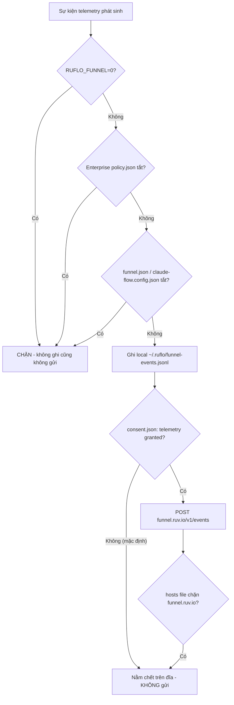

# 🛡️ Cẩm Nang Khóa Chặt Chống Rò Rỉ Dữ Liệu Cho Ruflo (Dựa Trên Mã Nguồn Thực Tế)

> **Phạm vi**: Repo `Loop_harness_ruflo` (ruflo / Claude Flow V3).
> **Phương pháp**: Toàn bộ khuyến nghị dưới đây được đối chiếu trực tiếp với mã nguồn trong `v3/` và `plugins/` — KHÔNG dựa trên tài liệu marketing. Mỗi mục đều dẫn file thật.

---

## 1. Kết Quả Điều Tra: Telemetry Trong Ruflo Thực Sự Hoạt Động Thế Nào

### 1.1. Kênh rò rỉ THẬT duy nhất: "Funnel" telemetry gửi về `funnel.ruv.io`

Đây là kênh gửi dữ liệu ra ngoài duy nhất được tìm thấy trong lõi CLI, nằm tại `v3/@claude-flow/cli/src/funnel/`:

| File | Endpoint mặc định | Biến môi trường override |
|------|-------------------|--------------------------|
| `funnel/event-transport.ts` (dòng 42–43) | `https://funnel.ruv.io/v1/events` | `RUFLO_FUNNEL_EVENTS_ENDPOINT` |
| `funnel/message-transport.ts` (dòng 49) | `https://funnel.ruv.io/v1/messages` | `RUFLO_FUNNEL_MESSAGES_ENDPOINT` |
| `funnel/attribution.ts` (dòng 48) | `https://funnel.ruv.io/v1/click` | `RUFLO_FUNNEL_CLICK_ENDPOINT` |

**Tin tốt (đã xác minh trong code):**

- `event-transport.ts` dòng 181: `if (!hasConsent('telemetry')) return { flushed: 0, skipped: 'no-consent' };` — **không có consent (sự đồng ý) thì KHÔNG có bất kỳ network call nào**. Consent mặc định là `false` (`funnel/consent.ts` dòng 36–41).
- Sự kiện được ghi **local-first** vào `~/.ruflo/funnel-events.jsonl` (file mode 0600) trước, chỉ flush lên mạng khi có consent.
- `message-transport.ts` dòng 120: kill switch `RUFLO_FUNNEL_MESSAGES=0` hoặc `RUFLO_FUNNEL=0` chặn kênh messages.

### 1.2. Chuỗi ưu tiên tắt Funnel (ADR-305) — `funnel/precedence.ts`

Thứ tự veto, nguồn thấp hơn KHÔNG BAO GIỜ bật lại được thứ nguồn cao hơn đã tắt:

1. **Env**: `RUFLO_FUNNEL=0` (dòng 25–28)
2. **Enterprise policy**: file trỏ bởi `RUFLO_ENTERPRISE_POLICY`, hoặc mặc định trên Windows là `%ProgramData%\ruflo\policy.json`, trên Linux/macOS là `/etc/ruflo/policy.json` (dòng 30–47)
3. **User config**: `~/.ruflo/funnel.json` với `enabled: false` (dòng 49–52)
4. **Project config**: `claude-flow.config.json` ở gốc dự án với `funnel.enabled: false` (dòng 54–61)

Trạng thái consent/funnel lưu ở `~/.ruflo/` (override được bằng `RUFLO_STATE_DIR`) — xem `funnel/state.ts` dòng 13–17.

### 1.3. Những thứ prompt gốc nêu ra nhưng KHÔNG tồn tại trong codebase này

Điều tra bằng grep toàn repo cho kết quả:

- **`LANGSMITH_TRACING` / `LANGFUSE_TRACING`**: KHÔNG xuất hiện trong bất kỳ file mã nguồn nào của `v3/` hay `plugins/`. Chỉ xuất hiện trong chính file prompt HLK (`HLK/prompts/05_...`) và `HLK/config/hlk.config.json`. → Ruflo không tích hợp LangSmith/Langfuse; đặt các biến này là vô hại nhưng chỉ mang tính phòng xa cho tool khác chạy cùng máy.
- **`OTEL_TRACES_EXPORTER` và họ OTEL**: KHÔNG có exporter OpenTelemetry nào trong mã nguồn `v3/@claude-flow/*/src/` (grep `opentelemetry|OTEL_` chỉ khớp 1 chuỗi text trong `v3/@claude-flow/security/src/CVE-REMEDIATION.ts` — không phải exporter). Các biến OTEL chỉ có tác dụng với **Claude Code CLI** (host chạy bên trên ruflo), không phải với lõi ruflo.
- **Mục `[observability]` trong `config.toml`**: File cấu hình thật `.agents/config.toml` (298 dòng, generated bởi `v3/@claude-flow/codex/src/generators/config-toml.ts`) KHÔNG có section `[observability]` hay `[observability.privacy]`. Snippet trong prompt gốc là hư cấu — nếu chép vào sẽ bị bỏ qua (validator ở `v3/@claude-flow/codex/src/validators/index.ts` không biết các key này).
- **`plugins/ruflo-aidefence/` có JSON config `pii_scanner`**: Plugin `ruflo-aidefence` CÓ TỒN TẠI, nhưng KHÔNG có file JSON config kiểu `pii_scanner.policy=REDACT`. Nó hoạt động qua **6 MCP tools** (`aidefence_scan`, `aidefence_is_safe`, `aidefence_has_pii`, ...) + 2 skills (`safety-scan`, `pii-detect`) — xem `plugins/ruflo-aidefence/README.md` dòng 39–52 (mô hình "3-gate").
- **Plugin `ruflo-observability`**: tracing/metrics của nó là **local** (span tree, AgentDB) — không có exporter đẩy ra ngoài (xem `plugins/ruflo-observability/README.md`).

---

## 2. Bước 1 — Biến Môi Trường (Hard Kill Switch)

Đặt các biến sau ở mức máy/user (Windows: `[Environment]::SetEnvironmentVariable(...)`, hoặc trong `.env` của dự án):

```bash
# ===== CÓ TÁC DỤNG THẬT VỚI RUFLO (đã xác minh trong code) =====
# Tắt toàn bộ funnel telemetry — veto cấp cao nhất (precedence.ts dòng 25–28, 78)
RUFLO_FUNNEL=0

# Tắt riêng kênh messages về funnel.ruv.io/v1/messages (message-transport.ts dòng 120)
RUFLO_FUNNEL_MESSAGES=0

# Bật mã hóa AES-256-GCM cho memory.db / session / terminal-history tại chỗ
# (fs-secure.ts dòng 124, encryption/vault.ts dòng 44)
CLAUDE_FLOW_ENCRYPT_AT_REST=1

# ===== PHÒNG XA CHO CLAUDE CODE CLI (host) — theo HLK/config/hlk.config.json =====
CLAUDE_CODE_ENABLE_TELEMETRY=0
DISABLE_TELEMETRY=1
OTEL_TRACES_EXPORTER=none
OTEL_METRICS_EXPORTER=none
OTEL_LOGS_EXPORTER=none

# ===== PHÒNG XA CHO TOOL BÊN THỨ 3 CHẠY CÙNG MÁY (ruflo KHÔNG dùng) =====
LANGSMITH_TRACING=false
LANGFUSE_TRACING=false
```

*Ghi chú*: `OTEL_*_EXPORTER=none` an toàn hơn `file` — trong `HLK/config/hlk.config.json` dòng 43 hiện đặt `OTEL_TRACES_EXPORTER=none` nhưng metrics/logs vẫn để `file`; nếu muốn tuyệt đối im lặng thì để cả ba là `none`.

PowerShell (Windows, persist cấp User):

```powershell
[Environment]::SetEnvironmentVariable('RUFLO_FUNNEL','0','User')
[Environment]::SetEnvironmentVariable('RUFLO_FUNNEL_MESSAGES','0','User')
[Environment]::SetEnvironmentVariable('CLAUDE_FLOW_ENCRYPT_AT_REST','1','User')
[Environment]::SetEnvironmentVariable('CLAUDE_CODE_ENABLE_TELEMETRY','0','User')
[Environment]::SetEnvironmentVariable('OTEL_TRACES_EXPORTER','none','User')
[Environment]::SetEnvironmentVariable('OTEL_METRICS_EXPORTER','none','User')
[Environment]::SetEnvironmentVariable('OTEL_LOGS_EXPORTER','none','User')
```

---

## 3. Bước 2 — Cấu Hình File (Phòng Thủ Nhiều Lớp)

### 3.1. Enterprise policy — tắt funnel cho MỌI user trên máy (mạnh thứ 2 sau env)

Tạo file (Windows) `C:\ProgramData\ruflo\policy.json` hoặc (Linux/macOS) `/etc/ruflo/policy.json` — đường dẫn hard-code trong `precedence.ts` dòng 33–37:

```json
{
  "funnel": {
    "enabled": false
  }
}
```

### 3.2. Project config — tắt funnel cho riêng repo này

Tạo `claude-flow.config.json` ở gốc dự án (đọc tại `precedence.ts` dòng 54–61):

```json
{
  "funnel": {
    "enabled": false
  }
}
```

### 3.3. `.agents/config.toml` — siết sandbox Codex (file thật, key thật)

Sửa các section CÓ THẬT trong `.agents/config.toml` (đã tồn tại ở gốc repo):

```toml
# Dòng 36: tắt web search của agent
web_search = "disabled"

# Dòng 133–138: đã có sẵn — giữ nguyên, chặn secret lọt vào env của agent
[shell_environment_policy]
inherit = "core"
exclude = ["*_KEY", "*_SECRET", "*_TOKEN", "*_PASSWORD"]

# Dòng 144–152: TẮT network trong sandbox (hiện đang là true — nên đổi)
[sandbox_workspace_write]
writable_roots = []
network_access = false
exclude_slash_tmp = false

# Dòng 158–178: đã có sẵn secret_scanning + blocked_patterns — giữ nguyên
[security]
secret_scanning = true
blocked_patterns = ["\\.env$", "credentials\\.json$", "\\.pem$", "\\.key$"]
```

*Lưu ý*: KHÔNG thêm section `[observability]` như prompt gốc gợi ý — key đó không tồn tại trong schema (`v3/@claude-flow/codex/src/generators/config-toml.ts`, `validators/index.ts`).

### 3.4. Tắt qua CLI (ghi vào `~/.ruflo/funnel.json` + xóa dữ liệu local)

```bash
# Tắt notices/funnel ở mức user + xóa sạch dữ liệu funnel local (settings.ts dòng 64–74)
npx ruflo settings notices off
```

Lệnh này gọi `deleteFunnelData()` — xóa luôn hàng đợi `~/.ruflo/funnel-events.jsonl`.

---

## 4. Bước 3 — Plugin `ruflo-aidefence`: Lọc PII Trước Khi Prompt Rời Máy

Plugin tồn tại tại `plugins/ruflo-aidefence/` nhưng **không cấu hình bằng JSON** như prompt gốc mô tả. Cách dùng thật (README dòng 42–52, mô hình "3-gate"):

| # | Cổng | MCP Tool | Thời điểm |
|---|------|----------|-----------|
| 1 | Pre-storage PII | `aidefence_has_pii` | Trước mọi lệnh ghi AgentDB / `memory_store` — redact trước khi lưu |
| 2 | Sanitization | `aidefence_scan` | Với cookie, token, blob entropy cao — vault thay vì nhúng giá trị thô |
| 3 | Prompt-injection | `aidefence_is_safe` | Trước khi text quay lại prompt LLM |

Cài và kiểm chứng:

```bash
/plugin install ruflo-aidefence@ruflo
bash plugins/ruflo-aidefence/scripts/smoke.sh   # Kỳ vọng: "10 passed, 0 failed"
```

Lớp redact bổ sung đã có sẵn ở tầng HLK: `HLK/config/hlk.config.json` dòng 25–38 định nghĩa `redact_patterns` (sk-*, ghp_*, connection string, private key...) với `redact_replacement: "[REDACTED]"`.

---

## 5. Bước 4 — Lệnh Kiểm Chứng "Không Một Byte Nào Rời Máy"

```bash
# 1. Xác nhận funnel đã tắt và nguồn nào quyết định (đọc precedence chain)
npx ruflo settings notices status
# Kỳ vọng: "Notices: disabled (decided by: env)" và "Telemetry: no consent"

# 2. Xác nhận mã hóa at-rest đang bật
npx ruflo doctor -c encryption

# 3. Kiểm tra hàng đợi telemetry local trống / không tồn tại
Get-Content "$env:USERPROFILE\.ruflo\funnel-events.jsonl" -ErrorAction SilentlyContinue
Get-Content "$env:USERPROFILE\.ruflo\consent.json" -ErrorAction SilentlyContinue
# Kỳ vọng: consent.json không có domain "telemetry" granted=true

# 4. Chứng minh bằng network: theo dõi kết nối TCP của tiến trình node khi chạy ruflo
#    (Windows) — không được thấy kết nối tới funnel.ruv.io
netstat -bno | Select-String -Context 1 "ruv.io"

# 5. Chặn cứng ở tầng DNS/hosts (tùy chọn, "belt and suspenders")
Add-Content C:\Windows\System32\drivers\etc\hosts "0.0.0.0 funnel.ruv.io"

# 6. Grep lại mã nguồn để tự kiểm chứng không còn endpoint nào khác
#    (3 endpoint duy nhất đều nằm trong v3/@claude-flow/cli/src/funnel/)
rg "https://" v3/@claude-flow/cli/src/funnel/
```

---

## 6. Sơ Đồ Tổng Quan Chuỗi Phòng Thủ



---

## Learnings

- **Đọc code trước khi tin tài liệu/prompt**: prompt gốc đề xuất `LANGSMITH_TRACING`, `[observability]` trong config.toml và `pii_scanner` JSON — cả 3 đều KHÔNG tồn tại trong codebase này; grep toàn repo mất 2 phút và tránh được việc phát hành hướng dẫn "cấu hình ma" không có tác dụng.
- **Tìm kênh exfiltration bằng cách grep endpoint chứ không grep tên tính năng**: `rg "https://"` trong thư mục nghi vấn (`v3/@claude-flow/cli/src/funnel/`) lộ ra cả 3 endpoint thật (`/v1/events`, `/v1/messages`, `/v1/click`) nhanh hơn nhiều so với đọc tài liệu.
- **Telemetry tử tế có kiến trúc nhận diện được**: consent-gated + local-first queue + kill-switch env + enterprise policy + precedence "veto không thể bị override" (ADR-302/305) — khi audit một tool mới, tìm đúng 4 thành phần này để đánh giá nhanh mức rủi ro.
- **Phòng thủ nhiều lớp độc lập**: env var (`RUFLO_FUNNEL=0`) + file policy hệ thống + project config + hosts file chặn DNS — mỗi lớp do một cơ chế khác nhau thực thi, một lớp hỏng (ví dụ env bị unset) các lớp khác vẫn giữ.
- **Biến "phòng xa" vẫn đáng đặt nhưng phải ghi chú rõ**: `OTEL_*`, `LANGSMITH_*` không tác dụng với ruflo nhưng tác dụng với Claude Code host / tool khác cùng máy — guide phải phân loại rõ "có tác dụng thật" vs "belt-and-suspenders" để người đọc không ngộ nhận.
- **Kiểm chứng bằng hành vi, không chỉ bằng cấu hình**: `netstat`/DNS block + kiểm tra file queue trống là bằng chứng runtime; `settings notices status` chỉ là bằng chứng cấu hình — báo cáo bảo mật cần cả hai.
- **Trạng thái nhạy cảm nằm ở `~/.ruflo/` (override bằng `RUFLO_STATE_DIR`)**: khi cần audit hoặc dọn sạch dấu vết consent/telemetry, đây là thư mục gốc duy nhất cần kiểm tra.
