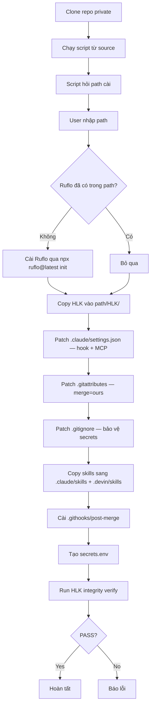

# HLK Setup Scripts

> Bộ script cài đặt HLK từ source đã clone vào path user chỉ định.
> Repo `thanhnt-sm/Loop_harness_ruflo` là **private**, nên cách cài là:
> clone repo → chạy script → script hỏi path → cài tự động.

## Cách dùng

### Bước 1: Clone repo (cần quyền truy cập GitHub)

```bash
git clone https://github.com/thanhnt-sm/Loop_harness_ruflo.git
cd Loop_harness_ruflo
```

### Bước 2: Chạy script cài đặt

**Linux / macOS (bash):**
```bash
bash HLK/setup/install.sh
# Script hỏi: "Nhập path cần cài HLK vào [mặc định: /current/dir]:"
# User nhập path → mọi việc tự động tiếp
```

**Windows (PowerShell):**
```powershell
powershell -ExecutionPolicy Bypass -File HLK/setup/install.ps1
# Script hỏi: "Nhập path cần cài HLK vào [mặc định: C:\current\dir]:"
# User nhập path → mọi việc tự động tiếp
```

**Cross-platform (Node.js):**
```bash
node HLK/setup/install.mjs
# Script hỏi: "Nhập path cần cài HLK vào [mặc định: /current/dir]:"
# User nhập path → mọi việc tự động tiếp
```

### Truyền path trực tiếp (không hỏi)

```bash
# bash
bash HLK/setup/install.sh /path/to/workspace
bash HLK/setup/install.sh --path /path/to/workspace

# PowerShell
powershell -ExecutionPolicy Bypass -File HLK/setup/install.ps1 -Path "C:\target"
powershell -ExecutionPolicy Bypass -File HLK/setup/install.ps1 "C:\target"

# Node.js
node HLK/setup/install.mjs /path/to/workspace
node HLK/setup/install.mjs --path /path/to/workspace
```

## Luồng cài đặt



## Script nào dùng khi nào?

| Script | Nền tảng | Lệnh |
|--------|----------|------|
| `install.sh` | Linux, macOS, WSL, Git Bash | `bash HLK/setup/install.sh` |
| `install.ps1` | Windows (PowerShell) | `powershell -File HLK/setup/install.ps1` |
| `install.mjs` | Mọi nền tảng có Node | `node HLK/setup/install.mjs` |

## Options (biến môi trường)

| Biến | Mặc định | Mô tả |
|------|----------|-------|
| `HLK_REPO` | `https://github.com/thanhnt-sm/Loop_harness_ruflo.git` | URL repo (dùng khi `SKIP_CLONE=0`) |
| `HLK_BRANCH` | `main` | Branch tải |
| `RUFLO_VERSION` | `latest` | Version Ruflo cài qua npm |
| `SKIP_RUFLO` | `0` | `1` = bỏ qua cài Ruflo (chỉ cài HLK) |
| `SKIP_CLONE` | `0` | `1` = dùng HLK từ source local (đã clone repo) |

### Ví dụ

```bash
# Chỉ cài HLK (Ruflo đã có trong path)
SKIP_RUFLO=1 bash HLK/setup/install.sh /path/to/workspace

# Cài Ruflo version cụ thể
RUFLO_VERSION=3.34.0 bash HLK/setup/install.sh /path/to/workspace

# Dùng source local (đã clone repo, không tải lại)
SKIP_CLONE=1 node HLK/setup/install.mjs /path/to/workspace
```

## Yêu cầu

| Tool | Phiên bản | Lý do |
|------|-----------|-------|
| Node.js | >= 14 | Chạy HLK scripts, MCP wrapper |
| git | bất kỳ | Clone repo, git hooks |
| npx | đi kèm Node | Cài Ruflo qua npm |

## Cài vào đâu?

Script cài vào **path user chỉ định** (không phải thư mục hiện tại):

```
<path user nhập>/
├── HLK/                    ← HLK copy vào đây
├── .claude/
│   ├── settings.json       ← patch thêm HLK hook + MCP wrapper
│   └── skills/hlk-*        ← copy skills HLK
├── .devin/
│   └── skills/hlk-*        ← copy skills HLK
├── .githooks/
│   └── post-merge          ← tự verify HLK sau pull/merge
├── .gitattributes          ← patch merge=ours
└── .gitignore              ← patch ignore secrets
```

## Sau khi cài

1. **Mở `<path>/HLK/config/secrets.env`** và điền API keys / tokens thật
2. **Khởi động lại Claude Code** tại `<path>` để MCP server dùng HLK wrapper
3. **Test sanitizer**: `node HLK/wrappers/hlk-hook-bridge.mjs < test-secret.json`
4. **Pull update từ upstream ruflo**: `node HLK/upstream/hlk-upstream-pull.mjs --yes`

## Tại sao không dùng `curl | bash`?

Repo `thanhnt-sm/Loop_harness_ruflo` là **private**, nên:
- `cdn.jsdelivr.net/gh/thanhnt-sm/...` → 404 (jsDelivr chỉ serve repo public)
- `raw.githubusercontent.com/thanhnt-sm/...` → 404 (cần auth)

Cách an toàn: **clone repo (có auth) → chạy script từ source**.

## Tích hợp CI/CD

```yaml
# GitHub Actions — repo private, dùng checkout
- uses: actions/checkout@v4
- name: Install HLK
  run: node HLK/setup/install.mjs ${{ github.workspace }} --yes
  env:
    SKIP_RUFLO: "1"  # Ruflo đã có trong repo
```
