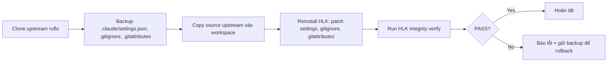

# HLK Upstream Sync

> Bộ script/tool chuyên update source code từ upstream ruflo
> (`https://github.com/ruvnet/ruflo`) vào workspace hiện tại, sau đó
> cài lại HLK layer để đảm bảo các tùy chỉnh bảo vệ không bị mất.

## Vấn đề giải quyết

Khi pull update từ upstream ruflo, các file sau thường bị **ghi đè mất**:

- `.gitignore` — mất rule bảo vệ `*.rvf`, `.env`, `HLK/config/secrets.*`
- `.claude/settings.json` — mất HLK PreToolUse hook và MCP wrapper
- `.gitattributes` — mất `merge=ours` cho HLK files

HLK integrity check sẽ báo FAIL, nhưng người dùng phải tự fix thủ công.
Bộ tool này tự động hóa toàn bộ luồng.

## Script

| Script | Mục đích |
|--------|----------|
| `hlk-upstream-pull.mjs` | Pull upstream + reinstall HLK trong một lệnh |

## Cách dùng

```bash
# Pull upstream + reinstall HLK (có xác nhận)
node HLK/upstream/hlk-upstream-pull.mjs

# Không hỏi xác nhận
node HLK/upstream/hlk-upstream-pull.mjs --yes

# Chỉ clone + xem diff, không copy/reinstall
node HLK/upstream/hlk-upstream-pull.mjs --dry-run

# Giữ backup sau khi xong (mặc định xóa)
node HLK/upstream/hlk-upstream-pull.mjs --keep-backup

# Đổi upstream URL hoặc branch
node HLK/upstream/hlk-upstream-pull.mjs --upstream https://github.com/ruvnet/ruflo.git --branch main
```

## Luồng xử lý



## Những gì được bảo vệ

Script **BỎ QUA** không copy đè từ upstream:

- `HLK/` — toàn bộ HLK layer của user
- `.git/` — git history local
- `node_modules/` — dependencies đã cài
- `.gitignore`, `.gitattributes` — sẽ patch lại qua `hlk-install.mjs`
- `agentdb.rvf`, `agentdb.rvf.lock` — file nhạy cảm

## Backup

Trước khi overwrite, script backup các file sau vào `HLK/backups/upstream-pull-<timestamp>/`:

- `.claude/settings.json`
- `.gitignore`
- `.gitattributes`

Mặc định backup sẽ bị xóa sau khi xong. Dùng `--keep-backup` để giữ lại rollback.

## Tích hợp với skill

Skill `hlk-upstream-pull` (trong `.devin/skills/hlk-upstream-pull/SKILL.md`)
cho phép gọi từ Claude Code / Devin CLI bằng lệnh tự nhiên.

## Tích hợp với hlk-lifecycle

`hlk-lifecycle.mjs --update` dùng `npx ruflo@<version> init upgrade` để
update Ruflo. Trong khi đó `hlk-upstream-pull.mjs` clone trực tiếp từ git
upstream. Hai cách dùng cho hai ngữ cảnh:

| Tool | Khi nào dùng |
|------|--------------|
| `hlk-lifecycle --update` | Update qua npm registry (bản stable) |
| `hlk-upstream-pull` | Update trực tiếp từ git upstream (bản dev mới nhất) |
