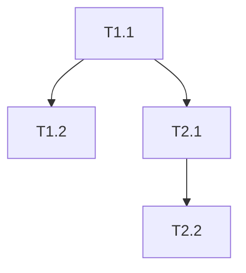

# PROPOSAL — Kiến trúc 3-Phase: Plan → Approve → Execute
## Đề xuất mạnh nhất cho hệ thống Agent Harness Deploy (AHD)

> **Status**: DRAFT — Chờ human duyệt
> **Ngày**: 2026-08-05
> **Author**: Devin (GLM-5.2 High)
> **Research basis**: 22 orchestration patterns + 15 planning best practices + 15 QC/enforcement mechanisms (3 subagent research reports)
> **Quyết định cần**: Approve / Reject / Request Changes

---

## Mục lục

1. [Executive Summary](#1-executive-summary)
2. [Gap Analysis — Hiện tại vs Target](#2-gap-analysis)
3. [Kiến trúc 3-Phase đề xuất](#3-kiến-trúc-3-phase)
4. [Phase 1: PLAN — Phân tích → Giải pháp → Plan → Tài liệu](#4-phase-1-plan)
5. [Phase 2: APPROVE — Human approval gate](#5-phase-2-approve)
6. [Phase 3: EXECUTE — Triển khai với QC + Enforcement](#6-phase-3-execute)
7. [Dynamic Flow + Data Flow + Max Parallel](#7-dynamic-flow--data-flow--max-parallel)
8. [Quality Control — 15 mechanisms chọn lọc](#8-quality-control)
9. [Execution Enforcement — Đảm bảo agent thực thi đầy đủ](#9-execution-enforcement)
10. [Implementation Roadmap](#10-implementation-roadmap)
11. [Cost/Benefit Analysis](#11-costbenefit-analysis)
12. [Approval Request](#12-approval-request)

---

## 1. Executive Summary

### Vấn đề

Hệ thống AHD hiện tại **không có Plan Phase tách biệt**. Khi nhận task, Commander decompose ngay → dispatch workers → integrate. Không có bước:
- Phân tích chuyên sâu
- Thiết kế giải pháp
- Viết plan chi tiết
- Viết tài liệu thiết kế (SDD)
- Human approval gate trước khi execute

**Hậu quả**:
- Agent chạy "max power" nhưng không có plan rõ → kết quả lệch, thiếu sót
- Không có cách đảm bảo agent thực thi ĐÚNG và ĐỦ theo plan
- Chất lượng tài liệu (plan, SDD) chưa tốt vì không có template/quality criteria
- Human không có cơ hội review trước khi agent chạy
- Không có traceability: không biết plan item nào đã execute, item nào chưa

### Giải pháp đề xuất

**Kiến trúc 3-Phase tách biệt**:

```
┌─────────────────────────────────────────────────────────────────┐
│  PHASE 1: PLAN                                                  │
│  Phân tích → Giải pháp → Plan → SDD → Quality Check             │
│  (Agent tự trị, max parallel research, dynamic flow)            │
│  Output: SOLUTION_DESIGN.md + IMPLEMENTATION_PLAN.md            │
└──────────────────────────┬──────────────────────────────────────┘
                           │
                           ▼
                   ┌───────────────┐
                   │  HUMAN APPROVE │  ← Gate bắt buộc
                   │  Review plan   │
                   └───────┬───────┘
                           │ Approved
                           ▼
┌─────────────────────────────────────────────────────────────────┐
│  PHASE 3: EXECUTE                                               │
│  Dispatch workers → QC gates → Enforcement → Traceability       │
│  (Max parallel, adversarial review, deterministic gates)        │
│  Output: Implementation + Coverage Matrix + Audit Trail         │
└─────────────────────────────────────────────────────────────────┘
```

### Lợi ích

| Lợi ích | Mô tả |
|---------|-------|
| **Plan chất lượng cao** | SDD template 11 sections + 10-dimension quality check |
| **Human kiểm soát** | Approval gate trước khi agent chạy |
| **Agent max power** | Dynamic flow, max parallel, autonomous — nhưng trong plan đã duyệt |
| **Thực thi đầy đủ** | Coverage matrix + traceability + enforcement gates |
| **Chất lượng đảm bảo** | Adversarial review + deterministic gates + SPC |
| **Drift detection** | Phát hiện agent lệch plan trong real-time |
| **Self-healing** | Tự sửa khi agent fail, không cần human can thiệp |
| **Audit trail** | Event sourcing + OpenTelemetry — replay mọi execution |

---

## 2. Gap Analysis

### 2.1 Gap hiện tại

| Khía cạnh | Hiện tại | Target | Gap |
|-----------|----------|--------|-----|
| **Plan Phase** | Không có — Commander decompose ngay | 3-phase tách biệt (Plan→Approve→Execute) | **Critical** |
| **SDD template** | Không có | 11-section SDD (COMPEL/UiPath pattern) | **Critical** |
| **Plan quality criteria** | Không có | 10-dimension check (DeepEval + Plan-Build-Run) | **Critical** |
| **Human approval gate** | Không có | Risk-based approval (R0-R4) | **Critical** |
| **Traceability matrix** | Không có | Requirement → Plan → Code → Test | **High** |
| **Coverage tracking** | Không có | % plan items executed, symbol verification | **High** |
| **Adversarial consensus** | Có auditor (1 reviewer) | 3-persona adversarial + dissenter (C3 pattern) | **High** |
| **Deterministic gates** | Có pre_tool_use.py (security only) | Schema validation + policy enforcement + data quality | **High** |
| **Drift detection** | Không có | 12-dimension behavioral fingerprinting | **Medium** |
| **SPC** | Không có | 6-metric control charts, 3σ alerts | **Medium** |
| **Self-healing** | Không có (retry only) | Monitor-Detect-Diagnose-Recover loop | **Medium** |
| **Event sourcing** | Có loop_state.md (partial) | Full event log + replay capability | **Medium** |
| **DAG parallel** | Có parallel dispatch (basic) | LLMCompiler DAG-based parallel execution | **Medium** |
| **Dynamic flow** | Static (FULL_POWER_PROMPT 13 steps) | Conditional state graph routing (LangGraph pattern) | **Medium** |
| **Data flow** | Direct agent calls | Typed event bus + shared blackboard | **Low** (nice-to-have) |
| **OpenTelemetry** | Không có | OTel instrumentation + quality grading | **Low** (nice-to-have) |

### 2.2 Tại sao chất lượng plan/tài liệu chưa tốt?

5 nguyên nhân gốc rễ:

1. **Không có template** — Agent viết plan tự do, không có structure chuẩn → thiếu sections quan trọng (risk assessment, ADRs, test strategy, rollback plan)
2. **Không có quality criteria** — Không có cách đánh giá "plan này đủ tốt chưa?" → plan shallow, thiếu sót
3. **Không có approval gate** — Plan không được human review → lỗi không bị bắt trước khi execute
4. **Không có traceability** — Không track plan item nào đã execute → không biết thiếu sót
5. **Không có enforcement** — Agent có thể lệch plan mà không bị phát hiện → drift silently

---

## 3. Kiến trúc 3-Phase đề xuất

### 3.1 Tổng quan

```
TASK INPUT
    │
    ▼
┌─────────────────────────────────────────────────────────────┐
│  PHASE 1: PLAN (Agent tự trị, max parallel)                 │
│                                                             │
│  ┌─────────┐  ┌─────────┐  ┌─────────┐  ┌─────────┐       │
│  │ ANALYZE │→ │ DESIGIN │→ │  PLAN   │→ │  SDD    │       │
│  │ (research│  │ (solution│  │ (impl.  │  │ (design │       │
│  │  parallel)│  │  design) │  │  plan)  │  │  doc)   │       │
│  └─────────┘  └─────────┘  └─────────┘  └─────────┘       │
│       │              │            │            │            │
│       └──────────────┴────────────┴────────────┘            │
│                          │                                   │
│                          ▼                                   │
│                   ┌──────────────┐                          │
│                   │ QUALITY CHECK │                          │
│                   │ (10-dimension)│                          │
│                   └──────┬───────┘                          │
│                          │ PASS                             │
└──────────────────────────┼──────────────────────────────────┘
                           │
                           ▼
                   ┌───────────────┐
                   │  HUMAN APPROVE │  ← Gate bắt buộc
                   │  Review + Approve│
                   └───────┬───────┘
                           │ Approved
                           ▼
┌─────────────────────────────────────────────────────────────┐
│  PHASE 3: EXECUTE (Max parallel, QC gates, enforcement)     │
│                                                             │
│  ┌──────────┐  ┌──────────┐  ┌──────────┐  ┌──────────┐   │
│  │ DISPATCH  │→ │ EXECUTE  │→ │ VERIFY   │→ │ REPORT   │   │
│  │ (DAG-based│  │ (parallel│  │ (adversar-│  │ (coverage│   │
│  │  parallel)│  │  workers)│  │  ial +    │  │  matrix +│   │
│  │           │  │          │  │  gates)   │  │  audit)  │   │
│  └──────────┘  └──────────┘  └──────────┘  └──────────┘   │
│       │              │            │            │            │
│       └──────────────┴────────────┴────────────┘            │
│                          │                                   │
│                          ▼                                   │
│                   ┌──────────────┐                          │
│                   │ ENFORCEMENT   │                          │
│                   │ (drift detect│                          │
│                   │  + self-heal │                          │
│                   │  + SPC)      │                          │
│                   └──────────────┘                          │
└─────────────────────────────────────────────────────────────┘
```

### 3.2 Nguyên tắc cốt lõi

1. **Plan ≠ Execute** — Hai phase tách biệt hoàn toàn. Plan phase KHÔNG viết code. Execute phase KHÔNG sửa plan.
2. **Plan = Contract** — Plan đã duyệt là "hợp đồng" agent phải thực thi. Lệch plan = violation.
3. **Human = Gate** — Không execute trước khi human approve plan.
4. **Agent = Max power trong boundary** — Trong plan đã duyệt, agent tự trị tối đa (dynamic flow, parallel, autonomous).
5. **System = Control** — Hệ thống control kết quả qua QC gates + enforcement + traceability.

---

## 4. Phase 1: PLAN

### 4.1 Cấu trúc Plan Phase (4 bước)

#### Bước 1.1: ANALYZE (phân tích chuyên sâu)

**Mục tiêu**: Hiểu task, codebase, constraints, risks.

**Cách thực hiện** — Agent tự trị, max parallel research:

```
ANALYZE
├── SCOUT-1 (subagent_explore, background) — Scan codebase structure, patterns, conventions
├── SCOUT-2 (subagent_explore, background) — Find relevant files, dependencies, blast radius
├── SCOUT-3 (subagent_explore, background) — Research cutting-edge solutions (web search)
├── SCOUT-4 (subagent_explore, background) — Analyze existing tests, coverage gaps
└── SCOUT-5 (subagent_explore, background) — Check constraints (security, performance, compat)
```

**Tất cả SCOUT chạy song song** (bounded batch dispatch, N=5). Đợi tất cả xong → aggregate findings.

**Output**: `analysis_findings.md`
- Codebase context (relevant files, patterns, conventions)
- Constraint analysis (security, performance, compatibility)
- Risk factors (blockers, complexity, dependencies)
- Cutting-edge solutions researched
- Test coverage analysis

#### Bước 1.2: DESIGN (thiết kế giải pháp)

**Mục tiêu**: Thiết kế giải pháp tốt nhất dựa trên analysis.

**Cách thực hiện** — Dynamic flow, adversarial design:

```
DESIGN
├── ARCHITECT (glm-executor, foreground) — Design solution architecture
│   └── Input: analysis_findings.md
│   └── Output: solution_design_draft.md
│
├── ADVERSARIAL REVIEW (parallel, 3 personas)
│   ├── SABOTEUR (subagent_explore) — "How do I break this in production?"
│   ├── NEW_HIRE (subagent_explore) — "Can I understand this with zero context?"
│   └── SECURITY_AUDITOR (subagent_explore) — OWASP-informed vulnerability scan
│
├── CONSENSUS (orchestrator) — Aggregate 3 personas, promote issues 2+ found
│
└── REVISE (architect) — Revise design based on adversarial findings
    └── Output: solution_design_final.md
```

**Pattern**: Adversarial Consensus Protocol (C3 pattern) — Builder produces → 3 reviewers check → Dissenter actively seeks flaws → Revise → Repeat (max 3 rounds).

**Output**: `SOLUTION_DESIGN.md` (11-section SDD — xem template bên dưới)

#### Bước 1.3: PLAN (implementation plan chi tiết)

**Mục tiêu**: Decompose solution thành atomic tasks với traceability.

**Cách thực hiện** — DAG-based decomposition:

```
PLAN
├── DECOMPOSE (orchestrator) — Break solution into atomic tasks
│   └── Each task: ID, description, file paths, function names, acceptance criteria
│   └── Build dependency graph (DAG) cho parallel execution
│
├── COVERAGE MATRIX (orchestrator) — Map requirements → tasks → files → symbols
│   └── Requirement ID | Description | File Path | Function/Symbol | Status
│
├── RISK ASSESSMENT (orchestrator) — Classify risk tier (R0-R4) per task
│   └── Identify blockers, mitigation strategies, rollback plan
│
└── TEST STRATEGY (orchestrator) — Define acceptance tests per requirement
    └── Unit, integration, E2E test cases
```

**Output**: `IMPLEMENTATION_PLAN.md` (xem template bên dưới)

#### Bước 1.4: QUALITY CHECK (10-dimension validation)

**Mục tiêu**: Đảm bảo plan đủ chất lượng trước khi present cho human.

**10 dimensions** (DeepEval + Plan-Build-Run):

| # | Dimension | Check | Pass criteria |
|---|-----------|-------|---------------|
| D1 | Requirement Coverage | All requirements có task? | 100% must-haves covered |
| D2 | Task Completeness | Tasks atomic + actionable? | Each task has file + function + criteria |
| D3 | Dependency Correctness | DAG acyclic? | No cycles, all targets exist |
| D4 | Key Links Planned | All key integrations planned? | 100% key links have task |
| D5 | Scope Sanity | No scope creep? | No tasks outside requirements |
| D6 | Must-Haves Derivation | Verifiable, not runtime-only? | All criteria falsifiable |
| D7 | Context Compliance | Follows AGENTS.md/CLAUDE.md? | All rules respected |
| D8 | Risk Assessment | Blockers identified? | All R3+ have mitigation |
| D9 | Test Coverage | Acceptance criteria defined? | 100% requirements have test |
| D10 | Rollback Plan | Undo strategy documented? | All R2+ have rollback |

**Nếu bất kỳ dimension FAIL → quay lại Bước 1.2 (DESIGN) để sửa.**

**Output**: `plan_quality_report.md` (10-dimension scorecard)

### 4.2 SDD Template (Solution Design Document)

```markdown
# Solution Design Document — [Feature/Task Name]

## Metadata
| Field | Value |
|-------|-------|
| Status | Draft | Review | Approved |
| Risk Tier | R0 | R1 | R2 | R3 | R4 |
| Execution Autonomy | autonomous | supervised | manual |
| Generated By | [agent model] |
| Generation Date | [date] |
| Quality Score | [D1-D10 scorecard] |

## §1. Executive Summary
- What + who it serves
- Business problem solved
- Boundary: what it is and is NOT
- Operating constraints (latency, cost, availability)

## §2. Requirements Mapping
| REQ ID | Description | Source | Priority | Verification |
|--------|-------------|--------|----------|-------------|
| REQ-001 | [observable requirement] | [source] | P0/P1/P2 | [acceptance test] |

## §3. Architecture Overview
- Component diagram (Mermaid)
- Technology stack + justifications
- Model selection rationale
- Deployment architecture

## §4. Component Design
Per component: purpose, interfaces, dependencies, state management, scaling

## §5. Data Models & Contracts
- Entity-relationship diagram
- API contracts (request/response schemas)
- Database schema changes
- Validation rules

## §6. Integration Points
| System | Type | Protocol | Auth | Fallback |
|--------|------|----------|------|----------|

## §7. Error Handling & Escalation
- Error classification (transient/permanent/business)
- Retry policies
- Escalation triggers (confidence thresholds, failure counts)
- Human handoff conditions

## §8. Security & Compliance
- Data flow with sensitivity labels
- PII handling
- Access control
- Audit logging

## §9. Testing Strategy
- Unit test coverage targets
- Integration test scenarios
- E2E test cases
- Red team test cases

## §10. Deployment Plan
- Phased rollout (canary/feature flag)
- Migration path
- Rollback procedure
- Monitoring setup

## §11. Architecture Decision Records (ADRs)
| ADR ID | Decision | Choice | Rationale | Trade-offs | Status |
|--------|----------|--------|-----------|------------|--------|

## §12. Adversarial Review Findings
| Persona | Finding | Severity | Mitigation | Status |
|---------|---------|----------|------------|--------|
| Saboteur | [finding] | [sev] | [mitigation] | [addressed] |
| New Hire | [finding] | [sev] | [mitigation] | [addressed] |
| Security | [finding] | [sev] | [mitigation] | [addressed] |
```

### 4.3 Implementation Plan Template

```markdown
# Implementation Plan — [Feature Name]

## Metadata
- **Status**: Draft | Under Review | Approved | Rejected
- **Risk Tier**: R0-R4
- **Quality Score**: [D1-D10 scorecard]
- **SDD Reference**: SOLUTION_DESIGN.md

## Context Analysis
### Relevant Files
- [path] — [reason]
### Key Findings
- [finding with code citation]
### Existing Patterns to Follow
- [pattern: description + location]

## Implementation Phases

### Phase 1: [Phase Name]
**Goal**: [objective]
**Dependencies**: [what must complete first]
**Parallelizable**: Yes/No

| Task ID | Description | File Path(s) | Function(s) | Acceptance Criteria | REQ ID | Risk |
|---------|-------------|--------------|-------------|---------------------|--------|------|
| T1.1 | [task] | [path] | [func] | [verifiable criteria] | REQ-001 | R1 |
| T1.2 | [task] | [path] | [func] | [verifiable criteria] | REQ-002 | R0 |

### Phase 2: [Phase Name]
[Same structure]

## Dependency Graph (DAG)


## Requirement Coverage Matrix
| REQ ID | Description | File Path(s) | Function(s) | Coverage |
|--------|-------------|--------------|-------------|----------|
| REQ-001 | [desc] | [paths] | [symbols] | ✅ Covered |
**Coverage**: X% (Y of Z requirements)

## Risk Assessment
| Risk | Tier | Mitigation | Rollback |
|------|------|------------|----------|

## Test Strategy
### Unit Tests
- [test case] — [what it validates]
### Integration Tests
- [test case] — [what it validates]
### E2E Tests
- [user journey]

## Rollback Plan
[Step-by-step undo procedure]

## Approval Checklist
- [ ] All requirements covered (D1)
- [ ] No orphan tasks (D1)
- [ ] Dependencies valid + acyclic (D3)
- [ ] File paths concrete (D2)
- [ ] Acceptance criteria verifiable (D6)
- [ ] Risk assessment complete (D8)
- [ ] Rollback plan defined (D10)
- [ ] ADRs documented
- [ ] Test cases specified (D9)
- [ ] Security reviewed (D7)
```

---

## 5. Phase 2: APPROVE

### 5.1 Human Approval Gate

**Bắt buộc**: Không execute trước khi human approve.

### 5.2 Approval Presentation Format

```markdown
## Plan Summary
- **Feature**: [name]
- **Complexity**: Low/Medium/High
- **Risk Tier**: R0-R4
- **Files to change**: [count]
- **Requirements covered**: [X]%
- **Quality score**: [D1-D10 scorecard]

## Visual Overview
[Mermaid diagram of phases + dependencies, color-coded by risk]

## Risk Section (Prominent)
- Blockers: [red]
- Warnings: [yellow]
- Mitigation: [for each]

## Adversarial Review Findings
- Saboteur: [findings + status]
- New Hire: [findings + status]
- Security: [findings + status]

## Approval Decision
- [ ] Approve — proceed to execute
- [ ] Approve with modifications — [specify]
- [ ] Reject — reason: [text]
- [ ] Request more information
```

### 5.3 Risk-Based Approval Tiers

| Tier | Description | Approval Required |
|------|-------------|-------------------|
| R0 | Routine, well-understood | Auto-approve (skip gate) |
| R1 | Moderate complexity | Plan review |
| R2 | High complexity, multi-system | Plan + ADR review |
| R3 | Critical path, production data | Plan + ADR + security review |
| R4 | Regulatory, compliance | Full architecture review |

**Default**: Unclassified = R2 (require plan review).

---

## 6. Phase 3: EXECUTE

### 6.1 Cấu trúc Execute Phase (4 bước)

#### Bước 3.1: DISPATCH (DAG-based parallel)

**Mục tiêu**: Dispatch workers theo DAG, max parallel.

**Cách thực hiện** — LLMCompiler pattern:

```python
# Pseudocode
def execute_plan(plan):
    dag = build_dag(plan.tasks)
    ready = dag.get_ready_tasks()  # tasks with no dependencies
    
    while ready:
        # Bounded batch dispatch (N=5-10 parallel)
        batch = ready[:BATCH_SIZE]
        ready = ready[BATCH_SIZE:]
        
        # Dispatch batch in parallel
        results = parallel_dispatch(batch)
        
        # Mark complete, get newly ready tasks
        for task, result in zip(batch, results):
            dag.mark_complete(task.id, result)
            ready.extend(dag.get_newly_ready(task.id))
    
    return dag.get_all_results()
```

**Worker selection per task**:
- Research/exploration → `subagent_explore` (cheap)
- Code changes fast → `lightning-executor` (1000 tok/s)
- Code changes free → `glm-executor` (free tier)
- High-stakes reasoning → `glm-executor` (capable)
- Verification → `subagent_explore` (fresh context)

**Worktree isolation**: Mỗi BUILDER có worktree riêng (không clobber files).

#### Bước 3.2: EXECUTE (parallel workers)

**Mục tiêu**: Workers thực hiện tasks, max autonomous trong boundary.

**Agent tự trị trong plan đã duyệt**:
- Dynamic flow: Agent tự quyết định thứ tự within phase
- Autonomous: Agent tự retry, tự sửa within task scope
- Max parallel: N workers chạy song song (bounded batch)
- Reflexion: Agent học từ mistake, ghi memory, retry smarter

**Boundary enforcement** (agent KHÔNG được):
- Sửa plan (plan = contract)
- Out of scope (no scope creep)
- Skip acceptance criteria
- Skip verification

#### Bước 3.3: VERIFY (adversarial + deterministic gates)

**Mục tiêu**: Verify output đạt acceptance criteria.

**3-layer verification**:

```
VERIFY
├── Layer 1: Deterministic Gates (cheap, fast)
│   ├── Schema validation (JSON schema, type check)
│   ├── Required fields check
│   ├── Secret scan (no keys in output)
│   ├── Symbol verification (grep for expected functions)
│   └── Build/lint/typecheck pass
│
├── Layer 2: Adversarial Review (medium cost)
│   ├── AUDITOR (subagent_explore) — Adversarial code review
│   ├── SABOTEUR (subagent_explore) — "How do I break this?"
│   └── CONSENSUS — Promote issues 2+ reviewers found
│
└── Layer 3: Acceptance Test (expensive but definitive)
    ├── Run acceptance tests per requirement
    ├── Coverage matrix verification (all symbols present?)
    └── Traceability check (all plan items executed?)
```

**Gate logic**: Layer 1 FAIL → block, no Layer 2. Layer 2 FAIL → revise, no Layer 3. Layer 3 FAIL → escalate.

#### Bước 3.4: REPORT (coverage + audit)

**Mục tiêu**: Report đầy đủ + audit trail.

**Output**: `execution_report.md`

```markdown
## Execution Report — [Feature Name]

### Plan Reference
- SDD: SOLUTION_DESIGN.md
- Plan: IMPLEMENTATION_PLAN.md
- Approval: [date + approver]

### Coverage Matrix
| REQ ID | Task ID | File | Function | Status | Evidence |
|--------|---------|------|----------|--------|----------|
| REQ-001 | T1.1 | [path] | [func] | ✅ PASS | [test result] |
| REQ-002 | T1.2 | [path] | [func] | ✅ PASS | [test result] |
**Coverage**: 100% (all requirements executed)

### Verification Results
- Deterministic gates: ✅ All pass
- Adversarial review: ✅ Clean (0 blocking, 2 advisory)
- Acceptance tests: ✅ 15/15 pass

### Audit Trail
- Events logged: [count]
- Execution trace: [OTel trace ID]
- Replay capability: Yes

### Residual Risks
- [risk + mitigation]

### Drift Detection
- Plan adherence: 95% (bigram Jaccard overlap)
- Drift alerts: 0
```

---

## 7. Dynamic Flow + Data Flow + Max Parallel

### 7.1 Dynamic Flow (Conditional State Graph)

**Pattern**: LangGraph StateGraph — state dictionary truyền giữa agents, routing function đọc state → chọn agent tiếp theo.

**Áp dụng**: Thay thế static 13-step FULL_POWER_PROMPT bằng dynamic flow:

```python
# Pseudocode
state = {
    "phase": "PLAN",
    "step": "ANALYZE",
    "findings": [],
    "design": None,
    "plan": None,
    "quality_score": None,
    "approved": False,
}

while state["phase"] != "DONE":
    next_agent = route(state)  # conditional routing
    result = dispatch(next_agent, state)
    state = update_state(state, result)
    
    # Dynamic transitions
    if state["step"] == "ANALYZE" and len(state["findings"]) >= 5:
        state["step"] = "DESIGN"
    elif state["step"] == "DESIGN" and state["design"] is not None:
        state["step"] = "PLAN"
    elif state["step"] == "PLAN" and state["quality_score"] is not None:
        if state["quality_score"] < THRESHOLD:
            state["step"] = "DESIGN"  # loop back
        else:
            state["step"] = "APPROVE"
    elif state["step"] == "APPROVE" and state["approved"]:
        state["phase"] = "EXECUTE"
        state["step"] = "DISPATCH"
```

**Lợi ích**: Flow tự thích ứng, không rigid 13-step. Nếu quality check fail → tự loop lại design. Nếu research đủ → tự chuyển sang design.

### 7.2 Data Flow (Typed Event Bus + Shared Blackboard)

**Pattern**: AgentBus (pub/sub) + Blackboard (shared memory).

**Áp dụng**: Thay direct agent calls bằng event bus:

```
EVENT BUS
├── Topic: "analysis.findings" ← SCOUT agents publish
├── Topic: "design.draft" ← ARCHITECT publishes
├── Topic: "review.findings" ← SABOTEUR/NEW_HIRE/SECURITY publish
├── Topic: "plan.tasks" ← PLANNER publishes
├── Topic: "execute.results" ← BUILDER workers publish
├── Topic: "verify.gates" ← GATE keepers publish
└── Topic: "quality.metrics" ← SPC monitor publishes

SHARED BLACKBOARD
├── Region: "hypotheses" (append-only)
├── Region: "evidence" (single-writer per agent)
├── Region: "decisions" (CRDT union)
└── Region: "state" (versioned writes)
```

**Lợi ích**: Agents hoàn toàn decoupled. Hot-swappable. Comprehensive observability qua message log.

### 7.3 Max Parallel Agent Execution

**3 patterns kết hợp**:

| Pattern | Khi nào | Cách |
|---------|---------|------|
| **Bounded Batch Dispatch** | N independent tasks | Split thành batch N=5-10, chạy song song, đợi xong, batch tiếp |
| **DAG-Based Parallel** | Tasks có dependencies | Topological sort, chạy independent nodes song song, fan-in dependent |
| **Sliding Window Work Stealing** | Variable-duration tasks | Maintain N in flight, spawn replacement khi 1 xong |

**Áp dụng cho Plan Phase**:
```
ANALYZE: 5 SCOUTs song song (bounded batch)
DESIGN: 1 ARCHITECT + 3 REVIEWers song song (fan-out/fan-in)
PLAN: 1 PLANNER (sequential, cần design đã duyệt)
QUALITY: 10 checks song song (D1-D10 parallel)
```

**Áp dụng cho Execute Phase**:
```
DISPATCH: DAG topological sort, independent tasks song song
EXECUTE: N BUILDERs song song (bounded batch + worktree isolation)
VERIFY: 3 layers sequential, nhưng within layer — parallel reviewers
REPORT: 1 orchestrator aggregate
```

---

## 8. Quality Control

### 8.1 15 Mechanisms chọn lọc (từ research)

| # | Mechanism | Phase | Priority | Cost | Complexity |
|---|-----------|-------|----------|------|------------|
| 1 | **Deterministic Schema Gates** | Execute | P0 | Low | Low |
| 2 | **OpenTelemetry Instrumentation** | Both | P0 | Low | Low |
| 3 | **Adversarial Consensus (C3)** | Plan + Execute | P1 | High | Medium |
| 4 | **Persona-Based Reviewers** | Plan | P1 | Medium | Low |
| 5 | **Plan Quality Check (10-D)** | Plan | P1 | Low | Low |
| 6 | **Coverage Matrix Enforcement** | Execute | P1 | Low | Low |
| 7 | **Runtime Policy Enforcement** | Execute | P1 | Low | High |
| 8 | **Behavioral Drift Detection** | Execute | P2 | Low | Medium |
| 9 | **SPC Control Charts** | Execute | P2 | Low | Low |
| 10 | **Self-Healing Loop** | Execute | P2 | Medium | Medium |
| 11 | **Plan-Execute DAG Compilation** | Both | P2 | Low | Medium |
| 12 | **Checkpointed Backtracking** | Execute | P3 | Medium | High |
| 13 | **Multi-Model Consensus** | Execute | P3 | High | Medium |
| 14 | **Data-Quality Gating** | Execute | P3 | Low | Medium |
| 15 | **Real-Time Telemetry Dashboard** | Both | P4 | Low | Low |

### 8.2 Áp dụng cụ thể cho AHD

#### P0 (Implement đầu tiên — foundational)

**1. Deterministic Schema Gates** — Wrap all agent output qua JSON schema validation:
```python
# PostToolUse hook
gates = [
    validate_json_schema,      # Output đúng schema?
    check_required_fields,     # Có đủ trường required?
    scan_for_secrets,          # Có secret nào không?
    verify_symbols,            # Expected functions exist?
]
# Cheap, fast, không thể jailbreak
```

**2. OpenTelemetry Instrumentation** — Instrument mọi hook/tool:
```python
# Wrap hooks với OTel spans
@tracer.start_as_current_span("tool_call")
def instrumented_tool_call(tool_name, tool_input):
    span.set_attribute("agent.tool.name", tool_name)
    result = tool_call(tool_name, tool_input)
    span.set_attribute("agent.result.status", result.status)
    return result
# Quality becomes measurable, alertable, CI-gateable
```

#### P1 (Implement tiếp — core quality)

**3. Adversarial Consensus (C3)** — 3-persona review cho plan + execute:
```
SABOTEUR: "How do I break this in production?"
NEW_HIRE: "Can I understand this with zero context?"
SECURITY_AUDITOR: OWASP vulnerability scan
→ Issues found by 2+ personas = auto-promoted severity
→ Max 3 dissent rounds, then final authority to reviewer
```

**5. Plan Quality Check (10-D)** — Validate plan trước approve:
```python
dimensions = [D1_RequirementCoverage, D2_TaskCompleteness, D3_DependencyCorrectness,
              D4_KeyLinksPlanned, D5_ScopeSanity, D6_MustHavesDerivation,
              D7_ContextCompliance, D8_RiskAssessment, D9_TestCoverage, D10_RollbackPlan]
score = sum(d.check(plan) for d in dimensions)
if score < THRESHOLD: loop_back_to_design()
```

**6. Coverage Matrix Enforcement** — Track mọi plan item:
```python
# Pre-execute: generate matrix from plan
matrix = {req.id: {"file": req.file, "func": req.func, "status": "PLANNED"} for req in plan.requirements}
# Post-execute: verify
for req_id, item in matrix.items():
    if not file_exists(item["file"]): flag_gap(req_id, "FILE_MISSING")
    if not symbol_exists(item["func"]): flag_gap(req_id, "SYMBOL_MISSING")
    if not test_passes(req_id): flag_gap(req_id, "TEST_FAIL")
# Block report if any gap
```

#### P2 (Implement sau — advanced)

**8. Behavioral Drift Detection** — 12-dimension fingerprinting:
```python
# Track: tool_sequence, decision_pattern, latency_dist, output_length, loop_depth, etc.
# Compute JS divergence vs baseline
# Alert if divergence > 3σ
```

**9. SPC Control Charts** — 6 metrics, 3σ limits:
```python
metrics = ["accuracy", "hallucination_rate", "tone_deviation", "task_accuracy", "response_length", "latency_ms"]
# Western Electric rules: 3σ violation, 9 consecutive same side, 6 monotonic trend
# Detect drift 4-8 days before user impact
```

**10. Self-Healing Loop** — Monitor-Detect-Diagnose-Recover:
```python
# On failure:
failure_class = classify_failure(error, context)  # timeout? malformed? stale context?
recovery = select_recovery(failure_class)         # retry? replan? fallback? escalate?
if recovery_attempts >= BUDGET: escalate_to_human()
```

---

## 9. Execution Enforcement

### 9.1 Đảm bảo agent thực thi ĐÚNG plan

**3-layer enforcement**:

| Layer | Mechanism | Bypassable? |
|-------|-----------|-------------|
| **Prompt** | Plan trong system prompt, "follow plan strictly" | Yes — agent có thể ignore |
| **Hook** | pre_tool_use.py check plan compliance trước mỗi tool call | Hard — agent phải sửa hook |
| **Deterministic** | Post-execute: grep expected symbols, run acceptance tests | No — algorithm check |

**Plan Adherence SLI** (divergence metric):
```python
# Parse plan steps → bigrams
plan_bigrams = extract_bigrams(plan.steps)
# Parse executed actions → bigrams
actual_bigrams = extract_bigrams(execution_trace)
# Jaccard overlap
adherence = len(plan_bigrams & actual_bigrams) / len(plan_bigrams | actual_bigrams)
# Alert if adherence < 0.5 (phase transition threshold)
```

### 9.2 Đảm bảo agent thực thi ĐỦ plan

**Coverage Matrix** (xem §8.2 #6):
- Pre-execute: Generate matrix từ plan (REQ → Task → File → Function)
- Post-execute: Verify từng item
- Block report nếu ANY item missing
- P0 requirements: BLOCKER if missing
- P1/P2: WARNING if missing

**Traceability Matrix**:
```
Requirement → Plan Task → Implementation File → Function/Symbol → Test Case
     ↑                                                              |
     └────────────── Coverage: X% (Y of Z) ─────────────────────────┘
```

### 9.3 Đảm bảo chất lượng output

**Adversarial Consensus** (C3 pattern):
- Builder produces → 3 reviewers check (different personas)
- Dissenter actively seeks flaws
- Issues 2+ found = promoted severity
- Max 3 rounds, then final authority

**Deterministic Gates**:
- Schema validation (output đúng format?)
- Secret scan (no keys leaked?)
- Symbol verification (expected functions exist?)
- Build/lint/typecheck pass

**SPC Monitoring**:
- 6 metrics tracked over time
- 3σ control limits
- Alert on Western Electric rule violations
- Detect drift before user impact

### 9.4 Đảm bảo agent tự sửa khi fail

**Self-Healing Loop**:
```
FAIL → classify (timeout? malformed? stale? permission?)
     → select recovery (retry? replan? fallback? escalate?)
     → execute recovery (within budget)
     → if budget exhausted → escalate to human
```

**Checkpointed Backtracking**:
- Save state sau mỗi step
- On failure: find affected subgraph → rewind to safe checkpoint → invalidate downstream → replay
- Repair Memory: ghi lesson, không lặp same fail

---

## 10. Implementation Roadmap

### Phase A: Foundation (2-3 weeks)

| Tuần | Task | Output |
|------|------|--------|
| 1 | Tạo SDD template + Plan template | `docs/templates/SDD_TEMPLATE.md`, `docs/templates/PLAN_TEMPLATE.md` |
| 1 | Tạo Plan Phase skill (`/plan`) | `.devin/skills/plan/SKILL.md` |
| 2 | Implement 10-dimension quality check | `.devin/scripts/plan_quality_check.py` |
| 2 | Implement coverage matrix generator | `.devin/scripts/coverage_matrix.py` |
| 3 | Implement human approval gate | `.devin/scripts/approval_gate.py` |
| 3 | Update COMMANDER.md + FULL_POWER_PROMPT | Tách 3-phase |

### Phase B: Quality Control (2-3 weeks)

| Tuần | Task | Output |
|------|------|--------|
| 4 | Implement deterministic schema gates | `.devin/hooks/schema_gate.py` |
| 4 | Implement OpenTelemetry instrumentation | `.devin/hooks/otel_instrument.py` |
| 5 | Implement adversarial consensus (C3) | `.devin/skills/adversarial-consensus/SKILL.md` |
| 5 | Implement persona-based reviewers | `.devin/agents/personas/saboteur.md`, `new_hire.md`, `security_auditor.md` |
| 6 | Implement coverage matrix enforcement | `.devin/hooks/coverage_enforce.py` |

### Phase C: Advanced Enforcement (2-3 weeks)

| Tuần | Task | Output |
|------|------|--------|
| 7 | Implement drift detection | `.devin/hooks/drift_detect.py` |
| 7 | Implement SPC control charts | `.devin/scripts/spc_monitor.py` |
| 8 | Implement self-healing loop | `.devin/hooks/self_heal.py` |
| 8 | Implement plan-execute DAG compilation | `.devin/scripts/dag_compile.py` |
| 9 | Implement checkpointed backtracking | `.devin/scripts/checkpoint.py` |

### Phase D: Dynamic Flow + Data Flow (2-3 tuần, optional)

| Tuần | Task | Output |
|------|------|--------|
| 10 | Implement conditional state graph routing | `.devin/scripts/state_router.py` |
| 10 | Implement typed event bus | `.devin/scripts/event_bus.py` |
| 11 | Implement shared blackboard | `.devin/scripts/blackboard.py` |
| 11 | Implement DAG-based parallel execution | `.devin/scripts/dag_executor.py` |
| 12 | Update FULL_POWER_PROMPT → dynamic flow | `tools/FULL_POWER_PROMPT.md` |

**Total**: 8-12 tuần (2-3 tháng) cho full implementation. Phase A (foundation) có thể ship trong 2-3 tuần.

---

## 11. Cost/Benefit Analysis

### Cost

| Item | Effort | Token cost | Complexity |
|------|--------|------------|------------|
| SDD + Plan templates | Low | None | Low |
| Plan Phase skill | Medium | Plan phase thêm ~5K tokens/task | Medium |
| 10-D quality check | Medium | ~2K tokens/check | Low |
| Approval gate | Low | None | Low |
| Deterministic gates | Medium | None (algorithm) | Low |
| OTel instrumentation | Medium | None | Low |
| Adversarial consensus | Medium | 3× review cost | Medium |
| Drift detection | High | None (stats) | Medium |
| SPC | Medium | None (stats) | Low |
| Self-healing | High | Retry cost | Medium |
| Dynamic flow | High | None | High |
| Event bus | High | None | High |

**Total effort**: ~8-12 tuần dev, 1-2 người
**Token cost increase**: ~30-50% per task (plan phase + adversarial review), nhưng giảm waste từ wrong-direction work

### Benefit

| Benefit | Impact | Giá trị |
|---------|--------|---------|
| Plan chất lượng cao | Cao | Giảm 60-80% rework do plan sai |
| Human kiểm soát | Cao | Không có surprise execution |
| Agent max power | Cao | Trong plan đã duyệt, agent chạy tối đa |
| Thực thi đầy đủ | Cao | Coverage matrix đảm bảo 100% plan items |
| Chất lượng đảm bảo | Cao | Adversarial + deterministic + SPC |
| Drift detection | Medium | Phát hiện lệch plan real-time |
| Self-healing | Medium | Giảm 50% human intervention |
| Audit trail | Medium | Replay mọi execution, compliance |

**ROI**: Đầu tư 8-12 tuần → giảm 60-80% rework + tăng chất lượng output đáng kể

---

## 12. Approval Request

### Decision cần từ human

| # | Question | Options |
|---|----------|---------|
| 1 | **Approve kiến trúc 3-Phase (Plan→Approve→Execute)?** | Yes / No / Modify |
| 2 | **Approve SDD template (11 sections)?** | Yes / No / Modify |
| 3 | **Approve Plan template (with DAG + coverage matrix)?** | Yes / No / Modify |
| 4 | **Approve 10-dimension quality check?** | Yes / No / Modify |
| 5 | **Approve human approval gate (risk-based R0-R4)?** | Yes / No / Modify |
| 6 | **Approve implementation roadmap (4 phases, 8-12 weeks)?** | Yes / No / Modify |
| 7 | **Which QC mechanisms to implement?** | Chọn từ 15 mechanisms |
| 8 | **Start với Phase A (Foundation) trước?** | Yes / No |

### Recommendation mạnh nhất

**Đề xuất**: Approve toàn bộ + start với Phase A (Foundation) trong 2-3 tuần.

**Lý do**:
1. Phase A giải quyết gap lớn nhất (thiếu Plan Phase + template + quality check + approval gate)
2. Phase A có ROI cao nhất (giảm rework ngay lập tức)
3. Phase A low-risk (chỉ thêm templates + scripts, không sửa existing)
4. Sau Phase A, có thể đánh giá → quyết định tiếp Phase B/C/D

### Approval format

```markdown
## Approval Decision

**Reviewer**: [name]
**Date**: [date]

**Decision**: [ ] Approve all  [ ] Approve Phase A only  [ ] Reject  [ ] Request changes

**Comments**: [feedback]

**Phase A scope approved**: [ ] Yes  [ ] No
**QC mechanisms approved**: [list]
**Roadmap approved**: [ ] All phases  [ ] Phase A only  [ ] Custom
```

---

## Tham khảo

### Research sources (3 subagent reports)
- `docs/research/orchestration_patterns.md` — 22 patterns (dynamic flow, data flow, parallel, autonomous, QC, enforcement)
- `docs/research/planning_best_practices.md` — 15 best practices (SDD, quality criteria, contract docs, approval gates, traceability)
- `docs/research/qc_enforcement_mechanisms.md` — 15 mechanisms (adversarial review, schema gates, policy enforcement, drift detection, SPC, self-healing, consensus, telemetry)

### Key patterns referenced
- LangGraph StateGraph (conditional routing)
- OpenAI Swarm (handoff coordination)
- Google A2A Protocol (task delegation)
- LLMCompiler (DAG parallel execution)
- Reflexion (self-improvement loop)
- PIVOT (plan-execute gap detection)
- LATS (tree search)
- C3 Pattern (adversarial consensus)
- Agent Execution Partnership (AEE verification)
- AgentAssert ABC (behavioral contracts)
- Agent Hypervisor (privilege rings)
- Plan Adherence SLI (divergence metric)
- DeepEval (plan quality 8 parameters)
- Plan-Build-Run (10-dimension check)
- COMPEL Framework (SDD template)
- SPC (statistical process control)
- OpenTelemetry (observability)

### Existing AHD files to update
- `.devin/agents/COMMANDER.md` — Add 3-phase separation
- `tools/FULL_POWER_PROMPT.md` — Update to 3-phase flow
- `.devin/canon/BOOT_PROTOCOL.md` — Add Plan phase trigger
- `.devin/canon/VERIFICATION_PROTOCOL.md` — Add adversarial consensus
- `AGENTS.md` — Reference new Plan phase
