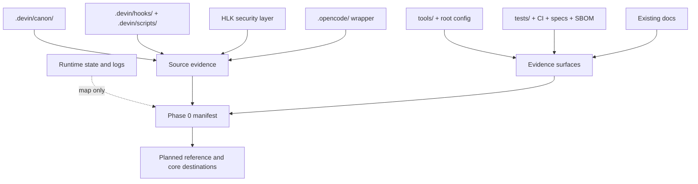

# AHD Loop Harness — Component coverage manifest

| Field | Value |
|---|---|
| Snapshot date | `2026-08-25` |
| Scope | Group-level inventory for Phase 0 |
| Evidence boundary | Actual source read in the workspace; runtime state is mapped only and is not source |
| Status | Group manifest recorded; Phase 0 independent gate PASS |
| Mirror | `docs/vi/` ↔ `docs/en/` |

C-coverage-01: [fact] This manifest is based on `.devin/canon/BOOT_PROTOCOL.md`, `.devin/rules/WORKSPACE_GOVERNANCE.md`, and directory listings/file reads at snapshot `2026-08-25`. It records observed paths/component groups and does not infer behavior from directory names. It does not state counts of files, tests, or packages without a separate counting evidence step.

## 1. How to read this manifest

### 1.1 Evidence categories

| Label | Meaning in this manifest |
|---|---|
| `source` | File/module used to read implementation, contract, or policy. |
| `runtime state` | State, log, checkpoint, cache, or artifact generated by runtime; map lifecycle/data shape only. |
| `security` | HLK security layer or protection boundary; read-only in this task. |
| `wrapper/config` | Provider bridge, launcher, or config connecting layers. |
| `evidence` | Test, CI workflow, formal spec, SBOM, or checking utility. |
| `existing docs` | Existing documentation; context/cross-check material, not automatically a new fact. |

Paths in the table are repository-relative and keep their English names. `Phase 0 coverage` states what the manifest did; it does not claim that a deep reference is complete.

## 2. Source, runtime, and security boundaries

**Figure 1 — Component-coverage boundary.** Source and evidence flow into the manifest; runtime state is mapped only, and later phases write references/cores from cross-checked source.

## 3. Component-group inventory

| Component group | Observed path/file `[fact]` | Type | Phase 0 coverage status | Planned reference destination |
|---|---|---|---|---|
| Canon protocols | `.devin/canon/CORE_CANON.md`, `.devin/canon/BOOT_PROTOCOL.md`, `.devin/canon/REDLINES.md`, `.devin/canon/VERIFICATION_PROTOCOL.md`, `.devin/canon/MEMORY_PROTOCOL.md`, `.devin/canon/LOOP_PROTOCOL.md`, `.devin/canon/CAVEMAN_PROTOCOL.md`, `.devin/canon/HARNESS_ENGINEERING.md`, `.devin/canon/JUDGMENT_RUBRICS.md`, `.devin/canon/HANDOFF_LETTER.md`, `.devin/canon/DAEMON_PROTOCOL.md`, `.devin/canon/LOOP_GOAL_BASED.md`, `.devin/canon/LOOP_PROACTIVE.md`, `.devin/canon/LOOP_TIME_BASED.md`, `.devin/canon/LOOP_TURN_BASED.md` | source | Canonical-rules group identified; grouped reference not written | `docs/vi/reference/<canon-protocols>.md` and `docs/en/reference/<canon-protocols>.md` |
| Skills | `.devin/skills/`, `.devin/skills/full-power/`, `.devin/skills/plan/`, `.devin/skills/lightning/`, `.devin/skills/glm/`, `.devin/skills/kimi/`, `.devin/skills/adversarial-consensus/`, `.devin/skills/aide-memory/`, `.devin/skills/harness-upgrade/`, `.devin/skills/auditor.md`, `.devin/skills/claim-grader.md`, `.devin/skills/fable-judge.md`, `.devin/skills/harness-sensor.md`, `.devin/skills/using-skills.md`, `.devin/skills/tdd.md`, `.devin/skills/systematic_debugging.md`, `.devin/skills/user-preference.md` | source | Workflow skills and metadata identified; each skill/trigger still needs reference | `docs/vi/reference/<skills>.md` and `docs/en/reference/<skills>.md` |
| Agents, personas, and executors | `.devin/agents/COMMANDER.md`, `.devin/agents/DISPATCH_TEMPLATES.md`, `.devin/agents/model_tiers.md`, `.devin/agents/workers/`, `.devin/agents/personas/`, `.devin/agents/glm-executor/`, `.devin/agents/kimi-executor/`, `.devin/agents/lightning-executor/` | source | Role/lifecycle directories identified; not every role contract mapped | `docs/vi/reference/<agents-and-personas>.md` and `docs/en/reference/<agents-and-personas>.md` |
| Hooks and hook-support modules | `.devin/hooks/pre_tool_use.py`, `.devin/hooks/post_tool_use.py`, `.devin/hooks/plan_enforce.py`, `.devin/hooks/schema_gate.py`, `.devin/hooks/coverage_enforce.py`, `.devin/hooks/session_start.py`, `.devin/hooks/session_end.py`, `.devin/hooks/stop.py`, `.devin/hooks/drift_detect.py`, `.devin/hooks/self_heal.py`, `.devin/hooks/reflection_gate.py`, `.devin/hooks/pre_tool_*.py`, `.devin/hooks/post_tool_*.py`, `.devin/hooks/schema_gate_*.py` | source/runtime enforcement | Entry points and module families identified; lifecycle, timeout, and fail-closed behavior need Phase 3/4 cross-check | `docs/vi/reference/<hooks>.md`, `docs/en/reference/<hooks>.md`; core: `docs/vi/core/<pre-tool-use>.md`, `<post-tool-use>.md`, `<plan-enforce>.md`, `<schema-gate>.md` |
| Plan and orchestration scripts | `.devin/scripts/plan_orchestrator.py`, `.devin/scripts/plan_dispatch.py`, `.devin/scripts/plan_fsm/`, `.devin/scripts/approval_gate.py`, `.devin/scripts/plan_quality_check.py`, `.devin/scripts/plan_quality_*.py`, `.devin/scripts/plan_sanitizer.py`, `.devin/scripts/pre_task_audit.py` | source | Plan/approval/quality family identified; FSM states and artifacts still need tracing | `docs/vi/reference/<plan-orchestration>.md` and `docs/en/reference/<plan-orchestration>.md`; core: `docs/vi/core/<plan-orchestrator>.md`, `<approval-gate>.md` |
| Execution, DAG, and swarm | `.devin/scripts/dag_compile.py`, `.devin/scripts/dag_executor.py`, `.devin/scripts/dag_*.py`, `.devin/scripts/swarm_director.py`, `.devin/scripts/swarm_judge.py`, `.devin/scripts/three_role.py`, `.devin/scripts/data_models.py` | source | Execution family, batch/retry/write-set concepts identified; source-to-test matrix pending | `docs/vi/reference/<execution-dag-swarm>.md` and `docs/en/reference/<execution-dag-swarm>.md`; core: `docs/vi/core/<dag-executor>.md`, `<swarm-director-judge>.md` |
| State, session, memory, event, and checkpoint | `.devin/scripts/state_router.py`, `.devin/scripts/state_schema.py`, `.devin/scripts/state_store/`, `.devin/scripts/session_manager.py`, `.devin/scripts/loop_memory_sync.py`, `.devin/scripts/loop_memory_*.py`, `.devin/scripts/event_bus.py`, `.devin/scripts/blackboard.py`, `.devin/scripts/checkpoint.py`, `.devin/scripts/checkpoint_*.py` | source | Persistence families and entry points identified; data model/lifetime required before Phase 4 | `docs/vi/reference/<state-session-memory>.md` and `docs/en/reference/<state-session-memory>.md`; core: `docs/vi/core/<state-router>.md`, `<session-manager>.md`, `<event-bus-blackboard>.md`, `<checkpoint-system>.md` |
| Verification, quality, and redteam | `.devin/scripts/coverage_matrix.py`, `.devin/scripts/qa_doc_audit.py`, `.devin/scripts/hook_integrity.py`, `.devin/scripts/sbom_verify.py`, `.devin/scripts/llm_as_judge.py`, `.devin/scripts/fable_judge_compensation.py`, `.devin/scripts/memory_audit.py`, `.devin/scripts/plan_quality_*.py`, plus `.devin/skills/fable-judge.md`, `.devin/skills/auditor.md`, `.devin/skills/claim-grader.md` | source/evidence | Gate/check families identified; all outputs and severities not yet cross-checked | `docs/vi/reference/<verification-quality-redteam>.md` and `docs/en/reference/<verification-quality-redteam>.md`; core: `docs/vi/core/<schema-gate>.md` |
| Context engineering, cost, and observability | `.devin/scripts/context_guard.py`, `.devin/scripts/context_projection.py`, `.devin/scripts/adaptive_compress.py`, `.devin/scripts/cot_synthesis.py`, `.devin/scripts/self_consistency.py`, `.devin/scripts/best_of_n.py`, `.devin/scripts/cost_tracker.py`, `.devin/scripts/cost_ledger.py`, `.devin/scripts/cost_dashboard.py`, `.devin/scripts/spc_monitor.py`, `.devin/scripts/graph_engine/` | source | Context/cost/graph families identified; metrics and boundaries need source cross-check | `docs/vi/reference/<context-cost-observability>.md` and `docs/en/reference/<context-cost-observability>.md` |
| Update, isolation, and supply-chain scripts | `.devin/scripts/check_updates.py`, `.devin/scripts/merge_updates.py`, `.devin/scripts/update_common.py`, `.devin/scripts/migrate_config.py`, `.devin/scripts/migrate_state.py`, `.devin/scripts/worktree.py`, `.devin/scripts/path_resolver.py`, `.devin/scripts/subagent_isolation.py`, `.devin/scripts/cosign_verify.py`, `.devin/scripts/cosign_verify.sh`, `.devin/scripts/cosign_verify.cmd` | source/tooling | Update, worktree, migration, and signing entry points identified; command/read-back matrix pending | `docs/vi/reference/<update-supply-chain>.md` and `docs/en/reference/<update-supply-chain>.md` |
| Shared runtime packages and adapters | `.devin/scripts/adapters/`, `.devin/scripts/agents/`, `.devin/scripts/runtime/`, `.devin/scripts/state_machine_v2/`, `.devin/scripts/state_store/`, `.devin/scripts/graph_engine/`, `.devin/scripts/data_models.py` | source | Package boundaries recorded; public API versus internal helper not separated | `docs/vi/reference/<runtime-packages>.md` and `docs/en/reference/<runtime-packages>.md` |
| HLK security layer | `HLK/security/sanitizer.js`, `HLK/security/vault-bridge.js`, `HLK/wrappers/hlk-loader.js`, `HLK/wrappers/hlk-hook-bridge.mjs`, `HLK/wrappers/hlk-hook-launcher.mjs`, `HLK/wrappers/hlk-verify-integrity.js`, `HLK/wrappers/ruflo-hlk.mjs`, `HLK/wrappers/ruflo-hlk.ps1`, `HLK/wrappers/ruflo-hlk.cmd`, `HLK/config/hlk.config.json`, `HLK/config/secrets.env.example`, `HLK/git-tools/`, `HLK/bin/`, `HLK/custom-hooks/`, `HLK/setup/`, `HLK/loop/`, `HLK/upstream/`, `HLK/skills/` | security; read-only | Security boundary separated from AHD source; HLK is not modified; command/path discrepancy is a known gap | `docs/vi/reference/<hlk-security>.md` and `docs/en/reference/<hlk-security>.md`; core: `docs/vi/core/<hlk-security-core>.md` |
| Reusable tools | `tools/check_governance.py`, `tools/check_deps.py`, `tools/junk_file_scanner.py`, `tools/gitignore_audit.py`, `tools/gen_source_map.py`, `tools/cross_platform.py`, `tools/health-check.ps1`, `tools/verify-workspace.ps1`, `tools/backup-workspace.ps1`, `tools/restore-workspace.ps1`, `tools/deploy-template.ps1`, `tools/rollback-deploy.ps1`, `tools/init-new-project.ps1`, `tools/package-template.ps1`, `tools/merge-config.ps1`, `tools/clean-runtime.ps1`, `tools/cleanup-orphan-sessions.ps1`, `tools/risk-contract-check.ps1` | source/tooling | Utility and operational checks identified; command success/failure needs ops phase | `docs/vi/reference/<tools>.md` and `docs/en/reference/<tools>.md` |
| Root entries and configuration | `AGENTS.md`, `CLAUDE.md`, `SECURITY.md`, `REPOS.md`, `opencode.json`, `.devin/config.json`, `.devin/mcp_config.json`, `.opencode/config.json`, `pyproject.toml`, `pytest.ini`, `package.json`, `package-lock.json`, `requirements-lock.txt`, `renovate.json`, `.gitignore`, `.gitattributes`, `activate.cmd`, `activate.ps1`, `devin-run.cmd`, `devin-run.ps1`, `devin-swe.cmd`, `devin-swe.ps1`, `loop`, `session` | config/entry | Entry/config boundary identified; precedence and platform variants need confirmation | `docs/vi/reference/<root-config>.md` and `docs/en/reference/<root-config>.md` |
| OpenCode wrapper and MCP | `.opencode/agent/`, `.opencode/agents/`, `.opencode/hooks/`, `.opencode/command/`, `.opencode/plugin/harness.ts`, `.opencode/tools/`, `.opencode/skills/`, `.opencode/config.json`, `.opencode/package.json`, `.opencode/package-lock.json`, `.devin/mcp_config.json` | wrapper/config | Provider wrapper separated from `.devin`; local MCP launcher coverage needs checking | `docs/vi/reference/<opencode-and-mcp>.md` and `docs/en/reference/<opencode-and-mcp>.md` |
| Tests and pentest evidence | `tests/conftest.py`, `tests/test_plan_orchestrator.py`, `tests/test_plan_fsm.py`, `tests/test_plan_enforce.py`, `tests/test_approval_gate.py`, `tests/test_dag_compile.py`, `tests/test_dag_executor.py`, `tests/test_session_manager.py`, `tests/test_event_bus.py`, `tests/test_blackboard.py`, `tests/test_checkpoint_schema.py`, `tests/test_state_layout.py`, `tests/test_state_locking.py`, `tests/test_qa_doc_audit.py`, `tests/test_hook_integrity.py`, `tests/test_destructive_block.py`, `tests/test_no_secret_log.py`, `tests/test_ssrf_guard.py`, `tests/test_encoding_bypass.py`, `tests/pentest/` | evidence | Behavior/security test families identified; component-to-test matrix pending | `docs/vi/reference/<tests-and-pentest>.md` and `docs/en/reference/<tests-and-pentest>.md` |
| CI, supply chain, formal specs, and SBOM | `.github/workflows/ci.yml`, `.github/workflows/codeql.yml`, `.github/workflows/supply-chain.yml`, `.github/supply-chain/`, `.githooks/pre-commit`, `.githooks/post-merge`, `specs/plan_orchestrator.tla`, `specs/state_router.tla`, `sbom/python.sbom.json`, `sbom/npm.sbom.json`, `requirements-lock.txt` | evidence/config | CI, SAST, SBOM, lock, and TLA+ surfaces identified; commands need cross-checking against actual files | `docs/vi/reference/<ci-specs-sbom>.md` and `docs/en/reference/<ci-specs-sbom>.md` |
| Runtime state and generated artifacts | `.devin/state/`, `.devin/session_state/`, `.devin/loop_state`, `.devin/plan_state/`, `.devin/blackboard/`, `.devin/event_bus/`, `.devin/telemetry/`, `.devin/context_flags/`, `.devin/checkpoints/`, `.devin/artifact_registry/`, `.opencode/session_state/`, `state/`, `logs/`, `.coverage`, `.pytest_cache/` | runtime state | Mapped as state/artifacts, not source; lifecycle/data-retention reference pending | `docs/vi/reference/<runtime-state-map>.md` and `docs/en/reference/<runtime-state-map>.md` |
| Existing documentation | `docs/USAGE_GUIDE.md`, `docs/CONTINUOUS_LOOP_GUIDE.md`, `docs/PLAN_ORCHESTRATOR_GUIDE.md`, `docs/CONSTRAINT_LEDGER.md`, `docs/AGENTS_full_reference.md`, `docs/BOOT_PROTOCOL_full.md`, `docs/REDLINES_full.md`, `docs/PROPOSAL.md`, `docs/PROPOSAL_PLAN_PHASE_REDESIGN.md`, `docs/REDTEAM_AUDIT.md`, `docs/REFACTOR_LONG_FILES.md`, `HLK/README.md`, `HLK/docs/README.md`, `HLK/docs/UPGRADE_PLAN.md`, `docs/plans/system-docs-vi-en/SOLUTION_DESIGN.md`, `docs/plans/system-docs-vi-en/IMPLEMENTATION_PLAN.md` | existing docs | Catalogued as secondary evidence; stale claims must be reconciled before use as facts | System pages `docs/vi/<system-document>.md` and `docs/en/<system-document>.md`; reference pages by group |

## 4. Phase 0 coverage status

| Status | Meaning |
|---|---|
| `Manifested` | An observed directory/file is assigned to a component group. |
| `Runtime-map-only` | A path is recorded for state/artifact boundaries; it is not used to infer implementation. |
| `Planned` | A future reference/core destination is named in inline code; the file does not exist yet. |
| `Gap` | A discrepancy, stale path, missing source, or boundary needs verifier/research work. |

**Phase 0 result at this boundary:** the principal layers have group-level inventory and planned destinations. Phase 0 does not provide a deep reference for every component or confirm every command; the independent gate passed according to the execution report.

## 5. Known gaps at the snapshot

| ID | Label and evidence | Impact | Next action |
|---|---|---|---|
| `G-01` | `[fact]` `HLK/README.md` references `HLK/bin/hlk-lifecycle.mjs`, `hlk-setup-max-power.mjs`, and `hlk-update-max-power.mjs`; the observed `HLK/bin/` directory contains other entries such as `hlk-install.mjs`, `hlk-pack.mjs`, `hlk-repack.mjs`, `hlk-status.mjs`, and `hlk-update.mjs`. | An HLK command reference must not become an operational fact without checking. | In Phase 3/5, reconcile README with actual files; keep the missing path as a known issue until verified. |
| `G-02` | `[fact]` `.devin/config.json` has metadata/timeouts for `aide-memory`, `spark-memory`, `deepwiki`, and `devin`, while `.devin/mcp_config.json` currently declares only `aide-memory`. | Do not describe four servers as locally configured launchers. | The OpenCode/MCP reference must separate configured metadata from actual launchers and cite each source. |
| `G-03` | `[fact]` `pyproject.toml` sets `tool.coverage.report.fail_under = 80`; `pytest.ini` sets `--cov-fail-under=20`; `ci.yml` runs pytest with `--override-ini="addopts=-ra"`. | Coverage gates have different contexts; do not state one threshold without the command context. | In Phase 3/5, build a command matrix, state config precedence, and record observed output. |
| `G-04` | `[fact]` `docs/USAGE_GUIDE.md` and `.devin/scripts/qa_doc_audit.py` still contain references to old script/path patterns; the root directory has no `scripts/` or `src/` directory at the snapshot. | Existing docs can contain stale references; do not use them as new links or source claims. | Reconcile in grouped references; a missing path must remain `[unverified-guess]` or a known issue. |
| `G-05` | `[fact]` SBOM metadata has timestamp `2026-08-19` in `sbom/python.sbom.json` and `2026-08-14` in `sbom/npm.sbom.json`, earlier than the corpus snapshot. | An SBOM does not prove dependency state at `2026-08-25`. | In Phase 3/6, compare lock, SBOM, and CI and record the SBOM snapshot separately. |
| `G-06` | `[fact]` Several directories contain generated state (`.devin/plan_state/`, `.devin/session_state/`, `.devin/telemetry/`, `.opencode/session_state/`, and root runtime directories) beside source; `.gitignore` also has runtime rules. | Readers can mistake current state for implementation or a stable contract. | Keep runtime-map-only; in Phase 2/3 document lifecycle, retention, and source boundaries from code. |
| `G-07` | `[fact]` `.gitignore` uses `docs/*`; the current plan added dedicated exceptions for `docs/vi/`, `docs/en/`, and `docs/plans/system-docs-vi-en/`. | The hidden-corpus risk is resolved for the current scope. | `git status --short --ignored` shows corpus paths as `??`, not `!!`; retain the exceptions when publishing. |
| `G-08` | `[inference]` Existing docs contain catalog/heading counts that differ from the current directory listing; basis: `docs/USAGE_GUIDE.md`, `.devin/canon/`, and `.devin/hooks/` were read. | Do not use old-document counts as a coverage claim. | Publish counts only with command-generated evidence at the snapshot; otherwise keep path-based inventory. |

## 6. Claims

| Claim ID | Label | Claim | Source path | Snapshot date | Notes/limits |
|---|---|---|---|---|---|
| `C-coverage-01` | `[fact]` | The manifest groups source, evidence, security, wrapper/config, and runtime state. | `.devin/canon/BOOT_PROTOCOL.md`, `.devin/rules/WORKSPACE_GOVERNANCE.md` | `2026-08-25` | This is a group-level inventory, not a deep reference. |
| `C-coverage-02` | `[inference]` | Runtime state should be documented as a boundary/lifecycle rather than used as source design. | `.devin/canon/MEMORY_PROTOCOL.md`, `.devin/rules/WORKSPACE_GOVERNANCE.md` | `2026-08-25` | Deeper cross-check is scheduled for Phases 2/3. |

## 7. Known issues

| Issue ID | Status/severity | Impact | Evidence path | Remediation or next action |
|---|---|---|---|---|
| `G-coverage-01` | `open/medium` | Some existing docs may be stale relative to current source. | `docs/USAGE_GUIDE.md`, `.devin/scripts/qa_doc_audit.py` | Reconcile in grouped references; do not modify existing docs in Phase 0. |
| `G-coverage-02` | `resolved` | New corpus files previously needed a tracking check because the `docs/*` rule could hide them. | `.gitignore:281-291` | An exception is now present; retain the allowlist and check tracking when publishing. |

## 8. Next destinations and phase boundary

- Phase 0 creates only the index, contract, and manifest; it does not create future reference/core/ops files.
- Phase 1 uses this manifest for system overview, component catalog, functions, principles, and design rationale.
- Phase 2 uses the source groups for model, flow, state, data, and sequence diagrams; a suitable lifetime diagram uses `activate`/`deactivate`.
- Phase 3 turns each group into a reference with source path, interface, lifecycle, failure, security, and test mapping.
- Phase 4 selects core pages from the plan: planning/approval, DAG/swarm, hooks/enforcement, state/memory/session/event/checkpoint/boot, and HLK security core.
- Phase 5 writes ops/roadmap content; an unchecked command must not enter an operator guide.

## 9. Phase 0 links

- [Documentation contract](00-documentation-contract.md).
- [Corpus index](00-index.md).
- [Vietnamese mirror](../vi/00-component-coverage.md).
- [`IMPLEMENTATION_PLAN.md`](../plans/system-docs-vi-en/IMPLEMENTATION_PLAN.md).
