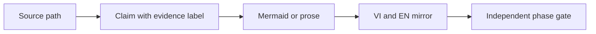
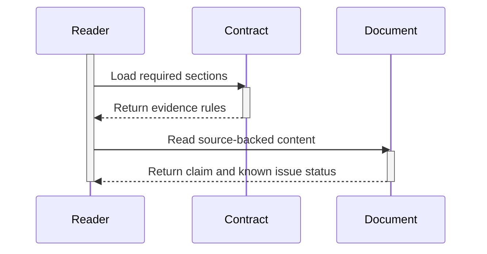
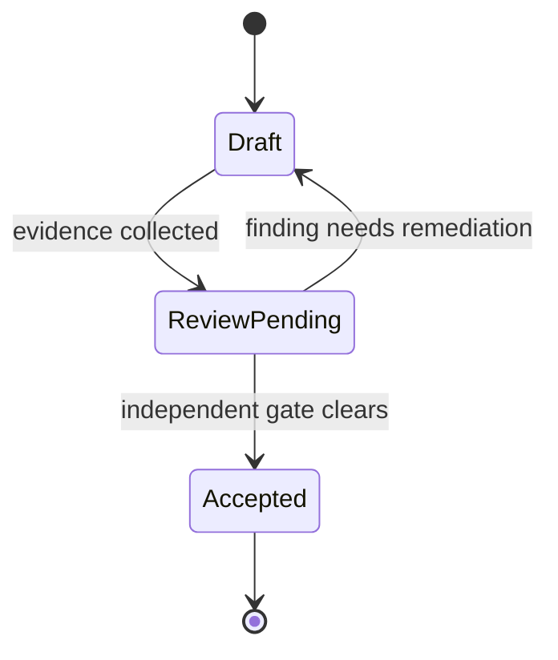
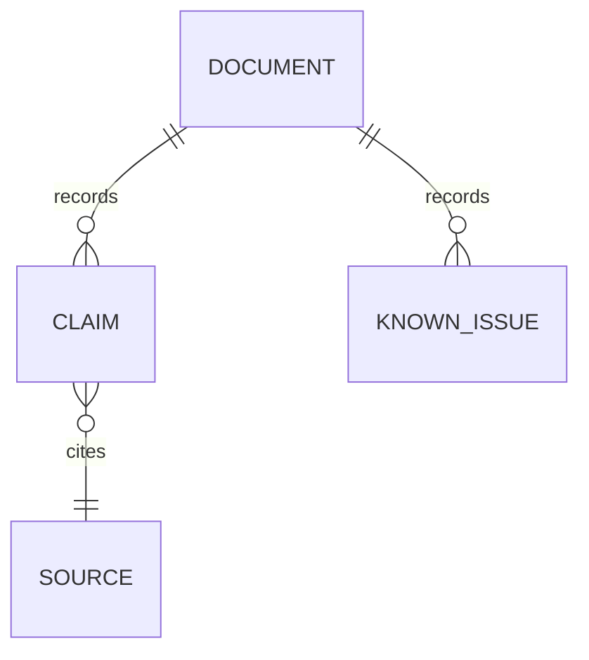

# AHD Loop Harness — Documentation contract

| Field | Value |
|---|---|
| Snapshot date | `2026-08-25` |
| Applies to | System, group/reference, core, and ops documents |
| Mirror | `docs/vi/` ↔ `docs/en/` |
| Status | Phase 0 standard; not a verifier verdict |

C-contract-01: [fact] This contract turns the requirements in [`IMPLEMENTATION_PLAN.md`](../plans/system-docs-vi-en/IMPLEMENTATION_PLAN.md) into corpus writing rules. Every document must still be checked against current source; the contract does not turn a planned path into an existing component.

## 1. Scope and principles

- Write documentation so a reader can trace each claim to a source path, config, test, CI workflow, spec, or existing documentation.
- Distinguish implementation source, generated runtime state, the HLK security layer, provider wrappers, and evidence. Do not use a runtime artifact as evidence of source design.
- Keep the diff small; do not modify `.devin/`, `HLK/`, source, tests, or existing docs when the task only creates the corpus.
- Do not record secret values, credentials, tokens, private keys, or sensitive data. Key or variable names may be mentioned to explain a contract; values may not.
- Do not add marketing or claims beyond the evidence. When a point is not verified, use `[unverified-guess]` and state the verification action.

## 2. Document-front metadata

Every system, group/reference, core, and ops document must have short metadata at the top:

| Required field | Rule |
|---|---|
| Title | Clear technical name; keep component, class, and module names in English. |
| Document type | One of `system`, `group/reference`, `core`, or `ops`. |
| Scope | State the boundary and exclusions. |
| Audience | State the primary readers. |
| Snapshot date | Use the date of the source survey; Phase 0 uses `2026-08-25`. |
| Status | `planned`, `draft`, `review-pending`, or a state recorded by the verifier; do not self-write `PASS`. |
| Mirror | Point to the VI/EN pair when that pair exists; future files are names in inline code only. |

Snapshot date records the evidence time. It is not a version marker or an edit history. Version truth belongs in git history and the changelog, as required by canon.

## 3. Required sections by document type

### 3.1 System documents

A system document must contain these sections, in logical order:

1. `Purpose and scope` — goal, boundary, audience, and out-of-scope items.
2. `System map` — layers, component groups, trust boundaries, and a source/runtime/security legend.
3. `Functions and responsibilities` — function, owning component, input/output, and dependency; do not assert an API not present in source.
4. `Operating principles` — principles derived from canon or source, with facts separated from inferences.
5. `Lifecycle and main flows` — end-to-end flow, happy path, and failure path; use Mermaid when relationships or transitions are present.
6. `Evidence and source paths` — claim, label, path, and snapshot-date table.
7. `Known issues and gaps` — discrepancy, missing path, stale documentation, or unsurveyed area.
8. `Further reading` — links only to existing files or files in the same phase.

### 3.2 Group/reference documents

A group/reference document must contain:

1. `Purpose and boundary` for the group.
2. `Component inventory` — observed components/file paths and whether each is source or runtime.
3. `Interfaces and contracts` — CLI, function, config, input/output, schema, or event when defined by source.
4. `Dependencies and ownership` — internal dependencies, wrappers, and editable/non-editable zones.
5. `Lifecycle and state` — initialization, reads/writes, termination, and persistence; state clearly when evidence is absent.
6. `Failure and security` — errors, fail-closed/open behavior, secret boundaries, and source-confirmed side effects.
7. `Verification evidence` — test, CI, spec, command, or read-back path.
8. `Known issues`, `claims`, and cross-links.

### 3.3 Core documents

A core document for one core component must contain:

1. `Purpose, scope and non-goals`.
2. `Source path and public surface` — exact module, class, function, entry point, and primary symbol names.
3. `Invariants and data contract` — preconditions, postconditions, schema, state, and idempotency when evidenced.
4. `Lifecycle and state transitions` — active lifetime, ownership, retry, checkpoint, or recovery when present in source.
5. `Control/data flow` — an appropriate Mermaid diagram and a step-by-step walkthrough.
6. `Failure modes and security boundary` — observable errors, secret handling, permission, and rollback.
7. `Verification evidence` — test path, deterministic gate, or spec path; the author's statement is not proof.
8. `Known issues`, `claims`, and next action.

### 3.4 Ops documents

An ops document must contain:

1. `Purpose, audience and change boundary`.
2. `Prerequisites` — runtime, permissions, config, and required source paths.
3. `Risk and authorization` — side effects, approval, secret handling, and stop condition.
4. `Command procedure` — exact command, step order, and safe input placeholders.
5. `Expected evidence` — output, file/state change, log, or CI artifact to observe.
6. `Failure diagnosis` — symptom, known cause, and escalation path.
7. `Rollback and recovery` — rollback condition, recovery steps, and limits; do not invent a command.
8. `Known issues`, `claims`, and snapshot date.

## 4. Evidence labels and source paths

### 4.1 Claim standard

Use exactly these three labels in the claim register and in assertive descriptions:

| Label | Meaning | Writing rule |
|---|---|---|
| `[fact]` | Direct observation from an existing file, symbol, config, test, CI workflow, or spec. | Include the source path and a line/range when useful; do not generalize beyond the source. |
| `[inference]` | A conclusion derived from one or more facts. | State the basis as facts/paths; make clear that this is interpretation. |
| `[unverified-guess]` | A hypothesis, assumption, or path/capability not opened and checked in source. | State the verification action; do not present it as an approved operational instruction. |

Do not hide a missing label behind confident wording. Existing docs may provide context; if they conflict with current source, record the conflict as a known issue.

### 4.2 Source-path rules

1. Use a repository-relative path, `/` separators, exact case, and the extension: for example `.devin/hooks/pre_tool_use.py`.
2. Add `:line` or `:line-line` for an important symbol or excerpt when useful; the line is evidence at the snapshot, not a substitute for reading the file.
3. Identify the path type: `source`, `config`, `runtime state`, `security`, `test`, `CI`, `spec`, `SBOM`, or `existing docs`.
4. Do not use an absolute personal-machine path, secret path, unnecessary URL, or nonexistent file as if it were source.
5. When a path does not exist, do not add a link to hide the gap. Use `[unverified-guess]` or record a known issue with a check action.
6. Every claim table must include at least `Claim ID`, `Label`, `Claim`, `Source path`, `Snapshot date`, and `Notes/limits`.

## 5. Mermaid conventions

Mermaid is used in an inline fence, not as a generated image. Every diagram needs a caption immediately before or after its fence and a short explanation. Do not put secret values, tokens, credentials, or sensitive runtime data in nodes or edges.

| Type | Use for | Minimum rule |
|---|---|---|
| `flowchart LR` or `flowchart TD` | Architecture, dependency, and control flow. | State the boundary; nodes without source must be marked planned or hypothetical outside the diagram. |
| `sequenceDiagram` | Interaction and active lifetime. | Use `activate`/`deactivate` for participants with a working lifetime; arrows alone are insufficient. |
| `stateDiagram-v2` | Status, stage, guard, and transition. | State the initial state, terminal state, and transition condition when source provides them. |
| `erDiagram` | Document/state/event/data-contract relationships. | Draw only relations stable in source/schema; label assumed relations as such. |

**Figure 1 — Standard flow from claim to independent check.** This is a documentation-contract convention, not a runtime diagram for a particular component.

The flow places the source path before the claim, then represents content and mirror checking; the diagram is not the source of truth.

**Figure 2 — Active lifetime in a sequence diagram.** `activate` and `deactivate` must surround the period in which a participant is working.

This sequence illustrates a documentation-reading lifetime; it does not assert that the participants are runtime modules.

**Figure 3 — Document-review state.** `stateDiagram-v2` represents a gate and remediation branch; it does not replace a verifier verdict.

The diagram uses `Accepted` as a documentation-process state; only an independent report records the actual phase state.

**Figure 4 — Minimal claim-register relationships.** This `erDiagram` describes evidence structure in the corpus.

Every claim needs a source; a known issue belongs to a document but cannot be used to fake source evidence.

## 6. Corpus naming and paths

- New files use lowercase, a numeric prefix, and `kebab-case`; the VI/EN pair keeps the same number and information scope.
- Logical directories are `docs/vi/`, `docs/en/`, `reference/`, `core/`, and `ops/` as defined by the plan; do not create directories outside scope.
- Keep command, class, module, function, event, config-key, and source-path names in English so they can be copied and searched.
- Headings use the same numbering in VI and EN; prose is translated naturally without losing technical semantics.
- Do not add version markers or changelog blocks to the document body. Snapshot date is evidence metadata only.
- Do not use generic names without domain meaning; do not rename a source symbol for translation.

## 7. VI/EN parity

Each pair must meet all of these checks before its phase gate:

- Same numeric prefix, document type, scope, and snapshot date.
- Same required-heading order, table rows, Claim IDs, and Known Issue IDs.
- Same diagram type, topology, and lifecycle; diagram text may be translated, but symbols, paths, and commands remain unchanged.
- EN contains information equivalent to VI, with no placeholder, shortened condition, or omitted known gap.
- Internal links in each version resolve to existing files or files in the same phase; future files use inline code only.
- Any evidence, claim, or known-issue change is mirrored in both versions.

## 8. Claim register and Known issues

### 8.1 Minimum claim register

Every content document must have a `Claims` section with this table:

| Claim ID | Label | Claim | Source path | Snapshot date | Notes/limits |
|---|---|---|---|---|---|
| `C-<doc>-<n>` | `[fact]`, `[inference]`, or `[unverified-guess]` | A checkable claim | Repository-relative path | `YYYY-MM-DD` | Basis, limit, or verification action |

Do not combine independent claims in one row when their evidence differs. A `[unverified-guess]` claim needs a verification action and must not be written as an existing capability.

### 8.2 Minimum Known issues section

Every document must have a `Known issues` section even when there is no finding. If none was observed, write `None observed at snapshot` and state the survey scope. For a finding:

| Issue ID | Status/severity | Impact | Evidence path | Remediation or next action |
|---|---|---|---|---|
| `G-<doc>-<n>` | `open`, `blocked`, or `resolved-pending-check` | Effect on reading, operations, or coverage | Path and line when available | Specific action; do not fix outside scope |

Missing paths, stale references, source/runtime ambiguity, parity drift, and unverified commands are known issues; they must not silently disappear from the inventory.

## 9. Phase-gate checklist

The builder creates content; an independent verifier decides the verdict. The phase gate must check this list and record evidence in the plan execution report:

- [ ] The file is at the `File Path` in the plan; no scope drift.
- [ ] Metadata includes document type, scope, audience, and `Snapshot date: 2026-08-25` or the correct source snapshot.
- [ ] Every claim has `[fact]`, `[inference]`, or `[unverified-guess]`, with source path and limits.
- [ ] Required sections for `system`, `group/reference`, `core`, or `ops` are complete.
- [ ] Known issues are present; missing, stale, and unverified items have remediation or a next action.
- [ ] VI/EN heading, table, Claim ID, Known Issue ID, and diagram parity is complete; EN is not a placeholder.
- [ ] Mermaid fences are balanced; diagrams use the allowed types; `sequenceDiagram` uses `activate`/`deactivate` when showing lifetime.
- [ ] Markdown links point only to existing files or files in the same phase; future files use inline code.
- [ ] No secret, credential, token value, absolute local path, or marketing claim is present.
- [ ] An independent verifier has read fresh context and recorded the result; the builder does not write `PASS`.

## 10. Claims

| Claim ID | Label | Claim | Source path | Snapshot date | Notes/limits |
|---|---|---|---|---|---|
| `C-contract-01` | `[fact]` | The contract requires repository-relative source paths and evidence labels for claims. | `.devin/canon/VERIFICATION_PROTOCOL.md`, `.devin/rules/WORKSPACE_GOVERNANCE.md` | `2026-08-25` | It applies to the new corpus and does not replace canonical policy. |
| `C-contract-02` | `[inference]` | An independent phase gate is necessary to reduce drift between VI/EN content and source. | `.devin/canon/VERIFICATION_PROTOCOL.md` | `2026-08-25` | This is a design interpretation, not a runtime guarantee. |

## 11. Known issues

| Issue ID | Status/severity | Impact | Evidence path | Remediation or next action |
|---|---|---|---|---|
| `G-contract-01` | `open/low` | Phase 0 checks Mermaid structure but has not rendered diagrams with an external renderer. | `docs/en/00-documentation-contract.md` | Run a renderer/spot-check in Phases 2 and 6 if the tool is available. |

## 12. Existing references

- [Corpus index](00-index.md).
- [Component coverage](00-component-coverage.md).
- [`SOLUTION_DESIGN.md`](../plans/system-docs-vi-en/SOLUTION_DESIGN.md).
- [`VERIFICATION_PROTOCOL.md`](../../.devin/canon/VERIFICATION_PROTOCOL.md).
