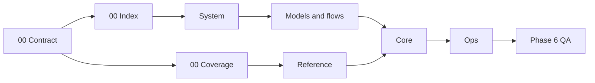

# AHD Loop Harness — Documentation Corpus Index

| Field | Value |
|---|---|
| Snapshot date | `2026-08-25` |
| Current scope | Phase 0 — bootstrap, skeleton, and standards |
| Status | Phase 0 passed independent check; Phase 1 may open |
| Corpus mirror | `docs/vi/` ↔ `docs/en/` |
| Source plan | [`IMPLEMENTATION_PLAN.md`](../plans/system-docs-vi-en/IMPLEMENTATION_PLAN.md) |

## 1. Purpose

C-index-01: [fact] This corpus is the bilingual technical documentation set for the AHD Loop Harness. It takes readers from the system map and evidence rules to grouped references, core components, and operations. The phase scope is defined in [`SOLUTION_DESIGN.md`](../plans/system-docs-vi-en/SOLUTION_DESIGN.md).

This corpus does not replace source, config, tests, or security policy. When documentation and source disagree, the author must open the current source, label the claim, and record a known issue instead of guessing.

## 2. Readers

- **New project readers:** start with the contract, index, and coverage to learn terminology and the source/runtime/security boundaries.
- **Developers and maintainers:** use system, reference, and core pages to trace modules, interfaces, lifecycles, and failure paths.
- **Operators:** use ops pages for commands with prerequisites, expected output, rollback, and stop conditions.
- **Reviewers, security auditors, and phase approvers:** use evidence, the claim register, known issues, and the phase gate for independent checking.

## 3. Reading route

1. Read the [documentation contract](00-documentation-contract.md) for required sections, evidence labels, and Mermaid conventions.
2. Read [component coverage](00-component-coverage.md) to distinguish source, runtime state, HLK security, provider wrappers, and evidence.
3. For system overview and principles, follow the future system files by their inline-code names: `01-system-overview.md`, `02-component-catalog.md`, `03-system-functions.md`, `04-operating-principles.md`, `05-design-philosophy.md`.
4. For models and flows, read the future files in order: `06-system-models.md`, `07-logic-flow.md`, `08-activity-diagrams.md`, `09-data-flow.md`, `10-state-stage-flows.md`, `11-sequence-diagrams.md`.
5. After system pages, enter the `reference/`, `core/`, and `ops/` groups when their phases open.
6. Finally read `12-roadmap.md` to distinguish evidence-backed work from hypotheses that still require research.

Future filenames in this section are inline code, not links; they are not created in Phase 0.

## 4. Planned documentation tree

The two trees keep the same numbering and information scope. `system` is a logical group; the planned system files remain directly under `docs/vi/` and `docs/en/` according to the plan, without inventing another directory.

`docs/en/`

- `00-index.md` — this Phase 0 file.
- `00-documentation-contract.md` — Phase 0.
- `00-component-coverage.md` — Phase 0.
- `system/` — logical group; the real directory is not created in Phase 0.
  - `01-system-overview.md` — planned.
  - `02-component-catalog.md` — planned.
  - `03-system-functions.md` — planned.
  - `04-operating-principles.md` — planned.
  - `05-design-philosophy.md` — planned.
  - `06-system-models.md` — planned.
  - `07-logic-flow.md` — planned.
  - `08-activity-diagrams.md` — planned.
  - `09-data-flow.md` — planned.
  - `10-state-stage-flows.md` — planned.
  - `11-sequence-diagrams.md` — planned.
- `reference/` — planned.
- `core/` — planned.
- `ops/` — planned.
- `12-roadmap.md` — planned.

`system/` in the tree is a logical group label for readability; the approved paths remain the filenames at the `docs/en/` level. `reference/`, `core/`, `ops/`, and their child files are future output and are written as inline code to avoid broken links.

## 5. Phase roadmap and status

| Phase | Scope | Status at snapshot |
|---|---|---|
| Phase 0 | Bootstrap, skeleton, index, contract, and component coverage | Complete; independent gate PASS on `2026-08-25` |
| Phase 1 | System overview and principles | Not started; waiting for the Phase 0 gate |
| Phase 2 | Models and flows | Not started; waiting for Phase 1 |
| Phase 3 | Grouped references | Not started; waiting for Phase 2 |
| Phase 4 | Core component deep references | Not started; waiting for Phase 3 |
| Phase 5 | Operations and roadmap research | Not started; waiting for Phase 4 |
| Phase 6 | Final QA and closeout | Not started; waiting for Phases 0–5 |

Each phase advances only after the independent check required by the plan. This table is not a verdict; a separate verifier must record evidence, findings, and remediation.

**Figure 1 — Corpus reading route by dependency.** A later phase consumes the vocabulary and manifest from the previous phase; nodes without real files describe planned destinations only.

## 6. Claims

| Claim ID | Label | Claim | Source path | Snapshot date | Notes/limits |
|---|---|---|---|---|---|
| `C-index-01` | `[fact]` | The corpus has six Phase 0 files listed in the execution-report scope. | `docs/plans/system-docs-vi-en/EXECUTION_REPORT.md` | `2026-08-25` | Scope expands after each phase. |
| `C-index-02` | `[fact]` | The corpus uses mirrored `docs/vi/` and `docs/en/` trees. | `docs/plans/system-docs-vi-en/IMPLEMENTATION_PLAN.md` | `2026-08-25` | A verifier must confirm parity after each phase. |

## 7. Known issues

| Issue ID | Status/severity | Impact | Evidence path | Remediation or next action |
|---|---|---|---|---|
| `G-index-01` | `open/medium` | Future documents do not yet exist and cannot be linked directly. | `docs/en/00-index.md` | Keep them as inline code until their phase creates the file and link check passes. |
| `G-index-02` | `resolved` | The `docs/*` rule could previously hide new corpus files. | `.gitignore:281-291` | Exceptions for `docs/vi/`, `docs/en/`, and the current plan have been added; retain them when publishing. |

## 8. Existing entry points

- Phase 0: [documentation contract](00-documentation-contract.md) and [component coverage](00-component-coverage.md).
- Vietnamese mirror: [Chỉ mục tiếng Việt](../vi/00-index.md).
- Existing workflow guides: [`docs/USAGE_GUIDE.md`](../USAGE_GUIDE.md) and [`docs/CONTINUOUS_LOOP_GUIDE.md`](../CONTINUOUS_LOOP_GUIDE.md).
- Related canon: [CORE_CANON.md](../../.devin/canon/CORE_CANON.md) and [VERIFICATION_PROTOCOL.md](../../.devin/canon/VERIFICATION_PROTOCOL.md).
- Existing security layer: [HLK README](../../HLK/README.md).

Links in this index point only to existing files or Phase 0 files in the same corpus. Future files appear only as inline code.

## 9. Corpus boundary

- Read `.devin/canon/`, `.devin/hooks/`, `.devin/scripts/`, `HLK/`, `.opencode/`, `tools/`, `tests/`, `.github/`, `specs/`, `sbom/`, and existing docs as evidence; do not modify those areas in this documentation task.
- Do not treat `.devin/state/`, `.devin/session_state/`, `.devin/plan_state/`, `.devin/telemetry/`, or other runtime directories as implementation source.
- Do not write secret values, credentials, tokens, or sensitive data into the corpus.
- Do not add marketing content; every description must be traceable to a path, test, config, CI, spec, or source evidence.
