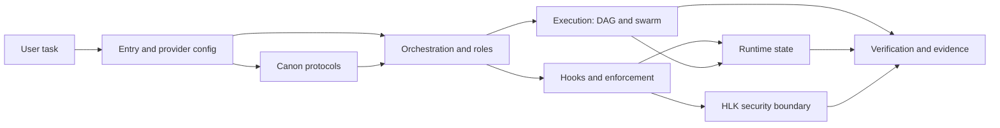
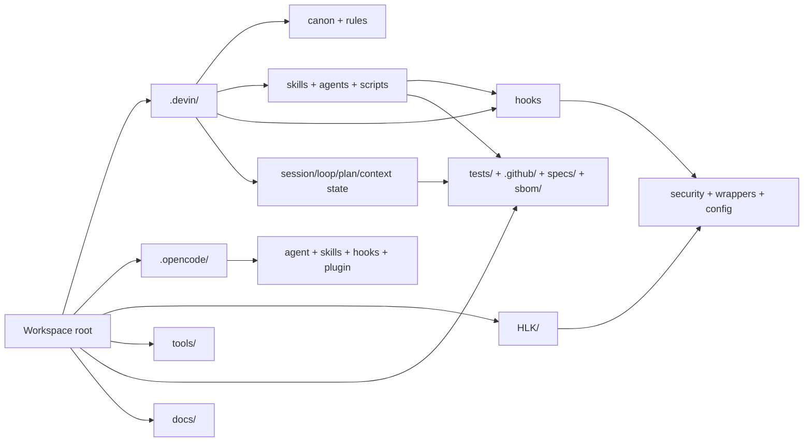
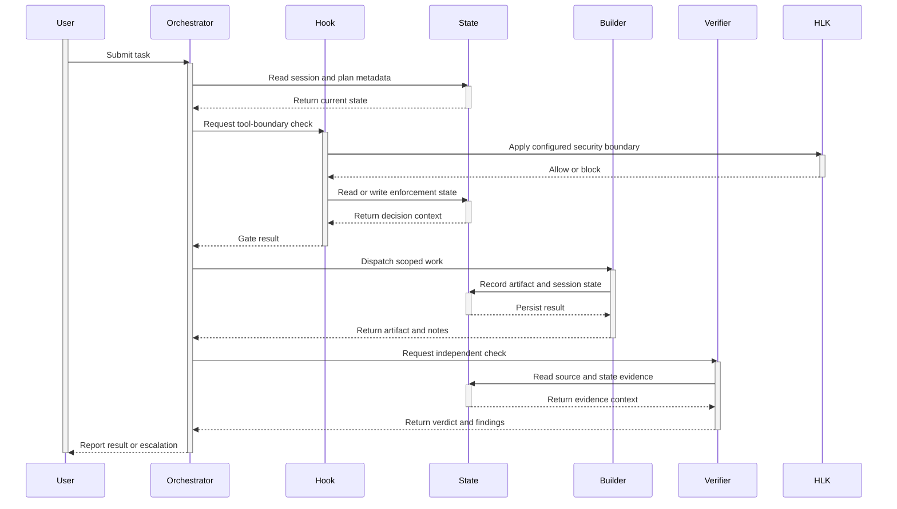

# AHD Loop Harness — System Overview

| Field | Value |
|---|---|
| Document type | `system` |
| Scope | Workspace-level map of the AHD Loop Harness: source, policy, workflow, enforcement, security, evidence, and runtime state; excludes applications outside the harness. |
| Audience | New project readers, maintainers, developers, operators, Builder, Verifier, and security reviewers. |
| Snapshot date | `2026-08-25` |
| Status | `draft` |
| Mirror | [`docs/vi/01-tong-quan-he-thong.md`](../vi/01-tong-quan-he-thong.md) ↔ [`docs/en/01-system-overview.md`](01-system-overview.md) |

## 1. Purpose and scope

`[fact]` AHD Loop Harness is a **Python/Node AI-agent harness**: Python implementation is concentrated in `.devin/hooks/` and `.devin/scripts/`, while the HLK layer has Node.js modules in `HLK/security/`. It is an AI-agent workflow workspace, **not a C# application**, and it must not be described as a .NET product.

`[inference]` The workspace’s operating goal is to connect a user request to plan, approval, execution, enforcement, verification, and memory through repository components with evidence. This is a synthesis of `AGENTS.md`, `.devin/canon/`, `.devin/scripts/plan_fsm/`, `.devin/hooks/`, and `.github/workflows/ci.yml`; it is not a single API.

### 1.1 Boundary

- **In scope:** root entry/config, `.devin/` (canon, skills, agents, hooks, scripts, and state), `HLK/` (security boundary), `.opencode/` (provider wrapper), `tools/`, `tests/`, `.github/`, `specs/`, `sbom/`, and documentation under `docs/`.
- **Source of truth:** current source/config/spec/test/CI. Existing docs are context or cross-check paths; runtime state is not implementation source.
- **Edit authority for this document:** only the two mirror files authorized by plan T1.1; do not modify canon, hooks, HLK, config, source, or tests.

### 1.2 Out of scope

- Building or marketing a C#/.NET application, UI, business service, or domain model.
- Inferring a public API, command, component, or capability from a directory name alone.
- Treating `.devin/session_state/`, `.devin/plan_state/`, `.devin/telemetry/`, `.opencode/session_state/`, or similar artifacts as source design.
- Writing secret values, credentials, tokens, private keys, or sensitive runtime data into the documentation.

## 2. System map

### 2.1 Annotated workspace tree

The tree is a group-level inventory at the snapshot, not a file count. `[source]`, `[config]`, `[security]`, `[evidence]`, `[existing docs]`, and `[runtime state]` distinguish purposes; one directory can contain several child types.

```text
workspace/
├── AGENTS.md, CLAUDE.md, REPOS.md, SECURITY.md       [entry/rules]
├── opencode.json, pyproject.toml, pytest.ini         [config]
├── package.json, package-lock.json, requirements-lock.txt, .gitignore [config/deps]
├── .githooks/                                        [source: Git hooks]
├── .devin/                                            [AHD source + runtime]
│   ├── canon/                                         [source: canonical protocols]
│   ├── rules/                                         [source: project rules]
│   ├── skills/                                        [source: workflow skills]
│   ├── agents/                                        [source: Commander/workers/personas]
│   ├── hooks/                                         [source: enforcement hooks]
│   ├── scripts/                                       [source: Python runtime scripts]
│   │   ├── plan_fsm/                                  [source: Plan FSM]
│   │   ├── plan_orchestrator.py                      [source: Plan entry point]
│   │   ├── state_router.py                            [source: conditional router]
│   │   ├── dag_executor.py                            [source: DAG executor]
│   │   ├── swarm_director.py                          [source: swarm dispatch]
│   │   └── loop_memory_sync.py                        [source: memory registry sync]
│   ├── config.json, mcp_config.json                   [config: provider/hooks/MCP]
│   ├── loop_state.md, loop_state/                     [runtime state: registry/session notes]
│   ├── session_state/, plan_state/                    [runtime state: machine state]
│   └── context_flags/, blackboard/, event_bus/,       [runtime state: flags/data/events]
│       checkpoints/, telemetry/, artifact_registry/
├── HLK/                                               [security: read-only boundary]
│   ├── security/                                      [source: sanitizer/vault]
│   ├── wrappers/                                      [source: launcher/bridge/integrity]
│   ├── config/                                        [config: HLK rules/templates]
│   └── bin/                                           [source: observed HLK commands]
├── .opencode/                                         [wrapper/config + runtime]
│   ├── agent/, agents/, skills/, hooks/               [source: provider wrappers]
│   ├── plugin/, tools/                                [source: bridge/tools]
│   └── session_state/                                 [runtime state: provider artifacts]
├── tools/                                             [source/tooling: checks and operations]
├── tests/                                             [evidence: pytest and pentest]
├── .github/workflows/                                 [evidence: CI/SAST/supply chain]
├── specs/                                             [evidence: TLA+ models]
├── sbom/                                              [evidence: CycloneDX inventories]
├── docs/                                              [existing docs + corpus]
│   ├── vi/, en/                                      [bilingual documentation]
│   └── plans/system-docs-vi-en/                      [plan/SDD artifacts]
└── .agents/, state/, logs/, tmp/, .coverage,          [runtime/shared/test artifacts]
    .pytest_cache/, .worktrees/, .opencode/session_state/
```

`[fact]` The principal directories in the tree were observed; `.devin/` contains both source and generated state and must be read using the legend. `HLK/` is a separate security layer; `.opencode/` is a provider wrapper, not an independent copy of the AHD core.

### 2.2 Layer map and legend

| Layer | Observed path | Evidence type | Responsibility and boundary |
|---|---|---|---|
| Entry/provider | `AGENTS.md`, `CLAUDE.md`, `opencode.json`, `.devin/config.json`, `.devin/mcp_config.json` | `[config]` | Declares instructions, permissions, hook events, and launcher metadata; it is not a business application. |
| Canon | `.devin/canon/` | `[source]` | Identity, BOOT, red lines, memory, loop, and verification protocols; canon is not edited directly. |
| Workflow | `.devin/skills/`, `.devin/agents/` | `[source]` | Skill triggers, Commander, worker, persona, and executor roles; it does not create runtime results by itself. |
| Orchestration | `.devin/scripts/plan_fsm/`, `.devin/scripts/plan_orchestrator.py`, `.devin/scripts/plan_dispatch.py` | `[source]` | Initializes/coordinates plans, classifies tiers, allocates files, and dispatches dependencies. |
| Execution | `.devin/scripts/dag_executor.py`, `.devin/scripts/swarm_director.py` | `[source]` | Processes workflows/DAGs, batches, task status, worker results, and write-set conflicts. |
| Enforcement | `.devin/hooks/pre_tool_use.py`, `.devin/hooks/plan_enforce.py`, `.devin/hooks/schema_gate.py`, `.devin/hooks/post_tool_use.py` | `[source/runtime enforcement]` | Blocks or records tool calls according to gate, plan, schema, secret, path, cost, and state contracts. |
| Security boundary | `HLK/security/`, `HLK/wrappers/`, `HLK/config/` | `[security]` | Sanitizer, vault bridge, launcher, and integrity boundary; this document reads/references it only. |
| Provider wrapper | `.opencode/`, `opencode.json` | `[wrapper/config]` | Maps AHD skills/agents/hooks into opencode with its own opt-in behavior. |
| Evidence/tooling | `tools/`, `tests/`, `.github/workflows/`, `specs/`, `sbom/` | `[evidence]` | Governance, import, test, CI, formal-property, dependency, and SBOM checks. |
| Runtime state | `.devin/loop_state.md`, `.devin/loop_state/`, `.devin/session_state/`, `.devin/plan_state/`, `.devin/context_flags/`, `.devin/telemetry/`, `.opencode/session_state/`, `state/`, `logs/`, `tmp/` | `[runtime state]` | Registry, heartbeat, plan state, flags, journal, telemetry, and artifacts; lifecycle tracking only, not source. |
| Documentation | `docs/vi/`, `docs/en/`, `docs/plans/system-docs-vi-en/`, `docs/USAGE_GUIDE.md` | `[existing docs]` | Corpus, plan, and existing guides; reconcile them when they diverge from source. |

**Figure 1 — High-level layer architecture and principal boundaries.** `[inference]` The topology is synthesized from config, canon, scripts, hooks, HLK, and evidence; it is not the call graph of one command.



The figure shows canon guiding orchestration, hooks controlling the tool boundary, execution producing results, state retaining lifecycle, HLK protecting the security boundary, and evidence supporting verification. The arrows are synthesized responsibility relationships and do not promise that every provider follows the same runtime path.

**Figure 2 — Directory flow annotated by layer.** `[fact]` The nodes use directories observed in the workspace; the final edges describe use/evidence relationships, not new import APIs.



This figure separates implementation/policy locations (`.devin/`, `.opencode/`, `HLK/`) from observed results (`tests/`, CI, specs, SBOM) and generated state. `docs/` supplies context and does not replace source nodes.

## 3. Functions and responsibilities

The table records inputs/outputs observed in source or config. `[fact]` in the Evidence column is direct evidence; no interface is inferred beyond the CLI/symbol names that were opened.

| Layer/component group | Input | Output | Dependency | Evidence |
|---|---|---|---|---|
| Entry/provider config | Configuration files and tool/session events supplied by the provider | Instructions, permissions, hook registrations, and MCP metadata | Provider runtime; paths declared by config | `[fact]` `.devin/config.json:15-54,103-380`; `opencode.json:2-33` |
| Canon protocols | Agent context and the protocol being applied | Identity, BOOT rules, red lines, memory/loop/verification rules | No runtime dependency declared by canon | `[fact]` `.devin/canon/CORE_CANON.md:6-41`; `.devin/canon/BOOT_PROTOCOL.md:5-17` |
| Skills, agents, personas | Task, trigger, and role selection | Missions/instructions, worker boundaries, and executor mapping | `.devin/skills/`, `.devin/agents/`, provider wrapper | `[fact]` `.devin/AGENTS.md:45-71`; `.devin/agents/COMMANDER.md:153-176` |
| Plan orchestrator and Plan FSM | `--init --task`, `--step --state --results`, `--status --state` | JSON state file, tier, current state, and `next_action` | `.devin/scripts/plan_fsm/cli.py`, `state_machine.py`, `storage.py` | `[fact]` `.devin/scripts/plan_orchestrator.py:1-15`; `.devin/scripts/plan_fsm/cli.py:14-74` |
| Approval and plan dispatch | SDD/plan path, decision, subtasks, and session id | Approval status/state, file ownership, conflicts, DAG order, and worktree map | `.devin/scripts/approval_gate.py`, `.devin/scripts/plan_dispatch.py`, `.devin/plan_state/` | `[fact]` `.devin/scripts/approval_gate.py:1-29,82-121`; `.devin/scripts/plan_dispatch.py:86-153` |
| Execution DAG and swarm | Workflow JSON or plan Markdown | Task status/result in execution state; `SwarmSpec`/`WorkerResult` | `.devin/scripts/dag_*.py`, `.devin/scripts/data_models.py`, `.devin/scripts/swarm_director.py` | `[fact]` `.devin/scripts/dag_executor.py:11-49`; `.devin/scripts/swarm_director.py:73-89,194-214` |
| Conditional state router | State dict/JSON and current step | `next_step`, `next_agent`, `reason`, signed `state_update` | `.devin/scripts/state_schema.py`, conditional `EDGES` | `[fact]` `.devin/scripts/state_router.py:97-104,176-220,262-309` |
| Pre-tool enforcement | JSON with `tool_name`, `tool_input`, and session context | Allow/block, reason, and exit code; dangerous/path/cost/SSRF/encoding/call-graph gates | `.devin/hooks/pre_tool_*.py`, `.devin/scripts/path_zones.py`, `.devin/session_state/`, `.devin/config.json` | `[fact]` `.devin/hooks/pre_tool_use.py:19-109`; `.devin/hooks/pre_tool_cli.py:42-122` |
| Plan/schema/post/coverage hooks | Write/Edit/tool response and session id | Plan decision; schema result; heartbeat/journal/candidate memory; coverage JSON/gaps | `.devin/plan_state/`, `.devin/session_state/`, `HLK/config/hlk.config.json`, and plan file | `[fact]` `.devin/hooks/plan_enforce.py:266-345`; `.devin/hooks/schema_gate.py:79-127`; `.devin/hooks/post_tool_use.py:1-14` |
| Loop memory synchronization | `.devin/session_state/*.json` and `.devin/loop_state/<sid>.md` | Registry `.devin/loop_state.md`, archive, and completed-session move | `.devin/scripts/loop_memory_*.py`, filesystem lock/state | `[fact]` `.devin/scripts/loop_memory_sync.py:1-19`; `.devin/canon/MEMORY_PROTOCOL.md:12-31` |
| HLK security layer | Text, HLK config, local secret source, or environment key name | Sanitized text; secret lookup result is not written to the corpus; audit records key/source only | Node `fs`, config, environment, HLK wrappers | `[fact]` `HLK/security/sanitizer.js:97-123,185-245`; `HLK/security/vault-bridge.js:140-207` |
| OpenCode wrapper | opencode event, environment opt-in, and provider config | Agent/skill wrapper mapping; best-effort hook bridge according to config | `.opencode/plugin/harness.ts`, `.opencode/hooks/`, `opencode.json` | `[fact]` `.opencode/README.md:7-29`; `.opencode/plugin/harness.ts:8-19,44-76` |
| Reusable tooling | Workspace path, source/config/state, and command context | Governance/import/health/integrity output or operational report | Python/PowerShell utilities and filesystem | `[fact]` `tools/check_governance.py:80-101,155-223`; `tools/verify-workspace.ps1:36-45,154-176` |
| Tests, CI, specs, SBOM | Source, config, dependency lock, and test fixtures | Pytest/SAST/CI results, TLA+ model surface, CycloneDX inventory | GitHub Actions, pytest, dependency tools | `[fact]` `.github/workflows/ci.yml:13-92`; `.github/workflows/supply-chain.yml:19-61`; `specs/plan_orchestrator.tla:7-15`; `sbom/python.sbom.json:2-15` |

No row treats `src/`, `scripts/`, or an undeclared MCP server as an existing component. Nonexistent paths appear only as inline-code gaps in Known issues.

## 4. Operating principles

| Principle | Application at the snapshot | Evidence |
|---|---|---|
| BOOT lazy-load | `[fact]` BOOT loads only the entry, registry, required profile/state, and top canon; the rest is on demand by tier. | `.devin/canon/BOOT_PROTOCOL.md:5-17,21-49` |
| Plan → Approve → Execute | `[fact]` M-tier+ tasks go through the Plan FSM, SDD approval, plan approval, and then plan-state write before execution; S-tier is the classifier-approved exception. | `.devin/agents/COMMANDER.md:8-17,32-77`; `.devin/scripts/plan_fsm/state_machine.py:473-617` |
| Maker ≠ Checker | `[fact]` Builder creates/edits output; Verifier reads fresh context and checks acceptance criteria; the producer does not issue its own verdict. | `.devin/canon/VERIFICATION_PROTOCOL.md:1-22,30-33`; `.devin/agents/workers/BUILDER.md:18-33`; `.devin/agents/workers/VERIFIER.md:19-33` |
| Defense in depth | `[inference]` Prompt/config, pre-tool gates, schema/coverage/post-tool, HLK, and CI form multiple control layers; no single layer proves all behavior. | `.devin/config.json:159-317`; `.devin/hooks/schema_gate_gates.py:198-233`; `HLK/wrappers/hlk-hook-launcher.mjs:64-90`; `.github/workflows/ci.yml:39-82` |
| Persistent state | `[fact]` Memory and lifecycle are written to disk through registry, session state, plan state, journal, checkpoint, and archive; `loop_memory_sync.py` is the sync entry point. | `.devin/canon/MEMORY_PROTOCOL.md:12-31,100-109`; `.devin/scripts/loop_memory_sync.py:1-19` |
| No automatic crash resume | `[fact]` BOOT requires crashed-session detection followed by a human question; the stop hook marks `suspected_crashed` when completion is not proven and does not delete state for automatic continuation. | `.devin/canon/BOOT_PROTOCOL.md:55-60`; `.devin/canon/REDLINES.md:8-13`; `.devin/hooks/stop.py:137-147` |
| HLK boundary | `[fact]` HLK is a separate security layer; `sanitizer` redacts from config, `vault-bridge` reads secret sources by precedence, and the launcher fails closed when the bridge is missing. AHD agents must not edit `HLK/`. | `HLK/README.md:42-86`; `HLK/security/sanitizer.js:109-147`; `HLK/security/vault-bridge.js:7-18`; `.devin/scripts/path_zones.py:47-90` |

These principles describe the source contract and observations at the snapshot; they do not guarantee identical runtime effectiveness for every provider or command.

## 5. Lifecycle and main flows

### 5.1 Main lifecycle

1. **Startup:** The provider reads entry/config; `.devin/hooks/session_start.py` initializes or preserves session state, checks HLK status, and leaves `boot_complete` unfinished. The BOOT protocol then lazy-loads the registry, profile, required canon, and crashed-session checks.
2. **Task intake:** `.devin/scripts/plan_fsm/classifier.py` classifies S/M/L/XL. S-tier may go directly to execution under the classifier; M-tier+ enters the plan phase.
3. **Plan:** `.devin/scripts/plan_orchestrator.py` delegates to `.devin/scripts/plan_fsm/cli.py`; the main flow is `INIT → CLASSIFY → BRAINSTORM → ANALYZE → DESIGN → REVIEW → REVISION → SDD_APPROVAL → PLAN → GAP_SCAN → QC → PLAN_ENHANCE → PLAN_APPROVAL → WRITE_STATE → DONE`. Revision/QC/enhance/approval loops have bounded counters in `.devin/scripts/plan_fsm/constants.py` and the TLA+ model.
4. **Approval:** `.devin/scripts/approval_gate.py` receives an SDD or plan and a decision of `approved`, `rejected`, or `changes_requested`; only an approved plan activates plan state for execution.
5. **Execute:** `.devin/scripts/plan_dispatch.py` analyzes ownership/conflicts/dependencies; the DAG executor runs bounded batches and stores execution state. `.devin/scripts/state_router.py` has a separate conditional flow from dispatch to execute/verify/report.
6. **Verify:** Pre-tool/schema/post-tool gates record or block according to contract; an independent Verifier/Auditor reads artifacts, source, and evidence. CI also runs integrity, governance, SAST, and pytest under the existing workflows.
7. **Memory/close:** Post-tool updates heartbeat, journal, context flags, and candidate memory; `loop_memory_sync.py` regenerates the registry. The stop hook archives a completed session or marks `suspected_crashed`, then cleans temporary files according to its rule.

**Figure 3 — High-level interaction and active lifetime.** `[inference]` This is a synthesized interaction model; `HLK` is called only at a correspondingly configured tool boundary, while State represents several state stores.



The sequence surrounds the working lifetime of all seven participants with `activate`/`deactivate`. It contains no secret/token value and does not replace the detailed trace of an individual hook or provider.

### 5.2 Happy path

`[inference]` For an M-tier+ task with no blocking finding: BOOT completes → the Plan FSM creates an SDD → reviewers leave no blocking issue → a human approves the SDD → a plan is created → gap scan/QC/plan enhancement pass → a human approves the plan → plan state is written → DAG/swarm dispatch runs → Builder creates the artifact → schema/coverage/evidence are collected → an independent Verifier checks them → memory sync and completed close occur.

This endpoint is a chain of conditions; `PASS` must not be inferred merely because a file was written or a worker returned `success`.

### 5.3 Failure path

- **BOOT/session:** Missing, stale, or crashed state is recorded/read and sent to a human question; it is not automatically resumed.
- **Plan:** `changes_requested` on an SDD/plan returns to the corresponding state; non-converging blocking findings or an exceeded counter lead to `ESCALATE`; rejection leads to `REJECTED`.
- **Enforcement:** Missing session binding, an unapproved plan, an out-of-zone path, a dangerous command, a secret/encoding violation, or an internal gate error can block/fail closed according to that gate; the reason must be surfaced.
- **Execution:** A DAG `failed` task, a dependency cycle/missing dependency, or an exceeded retry limit retains failure evidence and is not treated as completed.
- **Verification:** When the Verifier finds a problem, Builder fixes within scope and the Verifier reads again; if verification is impossible, the work remains incomplete and is escalated.
- **Security/provider:** A missing HLK bridge fails closed; the OpenCode hook bridge is opt-in/best-effort, so provider behavior must be separated from Devin hook behavior.
- **Close:** If the stop hook cannot find `session_completed` or a recent state write, it marks `suspected_crashed` and retains state for a human decision.

## 6. Evidence and source paths

The claim register uses exactly the three evidence labels. Every path is repository-relative and includes a line/range when a claim depends on a specific symbol or excerpt.

### 6.1 Claim register

| Claim ID | Label | Claim | Source path | Snapshot date | Notes/limits |
|---|---|---|---|---|---|
| `C-system-01` | `[fact]` | The workspace has Python implementation in `.devin/` and Node.js modules in the HLK security layer; AHD is described as an agent harness. | `.devin/AGENTS.md:14-22`; `.devin/scripts/plan_orchestrator.py:1-15`; `HLK/security/sanitizer.js:14-22` | `2026-08-25` | This is not evidence of a C# application or business service. |
| `C-system-02` | `[fact]` | Root/provider config declares instructions, permissions, hook events, and MCP metadata at the stated paths. | `.devin/config.json:15-54,103-317`; `opencode.json:2-33` | `2026-08-25` | A config declaration does not prove that every provider has loaded every entry. |
| `C-system-03` | `[fact]` | The BOOT protocol uses tiered lazy loading and requires no automatic resume of crashed sessions. | `.devin/canon/BOOT_PROTOCOL.md:5-17,21-60` | `2026-08-25` | This is a protocol contract; runtime effectiveness also depends on hooks/provider. |
| `C-system-04` | `[fact]` | The Plan FSM has plan/approval/enhancement states and bounded counters for revision, QC, enhancement, and approval. | `.devin/scripts/plan_fsm/constants.py:8-24,49-56`; `.devin/scripts/plan_fsm/state_machine.py:473-617`; `specs/plan_orchestrator.tla:7-15,140-156` | `2026-08-25` | `.devin/scripts/plan_fsm/state_machine_v2.py` exists, but the `.devin/scripts/plan_orchestrator.py` entry calls `.devin/scripts/plan_fsm/cli.py`. |
| `C-system-05` | `[fact]` | `plan_enforce.py` checks session/task/approved-plan binding; `schema_gate.py` returns a JSON gate result and a blocking exit code on failure. | `.devin/hooks/plan_enforce.py:266-345`; `.devin/hooks/schema_gate.py:79-127` | `2026-08-25` | Exact gate behavior can vary by tool name and environment flag. |
| `C-system-06` | `[fact]` | `post_tool_use.py` is the non-blocking entry point for session state, journal, context flags, candidate memory, and enforcement helpers. | `.devin/hooks/post_tool_use.py:1-14`; `.devin/hooks/post_tool_engine.py:39-286` | `2026-08-25` | The entry wrapper always exits 0; helpers can still log warnings or advisory blocks. |
| `C-system-07` | `[fact]` | The state router returns next step/agent/reason/state update; the DAG executor stores workflow task status and execution state. | `.devin/scripts/state_router.py:262-309`; `.devin/scripts/dag_executor.py:24-49,84-115` | `2026-08-25` | These are two separate source flows, not one combined API. |
| `C-system-08` | `[fact]` | Loop memory reads session metadata and per-session notes to regenerate the registry/archive; the memory protocol distinguishes hot/cold/runtime state. | `.devin/scripts/loop_memory_sync.py:1-19`; `.devin/canon/MEMORY_PROTOCOL.md:12-20,158-164` | `2026-08-25` | Generated state must be read as lifecycle data, not source design. |
| `C-system-09` | `[fact]` | The HLK sanitizer loads redact patterns from config/fallback, and the vault bridge retrieves secrets by precedence while audit output omits secret values. | `HLK/security/sanitizer.js:109-147,185-245`; `HLK/security/vault-bridge.js:7-18,140-207` | `2026-08-25` | The document mentions only key/source contracts, never values. |
| `C-system-10` | `[fact]` | The OpenCode wrapper disables the hook bridge by default and describes it as best-effort/fail-open; `.opencode` has its own wrapper/config. | `.opencode/README.md:7-29`; `.opencode/plugin/harness.ts:8-19,44-76` | `2026-08-25` | Do not transfer this behavior to the Devin hook chain. |
| `C-system-11` | `[fact]` | CI runs governance, hook/integrity, SAST, and pytest; the supply-chain workflow checks lock/SBOM and hash-pinned installation. | `.github/workflows/ci.yml:39-92`; `.github/workflows/supply-chain.yml:30-61` | `2026-08-25` | CI evidence is not the result of this documentation write. |
| `C-system-12` | `[inference]` | The practical architecture is defense-in-depth across policy, orchestration, hooks, HLK, and evidence; no single path covers every provider. | `.devin/config.json:159-317`; `.devin/hooks/pre_tool_cli.py:56-122`; `HLK/wrappers/hlk-hook-launcher.mjs:64-90`; `.opencode/plugin/harness.ts:8-15` | `2026-08-25` | Synthesized interpretation; a provider matrix is needed to measure effective coverage. |
| `C-system-13` | `[unverified-guess]` | There is not enough runtime observation to conclude which hook chain a specific provider executes in every mode. | `.devin/config.json:159-189`; `.opencode/README.md:17-25` | `2026-08-25` | Verification action: run each provider/mode with a safe test event and compare logs/exit codes. |

## 7. Known issues and gaps

Only findings observed in source/config/directory listings are recorded below. Nonexistent paths remain inline code and are not made into links.

| Issue ID | Status/severity | Impact | Evidence path | Remediation or next action |
|---|---|---|---|---|
| `G-system-01` | `open/high` | `HLK/README.md` gives commands for `HLK/bin/hlk-lifecycle.mjs`, `HLK/bin/hlk-setup-max-power.mjs`, and `HLK/bin/hlk-update-max-power.mjs`, but the observed `HLK/bin/` contains different entries at the snapshot. A missing command must not become an operational fact. | `HLK/README.md:90-103`; `HLK/bin/` | In Phases 3/5 reconcile README with actual files; replace with verified paths or retain the gap. |
| `G-system-02` | `open/medium` | Coverage has multiple contexts: `pyproject.toml` sets `fail_under = 80`, `pytest.ini` sets `--cov-fail-under=20`, while CI overrides `addopts`. One number can mislead. | `pyproject.toml:74-90`; `pytest.ini:12-22`; `.github/workflows/ci.yml:78-82` | Build a command matrix and record the effective threshold per invocation; do not publish one universal threshold. |
| `G-system-03` | `open/medium` | `.devin/config.json` has timeout/metadata for `aide-memory`, `spark-memory`, `deepwiki`, and `devin`, while `.devin/mcp_config.json` currently declares only the `aide-memory` launcher; the existing guide describes four servers. | `.devin/config.json:3-8`; `.devin/mcp_config.json:1-8`; `docs/USAGE_GUIDE.md:263-272` | The MCP reference must separate configured metadata, actual launchers, and remote/plugin dependencies; do not link or instruct on an unverified server. |
| `G-system-04` | `open/medium` | Existing usage docs contain old headings/counts/paths; `qa_doc_audit.py` also maintains stale patterns such as `scripts/verify.py`, while the root has no `scripts/` or `src/`. Links/capabilities from old docs may be wrong. | `docs/USAGE_GUIDE.md:7-15,286-323,403-410`; `.devin/scripts/qa_doc_audit.py:51-101` | Reconcile in grouped references; missing paths remain a known issue or `[unverified-guess]`; do not modify existing docs in T1.1. |
| `G-system-05` | `open/medium` | SBOM metadata predates the corpus snapshot and therefore does not prove dependency state at `2026-08-25`. | `sbom/python.sbom.json:6-15`; `sbom/npm.sbom.json:7-15` | In Phases 3/6 compare lock, SBOM, and CI and record a separate SBOM snapshot. |
| `G-system-06` | `open/medium` | Runtime state sits beside source and includes provider-specific directories; readers may confuse current registry/telemetry/journal data with a stable contract. | `.devin/canon/MEMORY_PROTOCOL.md:12-20,100-109`; `.gitignore:308-320,356-399` | Keep `[runtime state]`/`runtime-map-only` labels; document lifecycle, retention, and source boundaries in Phases 2/3. |
| `G-system-07` | `open/medium` | Devin config invokes the HLK launcher in the pre-exec chain, while the OpenCode bridge is disabled by default and is fail-open/best-effort; the same hook name does not mean the same enforcement. | `.devin/config.json:159-178`; `HLK/wrappers/hlk-hook-launcher.mjs:64-90`; `.opencode/plugin/harness.ts:8-15` | Create a provider/mode matrix with event, timeout, exit code, and effective block behavior before writing operator guides. |

## 8. Further reading

The links below point only to files that exist at the snapshot. Future corpus filenames remain inline code and are not fake links.

### Corpus and plan

- [Corpus index](00-index.md).
- [Documentation contract](00-documentation-contract.md).
- [Component coverage](00-component-coverage.md).
- [`SOLUTION_DESIGN.md`](../plans/system-docs-vi-en/SOLUTION_DESIGN.md).
- [`IMPLEMENTATION_PLAN.md`](../plans/system-docs-vi-en/IMPLEMENTATION_PLAN.md).

### Rules, config, and provider wrapper

- [`AGENTS.md`](../../AGENTS.md), [`CLAUDE.md`](../../CLAUDE.md), [`.devin/AGENTS.md`](../../.devin/AGENTS.md).
- [`CORE_CANON.md`](../../.devin/canon/CORE_CANON.md), [`BOOT_PROTOCOL.md`](../../.devin/canon/BOOT_PROTOCOL.md), [`VERIFICATION_PROTOCOL.md`](../../.devin/canon/VERIFICATION_PROTOCOL.md), [`MEMORY_PROTOCOL.md`](../../.devin/canon/MEMORY_PROTOCOL.md), [`REDLINES.md`](../../.devin/canon/REDLINES.md).
- [`.devin/config.json`](../../.devin/config.json), [`.devin/mcp_config.json`](../../.devin/mcp_config.json), [`opencode.json`](../../opencode.json), [`.opencode/README.md`](../../.opencode/README.md).

### Runtime and security source

- [`pre_tool_use.py`](../../.devin/hooks/pre_tool_use.py), [`plan_enforce.py`](../../.devin/hooks/plan_enforce.py), [`schema_gate.py`](../../.devin/hooks/schema_gate.py), [`post_tool_use.py`](../../.devin/hooks/post_tool_use.py).
- [`plan_orchestrator.py`](../../.devin/scripts/plan_orchestrator.py), [`state_router.py`](../../.devin/scripts/state_router.py), [`dag_executor.py`](../../.devin/scripts/dag_executor.py), [`swarm_director.py`](../../.devin/scripts/swarm_director.py), [`loop_memory_sync.py`](../../.devin/scripts/loop_memory_sync.py).
- [`HLK/README.md`](../../HLK/README.md), [`sanitizer.js`](../../HLK/security/sanitizer.js), [`vault-bridge.js`](../../HLK/security/vault-bridge.js), [`hlk-hook-launcher.mjs`](../../HLK/wrappers/hlk-hook-launcher.mjs).

### Evidence and operations

- [`docs/USAGE_GUIDE.md`](../USAGE_GUIDE.md), [`docs/CONTINUOUS_LOOP_GUIDE.md`](../CONTINUOUS_LOOP_GUIDE.md), [`docs/PLAN_ORCHESTRATOR_GUIDE.md`](../PLAN_ORCHESTRATOR_GUIDE.md).
- [`tools/check_governance.py`](../../tools/check_governance.py), [`tools/verify-workspace.ps1`](../../tools/verify-workspace.ps1), [`tools/import_smoke_test.py`](../../tools/import_smoke_test.py).
- [`ci.yml`](../../.github/workflows/ci.yml), [`supply-chain.yml`](../../.github/workflows/supply-chain.yml), [`plan_orchestrator.tla`](../../specs/plan_orchestrator.tla), [`state_router.tla`](../../specs/state_router.tla).
- [`python.sbom.json`](../../sbom/python.sbom.json), [`npm.sbom.json`](../../sbom/npm.sbom.json), [`pyproject.toml`](../../pyproject.toml), [`pytest.ini`](../../pytest.ini).

Later plan pages such as `02-component-catalog.md`, `03-system-functions.md`, `reference/`, `core/`, and `ops/` are future destinations only; do not treat them as existing files until they are created and checked separately.
