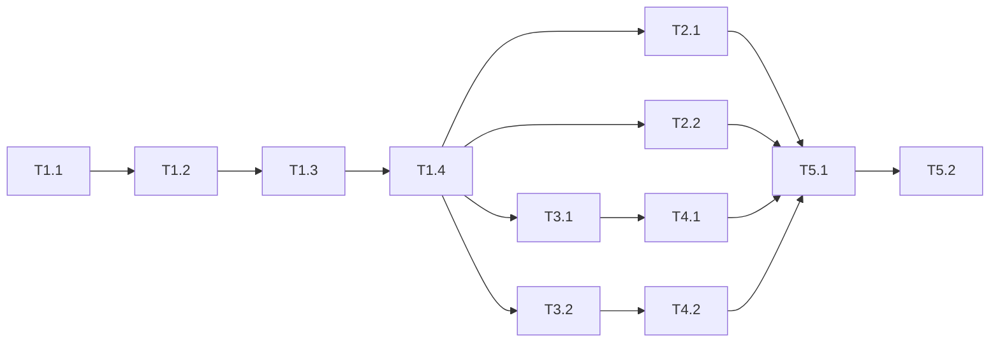

# Implementation Plan — Xử lý toàn diện kết quả source audit

## Metadata

| Trường | Giá trị |
|--------|---------|
| **Status** | Draft |
| **Risk Tier** | P1 |
| **Quality Score** | 8.0 |
| **SDD Reference** | `.devin/reports/SOURCE_AUDIT_2026_08_08.md` |

---

## 1. Context Analysis

### 1.1 Relevant Files

| File | Vai trò | Lý do liên quan |
|------|---------|-----------------|
| `.gitignore` | Cấu hình git | Chưa ignore `__pycache__` trong `.devin/scripts/`, `.worktrees/`, timestamp files |
| `.devin/telemetry/baseline.json` | Runtime telemetry | Đang tracked dù `.devin/telemetry/` đã ignore |
| `.devin/telemetry/drift_state.json` | Runtime telemetry | Chứa artifact test, đang tracked |
| `.devin/hook_hashes.json` | Hash baseline | `_generated` thay đổi mỗi lần chạy, gây nhiễu git diff |
| `.devin/scripts/hook_integrity.py` | Baseline generator | Cần tách `_generated` timestamp ra file riêng |
| `.devin/mcp_config.json` | MCP config | Chứa đường dẫn tuyệt đối Windows, không portable |
| `tests/test_plan_fsm.py` | Unit tests | Chưa đồng bộ với flow `BRAINSTORM` mới của plan FSM |
| `tests/test_plan_orchestrator.py` | Integration tests | Chưa đồng bộ với flow `BRAINSTORM` + `GAP_SCAN` + `PLAN_ENHANCE` mới |
| `.devin/scripts/plan_fsm/state_machine.py` | FSM core | Thiết kế đã có `BRAINSTORM`, tests cần cập nhật |

### 1.2 Key Findings

- Test suite chạy 2029 test, 15 fail tập trung ở `plan_fsm`.
- `plan_fsm` đã thêm `BRAINSTORM` giữa `CLASSIFY` và `ANALYZE`, và thêm `GAP_SCAN`/`PLAN_ENHANCE` giữa `PLAN` và `PLAN_APPROVAL`.
- Bài kiểm thử cũ vẫn mong luồng cũ `CLASSIFY -> ANALYZE` và `PLAN -> QC`.
- `.gitignore` có quy tắc `!.devin/scripts/**` ghi đè `__pycache__/`, làm 44 file `.pyc` rò rỉ.
- `.devin/telemetry/` ignore nhưng file vẫn tracked, gây diff nhiễu.
- `mcp_config.json` dùng đường dẫn tuyệt đối `C:\Users\thant\...`.

### 1.3 Existing Patterns

| Pattern | Vị trí | Có tái dùng? |
|---------|--------|--------------|
| `except Exception` rộng | Toàn bộ hooks/scripts | Không — cần thu hẹp dần |
| `json.loads` từ file | Hầu hết scripts | Có — giữ pattern nhưng thêm exception cụ thể |
| Safe/blocked zones | `path_zones.py` | Có — dùng cho schema_gate |

---

## 2. Implementation Phases

### 2.1 Phase 1: Dọn dẹp gitignore và runtime artifacts

| Khía cạnh | Mô tả |
|-----------|-------|
| **Goal** | Loại bỏ file sinh ra trong runtime khỏi git tracking/diff |
| **Dependencies** | Không |
| **Parallelizable** | Không với Phase 2, có thể chạy trước |

**Task table:**

| Task ID | Description | File Path | Function | Acceptance Criteria | REQ ID | Risk |
|---------|-------------|-----------|----------|---------------------|--------|------|
| T1.1 | Sửa `.gitignore` để ignore `__pycache__` trong `.devin/scripts/` | `.gitignore` | N/A | `git check-ignore .devin/scripts/__pycache__/x.pyc` trả về ignored | REQ-001 | Low |
| T1.2 | Thêm `.worktrees/` vào `.gitignore` | `.gitignore` | N/A | `.worktrees/` không còn xuất hiện untracked | REQ-001 | Low |
| T1.3 | `git rm --cached` telemetry files | `.devin/telemetry/baseline.json`, `drift_state.json` | N/A | Các file không còn `M` trong `git status` | REQ-001 | Low |
| T1.4 | Dọn artifact trong `drift_state.json` | `.devin/telemetry/drift_state.json` | N/A | File chỉ chứa cấu trúc hợp lệ, không còn chuỗi "A" dài | REQ-001 | Low |

### 2.2 Phase 2: Hook integrity và MCP config

| Khía cạnh | Mô tả |
|-----------|-------|
| **Goal** | Giảm nhiễu diff từ file cấu hình tự động sinh |
| **Dependencies** | Phase 1 (không conflict) |
| **Parallelizable** | Có thể chạy song song với Phase 3 |

**Task table:**

| Task ID | Description | File Path | Function | Acceptance Criteria | REQ ID | Risk |
|---------|-------------|-----------|----------|---------------------|--------|------|
| T2.1 | Tách `_generated` timestamp của `hook_hashes.json` ra file riêng | `.devin/scripts/hook_integrity.py` | `generate_baseline` | `hook_hashes.json` không chứa `_generated`; timestamp lưu tại `.devin/hook_hashes_generated.json` (untracked) | REQ-002 | Medium |
| T2.2 | Sửa `mcp_config.json` dùng đường dẫn tương đối hoặc env | `.devin/mcp_config.json` | N/A | File không còn chứa đường dẫn tuyệt đối Windows | REQ-003 | Low |

### 2.3 Phase 3: Cập nhật tests theo flow plan_fsm mới

| Khía cạnh | Mô tả |
|-----------|-------|
| **Goal** | Sửa 15 test fail để khớp với thiết kế `BRAINSTORM` + `GAP_SCAN` + `PLAN_ENHANCE` |
| **Dependencies** | Không (chỉ thay đổi tests) |
| **Parallelizable** | Có thể chạy song song với Phase 2 |

**Task table:**

| Task ID | Description | File Path | Function | Acceptance Criteria | REQ ID | Risk |
|---------|-------------|-----------|----------|---------------------|--------|------|
| T3.1 | Cập nhật `tests/test_plan_fsm.py` theo flow mới | `tests/test_plan_fsm.py` | Nhiều test | Tất cả test trong file pass; state `BRAINSTORM` được kiểm tra | REQ-004 | High |
| T3.2 | Cập nhật `tests/test_plan_orchestrator.py` theo flow mới | `tests/test_plan_orchestrator.py` | `_fast_forward_to_qc`, `_step`, nhiều test | Tất cả test trong file pass; bao gồm `GAP_SCAN` và `PLAN_ENHANCE` | REQ-004 | High |

### 2.4 Phase 4: Thu hẹp `except Exception`

| Khía cạnh | Mô tả |
|-----------|-------|
| **Goal** | Giảm ~205 chỗ bắt lỗi quá rộng trong các file quan trọng |
| **Dependencies** | Phase 3 (không làm hỏng tests) |
| **Parallelizable** | Không với Phase 3 |

**Task table:**

| Task ID | Description | File Path | Function | Acceptance Criteria | REQ ID | Risk |
|---------|-------------|-----------|----------|---------------------|--------|------|
| T4.1 | Thu hẹp `except Exception` trong hooks chính | `.devin/hooks/pre_tool_use.py`, `post_tool_use.py`, `schema_gate.py`, `coverage_enforce.py` | Các hàm try/except | Số lượng `except Exception` giảm; tests vẫn pass | REQ-005 | Medium |
| T4.2 | Thu hẹp `except Exception` trong scripts chính | `.devin/scripts/approval_gate.py`, `plan_quality_check.py`, `worktree.py` | Các hàm try/except | Số lượng `except Exception` giảm; tests vẫn pass | REQ-005 | Medium |

### 2.5 Phase 5: Xác nhận toàn bộ

| Khía cạnh | Mô tả |
|-----------|-------|
| **Goal** | Chạy lại full test suite và kiểm tra git status |
| **Dependencies** | Tất cả phase trước |
| **Parallelizable** | Không |

**Task table:**

| Task ID | Description | File Path | Function | Acceptance Criteria | REQ ID | Risk |
|---------|-------------|-----------|----------|---------------------|--------|------|
| T5.1 | Chạy `pytest` | N/A | N/A | ≥ 2029 test collected, pass ≥ 2028, coverage ≥ 80% | REQ-006 | High |
| T5.2 | Kiểm tra `git status` | N/A | N/A | Không còn `__pycache__`, `.worktrees/`, telemetry files modified | REQ-007 | Low |

---

## 3. Dependency Graph

---

## 4. Requirement Coverage Matrix

| REQ ID | Description | File Path | Function | Coverage Status |
|--------|-------------|-----------|----------|-----------------|
| REQ-001 | Gitignore sạch, không rò rỉ runtime artifacts | `.gitignore` | N/A | Covered |
| REQ-002 | Hook hash baseline ổn định, timestamp tách riêng | `.devin/scripts/hook_integrity.py` | `generate_baseline` | Covered |
| REQ-003 | MCP config portable | `.devin/mcp_config.json` | N/A | Covered |
| REQ-004 | Tests đồng bộ với plan_fsm mới | `tests/test_plan_fsm.py`, `tests/test_plan_orchestrator.py` | Nhiều | Covered |
| REQ-005 | Giảm except Exception rộng | `.devin/hooks/*.py`, `.devin/scripts/*.py` | Nhiều | Partial |
| REQ-006 | Test suite xanh | `pytest.ini` | N/A | Covered |
| REQ-007 | Git status sạch sau test | N/A | N/A | Covered |

---

## 5. Risk Assessment

| Risk | Tier | Mitigation | Rollback |
|------|------|------------|----------|
| Cập nhật tests sai flow có thể pass giả | P1 | So sánh với `state_machine.py` kỹ trước khi sửa; chạy từng test riêng | `git checkout tests/test_plan_fsm.py tests/test_plan_orchestrator.py` |
| `hook_integrity.py` thay đổi làm hỏng verify | P1 | Giữ file hash gốc, chỉ tách timestamp; test `hook_integrity` riêng | `git checkout .devin/hook_hashes.json .devin/scripts/hook_integrity.py` |
| `except Exception` thu hẹp gây lỗi nếu exception con bị bỏ sót | P2 | Chỉ thu hẹp các chỗ rõ ràng (JSON, OSError), không đổi logic nghiệp vụ | `git checkout .devin/hooks/<file>` |
| Xóa tracking telemetry làm mất baseline | P2 | Tạo backup `baseline.json.bak` trước khi `git rm --cached` (vẫn giữ file trên disk) | `git add .devin/telemetry/baseline.json` |

---

## 6. Test Strategy

### 6.1 Unit Tests

| Task ID | Test file | Cases | Coverage target | Gate |
|---------|-----------|-------|-----------------|------|
| T3.1 | `tests/test_plan_fsm.py` | 35+ | ≥ 90% | Tất cả pass |
| T3.2 | `tests/test_plan_orchestrator.py` | 8+ | ≥ 85% | Tất cả pass |
| T2.1 | `tests/test_targeted_coverage_boost.py`, `tests/test_coverage_boost.py` | hook_integrity | ≥ 80% | Tất cả pass |

### 6.2 Integration Tests

| Scenario | Test file | Services involved | Gate |
|----------|-----------|-------------------|------|
| Full plan orchestrator happy path | `tests/test_plan_orchestrator.py` | plan_fsm, storage, approval | PASS |
| Git status clean after test | Manual | git | No untracked pycache/worktrees |

### 6.3 End-to-End (E2E) Tests

| Scenario | Test file | Entry point | Expected outcome | Gate |
|----------|-----------|-------------|------------------|------|
| Full pytest suite | `pytest` | `pytest -q` | ≥ 2028 pass, coverage ≥ 80% | PASS |

---

## 7. Rollback Plan

| Bước | Trigger | Hành động | RTO | Người chịu trách nhiệm |
|------|---------|-----------|-----|------------------------|
| 1 | Test fail > 20 | `git checkout` các file tests và code tương ứng | 5 phút | Devin |
| 2 | `hook_integrity` verify fail | Khôi phục `hook_hashes.json` từ git | 2 phút | Devin |
| 3 | `git status` vẫn bẩn | Khôi phục `.gitignore` từ git | 1 phút | Devin |

---

## 8. Approval Checklist

| ID | Tiêu chí | Trạng thái | Ghi chú |
|----|----------|------------|---------|
| D1 | SDD đã được duyệt và tham chiếu đúng | ✗ | SDD là audit report, chưa qua approval gate |
| D2 | Mọi REQ ID có ít nhất 1 Task bao phủ | ✓ | 7/7 covered |
| D3 | Dependency graph không có chu trình (cycle) | ✓ | DAG hợp lệ |
| D4 | Mỗi Task có acceptance criteria rõ ràng | ✓ | Có criteria cụ thể |
| D5 | Risk assessment bao phủ mọi Task High risk | ✓ | 4 risk được đánh giá |
| D6 | Test strategy có unit + integration + E2E | ✓ | Có đủ 3 cấp |
| D7 | Rollback plan có RTO và người chịu trách nhiệm | ✓ | Có RTO và assignee |
| D8 | Không có thay đổi phá vỡ backward-compat chưa ghi rõ | ✓ | Chỉ cập nhật tests theo flow mới đã có sẵn |
| D9 | Không có thao tác phá hủy (drop/delete/force) không có guard | ✓ | Không có destructive op |
| D10 | Adversarial review findings từ SDD đã được mitigate | ✗ | Chưa chạy adversarial-consensus |

---

## 9. Approval Decision

| Trường | Giá trị |
|--------|---------|
| **Decision** | Draft — awaiting approval |
| **Reviewer** | human |
| **Date** | 2026-08-08 |
| **Conditions** | Approve để triển khai; hoặc yêu cầu bổ sung adversarial review |
| **Comments** | Plan tập trung sửa test fail, dọn gitignore, giảm nhiễu diff. Không thay đổi logic bảo mật. |
