# Implementation Plan: AHD Loop Harness Documentation

## Metadata

| Trường | Giá trị |
|--------|---------|
| **Status** | Approved with Conditions |
| **Risk Tier** | P2 |
| **Quality Score** | 8.5/10 |
| **SDD Reference** | `docs/plans/system-docs-vi-en/SOLUTION_DESIGN.md` |
| **Approval** | User phê duyệt trong hội thoại ngày 2026-08-25 |
| **Execution rule** | Mỗi task/phase phải chạy independent check và đạt trước task/phase kế tiếp |

## 1. Context Analysis

### 1.1 Relevant Files and Sources

| File/Directory | Vai trò | Lý do liên quan |
|----------------|---------|-----------------|
| `.devin/canon/` | Canon protocols | Nguồn nguyên tắc và triết lý |
| `.devin/skills/` | Workflow skills | Catalog workflow |
| `.devin/agents/` | Agent roles | Catalog role/lifecycle |
| `.devin/hooks/` | Runtime enforcement | Hook chain và security gates |
| `.devin/scripts/` | Runtime implementation | Flow, state, DAG, memory, verification |
| `HLK/` | Security layer | Sanitizer, vault, integrity, safe git |
| `.opencode/` | Provider wrapper | Hook bridge và wrapper mapping |
| `tools/` | Reusable utilities | Installation, health, backup, deploy, governance |
| `tests/` | Behavioral evidence | Test groups, pentest và coverage |
| `.github/` | CI/supply-chain | Build, SAST, CodeQL, SBOM |
| `specs/` | Formal model | TLA+ safety/liveness evidence |
| `docs/` | Existing docs | Reuse, link and avoid duplication |
| `docs/vi/` | New Vietnamese corpus | Planned output |
| `docs/en/` | New English corpus | Planned output |

### 1.2 Key Findings

- Workspace là Python/Node AI agent harness, không phải ứng dụng .NET/C#.
- `.devin/` là vùng lõi; `HLK/` là security layer và có quy định không sửa trực tiếp.
- Nhiều runtime directory chứa state generated, không được mô tả như source.
- Docs hiện có guides/protocol nhưng thiếu một corpus kiến trúc song ngữ có index và model đầy đủ.
- Có các điểm lệch cần ghi rõ: script HLK được tham chiếu nhưng thiếu, coverage threshold 20/80, pre-commit thực tế 5 gate, một số MCP không có local launcher.

### 1.3 Existing Patterns

| Pattern | Vị trí | Tái dùng |
|---------|--------|----------|
| Mermaid inline | `HLK/docs/`, existing plan docs | Có, chuẩn hóa trong docs mới |
| Fact/inference/unverified | `.devin/canon/VERIFICATION_PROTOCOL.md` | Có, áp dụng cho roadmap/claims |
| Mirror/lazy loading | `AGENTS.md`, `.opencode/` | Có, dùng cho VI/EN navigation |
| Phase/gate | `.devin/skills/full-power/SKILL.md` | Có, mỗi phase có check |

## 2. Implementation Phases

### 2.1 Phase 0: Bootstrap, skeleton and standards

| Khía cạnh | Mô tả |
|-----------|-------|
| **Goal** | Tạo manifest, index, chuẩn tài liệu và skeleton hai cây. |
| **Dependencies** | SDD/plan đã duyệt |
| **Parallelizable** | Không; bootstrap trước các phase khác |

| Task ID | Description | File Path | Function | Acceptance Criteria | REQ ID | Risk |
|---------|-------------|-----------|----------|---------------------|--------|------|
| T0.1 | Tạo index và reading guide song ngữ. | `docs/vi/00-index.md`; `docs/en/00-index.md` | Navigation | Test phải pass 1 manifest: link tới toàn bộ nhóm planned và hai file tồn tại. | REQ-001, REQ-008 | Med |
| T0.2 | Tạo documentation contract và diagram conventions. | `docs/vi/00-documentation-contract.md`; `docs/en/00-documentation-contract.md` | Contract | Test phải pass 1 checklist: section bắt buộc, evidence, Mermaid, parity và phase gate đều được nêu. | REQ-004, REQ-008, REQ-009 | Low |
| T0.3 | Tạo component coverage manifest. | `docs/vi/00-component-coverage.md`; `docs/en/00-component-coverage.md` | Coverage matrix | Test phải pass 1 matrix: mọi nhóm source/config/runtime được liệt kê và known gaps được ghi. | REQ-001, REQ-002 | Med |
| T0.4 | Kiểm tra độc lập Phase 0. | `docs/plans/system-docs-vi-en/EXECUTION_REPORT.md` | Phase gate | Test phải pass 6 gate: link, heading, parity, fence, governance và Git tracking; finding phải có remediation. | REQ-009 | Med |

### 2.2 Phase 1: System overview and principles

| Khía cạnh | Mô tả |
|-----------|-------|
| **Goal** | Mô tả trực quan hệ thống, chức năng, nguyên tắc và triết lý. |
| **Dependencies** | Phase 0 PASS |
| **Parallelizable** | Có, các file system-level độc lập |

| Task ID | Description | File Path | Function | Acceptance Criteria | REQ ID | Risk |
|---------|-------------|-----------|----------|---------------------|--------|------|
| T1.1 | Tổng quan và cây thư mục chú giải. | `docs/vi/01-tong-quan-he-thong.md`; `docs/en/01-system-overview.md` | System map | Test phải pass 1 tree audit: tree, boundaries, source/runtime/security legend và evidence đều có. | REQ-001 | High |
| T1.2 | Catalog component toàn workspace. | `docs/vi/02-catalog-thanh-phan.md`; `docs/en/02-component-catalog.md` | Component matrix | Test phải pass 1 component matrix: mọi nhóm và số lượng/role được mapping. | REQ-002 | High |
| T1.3 | Catalog chức năng. | `docs/vi/03-chuc-nang-he-thong.md`; `docs/en/03-system-functions.md` | Function matrix | Test phải pass 1 function matrix: function, component, input/output và verification đều có. | REQ-002 | High |
| T1.4 | Nguyên tắc hoạt động. | `docs/vi/04-nguyen-tac-hoat-dong.md`; `docs/en/04-operating-principles.md` | Operating model | Test phải pass 1 walkthrough: end-to-end flow và subsystem rules đều được giải thích. | REQ-003 | High |
| T1.5 | Triết lý thiết kế. | `docs/vi/05-triet-ly-thiet-ke.md`; `docs/en/05-design-philosophy.md` | Design rationale | Test phải pass 1 decision table: trade-offs, rejected alternatives và source canon đều có. | REQ-003 | Med |
| T1.6 | Kiểm tra độc lập Phase 1. | `docs/plans/system-docs-vi-en/EXECUTION_REPORT.md` | Phase gate | Test phải pass 3 gate: source cross-check, link/parity và Mermaid; finding phải có remediation. | REQ-009, REQ-010 | High |

### 2.3 Phase 2: Models and flows

| Khía cạnh | Mô tả |
|-----------|-------|
| **Goal** | Mô hình hóa hệ thống và các flow bắt buộc, có active lifetime. |
| **Dependencies** | Phase 1 PASS |
| **Parallelizable** | Có, mỗi loại model là write set riêng |

| Task ID | Description | File Path | Function | Acceptance Criteria | REQ ID | Risk |
|---------|-------------|-----------|----------|---------------------|--------|------|
| T2.1 | Mô hình hệ thống context/container/component. | `docs/vi/06-mo-hinh-he-thong.md`; `docs/en/06-system-models.md` | C4-style models | Test phải pass 1 model review: boundary, legend, dependency và walkthrough đều có. | REQ-004 | High |
| T2.2 | Flow logic control chính. | `docs/vi/07-flow-logic.md`; `docs/en/07-logic-flow.md` | Control flow | Test phải pass 1 flow trace: plan, approve, execute, verify, memory và error paths đều nối được. | REQ-004 | High |
| T2.3 | Activity diagrams. | `docs/vi/08-activity-diagrams.md`; `docs/en/08-activity-diagrams.md` | Activities | Test phải pass 6 activity cases: BOOT, planning, approval, DAG, verification và incident đều có. | REQ-004 | High |
| T2.4 | Data flow. | `docs/vi/09-data-flow.md`; `docs/en/09-data-flow.md` | Data movement | Test phải pass 1 data inventory: state, JSONL, telemetry, blackboard, artifact và trust boundaries đều có. | REQ-004 | High |
| T2.5 | Status/stage flows. | `docs/vi/10-state-stage-flows.md`; `docs/en/10-state-stage-flows.md` | State machines | Test phải pass 4 state models: FSM 17 states, DAG, session và approval/loop transitions đều có. | REQ-004 | High |
| T2.6 | Sequence diagrams và active lifetime. | `docs/vi/11-sequence-diagrams.md`; `docs/en/11-sequence-diagrams.md` | Interaction sequences | Test phải pass 1 lifetime audit: activation/deactivation cho orchestrator, agents, hooks, state stores và HLK đều có. | REQ-004 | High |
| T2.7 | Kiểm tra độc lập Phase 2. | `docs/plans/system-docs-vi-en/EXECUTION_REPORT.md` | Phase gate | Test phải pass 4 gate: fence, link, render smoke và source cross-check; finding phải có remediation. | REQ-009, REQ-010 | High |

### 2.4 Phase 3: Grouped references

| Khía cạnh | Mô tả |
|-----------|-------|
| **Goal** | Reference theo nhóm, mọi component có section riêng. |
| **Dependencies** | Phase 2 PASS |
| **Parallelizable** | Có theo từng nhóm, không sửa index chung ngoài phase integration |

| Task ID | Description | File Path | Function | Acceptance Criteria | REQ ID | Risk |
|---------|-------------|-----------|----------|---------------------|--------|------|
| T3.1 | Reference canon, skills, agents, hooks. | `docs/vi/reference/`; `docs/en/reference/` | Grouped reference | Test phải pass 1 component matrix: mỗi component có purpose, interface, lifecycle, failure và source path. | REQ-005 | High |
| T3.2 | Reference plan, execution, state, verification và context scripts. | `docs/vi/reference/`; `docs/en/reference/` | Script reference | Test phải pass 1 script map: script/package, CLI/API, state/data và tests đều được mapping. | REQ-005 | High |
| T3.3 | Reference update, supply-chain, runtime packages. | `docs/vi/reference/`; `docs/en/reference/` | Platform reference | Test phải pass 1 safe workflow: dependency, rollback, security boundary và command path đều có. | REQ-005 | High |
| T3.4 | Reference HLK, tools, root/config/CI/specs/SBOM. | `docs/vi/reference/`; `docs/en/reference/` | Deployment reference | Test phải pass 1 deployment audit: HLK chỉ read/reference, command được đối chiếu và known gaps ghi rõ. | REQ-001, REQ-005, REQ-006 | High |
| T3.5 | Reference OpenCode, MCP, tests và runtime state. | `docs/vi/reference/`; `docs/en/reference/` | Integration reference | Test phải pass 1 integration matrix: wrapper, server, test và runtime state được mapping đầy đủ. | REQ-005 | High |
| T3.6 | Kiểm tra độc lập Phase 3. | `docs/plans/system-docs-vi-en/EXECUTION_REPORT.md` | Phase gate | Test phải pass 4 gate: component matrix, source paths, parity và diagrams; finding phải có remediation. | REQ-009, REQ-010 | High |

### 2.5 Phase 4: Core component deep references

| Khía cạnh | Mô tả |
|-----------|-------|
| **Goal** | Trang chuyên sâu cho 15 core components. |
| **Dependencies** | Phase 3 PASS |
| **Parallelizable** | Có, mỗi core page là write set riêng |

| Task ID | Description | File Path | Function | Acceptance Criteria | REQ ID | Risk |
|---------|-------------|-----------|----------|---------------------|--------|------|
| T4.1 | Viết core pages cho planning/approval/execute. | `docs/vi/core/`; `docs/en/core/` | Deep reference | Test phải pass 1 core checklist: source, contracts, state, sequence, failure và verification đều có. | REQ-005 | High |
| T4.2 | Viết core pages cho hooks/enforcement/security. | `docs/vi/core/`; `docs/en/core/` | Deep reference | Test phải pass 1 security checklist: hook lifetime, fail-closed/open, secret boundary và gates đều có. | REQ-005 | High |
| T4.3 | Viết core pages cho state/memory/session/event/checkpoint/boot. | `docs/vi/core/`; `docs/en/core/` | Deep reference | Test phải pass 1 lifecycle checklist: persistence, recovery, idempotency và diagrams đều có. | REQ-005 | High |
| T4.4 | Kiểm tra độc lập Phase 4. | `docs/plans/system-docs-vi-en/EXECUTION_REPORT.md` | Phase gate | Test phải pass 2 gate: fresh-context readback và source verification; finding phải có remediation. | REQ-009, REQ-010 | High |

### 2.6 Phase 5: Operations and roadmap research

| Khía cạnh | Mô tả |
|-----------|-------|
| **Goal** | Cung cấp toàn bộ ops docs và roadmap có evidence nội bộ/online. |
| **Dependencies** | Phase 4 PASS |
| **Parallelizable** | Ops docs có thể song song; roadmap research trước khi viết final |

| Task ID | Description | File Path | Function | Acceptance Criteria | REQ ID | Risk |
|---------|-------------|-----------|----------|---------------------|--------|------|
| T5.1 | Installation, usage, operations guide. | `docs/vi/ops/`; `docs/en/ops/` | Operator guides | Test phải pass 1 operator checklist: prerequisite, command, success/failure output và rollback đều có. | REQ-006 | High |
| T5.2 | Playbook và runbook. | `docs/vi/ops/`; `docs/en/ops/` | Procedures | Test phải pass 1 procedure checklist: trigger, precondition, steps, evidence, escalation và stop condition đều có. | REQ-006 | High |
| T5.3 | Log guide và incident response. | `docs/vi/ops/`; `docs/en/ops/` | Incident operations | Test phải pass 1 incident checklist: field map, query examples, diagnosis tree, containment và recovery đều có. | REQ-006 | High |
| T5.4 | Best practices. | `docs/vi/ops/`; `docs/en/ops/` | Operational policy | Test phải pass 1 policy checklist: security, token, git, state và verification practices đều có. | REQ-006 | Med |
| T5.5 | Research online + redteam roadmap. | `docs/vi/12-roadmap.md`; `docs/en/12-roadmap.md` | Roadmap | Test phải pass 1 research matrix: source register, claim labels, dependency graph, priorities và acceptance criteria đều có. | REQ-007 | High |
| T5.6 | Kiểm tra độc lập Phase 5. | `docs/plans/system-docs-vi-en/EXECUTION_REPORT.md` | Phase gate | Test phải pass 4 gate: command/source, research citations, parity và incident paths; finding phải có remediation. | REQ-009, REQ-010 | High |

### 2.7 Phase 6: Final QA and closeout

| Khía cạnh | Mô tả |
|-----------|-------|
| **Goal** | Kiểm tra toàn corpus và hoàn tất báo cáo. |
| **Dependencies** | Phase 0–5 PASS |
| **Parallelizable** | Các QA scan độc lập; final integration tuần tự |

| Task ID | Description | File Path | Function | Acceptance Criteria | REQ ID | Risk |
|---------|-------------|-----------|----------|---------------------|--------|------|
| T6.1 | Kiểm tra filename/mirror/heading parity. | `docs/vi/`; `docs/en/` | Bilingual QA | Test phải pass 1 parity scan: không thiếu cặp và không lệch section bắt buộc. | REQ-008 | High |
| T6.2 | Kiểm tra link, code fence, Mermaid và path references. | `docs/vi/`; `docs/en/` | Structural QA | Test phải pass 3 scans: không link chết, fence cân bằng và diagram checklist đạt. | REQ-004, REQ-010 | High |
| T6.3 | Kiểm tra claim/evidence và redteam corpus. | `docs/vi/`; `docs/en/` | Semantic QA | Test phải pass 1 evidence scan: claim external có nguồn và known issue không bị ghi sai thành fact. | REQ-007, REQ-010 | High |
| T6.4 | Governance, slop và final report. | `docs/plans/system-docs-vi-en/EXECUTION_REPORT.md` | Closeout | Test phải pass 1 closeout: governance sạch, report có files, checks, residual risks và coverage. | REQ-009 | High |

## 3. Dependency Graph

```mermaid
flowchart LR
    T0[T0 Bootstrap] --> G0{Check 0}
    G0 --> T1[T1 Overview]
    T1 --> G1{Check 1}
    G1 --> T2[T2 Models and flows]
    T2 --> G2{Check 2}
    G2 --> T3[T3 Grouped references]
    T3 --> G3{Check 3}
    G3 --> T4[T4 Core references]
    T4 --> G4{Check 4}
    G4 --> T5[T5 Ops and roadmap]
    T5 --> G5{Check 5}
    G5 --> T6[T6 Final QA]
    G0 -. fail .-> T0
    G1 -. fail .-> T1
    G2 -. fail .-> T2
    G3 -. fail .-> T3
    G4 -. fail .-> T4
    G5 -. fail .-> T5
```

## 4. Requirement Coverage Matrix

| REQ ID | Covered by | Status |
|--------|------------|--------|
| REQ-001 | T0.3, T1.1, T1.2, T3.4 | Covered |
| REQ-002 | T0.3, T1.2, T1.3, T3.1–T3.5 | Covered |
| REQ-003 | T1.4, T1.5, T3.1–T3.5, T4.1–T4.3 | Covered |
| REQ-004 | T0.2, T2.1–T2.6, T6.2 | Covered |
| REQ-005 | T3.1–T3.5, T4.1–T4.3 | Covered |
| REQ-006 | T3.4, T5.1–T5.4 | Covered |
| REQ-007 | T5.5, T6.3 | Covered |
| REQ-008 | T0.1, T0.2, all paired tasks, T6.1 | Covered |
| REQ-009 | T0.4, T1.6, T2.7, T3.6, T4.4, T5.6, T6.4 | Covered |
| REQ-010 | T0.3, all phase gates, T6.2–T6.3 | Covered |

## 5. Test-Requirement Mapping

| REQ ID | Test case | Evidence |
|--------|------------|----------|
| REQ-001 | `test_tree_catalog` | Tree audit đối chiếu `git ls-files` và component manifest |
| REQ-002 | `test_component_function_matrix` | Catalog và grouped reference có mapping component/function |
| REQ-003 | `test_principles_and_rationale` | Source/canon cross-check và independent readback |
| REQ-004 | `test_diagram_coverage` | Mermaid fence, diagram inventory và lifetime checklist |
| REQ-005 | `test_reference_coverage` | Component-to-document matrix cho reference/core pages |
| REQ-006 | `test_operator_guides` | Command/path review, procedure checklist và rollback review |
| REQ-007 | `test_roadmap_evidence` | Source register, URL check, claim grading và redteam review |
| REQ-008 | `test_bilingual_mirror` | Filename, heading và section parity scan |
| REQ-009 | `test_phase_gates` | Execution report có check sau mỗi phase/task group |
| REQ-010 | `test_source_claims` | Read-back source paths, link scan và unverified claim scan |

## 6. Risk & Mitigation

| Risk | Tier | Mitigation | Rollback |
|------|------|------------|----------|
| High-risk documentation task hoặc source drift | P0 | Test phải pass source cross-check và evidence scan trước khi gate; dừng khi claim không xác minh được. | Xóa/chỉ sửa corpus của phase hiện tại, khôi phục từ git diff trước phase và chạy lại gate. |
| Medium-risk parity/link/diagram failure | P1 | Test phải pass parity, link và Mermaid scans; ghi finding theo file:line. | Revert các file docs mới của phase hiện tại, giữ plan/report và chạy lại phase. |
| Low-risk formatting or navigation issue | P2 | Test phải pass heading/fence scan và sửa tại chỗ trước khi tiếp tục. | Sửa hoặc loại bỏ file lỗi khỏi phase, không ảnh hưởng source/config. |

## 7. Phase Gate Contract

Mỗi phase chỉ được chuyển trạng thái khi execution report ghi đủ: file đã tạo, source paths đã đối chiếu, số diagram, parity result, link/fence result, governance result, findings và remediation. `FAIL` hoặc `UNVERIFIABLE` giữ phase hiện tại; không được coi là hoàn thành dựa trên lời mô tả.

## 8. Planned Output Paths

The following directory scopes are authorized by this plan:

- `docs/vi/`
- `docs/en/`
- `docs/plans/system-docs-vi-en/`
- `.gitignore` (chỉ thêm exception để Git track `docs/vi/` và `docs/en/`)

The phase builders must not modify `.devin/`, `HLK/`, source code, tests or existing docs outside the plan directory. The integrator may modify only the two corpus exceptions in `.gitignore` so the approved output is trackable. Existing docs may be read and linked.

## 9. Verification Strategy

### Sau mỗi đầu mục

1. Read-back every changed file.
2. Verify the expected heading and diagram checklist.
3. Check internal links and code-fence balance.
4. Compare the VI/EN pair for structural parity.
5. Re-open the relevant source/config paths for factual claims.
6. Run governance layout check when new files are added.
7. Record result and unresolved finding before continuing.

### Cuối mỗi phase

- Fresh-context structural review.
- `python tools/check_governance.py --layout-only`.
- Bilingual manifest comparison.
- Mermaid/link smoke scan.
- Factual source spot-check.
- Update `EXECUTION_REPORT.md`.

## 10. Rollback Plan

| Trigger | Hành động |
|---------|-----------|
| Link/diagram/parity failure | Chỉ sửa các file docs của phase hiện tại, chạy lại phase gate |
| Source claim không xác minh được | Gắn `[unverified-guess]` hoặc loại bỏ claim; không tiếp tục qua gate |
| Governance error | Dừng, chuyển file về `docs/vi`, `docs/en` hoặc plan dir hợp lệ |
| Scope drift | Giữ lại finding, không mở rộng plan khi chưa có approval mới |
| Research source không truy cập được | Ghi `UNVERIFIABLE`, thay nguồn hoặc đánh dấu roadmap item là hypothesis |

## 11. Approval Checklist

| ID | Tiêu chí | Trạng thái |
|----|----------|------------|
| D1 | SDD được duyệt và tham chiếu đúng | [✓] |
| D2 | Mọi REQ có task bao phủ | [✓] |
| D3 | Dependency graph không có cycle | [✓] |
| D4 | Mỗi task có acceptance criteria | [✓] |
| D5 | High-risk tasks có mitigation | [✓] |
| D6 | Có structural, semantic và source verification | [✓] |
| D7 | Có rollback/stop condition | [✓] |
| D8 | Không sửa HLK/canon/source ngoài scope | [✓] |
| D9 | Không có destructive operation | [✓] |
| D10 | User yêu cầu kiểm tra sau từng mục đã được đưa thành REQ-009/gate | [✓] |

## 12. Approval Decision

| Trường | Giá trị |
|--------|---------|
| **Decision** | Approved with Conditions |
| **Reviewer** | User |
| **Date** | 2026-08-25 |
| **Conditions** | Duyệt/kiểm tra từng phase; không tiếp tục sau gate FAIL; không triển khai phần C# marketing. |
| **Comments** | Roadmap vẫn phải có research online và redteam; mọi claim phải gắn evidence. |

## Changelog

| Phiên bản | Ngày | Thay đổi | Tác giả |
|-----------|------|----------|--------|
| v1.0 | 2026-08-25 | Chuyển kế hoạch hội thoại thành plan artifact để triển khai. | OpenCode |
