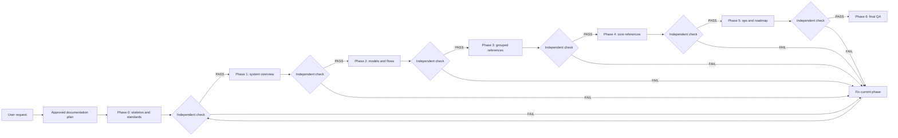

# Solution Design Document: AHD Loop Harness Documentation

## Metadata

| Trường | Giá trị |
|--------|---------|
| **Status** | Approved with Conditions |
| **Risk Tier** | P2 |
| **Execution Autonomy** | Supervised |
| **Generated By** | OpenCode, dựa trên khảo sát workspace ngày 2026-08-25 |
| **Date** | 2026-08-25 |
| **Quality Score** | 8.5/10 |
| **Approval** | User đã phê duyệt kế hoạch trong hội thoại; mỗi phase phải kiểm tra trước khi chuyển tiếp |

## §1. Executive Summary

### Mục tiêu

Tạo bộ tài liệu kỹ thuật song ngữ Việt-Anh cho toàn bộ AHD Loop Harness. Tài liệu phải mô tả được cấu trúc workspace, chức năng, nguyên tắc vận hành, triết lý thiết kế, mô hình và các luồng logic, đồng thời cung cấp reference, installation guide, user guide, operations guide, playbook, runbook, log guide, incident response và roadmap.

Phạm vi tài liệu được tổ chức theo nhóm để tránh hàng trăm trang trùng lặp. Mọi thành phần có trong cây workspace phải xuất hiện trong catalog hoặc reference theo nhóm; khoảng 15 thành phần quan trọng có trang chuyên sâu riêng.

### Ngoài phạm vi

- Không viết marketing riêng cho lập trình viên .NET/C# theo lựa chọn của user.
- Không sửa source code, test, hook, canon, HLK security layer hoặc cấu hình runtime để phục vụ việc viết tài liệu.
- Không tuyên bố một chức năng tồn tại nếu chưa đối chiếu file source/config tương ứng.
- Không tạo sơ đồ nhị phân, file generated hoặc scratch file trong repo.

### Ràng buộc

- Tài liệu mới đặt dưới `docs/vi/` và `docs/en/`.
- Hai cây phải đối xứng theo tên và nội dung.
- Sơ đồ dùng Mermaid inline, được kiểm tra cân bằng code fence, tham chiếu và tính hợp lệ cơ bản.
- Sau mỗi đầu mục/phase phải chạy kiểm tra độc lập; bằng chứng phải ghi trong execution report.
- Mọi claim roadmap hoặc xu hướng bên ngoài phải có nguồn online và nhãn fact/inference phù hợp.

## §2. Requirements Mapping

| REQ ID | Description | Source | Priority | Verification |
|--------|-------------|--------|----------|--------------|
| REQ-001 | Quét và mô tả toàn bộ cây workspace, phân biệt source/config/runtime state/security layer. | User request + khảo sát workspace | Must | Đối chiếu `git ls-files`, catalog và tree annotated |
| REQ-002 | Mô tả trực quan toàn bộ component và chức năng hệ thống. | User request | Must | Catalog bao phủ tất cả nhóm và reference có component matrix |
| REQ-003 | Diễn giải nguyên tắc hoạt động và triết lý thiết kế của hệ thống và từng subsystem. | User request + canon | Must | Review chéo với source và canon |
| REQ-004 | Cung cấp model, flow logic, activity, data flow, status/stage và sequence diagram đầy đủ lifetime. | User request | Must | Mermaid fence/link check + checklist diagram coverage |
| REQ-005 | Cung cấp reference theo nhóm và trang chuyên sâu cho core components. | User lựa chọn granular theo nhóm + lõi riêng | Must | Component-to-document matrix |
| REQ-006 | Cung cấp installation, usage, operations, logs, incident response, playbook, runbook và best practices. | User request | Must | Dry-run command review + ops checklist |
| REQ-007 | Cung cấp roadmap và thứ tự nâng cấp dựa trên phân tích nội bộ, redteam và research online. | User request | Must | Source register + claim grading + adversarial review |
| REQ-008 | Mỗi tài liệu có bản tiếng Việt và tiếng Anh trong cây mirror. | User decision | Must | Filename parity + heading/section parity |
| REQ-009 | Kiểm tra độc lập ngay sau từng đầu mục trước khi triển khai đầu mục kế tiếp. | User instruction | Must | Phase checklist, sensor output và execution report |
| REQ-010 | Không đưa vào tài liệu các lệnh, component, API hoặc đường dẫn chưa được xác minh. | Verification Protocol | Must | Source evidence table + fable-judge pass |

## §3. Architecture Overview



### Các lớp nguồn

| Lớp | Nguồn chính | Cách dùng trong tài liệu |
|-----|-------------|---------------------------|
| Canon | `.devin/canon/` | Nguyên tắc, protocol, decision rationale |
| Runtime implementation | `.devin/hooks/`, `.devin/scripts/` | Function, input/output, lifecycle, failure modes |
| Provider wrapper | `.opencode/` | Mapping wrapper và hook bridge |
| Security | `HLK/` | Sanitizer, vault, integrity, safe git; chỉ đọc, không sửa |
| Tooling | `tools/`, root scripts, CI | Cài đặt, vận hành, kiểm tra và rollback |
| Evidence | `tests/`, `specs/`, `sbom/` | Behavior, formal properties, coverage và supply-chain |
| Existing docs | `docs/`, `HLK/docs/` | Tái sử dụng, liên kết, đánh dấu nội dung lịch sử |

## §4. Documentation Design

### 4.1 Cấu trúc mirror

```text
docs/vi/<document>.md  <->  docs/en/<document>.md
```

Mỗi cặp tài liệu giữ cùng mã số, tên logic tương ứng, heading chính, bảng, sơ đồ và liên kết. Bản Việt là bản diễn giải chính; bản Anh là bản tương đương về thông tin, không dịch máy từng chữ nếu làm mất nghĩa kỹ thuật.

### 4.2 Template nội dung

Mỗi tài liệu reference tối thiểu có: mục đích, vị trí, phạm vi, thành phần con, interfaces, dependencies, state/lifetime, flow, data contract, failure modes, security, vận hành, verification evidence và liên kết chéo.

Mỗi tài liệu model tối thiểu có: scope, legend, assumptions, diagram, walkthrough từng bước, boundary, failure path và source references.

### 4.3 Diagram standard

- `flowchart LR/TD`: kiến trúc, control flow, dependency.
- `sequenceDiagram`: interaction; dùng `activate`/`deactivate` để biểu diễn active lifetime.
- `stateDiagram-v2`: status/stage và transition guard.
- `erDiagram`: JSON/state/event contracts khi quan hệ đủ ổn định.
- Mỗi sơ đồ có caption và đoạn giải thích sau sơ đồ.

## §5. Component Boundaries

### Nhóm reference

1. Canon protocols.
2. Skills.
3. Agents.
4. Hooks và hook support modules.
5. Plan/orchestration scripts.
6. Execution/DAG/swarm scripts.
7. State/session/memory scripts.
8. Verification/quality/redteam scripts.
9. Context engineering scripts.
10. Update/supply-chain scripts.
11. Runtime packages.
12. HLK security layer.
13. Tools.
14. Root entries/configs/CI/specs/SBOM.
15. OpenCode wrapper và MCP.
16. Tests và runtime-state map.

### Core pages

`plan-orchestrator`, `approval-gate`, `dag-executor`, `swarm-director-judge`, `schema-gate`, `pre-tool-use`, `post-tool-use`, `plan-enforce`, `loop-memory-sync`, `state-router`, `hlk-security-core`, `session-manager`, `event-bus-blackboard`, `checkpoint-system`, `boot-chain`.

## §6. Research and Roadmap Policy

- Trước khi viết roadmap, đọc source nội bộ: `UPGRADE_PLAN.md`, `UPGRADE_TRACKER*`, proposal, redteam report và CI/security docs.
- Research online theo các chủ đề: agent harness orchestration, context engineering, verification, secure tool execution, OpenTelemetry, event sourcing và supply-chain security.
- Mỗi nguồn lưu URL, ngày truy cập, claim được hỗ trợ và giới hạn áp dụng.
- Không biến xu hướng bên ngoài thành cam kết sản phẩm nếu chưa có acceptance criteria nội bộ.
- Roadmap ưu tiên theo impact, risk, dependency, effort, reversibility và evidence quality.

## §7. Risks and Mitigations

| Risk | Severity | Mitigation |
|------|----------|------------|
| Tài liệu lệch source do runtime thay đổi trong lúc viết | High | Ghi snapshot date, source path, chạy source check sau mỗi phase |
| Hai ngôn ngữ không tương đương | High | Mirror manifest, heading parity, checklist song ngữ |
| Mermaid có thể render lỗi | Medium | Fence balance, syntax smoke check, spot-check bằng Mermaid renderer nếu có |
| Overclaim chức năng hoặc roadmap | High | Fact/inference labels, source register, claim-grader, redteam |
| Tài liệu trùng với docs cũ hoặc mâu thuẫn HLK | Medium | Link/reuse existing docs, đánh dấu historical context, không sửa HLK |
| Scope phình vượt plan | High | Chỉ ghi trong các thư mục đã khai báo, dừng phase khi drift |
| Khối lượng lớn khiến review hời hợt | High | Chia phase, kiểm tra độc lập sau từng đầu mục, ưu tiên evidence |

## §8. Adversarial Review Findings

| Persona | Finding | Severity | Mitigation | Status |
|---------|---------|----------|------------|--------|
| New Hire | Người đọc mới có thể nhầm runtime state là source code. | Medium | Runtime-state map và legend bắt buộc trong overview. | Mitigated by plan |
| Security Auditor | Sơ đồ có thể vô tình làm lộ secret path hoặc giá trị nhạy cảm. | High | Chỉ mô tả key/path contract, scan secret trước mỗi phase. | Mitigated by plan |
| Code Reviewer | Tài liệu quảng cáo quá mức có thể biến inference thành fact. | Medium | Claim grading và source evidence table. | Mitigated by plan |
| Architect | Roadmap dễ trở thành danh sách mong muốn không có dependency. | Medium | Dependency graph, priority/risk/acceptance criteria. | Mitigated by plan |
| Saboteur | Một file index hỏng link có thể làm mất khả năng điều hướng toàn bộ corpus. | Medium | Link checker và mirror parity trong mỗi phase. | Mitigated by plan |

## §9. Acceptance

Kết quả được coi là hoàn thành khi:

1. Tất cả tài liệu trong plan tồn tại ở cả `docs/vi/` và `docs/en/`.
2. Catalog có mapping cho toàn bộ nhóm source/config/runtime đã quét.
3. Có đủ sáu nhóm model/flow theo yêu cầu.
4. Có 15 core pages và 16 nhóm reference.
5. Có đủ ops/playbook/runbook/log/incident/best-practice và roadmap có nguồn.
6. Kiểm tra sau từng phase có bằng chứng PASS hoặc finding đã xử lý.
7. `python tools/check_governance.py --layout-only` không có lỗi layout/junk mới.
8. QA cuối xác nhận link, code fence, parity VI/EN và không có claim chưa gắn evidence.
