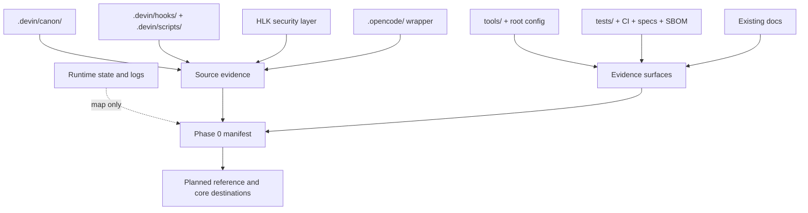

# AHD Loop Harness — Component coverage manifest

| Trường | Giá trị |
|---|---|
| Snapshot date | `2026-08-25` |
| Phạm vi | Inventory cấp nhóm cho Phase 0 |
| Evidence boundary | Source thật đã đọc ở workspace; runtime state chỉ được map, không được coi là source |
| Trạng thái | Manifest cấp nhóm đã ghi; independent gate Phase 0 PASS |
| Mirror | `docs/vi/` ↔ `docs/en/` |

C-coverage-01: [fact] Manifest này dựa trên `.devin/canon/BOOT_PROTOCOL.md`, `.devin/rules/WORKSPACE_GOVERNANCE.md` và directory listing/file reads tại snapshot `2026-08-25`. Nó ghi path/component group đã quan sát, không suy ra behavior từ tên thư mục. Không ghi số lượng file, test hoặc package khi chưa có phép đếm evidence riêng.

## 1. Cách đọc manifest

### 1.1 Phân loại evidence

| Nhãn | Ý nghĩa trong manifest |
|---|---|
| `source` | File/module dùng để đọc implementation, contract hoặc policy. |
| `runtime state` | State, log, checkpoint, cache hoặc artifact do runtime sinh; chỉ map lifecycle/data shape. |
| `security` | HLK security layer hoặc boundary bảo vệ; chỉ đọc trong task này. |
| `wrapper/config` | Provider bridge, launcher hoặc config kết nối các layer. |
| `evidence` | Test, CI, formal spec, SBOM hoặc utility kiểm tra. |
| `existing docs` | Tài liệu đã có; dùng làm context/đường dẫn đối chiếu, không tự động là fact mới. |

Các path trong bảng là repository-relative và giữ nguyên tên English. Cột `Phase 0 coverage` nói manifest đã làm gì; không phải tuyên bố deep reference đã hoàn thành.

## 2. Ranh giới source, runtime và security

**Hình 1 — Boundary của component coverage.** Source và evidence đi vào manifest; runtime state chỉ được map, sau đó các phase sau mới viết reference/core dựa trên source đã cross-check.

## 3. Inventory component group

| Component group | Path/file đã quan sát `[fact]` | Loại | Coverage status Phase 0 | Planned reference destination |
|---|---|---|---|---|
| Canon protocols | `.devin/canon/CORE_CANON.md`, `.devin/canon/BOOT_PROTOCOL.md`, `.devin/canon/REDLINES.md`, `.devin/canon/VERIFICATION_PROTOCOL.md`, `.devin/canon/MEMORY_PROTOCOL.md`, `.devin/canon/LOOP_PROTOCOL.md`, `.devin/canon/CAVEMAN_PROTOCOL.md`, `.devin/canon/HARNESS_ENGINEERING.md`, `.devin/canon/JUDGMENT_RUBRICS.md`, `.devin/canon/HANDOFF_LETTER.md`, `.devin/canon/DAEMON_PROTOCOL.md`, `.devin/canon/LOOP_GOAL_BASED.md`, `.devin/canon/LOOP_PROACTIVE.md`, `.devin/canon/LOOP_TIME_BASED.md`, `.devin/canon/LOOP_TURN_BASED.md` | source | Đã nhận diện nhóm canonical rules; chưa viết grouped reference | `docs/vi/reference/<canon-protocols>.md` và `docs/en/reference/<canon-protocols>.md` |
| Skills | `.devin/skills/`, `.devin/skills/full-power/`, `.devin/skills/plan/`, `.devin/skills/lightning/`, `.devin/skills/glm/`, `.devin/skills/kimi/`, `.devin/skills/adversarial-consensus/`, `.devin/skills/aide-memory/`, `.devin/skills/harness-upgrade/`, `.devin/skills/auditor.md`, `.devin/skills/claim-grader.md`, `.devin/skills/fable-judge.md`, `.devin/skills/harness-sensor.md`, `.devin/skills/using-skills.md`, `.devin/skills/tdd.md`, `.devin/skills/systematic_debugging.md`, `.devin/skills/user-preference.md` | source | Đã nhận diện workflow skills và skill metadata; cần reference từng skill/trigger | `docs/vi/reference/<skills>.md` và `docs/en/reference/<skills>.md` |
| Agents, personas và executors | `.devin/agents/COMMANDER.md`, `.devin/agents/DISPATCH_TEMPLATES.md`, `.devin/agents/model_tiers.md`, `.devin/agents/workers/`, `.devin/agents/personas/`, `.devin/agents/glm-executor/`, `.devin/agents/kimi-executor/`, `.devin/agents/lightning-executor/` | source | Đã nhận diện role/lifecycle directories; chưa mapping hết contract từng role | `docs/vi/reference/<agents-and-personas>.md` và `docs/en/reference/<agents-and-personas>.md` |
| Hooks và hook support modules | `.devin/hooks/pre_tool_use.py`, `.devin/hooks/post_tool_use.py`, `.devin/hooks/plan_enforce.py`, `.devin/hooks/schema_gate.py`, `.devin/hooks/coverage_enforce.py`, `.devin/hooks/session_start.py`, `.devin/hooks/session_end.py`, `.devin/hooks/stop.py`, `.devin/hooks/drift_detect.py`, `.devin/hooks/self_heal.py`, `.devin/hooks/reflection_gate.py`, `.devin/hooks/pre_tool_*.py`, `.devin/hooks/post_tool_*.py`, `.devin/hooks/schema_gate_*.py` | source/runtime enforcement | Đã nhận diện entry points và module families; lifecycle, timeout và fail-closed cần Phase 3/4 cross-check | `docs/vi/reference/<hooks>.md`, `docs/en/reference/<hooks>.md`; core: `docs/vi/core/<pre-tool-use>.md`, `<post-tool-use>.md`, `<plan-enforce>.md`, `<schema-gate>.md` |
| Plan và orchestration scripts | `.devin/scripts/plan_orchestrator.py`, `.devin/scripts/plan_dispatch.py`, `.devin/scripts/plan_fsm/`, `.devin/scripts/approval_gate.py`, `.devin/scripts/plan_quality_check.py`, `.devin/scripts/plan_quality_*.py`, `.devin/scripts/plan_sanitizer.py`, `.devin/scripts/pre_task_audit.py` | source | Đã nhận diện plan/approval/quality family; chưa trace đầy đủ FSM state và artifact | `docs/vi/reference/<plan-orchestration>.md` và `docs/en/reference/<plan-orchestration>.md`; core: `docs/vi/core/<plan-orchestrator>.md`, `<approval-gate>.md` |
| Execution, DAG và swarm | `.devin/scripts/dag_compile.py`, `.devin/scripts/dag_executor.py`, `.devin/scripts/dag_*.py`, `.devin/scripts/swarm_director.py`, `.devin/scripts/swarm_judge.py`, `.devin/scripts/three_role.py`, `.devin/scripts/data_models.py` | source | Đã nhận diện execution family, batch/retry/write-set concepts; cần source-to-test matrix | `docs/vi/reference/<execution-dag-swarm>.md` và `docs/en/reference/<execution-dag-swarm>.md`; core: `docs/vi/core/<dag-executor>.md`, `<swarm-director-judge>.md` |
| State, session, memory, event và checkpoint | `.devin/scripts/state_router.py`, `.devin/scripts/state_schema.py`, `.devin/scripts/state_store/`, `.devin/scripts/session_manager.py`, `.devin/scripts/loop_memory_sync.py`, `.devin/scripts/loop_memory_*.py`, `.devin/scripts/event_bus.py`, `.devin/scripts/blackboard.py`, `.devin/scripts/checkpoint.py`, `.devin/scripts/checkpoint_*.py` | source | Đã nhận diện persistence families và entry points; cần model data/lifetime trước Phase 4 | `docs/vi/reference/<state-session-memory>.md` và `docs/en/reference/<state-session-memory>.md`; core: `docs/vi/core/<state-router>.md`, `<session-manager>.md`, `<event-bus-blackboard>.md`, `<checkpoint-system>.md` |
| Verification, quality và redteam | `.devin/scripts/coverage_matrix.py`, `.devin/scripts/qa_doc_audit.py`, `.devin/scripts/hook_integrity.py`, `.devin/scripts/sbom_verify.py`, `.devin/scripts/llm_as_judge.py`, `.devin/scripts/fable_judge_compensation.py`, `.devin/scripts/memory_audit.py`, `.devin/scripts/plan_quality_*.py`, cùng `.devin/skills/fable-judge.md`, `.devin/skills/auditor.md`, `.devin/skills/claim-grader.md` | source/evidence | Đã nhận diện gate/check families; chưa đối chiếu toàn bộ output và severity | `docs/vi/reference/<verification-quality-redteam>.md` và `docs/en/reference/<verification-quality-redteam>.md`; core: `docs/vi/core/<schema-gate>.md` |
| Context engineering, cost và observability | `.devin/scripts/context_guard.py`, `.devin/scripts/context_projection.py`, `.devin/scripts/adaptive_compress.py`, `.devin/scripts/cot_synthesis.py`, `.devin/scripts/self_consistency.py`, `.devin/scripts/best_of_n.py`, `.devin/scripts/cost_tracker.py`, `.devin/scripts/cost_ledger.py`, `.devin/scripts/cost_dashboard.py`, `.devin/scripts/spc_monitor.py`, `.devin/scripts/graph_engine/` | source | Đã nhận diện context/cost/graph families; metrics và boundary cần source cross-check | `docs/vi/reference/<context-cost-observability>.md` và `docs/en/reference/<context-cost-observability>.md` |
| Update, isolation và supply-chain scripts | `.devin/scripts/check_updates.py`, `.devin/scripts/merge_updates.py`, `.devin/scripts/update_common.py`, `.devin/scripts/migrate_config.py`, `.devin/scripts/migrate_state.py`, `.devin/scripts/worktree.py`, `.devin/scripts/path_resolver.py`, `.devin/scripts/subagent_isolation.py`, `.devin/scripts/cosign_verify.py`, `.devin/scripts/cosign_verify.sh`, `.devin/scripts/cosign_verify.cmd` | source/tooling | Đã nhận diện update, worktree, migration và signing entry points; cần command/read-back matrix | `docs/vi/reference/<update-supply-chain>.md` và `docs/en/reference/<update-supply-chain>.md` |
| Shared runtime packages và adapters | `.devin/scripts/adapters/`, `.devin/scripts/agents/`, `.devin/scripts/runtime/`, `.devin/scripts/state_machine_v2/`, `.devin/scripts/state_store/`, `.devin/scripts/graph_engine/`, `.devin/scripts/data_models.py` | source | Đã ghi nhận package boundaries; chưa tách public API và internal helper | `docs/vi/reference/<runtime-packages>.md` và `docs/en/reference/<runtime-packages>.md` |
| HLK security layer | `HLK/security/sanitizer.js`, `HLK/security/vault-bridge.js`, `HLK/wrappers/hlk-loader.js`, `HLK/wrappers/hlk-hook-bridge.mjs`, `HLK/wrappers/hlk-hook-launcher.mjs`, `HLK/wrappers/hlk-verify-integrity.js`, `HLK/wrappers/ruflo-hlk.mjs`, `HLK/wrappers/ruflo-hlk.ps1`, `HLK/wrappers/ruflo-hlk.cmd`, `HLK/config/hlk.config.json`, `HLK/config/secrets.env.example`, `HLK/git-tools/`, `HLK/bin/`, `HLK/custom-hooks/`, `HLK/setup/`, `HLK/loop/`, `HLK/upstream/`, `HLK/skills/` | security; chỉ đọc | Đã phân biệt security boundary với AHD source; không sửa HLK; command/path discrepancy là known gap | `docs/vi/reference/<hlk-security>.md` và `docs/en/reference/<hlk-security>.md`; core: `docs/vi/core/<hlk-security-core>.md` |
| Reusable tools | `tools/check_governance.py`, `tools/check_deps.py`, `tools/junk_file_scanner.py`, `tools/gitignore_audit.py`, `tools/gen_source_map.py`, `tools/cross_platform.py`, `tools/health-check.ps1`, `tools/verify-workspace.ps1`, `tools/backup-workspace.ps1`, `tools/restore-workspace.ps1`, `tools/deploy-template.ps1`, `tools/rollback-deploy.ps1`, `tools/init-new-project.ps1`, `tools/package-template.ps1`, `tools/merge-config.ps1`, `tools/clean-runtime.ps1`, `tools/cleanup-orphan-sessions.ps1`, `tools/risk-contract-check.ps1` | source/tooling | Đã nhận diện utility và operational checks; command success/failure cần ops phase | `docs/vi/reference/<tools>.md` và `docs/en/reference/<tools>.md` |
| Root entries và configuration | `AGENTS.md`, `CLAUDE.md`, `SECURITY.md`, `REPOS.md`, `opencode.json`, `.devin/config.json`, `.devin/mcp_config.json`, `.opencode/config.json`, `pyproject.toml`, `pytest.ini`, `package.json`, `package-lock.json`, `requirements-lock.txt`, `renovate.json`, `.gitignore`, `.gitattributes`, `activate.cmd`, `activate.ps1`, `devin-run.cmd`, `devin-run.ps1`, `devin-swe.cmd`, `devin-swe.ps1`, `loop`, `session` | config/entry | Đã lập boundary của entry/config; cần xác nhận precedence và platform variants | `docs/vi/reference/<root-config>.md` và `docs/en/reference/<root-config>.md` |
| OpenCode wrapper và MCP | `.opencode/agent/`, `.opencode/agents/`, `.opencode/hooks/`, `.opencode/command/`, `.opencode/plugin/harness.ts`, `.opencode/tools/`, `.opencode/skills/`, `.opencode/config.json`, `.opencode/package.json`, `.opencode/package-lock.json`, `.devin/mcp_config.json` | wrapper/config | Đã phân biệt provider wrapper với `.devin`; local MCP launcher coverage còn cần kiểm tra | `docs/vi/reference/<opencode-and-mcp>.md` và `docs/en/reference/<opencode-and-mcp>.md` |
| Tests và pentest evidence | `tests/conftest.py`, `tests/test_plan_orchestrator.py`, `tests/test_plan_fsm.py`, `tests/test_plan_enforce.py`, `tests/test_approval_gate.py`, `tests/test_dag_compile.py`, `tests/test_dag_executor.py`, `tests/test_session_manager.py`, `tests/test_event_bus.py`, `tests/test_blackboard.py`, `tests/test_checkpoint_schema.py`, `tests/test_state_layout.py`, `tests/test_state_locking.py`, `tests/test_qa_doc_audit.py`, `tests/test_hook_integrity.py`, `tests/test_destructive_block.py`, `tests/test_no_secret_log.py`, `tests/test_ssrf_guard.py`, `tests/test_encoding_bypass.py`, `tests/pentest/` | evidence | Đã nhận diện behavior/security test families; chưa xây component-to-test matrix | `docs/vi/reference/<tests-and-pentest>.md` và `docs/en/reference/<tests-and-pentest>.md` |
| CI, supply-chain, formal specs và SBOM | `.github/workflows/ci.yml`, `.github/workflows/codeql.yml`, `.github/workflows/supply-chain.yml`, `.github/supply-chain/`, `.githooks/pre-commit`, `.githooks/post-merge`, `specs/plan_orchestrator.tla`, `specs/state_router.tla`, `sbom/python.sbom.json`, `sbom/npm.sbom.json`, `requirements-lock.txt` | evidence/config | Đã nhận diện CI, SAST, SBOM, lock và TLA+ surfaces; cần đối chiếu command với file thật | `docs/vi/reference/<ci-specs-sbom>.md` và `docs/en/reference/<ci-specs-sbom>.md` |
| Runtime state và generated artifacts | `.devin/state/`, `.devin/session_state/`, `.devin/loop_state`, `.devin/plan_state/`, `.devin/blackboard/`, `.devin/event_bus/`, `.devin/telemetry/`, `.devin/context_flags/`, `.devin/checkpoints/`, `.devin/artifact_registry/`, `.opencode/session_state/`, `state/`, `logs/`, `.coverage`, `.pytest_cache/` | runtime state | Đã map như state/artifact, không dùng làm source; cần lifecycle/data-retention reference | `docs/vi/reference/<runtime-state-map>.md` và `docs/en/reference/<runtime-state-map>.md` |
| Existing documentation | `docs/USAGE_GUIDE.md`, `docs/CONTINUOUS_LOOP_GUIDE.md`, `docs/PLAN_ORCHESTRATOR_GUIDE.md`, `docs/CONSTRAINT_LEDGER.md`, `docs/AGENTS_full_reference.md`, `docs/BOOT_PROTOCOL_full.md`, `docs/REDLINES_full.md`, `docs/PROPOSAL.md`, `docs/PROPOSAL_PLAN_PHASE_REDESIGN.md`, `docs/REDTEAM_AUDIT.md`, `docs/REFACTOR_LONG_FILES.md`, `HLK/README.md`, `HLK/docs/README.md`, `HLK/docs/UPGRADE_PLAN.md`, `docs/plans/system-docs-vi-en/SOLUTION_DESIGN.md`, `docs/plans/system-docs-vi-en/IMPLEMENTATION_PLAN.md` | existing docs | Đã catalogued như secondary evidence; phải reconcile stale claim trước khi dùng làm fact | System pages `docs/vi/<system-document>.md` và `docs/en/<system-document>.md`; reference pages theo nhóm |

## 4. Coverage status Phase 0

| Status | Ý nghĩa |
|---|---|
| `Manifested` | Directory/file đã được quan sát và gắn vào một component group. |
| `Runtime-map-only` | Path được ghi để mô tả state/artifact boundary; chưa được dùng để suy ra implementation. |
| `Planned` | Reference/core destination đã định danh bằng inline code; file chưa tồn tại. |
| `Gap` | Có discrepancy, stale path, missing source hoặc boundary cần verifier/research xử lý. |

**Kết quả cấp Phase 0:** các layer chính đã có inventory theo group và destination dự kiến. Phase 0 chưa cung cấp deep reference cho từng component và chưa xác nhận mọi command; independent gate đã PASS theo execution report.

## 5. Known gaps tại snapshot

| ID | Label và evidence | Ảnh hưởng | Next action |
|---|---|---|---|
| `G-01` | `[fact]` `HLK/README.md` tham chiếu `HLK/bin/hlk-lifecycle.mjs`, `hlk-setup-max-power.mjs` và `hlk-update-max-power.mjs`; directory `HLK/bin/` đã quan sát chỉ có các entry khác như `hlk-install.mjs`, `hlk-pack.mjs`, `hlk-repack.mjs`, `hlk-status.mjs`, `hlk-update.mjs`. | Không được đưa command HLK tham chiếu thành operational fact. | Phase 3/5 đối chiếu README với file thật; giữ path thiếu ở trạng thái known issue cho đến khi xác minh. |
| `G-02` | `[fact]` `.devin/config.json` có metadata/timeout cho `aide-memory`, `spark-memory`, `deepwiki`, `devin`, trong khi `.devin/mcp_config.json` hiện chỉ khai báo `aide-memory`. | Không được mô tả bốn server là local launcher đã cấu hình. | Reference OpenCode/MCP phải tách configured metadata khỏi launcher thực tế và ghi nguồn cho từng server. |
| `G-03` | `[fact]` `pyproject.toml` đặt `tool.coverage.report.fail_under = 80`; `pytest.ini` đặt `--cov-fail-under=20`; `ci.yml` chạy pytest với `--override-ini="addopts=-ra"`. | Coverage gate có nhiều context; không ghi một threshold duy nhất nếu chưa nói rõ command. | Phase 3/5 lập command matrix, nêu config precedence và output thực tế. |
| `G-04` | `[fact]` `docs/USAGE_GUIDE.md` và `.devin/scripts/qa_doc_audit.py` còn có references tới script/path cũ; root directory hiện không có `scripts/` và `src/`. | Existing docs có thể chứa stale reference; không dùng làm link hoặc source claim mới. | Reconcile trong grouped reference; path chưa tồn tại phải là `[unverified-guess]` hoặc known issue. |
| `G-05` | `[fact]` SBOM metadata có timestamp `2026-08-19` trong `sbom/python.sbom.json` và `2026-08-14` trong `sbom/npm.sbom.json`, sớm hơn snapshot corpus. | SBOM không tự chứng minh trạng thái dependency tại `2026-08-25`. | Phase 3/6 đối chiếu lock, SBOM và CI; ghi SBOM snapshot riêng. |
| `G-06` | `[fact]` Nhiều thư mục chứa generated state (`.devin/plan_state/`, `.devin/session_state/`, `.devin/telemetry/`, `.opencode/session_state/` và root runtime dirs) nằm cạnh source; `.gitignore` cũng có rule runtime riêng. | Reader có thể nhầm state hiện tại với implementation hoặc contract ổn định. | Giữ runtime-map-only; Phase 2/3 ghi lifecycle, retention và source boundary từ code. |
| `G-07` | `[fact]` `.gitignore` dùng `docs/*`; plan hiện tại đã thêm exception riêng cho `docs/vi/`, `docs/en/` và `docs/plans/system-docs-vi-en/`. | Rủi ro file corpus bị ẩn đã được xử lý cho scope hiện tại. | `git status --short --ignored` cho thấy các path corpus là `??`, không phải `!!`; giữ exception khi publish. |
| `G-08` | `[inference]` Existing docs có catalog/heading count khác directory listing hiện tại; basis là `docs/USAGE_GUIDE.md`, `.devin/canon/` và `.devin/hooks/` đã đọc. | Không dùng số lượng trong docs cũ làm coverage claim. | Chỉ công bố count khi có command-generated evidence tại snapshot; nếu không, giữ inventory path-based. |

## 6. Claims

| Claim ID | Label | Claim | Source path | Snapshot date | Notes/limits |
|---|---|---|---|---|---|
| `C-coverage-01` | `[fact]` | Manifest đã phân nhóm source, evidence, security, wrapper/config và runtime state. | `.devin/canon/BOOT_PROTOCOL.md`, `.devin/rules/WORKSPACE_GOVERNANCE.md` | `2026-08-25` | Đây là inventory cấp nhóm, không phải deep reference. |
| `C-coverage-02` | `[inference]` | Runtime state cần được mô tả như boundary/lifecycle thay vì dùng làm source design. | `.devin/canon/MEMORY_PROTOCOL.md`, `.devin/rules/WORKSPACE_GOVERNANCE.md` | `2026-08-25` | Sẽ cross-check sâu hơn ở Phase 2/3. |

## 7. Known issues

| Issue ID | Status/severity | Impact | Evidence path | Remediation hoặc next action |
|---|---|---|---|---|
| `G-coverage-01` | `open/medium` | Một số existing docs có thể stale so với source hiện tại. | `docs/USAGE_GUIDE.md`, `.devin/scripts/qa_doc_audit.py` | Reconcile trong grouped reference; không sửa existing docs ở Phase 0. |
| `G-coverage-02` | `resolved` | Corpus mới từng cần kiểm tra tracking vì rule `docs/*` có thể che file mới. | `.gitignore:281-291` | Exception đã được thêm; giữ allowlist và kiểm tra tracking khi publish. |

## 8. Next destinations và phase boundary

- Phase 0 chỉ tạo index, contract và manifest; không tạo future reference/core/ops file.
- Phase 1 dùng manifest này để viết system overview, component catalog, functions, principles và design rationale.
- Phase 2 dùng source groups để viết model, flow, state, data và sequence diagrams; lifetime phải có `activate`/`deactivate` khi phù hợp.
- Phase 3 biến từng group thành reference có source path, interface, lifecycle, failure, security và test mapping.
- Phase 4 chọn core pages theo plan: planning/approval, DAG/swarm, hooks/enforcement, state/memory/session/event/checkpoint/boot và HLK security core.
- Phase 5 mới viết ops/roadmap; command chưa cross-check không được đưa vào hướng dẫn.

## 9. Liên kết Phase 0

- [Documentation contract](00-documentation-contract.md).
- [Chỉ mục corpus](00-index.md).
- [Bản mirror tiếng Anh](../en/00-component-coverage.md).
- [`IMPLEMENTATION_PLAN.md`](../plans/system-docs-vi-en/IMPLEMENTATION_PLAN.md).
