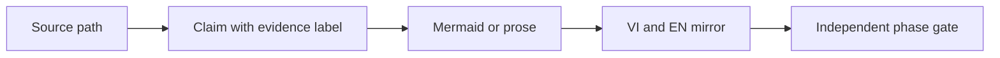
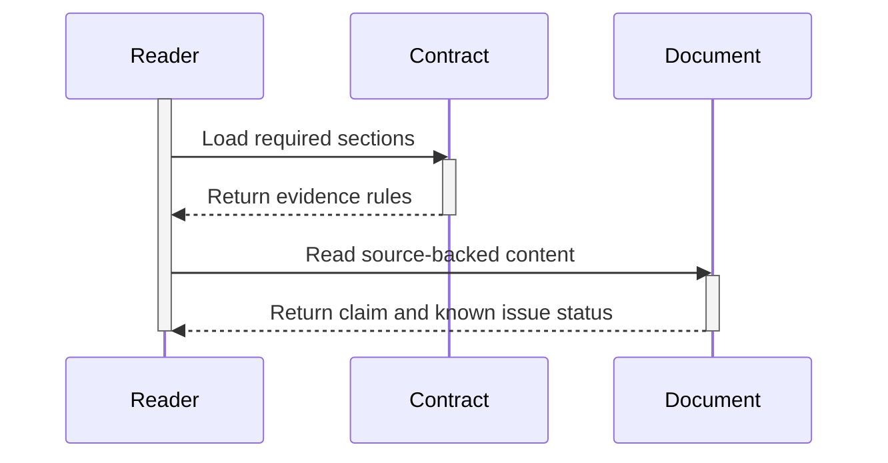
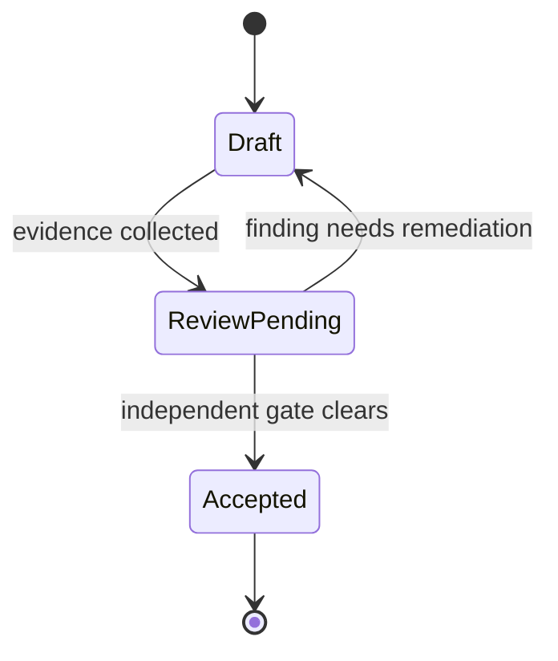
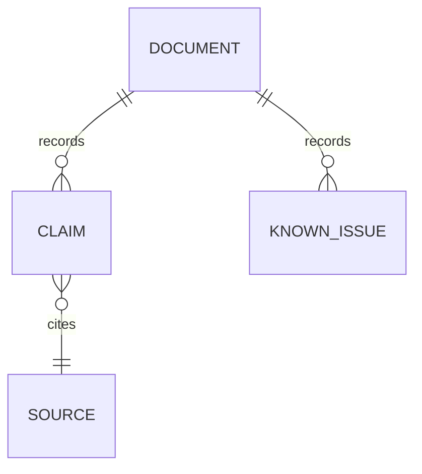

# AHD Loop Harness — Documentation contract

| Trường | Giá trị |
|---|---|
| Snapshot date | `2026-08-25` |
| Áp dụng | System, group/reference, core và ops documents |
| Mirror | `docs/vi/` ↔ `docs/en/` |
| Trạng thái | Chuẩn Phase 0; chưa phải verdict của verifier |

C-contract-01: [fact] Contract này chuyển yêu cầu của [`IMPLEMENTATION_PLAN.md`](../plans/system-docs-vi-en/IMPLEMENTATION_PLAN.md) thành quy tắc viết corpus. Mọi tài liệu vẫn phải đối chiếu source hiện tại; contract không biến một path dự kiến thành component đã tồn tại.

## 1. Phạm vi và nguyên tắc

- Viết tài liệu để người đọc truy vết được từ claim đến source path, config, test, CI, spec hoặc existing documentation.
- Phân biệt rõ implementation source, generated runtime state, HLK security layer, provider wrapper và evidence. Không dùng runtime artifact làm bằng chứng cho source design.
- Giữ diff nhỏ, không sửa `.devin/`, `HLK/`, source, tests hoặc existing docs khi task chỉ tạo corpus.
- Không ghi secret value, credential, token, private key hoặc dữ liệu nhạy cảm. Có thể ghi tên biến/key nếu cần giải thích contract, không ghi giá trị.
- Không thêm marketing hoặc cam kết vượt quá evidence. Khi chưa xác minh, dùng `[unverified-guess]` và nêu bước xác minh.

## 2. Metadata đầu tài liệu

Mỗi system, group/reference, core và ops document phải có metadata ngắn ở đầu file:

| Trường bắt buộc | Quy tắc |
|---|---|
| Title | Tên kỹ thuật rõ ràng; giữ component/class/module name bằng English. |
| Document type | Một trong `system`, `group/reference`, `core`, `ops`. |
| Scope | Nêu boundary và phần không bao gồm. |
| Audience | Nêu người đọc chính. |
| Snapshot date | Dùng đúng ngày khảo sát source; Phase 0 dùng `2026-08-25`. |
| Status | `planned`, `draft`, `review-pending` hoặc trạng thái được verifier ghi nhận; không tự ghi `PASS`. |
| Mirror | Trỏ tới cặp VI/EN nếu file cặp đã tồn tại; file tương lai chỉ ghi tên inline code. |

Snapshot date là thời điểm của evidence, không phải version marker hay lịch sử chỉnh sửa. Version truth nằm ở git history và changelog theo canon.

## 3. Section bắt buộc theo loại tài liệu

### 3.1 System documents

System document phải có, theo thứ tự logic:

1. `Purpose and scope` — mục tiêu, boundary, audience và out-of-scope.
2. `System map` — các layer, component groups, trust boundary và legend source/runtime/security.
3. `Functions and responsibilities` — function, owner component, input/output và dependency; không khẳng định API chưa thấy trong source.
4. `Operating principles` — nguyên tắc được dẫn từ canon hoặc source, tách fact khỏi inference.
5. `Lifecycle and main flows` — flow end-to-end, happy path và failure path; dùng Mermaid khi có quan hệ/transition.
6. `Evidence and source paths` — bảng claim, label, path và snapshot date.
7. `Known issues and gaps` — discrepancy, missing path, stale documentation hoặc phần chưa khảo sát.
8. `Further reading` — chỉ link tới file đã tồn tại hoặc file cùng phase.

### 3.2 Group/reference documents

Group/reference document phải có:

1. `Purpose and boundary` của nhóm.
2. `Component inventory` — component/file path quan sát được và trạng thái source hay runtime.
3. `Interfaces and contracts` — CLI, function, config, input/output, schema hoặc event nếu source có định nghĩa.
4. `Dependencies and ownership` — dependency nội bộ, wrapper và vùng được phép sửa/không được sửa.
5. `Lifecycle and state` — khởi tạo, đọc/ghi, kết thúc và persistence; nếu không có evidence thì ghi rõ.
6. `Failure and security` — lỗi, fail-closed/open, secret boundary và side effect đã được source xác nhận.
7. `Verification evidence` — test, CI, spec, command hoặc read-back path.
8. `Known issues`, `claims` và liên kết chéo.

### 3.3 Core documents

Core document cho một component lõi phải có:

1. `Purpose, scope and non-goals`.
2. `Source path and public surface` — module, class, function, entry point và symbol name chính xác.
3. `Invariants and data contract` — precondition, postcondition, schema, state và idempotency nếu có evidence.
4. `Lifecycle and state transitions` — active lifetime, ownership, retry, checkpoint hoặc recovery nếu source có.
5. `Control/data flow` — Mermaid phù hợp và walkthrough theo bước.
6. `Failure modes and security boundary` — lỗi có thể quan sát, secret handling, permission và rollback.
7. `Verification evidence` — test path, deterministic gate hoặc spec path; không dùng lời tác giả làm proof.
8. `Known issues`, `claims` và next action.

### 3.4 Ops documents

Ops document phải có:

1. `Purpose, audience and change boundary`.
2. `Prerequisites` — runtime, permission, config và source path cần có.
3. `Risk and authorization` — side effect, approval, secret handling và stop condition.
4. `Command procedure` — command nguyên văn, thứ tự bước và input placeholder an toàn.
5. `Expected evidence` — output, file/state change, log hoặc CI artifact cần quan sát.
6. `Failure diagnosis` — triệu chứng, nguyên nhân đã biết và escalation path.
7. `Rollback and recovery` — điều kiện rollback, bước khôi phục và giới hạn; không bịa command.
8. `Known issues`, `claims` và ngày snapshot.

## 4. Evidence labels và source path

### 4.1 Chuẩn claim

Chỉ dùng đúng ba label sau trong claim register và các đoạn mô tả có tính khẳng định:

| Label | Ý nghĩa | Cách viết |
|---|---|---|
| `[fact]` | Quan sát trực tiếp từ file, symbol, config, test, CI hoặc spec hiện có. | Ghi source path và line/range khi hữu ích; không suy rộng quá source. |
| `[inference]` | Kết luận được suy ra từ một hoặc nhiều fact. | Ghi basis là các fact/path; dùng ngôn ngữ thể hiện đây là diễn giải. |
| `[unverified-guess]` | Hypothesis, assumption hoặc path/chức năng chưa mở được source để xác minh. | Ghi hành động cần verify; không dùng làm hướng dẫn vận hành đã được phê duyệt. |

Không bỏ label bằng cách dùng câu chắc chắn cho một claim chưa có evidence. `Existing docs` có thể làm context; nếu mâu thuẫn với source hiện tại, ghi conflict thành known issue.

### 4.2 Quy tắc source path

1. Dùng path tương đối từ repository root, dấu `/`, giữ đúng chữ hoa/thường và extension: ví dụ `.devin/hooks/pre_tool_use.py`.
2. Với symbol hoặc đoạn quan trọng, thêm `:line` hoặc `:line-line`; line là evidence tại snapshot, không thay thế việc đọc file.
3. Ghi rõ loại path: `source`, `config`, `runtime state`, `security`, `test`, `CI`, `spec`, `SBOM` hoặc `existing docs`.
4. Không trỏ tới path tuyệt đối trên máy cá nhân, path secret, URL không cần thiết hoặc file chưa tồn tại như thể nó là source.
5. Khi một path không tồn tại, không tạo link để che khoảng trống. Gắn `[unverified-guess]` hoặc ghi known issue với bước kiểm tra.
6. Mỗi bảng claim phải có tối thiểu `Claim ID`, `Label`, `Claim`, `Source path`, `Snapshot date` và `Notes/limits`.

## 5. Mermaid conventions

Mermaid dùng inline fence, không dùng ảnh generated. Mỗi diagram phải có caption ngay trước/sau fence và một đoạn giải thích ngắn. Không đưa secret value, token, credential hoặc dữ liệu runtime nhạy cảm vào node/edge.

| Loại | Dùng cho | Quy tắc tối thiểu |
|---|---|---|
| `flowchart LR` hoặc `flowchart TD` | Architecture, dependency và control flow. | Nêu boundary; node chưa có source phải ghi là planned hoặc hypothesis ngoài diagram. |
| `sequenceDiagram` | Interaction và active lifetime. | Dùng `activate`/`deactivate` cho participant có thời gian hoạt động; không chỉ vẽ mũi tên. |
| `stateDiagram-v2` | Status, stage, guard và transition. | Nêu state khởi đầu, terminal state và điều kiện chuyển nếu source có. |
| `erDiagram` | Quan hệ document/state/event/data contract. | Chỉ vẽ relation đã ổn định trong source/schema; relation giả định phải gắn label. |

**Hình 1 — Flow chuẩn từ claim đến kiểm tra độc lập.** Đây là convention của documentation contract, không phải sơ đồ runtime của một component cụ thể.

Sơ đồ trên đặt source path trước claim, sau đó mới biểu diễn nội dung và kiểm tra mirror; vì vậy tài liệu không lấy diagram làm nguồn sự thật.

**Hình 2 — Active lifetime trong sequence diagram.** `activate` và `deactivate` phải bao quanh khoảng thời gian participant đang xử lý.

Sequence này minh họa lifetime của việc đọc tài liệu; nó không khẳng định participant là module runtime.

**Hình 3 — Trạng thái review của tài liệu.** `stateDiagram-v2` biểu diễn gate và nhánh remediation, không thay thế verdict của verifier.

Sơ đồ dùng `Accepted` như trạng thái quy trình tài liệu; chỉ report độc lập mới được ghi nhận trạng thái thật của phase.

**Hình 4 — Quan hệ tối thiểu của claim register.** `erDiagram` chỉ mô tả cấu trúc evidence trong corpus.

Mỗi claim cần source; known issue thuộc document nhưng không được dùng để giả mạo source evidence.

## 6. Naming và path của corpus

- File mới dùng lowercase, numeric prefix và `kebab-case`; tên cặp VI/EN giữ cùng số và cùng phạm vi thông tin.
- Các thư mục logic là `docs/vi/`, `docs/en/`, `reference/`, `core/` và `ops/` theo plan; không tự tạo thư mục ngoài scope.
- Tên command, class, module, function, event, config key và source path giữ nguyên English để copy/search được.
- Heading có số thứ tự giống nhau giữa VI và EN; prose được dịch tự nhiên, không làm mất semantics kỹ thuật.
- Không thêm version marker hoặc changelog block vào thân tài liệu. Snapshot date chỉ là metadata của evidence.
- Không dùng tên chung không có domain meaning; không đổi tên source symbol chỉ vì bản dịch.

## 7. VI/EN parity

Mỗi cặp phải đạt tất cả điểm sau trước phase gate:

- Cùng numeric prefix, document type, scope và snapshot date.
- Cùng thứ tự heading bắt buộc, cùng bảng/row, cùng Claim ID và Known Issue ID.
- Diagram có cùng loại, topology và lifecycle; text trong diagram có thể dịch nhưng symbol/path/command giữ nguyên.
- EN phải chứa đủ thông tin tương đương VI, không để placeholder, câu rút gọn làm mất điều kiện hoặc bỏ qua known gap.
- Link nội bộ của mỗi bản phải resolve tới file hiện có hoặc file Phase 0; filename tương lai chỉ dùng inline code.
- Một thay đổi evidence, claim hoặc known issue phải được phản chiếu ở cả hai bản.

## 8. Claim register và Known issues

### 8.1 Claim register tối thiểu

Mỗi document nội dung phải có section `Claims` với bảng:

| Claim ID | Label | Claim | Source path | Snapshot date | Notes/limits |
|---|---|---|---|---|---|
| `C-<doc>-<n>` | `[fact]`, `[inference]` hoặc `[unverified-guess]` | Một claim có thể kiểm tra | Path tương đối | `YYYY-MM-DD` | Basis, giới hạn hoặc action verify |

Không gộp nhiều claim độc lập vào một row nếu chúng có evidence khác nhau. Claim `[unverified-guess]` phải có action verify và không được viết như capability đã có.

### 8.2 Known issue tối thiểu

Mỗi document phải có section `Known issues` dù hiện tại không có finding; khi không có finding, ghi `None observed at snapshot` và nêu phạm vi đã khảo sát. Khi có finding:

| Issue ID | Status/severity | Impact | Evidence path | Remediation hoặc next action |
|---|---|---|---|---|
| `G-<doc>-<n>` | `open`, `blocked` hoặc `resolved-pending-check` | Ảnh hưởng tới đọc/vận hành/coverage | Path và line nếu có | Bước cụ thể, không tự sửa ngoài scope |

Missing path, stale reference, source/runtime ambiguity, parity drift và command không đối chiếu được đều là known issue; không được âm thầm loại khỏi inventory.

## 9. Phase-gate checklist

Builder chỉ tạo nội dung; verifier độc lập quyết định verdict. Phase gate phải kiểm tra checklist này và ghi evidence ở execution report của plan:

- [ ] File nằm đúng `File Path` trong plan; không có scope drift.
- [ ] Metadata có document type, scope, audience, `Snapshot date: 2026-08-25` hoặc ngày snapshot đúng source.
- [ ] Tất cả claim có `[fact]`, `[inference]` hoặc `[unverified-guess]`, kèm source path và giới hạn.
- [ ] Section bắt buộc của `system`, `group/reference`, `core` hoặc `ops` đầy đủ.
- [ ] Known issues có mặt; missing/stale/unverified item có remediation hoặc next action.
- [ ] VI/EN có heading, table, Claim ID, Known Issue ID và diagram parity; EN không phải placeholder.
- [ ] Mermaid fence cân bằng; diagram dùng đúng type; `sequenceDiagram` có `activate`/`deactivate` khi biểu diễn lifetime.
- [ ] Markdown links chỉ trỏ file tồn tại hoặc file cùng phase; future file dùng inline code.
- [ ] Không có secret, credential, token value, absolute local path hoặc marketing claim.
- [ ] Independent verifier đã đọc fresh context và ghi result; builder không tự ghi `PASS`.

## 10. Claims

| Claim ID | Label | Claim | Source path | Snapshot date | Notes/limits |
|---|---|---|---|---|---|
| `C-contract-01` | `[fact]` | Contract yêu cầu source path repository-relative và claim phải có evidence label. | `.devin/canon/VERIFICATION_PROTOCOL.md`, `.devin/rules/WORKSPACE_GOVERNANCE.md` | `2026-08-25` | Áp dụng cho corpus mới; không thay thế policy gốc. |
| `C-contract-02` | `[inference]` | Independent phase gate là điều kiện cần để giảm drift giữa bản VI/EN và source. | `.devin/canon/VERIFICATION_PROTOCOL.md` | `2026-08-25` | Đây là design interpretation, không phải runtime guarantee. |

## 11. Known issues

| Issue ID | Status/severity | Impact | Evidence path | Remediation hoặc next action |
|---|---|---|---|---|
| `G-contract-01` | `open/low` | Phase 0 mới kiểm tra structural Mermaid, chưa render bằng renderer bên ngoài. | `docs/vi/00-documentation-contract.md` | Chạy renderer/spot-check ở Phase 2 và Phase 6 nếu tool khả dụng. |

## 12. Tham chiếu hiện có

- [Chỉ mục corpus](00-index.md).
- [Component coverage](00-component-coverage.md).
- [`SOLUTION_DESIGN.md`](../plans/system-docs-vi-en/SOLUTION_DESIGN.md).
- [`VERIFICATION_PROTOCOL.md`](../../.devin/canon/VERIFICATION_PROTOCOL.md).
