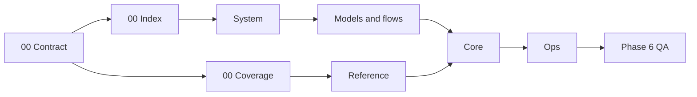

# AHD Loop Harness — Chỉ mục corpus tài liệu

| Trường | Giá trị |
|---|---|
| Snapshot date | `2026-08-25` |
| Phạm vi hiện tại | Phase 0 — bootstrap, skeleton và standards |
| Trạng thái | Phase 0 đã qua independent check; sẵn sàng mở Phase 1 |
| Corpus mirror | `docs/vi/` ↔ `docs/en/` |
| Kế hoạch nguồn | [`IMPLEMENTATION_PLAN.md`](../plans/system-docs-vi-en/IMPLEMENTATION_PLAN.md) |

## 1. Mục đích

C-index-01: [fact] Corpus này là bộ tài liệu kỹ thuật song ngữ cho AHD Loop Harness: giúp người đọc đi từ bản đồ hệ thống và quy ước evidence đến reference, core component và vận hành. Phạm vi phase được định nghĩa trong [`SOLUTION_DESIGN.md`](../plans/system-docs-vi-en/SOLUTION_DESIGN.md).

Corpus này không thay thế source, config, test hoặc security policy. Khi tài liệu và source khác nhau, người viết phải mở source hiện tại, gắn nhãn claim và ghi known issue thay vì đoán.

## 2. Người đọc

- **Người mới vào dự án:** đọc contract, index và coverage để biết thuật ngữ, ranh giới source/runtime/security.
- **Developer và maintainer:** đọc system, reference và core để truy vết module, interface, lifecycle và failure path.
- **Operator:** đọc ops để chạy command có prerequisite, output mong đợi, rollback và stop condition.
- **Reviewer, security auditor và người duyệt phase:** dùng evidence, claim register, known issue và phase gate để kiểm tra độc lập.

## 3. Lộ trình đọc

1. Đọc [documentation contract](00-documentation-contract.md) để biết section bắt buộc, evidence label và quy ước Mermaid.
2. Đọc [component coverage](00-component-coverage.md) để phân biệt source, runtime state, HLK security, provider wrapper và evidence.
3. Với tổng quan nguyên lý, theo dõi các file hệ thống tương lai bằng tên inline code: `01-tong-quan-he-thong.md`, `02-catalog-thanh-phan.md`, `03-chuc-nang-he-thong.md`, `04-nguyen-tac-hoat-dong.md`, `05-triet-ly-thiet-ke.md`.
4. Với model và flow, đọc lần lượt các file tương lai: `06-mo-hinh-he-thong.md`, `07-flow-logic.md`, `08-activity-diagrams.md`, `09-data-flow.md`, `10-state-stage-flows.md`, `11-sequence-diagrams.md`.
5. Sau system, đi vào các nhóm `reference/`, `core/` và `ops/` khi phase tương ứng được mở.
6. Cuối cùng đọc `12-roadmap.md` để phân biệt việc đã có evidence với hypothesis cần research.

Các tên file tương lai trong mục này là inline code, không phải link; chúng chưa được tạo trong Phase 0.

## 4. Cây tài liệu dự kiến

Hai cây giữ cùng mã số và cùng phạm vi thông tin. Nhóm `system` là nhóm logic; các file system theo plan nằm trực tiếp dưới `docs/vi/` và `docs/en/`, không tự ý tạo thư mục khác.

`docs/vi/`

- `00-index.md` — file Phase 0 này.
- `00-documentation-contract.md` — Phase 0.
- `00-component-coverage.md` — Phase 0.
- `system/` — nhóm logic, chưa tạo thư mục thật trong Phase 0.
  - `01-tong-quan-he-thong.md` — planned.
  - `02-catalog-thanh-phan.md` — planned.
  - `03-chuc-nang-he-thong.md` — planned.
  - `04-nguyen-tac-hoat-dong.md` — planned.
  - `05-triet-ly-thiet-ke.md` — planned.
  - `06-mo-hinh-he-thong.md` — planned.
  - `07-flow-logic.md` — planned.
  - `08-activity-diagrams.md` — planned.
  - `09-data-flow.md` — planned.
  - `10-state-stage-flows.md` — planned.
  - `11-sequence-diagrams.md` — planned.
- `reference/` — planned.
- `core/` — planned.
- `ops/` — planned.
- `12-roadmap.md` — planned.

`system/` trong tree là nhãn nhóm logic để dễ đọc; tên path đã được plan duyệt vẫn là các filename ở cấp `docs/vi/`. `reference/`, `core/`, `ops/` và các file con là output tương lai, được ghi bằng inline code để tránh broken link.

## 5. Lộ trình phase và trạng thái

| Phase | Phạm vi | Trạng thái tại snapshot |
|---|---|---|
| Phase 0 | Bootstrap, skeleton, index, contract, component coverage | Hoàn thành; independent gate PASS ngày `2026-08-25` |
| Phase 1 | System overview và principles | Chưa bắt đầu; chờ gate Phase 0 |
| Phase 2 | Models và flows | Chưa bắt đầu; chờ Phase 1 |
| Phase 3 | Grouped references | Chưa bắt đầu; chờ Phase 2 |
| Phase 4 | Core component deep references | Chưa bắt đầu; chờ Phase 3 |
| Phase 5 | Operations và roadmap research | Chưa bắt đầu; chờ Phase 4 |
| Phase 6 | Final QA và closeout | Chưa bắt đầu; chờ Phase 0–5 |

Mỗi phase chỉ chuyển tiếp sau independent check theo plan. Bảng này không phải verdict; verifier riêng phải ghi evidence, finding và remediation.

**Hình 1 — Lộ trình đọc theo dependency của corpus.** Phase sau dùng vocabulary và manifest của phase trước; các node chưa có file thật chỉ mô tả đích dự kiến.

## 6. Claims

| Claim ID | Label | Claim | Source path | Snapshot date | Notes/limits |
|---|---|---|---|---|---|
| `C-index-01` | `[fact]` | Corpus có sáu file Phase 0 được liệt kê trong scope của execution report. | `docs/plans/system-docs-vi-en/EXECUTION_REPORT.md` | `2026-08-25` | Phạm vi sẽ mở rộng sau từng phase. |
| `C-index-02` | `[fact]` | Corpus dùng hai cây mirror `docs/vi/` và `docs/en/`. | `docs/plans/system-docs-vi-en/IMPLEMENTATION_PLAN.md` | `2026-08-25` | Parity phải được verifier xác nhận sau mỗi phase. |

## 7. Known issues

| Issue ID | Status/severity | Impact | Evidence path | Remediation hoặc next action |
|---|---|---|---|---|
| `G-index-01` | `open/medium` | Future documents chưa tồn tại nên chưa thể link trực tiếp. | `docs/vi/00-index.md` | Giữ inline code cho đến khi phase tương ứng tạo file và pass link check. |
| `G-index-02` | `resolved` | Rule `docs/*` từng có thể làm file corpus mới bị ignore. | `.gitignore:281-291` | Đã thêm exception cho `docs/vi/`, `docs/en/` và plan hiện tại; tiếp tục giữ rule này khi publish. |

## 8. Điểm vào hiện có

- Phase 0: [documentation contract](00-documentation-contract.md) và [component coverage](00-component-coverage.md).
- Bản mirror tiếng Anh: [English index](../en/00-index.md).
- Hướng dẫn workflow hiện có: [`docs/USAGE_GUIDE.md`](../USAGE_GUIDE.md) và [`docs/CONTINUOUS_LOOP_GUIDE.md`](../CONTINUOUS_LOOP_GUIDE.md).
- Canon liên quan: [CORE_CANON.md](../../.devin/canon/CORE_CANON.md) và [VERIFICATION_PROTOCOL.md](../../.devin/canon/VERIFICATION_PROTOCOL.md).
- Security layer hiện có: [HLK README](../../HLK/README.md).

Các liên kết trong index này chỉ trỏ đến file đã tồn tại hoặc file Phase 0 trong cùng corpus. File tương lai chỉ xuất hiện dưới dạng inline code.

## 9. Ranh giới corpus

- Đọc `.devin/canon/`, `.devin/hooks/`, `.devin/scripts/`, `HLK/`, `.opencode/`, `tools/`, `tests/`, `.github/`, `specs/`, `sbom/` và existing docs làm evidence; không sửa các vùng đó trong task tài liệu này.
- Không coi `.devin/state/`, `.devin/session_state/`, `.devin/plan_state/`, `.devin/telemetry/` hoặc các runtime directory khác là source implementation.
- Không ghi secret value, credential, token hoặc dữ liệu nhạy cảm vào corpus.
- Không thêm nội dung marketing; mọi mô tả phải truy vết được về path, test, config, CI, spec hoặc source evidence.
