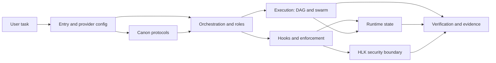
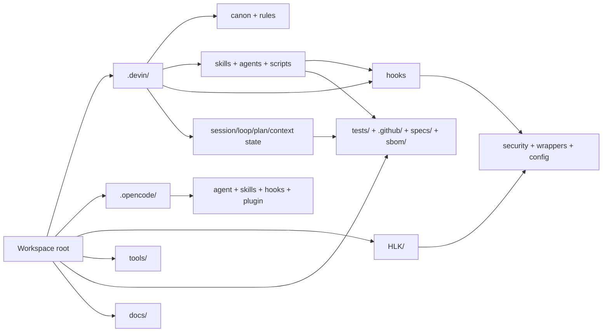
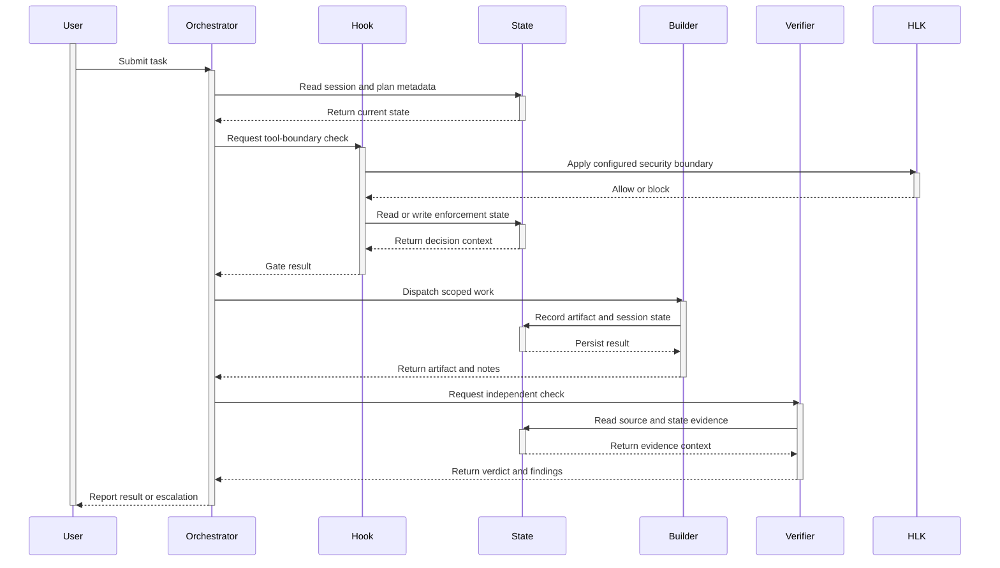

# AHD Loop Harness — Tổng quan hệ thống

| Trường | Giá trị |
|---|---|
| Document type | `system` |
| Scope | Bản đồ cấp workspace của AHD Loop Harness: source, policy, workflow, enforcement, security, evidence và runtime state; không bao gồm ứng dụng nghiệp vụ bên ngoài harness. |
| Audience | Người mới vào dự án, maintainer, developer, operator, Builder, Verifier và security reviewer. |
| Snapshot date | `2026-08-25` |
| Status | `draft` |
| Mirror | [`docs/vi/01-tong-quan-he-thong.md`](01-tong-quan-he-thong.md) ↔ [`docs/en/01-system-overview.md`](../en/01-system-overview.md) |

## 1. Mục đích và phạm vi

`[fact]` AHD Loop Harness là một **Python/Node AI-agent harness** (bộ khung điều phối agent): phần Python nằm chủ yếu trong `.devin/hooks/` và `.devin/scripts/`, còn lớp HLK có module Node.js trong `HLK/security/`. Đây là workspace cho workflow của AI agent, **không phải ứng dụng C#** và không được mô tả như một sản phẩm .NET.

`[inference]` Mục tiêu vận hành của workspace là nối yêu cầu của người dùng với các bước plan, approval, execution, enforcement, verification và memory bằng các component có evidence trong repo. Đây là diễn giải tổng hợp từ `AGENTS.md`, `.devin/canon/`, `.devin/scripts/plan_fsm/`, `.devin/hooks/` và `.github/workflows/ci.yml`; không phải một API duy nhất.

### 1.1 Boundary

- **Trong scope:** root entry/config, `.devin/` (canon, skills, agents, hooks, scripts và state), `HLK/` (security boundary), `.opencode/` (provider wrapper), `tools/`, `tests/`, `.github/`, `specs/`, `sbom/` và corpus tài liệu dưới `docs/`.
- **Nguồn sự thật:** source/config/spec/test/CI hiện có. Existing docs chỉ là context hoặc đường dẫn đối chiếu; runtime state không phải implementation source.
- **Quyền sửa của tài liệu này:** chỉ hai file mirror được plan T1.1 cho phép; không sửa canon, hook, HLK, config, source hoặc test.

### 1.2 Ngoài scope

- Không xây dựng hoặc quảng bá ứng dụng C#/.NET, UI, business service hay domain model.
- Không suy ra public API, command, component hoặc capability chỉ từ tên thư mục.
- Không coi `.devin/session_state/`, `.devin/plan_state/`, `.devin/telemetry/`, `.opencode/session_state/` hay artifact tương tự là source design.
- Không ghi secret value, credential, token, private key hoặc dữ liệu runtime nhạy cảm vào tài liệu.

## 2. Bản đồ hệ thống

### 2.1 Cây workspace có chú giải

Cây dưới đây là inventory cấp nhóm tại snapshot, không phải danh sách đếm file. Nhãn `[source]`, `[config]`, `[security]`, `[evidence]`, `[existing docs]` và `[runtime state]` phân biệt mục đích; một thư mục có thể chứa nhiều loại con.

```text
workspace/
├── AGENTS.md, CLAUDE.md, REPOS.md, SECURITY.md       [entry/rules]
├── opencode.json, pyproject.toml, pytest.ini         [config]
├── package.json, package-lock.json, requirements-lock.txt, .gitignore [config/deps]
├── .githooks/                                        [source: Git hooks]
├── .devin/                                            [AHD source + runtime]
│   ├── canon/                                         [source: canonical protocols]
│   ├── rules/                                         [source: project rules]
│   ├── skills/                                        [source: workflow skills]
│   ├── agents/                                        [source: Commander/workers/personas]
│   ├── hooks/                                         [source: enforcement hooks]
│   ├── scripts/                                       [source: Python runtime scripts]
│   │   ├── plan_fsm/                                  [source: Plan FSM]
│   │   ├── plan_orchestrator.py                      [source: Plan entry point]
│   │   ├── state_router.py                            [source: conditional router]
│   │   ├── dag_executor.py                            [source: DAG executor]
│   │   ├── swarm_director.py                          [source: swarm dispatch]
│   │   └── loop_memory_sync.py                        [source: memory registry sync]
│   ├── config.json, mcp_config.json                   [config: provider/hooks/MCP]
│   ├── loop_state.md, loop_state/                     [runtime state: registry/session notes]
│   ├── session_state/, plan_state/                    [runtime state: machine state]
│   └── context_flags/, blackboard/, event_bus/,       [runtime state: flags/data/events]
│       checkpoints/, telemetry/, artifact_registry/
├── HLK/                                               [security: read-only boundary]
│   ├── security/                                      [source: sanitizer/vault]
│   ├── wrappers/                                      [source: launcher/bridge/integrity]
│   ├── config/                                        [config: HLK rules/templates]
│   └── bin/                                           [source: observed HLK commands]
├── .opencode/                                         [wrapper/config + runtime]
│   ├── agent/, agents/, skills/, hooks/               [source: provider wrappers]
│   ├── plugin/, tools/                                [source: bridge/tools]
│   └── session_state/                                 [runtime state: provider artifacts]
├── tools/                                             [source/tooling: checks and operations]
├── tests/                                             [evidence: pytest and pentest]
├── .github/workflows/                                 [evidence: CI/SAST/supply chain]
├── specs/                                             [evidence: TLA+ models]
├── sbom/                                              [evidence: CycloneDX inventories]
├── docs/                                              [existing docs + corpus]
│   ├── vi/, en/                                      [bilingual documentation]
│   └── plans/system-docs-vi-en/                      [plan/SDD artifacts]
└── .agents/, state/, logs/, tmp/, .coverage,          [runtime/shared/test artifacts]
    .pytest_cache/, .worktrees/, .opencode/session_state/
```

`[fact]` Các thư mục chính trong cây đã được quan sát; `.devin/` chứa cả source và state generated nên phải đọc theo legend. `HLK/` là lớp security riêng; `.opencode/` là wrapper của provider, không phải một bản sao độc lập của AHD core.

### 2.2 Layer map và legend

| Layer | Path đã quan sát | Loại evidence | Trách nhiệm và boundary |
|---|---|---|---|
| Entry/provider | `AGENTS.md`, `CLAUDE.md`, `opencode.json`, `.devin/config.json`, `.devin/mcp_config.json` | `[config]` | Khai báo instruction, permission, hook event và launcher metadata; không phải business application. |
| Canon | `.devin/canon/` | `[source]` | Identity, BOOT, red lines, memory, loop và verification protocol; vùng canon không được sửa trực tiếp. |
| Workflow | `.devin/skills/`, `.devin/agents/` | `[source]` | Skill trigger, Commander, worker, persona và executor role; không tự tạo runtime result. |
| Orchestration | `.devin/scripts/plan_fsm/`, `.devin/scripts/plan_orchestrator.py`, `.devin/scripts/plan_dispatch.py` | `[source]` | Khởi tạo/điều phối plan, phân loại tier, phân quyền file và dependency dispatch. |
| Execution | `.devin/scripts/dag_executor.py`, `.devin/scripts/swarm_director.py` | `[source]` | Xử lý workflow/DAG, batch, task status, worker result và write-set conflict. |
| Enforcement | `.devin/hooks/pre_tool_use.py`, `.devin/hooks/plan_enforce.py`, `.devin/hooks/schema_gate.py`, `.devin/hooks/post_tool_use.py` | `[source/runtime enforcement]` | Chặn hoặc ghi nhận tool call theo gate, plan, schema, secret, path, cost và state contract. |
| Security boundary | `HLK/security/`, `HLK/wrappers/`, `HLK/config/` | `[security]` | Sanitizer, vault bridge, launcher và integrity boundary; tài liệu này chỉ đọc/reference. |
| Provider wrapper | `.opencode/`, `opencode.json` | `[wrapper/config]` | Mapping skill/agent/hook của AHD sang opencode với chế độ opt-in riêng. |
| Evidence/tooling | `tools/`, `tests/`, `.github/workflows/`, `specs/`, `sbom/` | `[evidence]` | Kiểm tra governance, import, test, CI, formal property, dependency và SBOM. |
| Runtime state | `.devin/loop_state.md`, `.devin/loop_state/`, `.devin/session_state/`, `.devin/plan_state/`, `.devin/context_flags/`, `.devin/telemetry/`, `.opencode/session_state/`, `state/`, `logs/`, `tmp/` | `[runtime state]` | Registry, heartbeat, plan state, flags, journal, telemetry và artifact; chỉ dùng để theo dõi lifecycle, không thay source. |
| Documentation | `docs/vi/`, `docs/en/`, `docs/plans/system-docs-vi-en/`, `docs/USAGE_GUIDE.md` | `[existing docs]` | Corpus, plan và hướng dẫn hiện có; phải reconcile khi lệch source. |

**Sơ đồ 1 — Kiến trúc layer cấp cao và các boundary chính.** `[inference]` Topology được tổng hợp từ config, canon, scripts, hooks, HLK và evidence; đây không phải call graph của một lệnh đơn.



Sơ đồ cho thấy canon định hướng orchestration, hooks kiểm soát tool boundary, execution tạo result, state giữ lifecycle, HLK bảo vệ security boundary và evidence hỗ trợ verification. Mũi tên là quan hệ trách nhiệm tổng hợp, không cam kết mọi provider đi qua cùng một runtime path.

**Sơ đồ 2 — Luồng thư mục được chú giải theo layer.** `[fact]` Các node dùng directory đã quan sát; các cạnh cuối là quan hệ sử dụng/đưa evidence, không phải import API mới.



Sơ đồ này giúp phân biệt nơi chứa implementation/policy (`.devin/`, `.opencode/`, `HLK/`) với nơi quan sát kết quả (`tests/`, CI, specs, SBOM) và nơi lưu state generated. `docs/` cung cấp context, không thay thế các node source.

## 3. Functions and responsibilities

Bảng sau chỉ ghi input/output đã thấy trong source hoặc config. `[fact]` trong cột Evidence là bằng chứng trực tiếp; không suy ra API ngoài các tên CLI/symbol được mở.

| Layer/component group | Input | Output | Dependency | Evidence |
|---|---|---|---|---|
| Entry/provider config | File cấu hình và tool/session event do provider gửi | Instruction, permission, hook registration và MCP metadata | Provider runtime; các path được khai báo trong config | `[fact]` `.devin/config.json:15-54,103-380`; `opencode.json:2-33` |
| Canon protocols | Agent context và protocol cần áp dụng | Identity, BOOT rule, red line, memory/loop/verification rule | Không có runtime dependency được khai báo trong canon | `[fact]` `.devin/canon/CORE_CANON.md:6-41`; `.devin/canon/BOOT_PROTOCOL.md:5-17` |
| Skills, agents, personas | Task, trigger và role selection | Mission/instruction, worker boundary và executor mapping | `.devin/skills/`, `.devin/agents/`, provider wrapper | `[fact]` `.devin/AGENTS.md:45-71`; `.devin/agents/COMMANDER.md:153-176` |
| Plan orchestrator và Plan FSM | `--init --task`, `--step --state --results`, `--status --state` | JSON state file, tier, current state và `next_action` | `.devin/scripts/plan_fsm/cli.py`, `state_machine.py`, `storage.py` | `[fact]` `.devin/scripts/plan_orchestrator.py:1-15`; `.devin/scripts/plan_fsm/cli.py:14-74` |
| Approval và plan dispatch | SDD/plan path, decision, subtasks và session id | Approval status/state, file ownership, conflict, DAG order và worktree map | `.devin/scripts/approval_gate.py`, `.devin/scripts/plan_dispatch.py`, `.devin/plan_state/` | `[fact]` `.devin/scripts/approval_gate.py:1-29,82-121`; `.devin/scripts/plan_dispatch.py:86-153` |
| Execution DAG và swarm | Workflow JSON hoặc plan Markdown | Task status/result trong execution state; `SwarmSpec`/`WorkerResult` | `.devin/scripts/dag_*.py`, `.devin/scripts/data_models.py`, `.devin/scripts/swarm_director.py` | `[fact]` `.devin/scripts/dag_executor.py:11-49`; `.devin/scripts/swarm_director.py:73-89,194-214` |
| Conditional state router | State dict/JSON và current step | `next_step`, `next_agent`, `reason`, signed `state_update` | `.devin/scripts/state_schema.py`, conditional `EDGES` | `[fact]` `.devin/scripts/state_router.py:97-104,176-220,262-309` |
| Pre-tool enforcement | JSON có `tool_name`, `tool_input`, session context | Allow/block, reason và exit code; gate dangerous/path/cost/SSRF/encoding/call graph | `.devin/hooks/pre_tool_*.py`, `.devin/scripts/path_zones.py`, `.devin/session_state/`, `.devin/config.json` | `[fact]` `.devin/hooks/pre_tool_use.py:19-109`; `.devin/hooks/pre_tool_cli.py:42-122` |
| Plan/schema/post/coverage hooks | Write/Edit/tool response và session id | Plan decision; schema result; heartbeat/journal/candidate memory; coverage JSON/gap | `.devin/plan_state/`, `.devin/session_state/`, `HLK/config/hlk.config.json` và plan file | `[fact]` `.devin/hooks/plan_enforce.py:266-345`; `.devin/hooks/schema_gate.py:79-127`; `.devin/hooks/post_tool_use.py:1-14` |
| Loop memory synchronization | `.devin/session_state/*.json` và `.devin/loop_state/<sid>.md` | Registry `.devin/loop_state.md`, archive và completed-session move | `.devin/scripts/loop_memory_*.py`, filesystem lock/state | `[fact]` `.devin/scripts/loop_memory_sync.py:1-19`; `.devin/canon/MEMORY_PROTOCOL.md:12-31` |
| HLK security layer | Text, HLK config, local secret source hoặc environment key name | Sanitized text; secret lookup result không được ghi vào corpus; audit chỉ ghi key/source | Node `fs`, config, environment, HLK wrappers | `[fact]` `HLK/security/sanitizer.js:97-123,185-245`; `HLK/security/vault-bridge.js:140-207` |
| OpenCode wrapper | opencode event, environment opt-in và provider config | Wrapper agent/skill mapping; hook bridge chạy best-effort theo cấu hình | `.opencode/plugin/harness.ts`, `.opencode/hooks/`, `opencode.json` | `[fact]` `.opencode/README.md:7-29`; `.opencode/plugin/harness.ts:8-19,44-76` |
| Reusable tooling | Workspace path, source/config/state và command context | Governance/import/health/integrity output hoặc operational report | Python/PowerShell utilities và filesystem | `[fact]` `tools/check_governance.py:80-101,155-223`; `tools/verify-workspace.ps1:36-45,154-176` |
| Tests, CI, specs, SBOM | Source, config, dependency lock và test fixtures | Pytest/SAST/CI result, TLA+ model surface, CycloneDX inventory | GitHub Actions, pytest, dependency tools | `[fact]` `.github/workflows/ci.yml:13-92`; `.github/workflows/supply-chain.yml:19-61`; `specs/plan_orchestrator.tla:7-15`; `sbom/python.sbom.json:2-15` |

Không có row nào coi `src/`, `scripts/` hoặc một MCP server chưa khai báo là component hiện hữu. Các path chưa tồn tại chỉ xuất hiện ở phần known issues dưới dạng gap.

## 4. Operating principles

| Principle | Cách áp dụng tại snapshot | Evidence |
|---|---|---|
| BOOT lazy-load | `[fact]` BOOT chỉ nạp entry, registry, profile/state cần thiết và top canon; phần còn lại là on-demand theo tier. | `.devin/canon/BOOT_PROTOCOL.md:5-17,21-49` |
| Plan → Approve → Execute | `[fact]` M-tier+ đi qua Plan FSM, SDD approval, plan approval rồi mới ghi plan state để cho execution; S-tier là ngoại lệ được classifier cho phép. | `.devin/agents/COMMANDER.md:8-17,32-77`; `.devin/scripts/plan_fsm/state_machine.py:473-617` |
| Maker ≠ Checker | `[fact]` Builder tạo/sửa output; Verifier đọc fresh context và đối chiếu acceptance criteria; producer không tự cấp verdict. | `.devin/canon/VERIFICATION_PROTOCOL.md:1-22,30-33`; `.devin/agents/workers/BUILDER.md:18-33`; `.devin/agents/workers/VERIFIER.md:19-33` |
| Defense in depth | `[inference]` Nhiều lớp prompt/config, pre-tool gate, schema/coverage/post-tool, HLK và CI cùng giảm blast radius; không một lớp nào tự chứng minh toàn bộ behavior. | `.devin/config.json:159-317`; `.devin/hooks/schema_gate_gates.py:198-233`; `HLK/wrappers/hlk-hook-launcher.mjs:64-90`; `.github/workflows/ci.yml:39-82` |
| Persistent state | `[fact]` Memory và lifecycle được ghi trên disk qua registry, session state, plan state, journal, checkpoint và archive; `loop_memory_sync.py` là entry point sync. | `.devin/canon/MEMORY_PROTOCOL.md:12-31,100-109`; `.devin/scripts/loop_memory_sync.py:1-19` |
| Không auto-resume crashed | `[fact]` BOOT yêu cầu phát hiện crashed session rồi hỏi human; stop hook đánh dấu `suspected_crashed` khi chưa chứng minh completed, không xóa state để tự nối tiếp. | `.devin/canon/BOOT_PROTOCOL.md:55-60`; `.devin/canon/REDLINES.md:8-13`; `.devin/hooks/stop.py:137-147` |
| HLK boundary | `[fact]` HLK là security layer riêng; `sanitizer` redact theo config, `vault-bridge` đọc nguồn secret theo precedence và launcher fail-closed khi thiếu bridge. AHD agent không được sửa `HLK/`. | `HLK/README.md:42-86`; `HLK/security/sanitizer.js:109-147`; `HLK/security/vault-bridge.js:7-18`; `.devin/scripts/path_zones.py:47-90` |

Các nguyên tắc trên mô tả contract và quan sát source tại snapshot, không phải bảo đảm rằng mọi provider hoặc mọi lệnh luôn có cùng hiệu lực runtime.

## 5. Lifecycle và main flows

### 5.1 Main lifecycle

1. **Khởi động:** provider đọc entry/config; `.devin/hooks/session_start.py` khởi tạo hoặc giữ session state, kiểm tra HLK status và đặt `boot_complete` chưa hoàn tất. BOOT protocol sau đó lazy-load registry, profile, canon cần thiết và kiểm tra crashed session.
2. **Nhận task:** `.devin/scripts/plan_fsm/classifier.py` phân loại S/M/L/XL. S-tier có thể đi thẳng execution theo classifier; M-tier+ đi qua plan phase.
3. **Plan:** `.devin/scripts/plan_orchestrator.py` chuyển tiếp tới `.devin/scripts/plan_fsm/cli.py`; flow chính là `INIT → CLASSIFY → BRAINSTORM → ANALYZE → DESIGN → REVIEW → REVISION → SDD_APPROVAL → PLAN → GAP_SCAN → QC → PLAN_ENHANCE → PLAN_APPROVAL → WRITE_STATE → DONE`. Các vòng revision/QC/enhance/approval có counter giới hạn trong `.devin/scripts/plan_fsm/constants.py` và TLA+ model.
4. **Approval:** `.devin/scripts/approval_gate.py` nhận SDD hoặc plan cùng quyết định `approved`, `rejected` hoặc `changes_requested`; chỉ approved plan mới kích hoạt plan state cho execution.
5. **Execute:** `.devin/scripts/plan_dispatch.py` phân tích ownership/conflict/dependency; DAG executor chạy batch bounded và lưu execution state. `.devin/scripts/state_router.py` có flow conditional riêng cho route từ dispatch tới execute/verify/report.
6. **Verify:** pre-tool/schema/post-tool gates ghi hoặc chặn theo contract; Verifier/Auditor độc lập đọc artifact, source và evidence. CI còn chạy integrity, governance, SAST và pytest theo workflow hiện có.
7. **Memory/close:** post-tool cập nhật heartbeat, journal, context flags và candidate memory; `loop_memory_sync.py` regenerate registry. Stop hook archive session completed hoặc đánh dấu `suspected_crashed`, rồi dọn temporary files theo rule.

**Sơ đồ 3 — High-level interaction và active lifetime.** `[inference]` Đây là interaction model tổng hợp; `HLK` chỉ được gọi ở tool boundary có cấu hình tương ứng, còn State đại diện các state store khác nhau.



Sơ đồ bao quanh thời gian hoạt động của cả bảy participant bằng `activate`/`deactivate`. Nó không đặt secret/token value và không thay thế trace chi tiết của từng hook hoặc provider.

### 5.2 Happy path

`[inference]` Với task M-tier+ không có finding blocking: BOOT hoàn tất → plan FSM tạo SDD → reviewer không còn blocking → human duyệt SDD → tạo plan → gap scan/QC/plan enhancement đạt → human duyệt plan → ghi plan state → dispatch DAG/swarm → Builder tạo artifact → schema/coverage/evidence được thu thập → Verifier độc lập đối chiếu → memory sync và close completed.

Điểm kết thúc này là một chuỗi điều kiện; không được suy ra `PASS` chỉ từ việc một file được ghi hoặc một worker trả về `success`.

### 5.3 Failure path

- **BOOT/session:** state thiếu, stale hoặc crashed → ghi nhận/đọc state và hỏi human; không auto-resume.
- **Plan:** SDD/plan bị `changes_requested` → quay lại state tương ứng; blocking finding không hội tụ hoặc vượt counter → `ESCALATE`; reject → `REJECTED`.
- **Enforcement:** thiếu session binding, plan chưa approved, path ngoài zone, dangerous command, secret/encoding violation hoặc gate internal error → block/fail-closed theo gate cụ thể; reason phải được báo ra.
- **Execution:** DAG có task `failed`, dependency cycle/missing dependency hoặc retry vượt giới hạn → giữ failure evidence, không coi là completed.
- **Verification:** Verifier tìm finding → Builder sửa trong scope rồi Verifier đọc lại; nếu không thể xác minh, giữ trạng thái chưa hoàn tất và escalate.
- **Security/provider:** HLK launcher thiếu bridge thì fail-closed; OpenCode hook bridge là opt-in/best-effort nên phải tách provider behavior khỏi Devin hook behavior.
- **Close:** stop hook không thấy `session_completed` hoặc state write gần đây → đánh dấu `suspected_crashed`, giữ state để human quyết định bước tiếp.

## 6. Evidence và source paths

Claim register dưới đây dùng đúng ba nhãn evidence. Mỗi path là repository-relative và được ghi với line/range khi claim phụ thuộc symbol hoặc đoạn cụ thể.

### 6.1 Claim register

| Claim ID | Label | Claim | Source path | Snapshot date | Notes/limits |
|---|---|---|---|---|---|
| `C-system-01` | `[fact]` | Workspace có implementation Python trong `.devin/` và module Node.js trong HLK security layer; AHD được mô tả là agent harness. | `.devin/AGENTS.md:14-22`; `.devin/scripts/plan_orchestrator.py:1-15`; `HLK/security/sanitizer.js:14-22` | `2026-08-25` | Không phải evidence cho một ứng dụng C# hay business service. |
| `C-system-02` | `[fact]` | Root/provider config khai báo instruction, permission, hook event và MCP metadata ở các path đã nêu. | `.devin/config.json:15-54,103-317`; `opencode.json:2-33` | `2026-08-25` | Config declaration không tự chứng minh provider đã load mọi entry. |
| `C-system-03` | `[fact]` | BOOT protocol dùng lazy-load theo tier và yêu cầu không auto-resume crashed session. | `.devin/canon/BOOT_PROTOCOL.md:5-17,21-60` | `2026-08-25` | Đây là protocol contract; hiệu lực runtime còn phụ thuộc hook/provider. |
| `C-system-04` | `[fact]` | Plan FSM hiện có các state plan/approval/enhancement và counter giới hạn cho revision, QC, enhance, approval. | `.devin/scripts/plan_fsm/constants.py:8-24,49-56`; `.devin/scripts/plan_fsm/state_machine.py:473-617`; `specs/plan_orchestrator.tla:7-15,140-156` | `2026-08-25` | `.devin/scripts/plan_fsm/state_machine_v2.py` tồn tại nhưng entry `.devin/scripts/plan_orchestrator.py` gọi `.devin/scripts/plan_fsm/cli.py`. |
| `C-system-05` | `[fact]` | `plan_enforce.py` kiểm tra session/task/approved plan; `schema_gate.py` trả JSON gate result và exit code block khi fail. | `.devin/hooks/plan_enforce.py:266-345`; `.devin/hooks/schema_gate.py:79-127` | `2026-08-25` | Exact gate behavior có thể khác theo tool name và environment flag. |
| `C-system-06` | `[fact]` | `post_tool_use.py` là non-blocking entry point cho session state, journal, context flags, candidate memory và enforcement helpers. | `.devin/hooks/post_tool_use.py:1-14`; `.devin/hooks/post_tool_engine.py:39-286` | `2026-08-25` | Post-hook luôn exit 0 ở entry wrapper; một số helper vẫn log warning/block advisory. |
| `C-system-07` | `[fact]` | State router trả next step/agent/reason/state update; DAG executor lưu task status và execution state theo workflow. | `.devin/scripts/state_router.py:262-309`; `.devin/scripts/dag_executor.py:24-49,84-115` | `2026-08-25` | Đây là hai flow source riêng, không gộp thành một API. |
| `C-system-08` | `[fact]` | Loop memory đọc session metadata và per-session note để regenerate registry/archive; memory protocol phân biệt hot/cold/runtime state. | `.devin/scripts/loop_memory_sync.py:1-19`; `.devin/canon/MEMORY_PROTOCOL.md:12-20,158-164` | `2026-08-25` | State generated phải được đọc theo lifecycle, không dùng làm source design. |
| `C-system-09` | `[fact]` | HLK sanitizer load redact patterns từ config/fallback và vault bridge lấy secret theo precedence, audit không ghi secret value. | `HLK/security/sanitizer.js:109-147,185-245`; `HLK/security/vault-bridge.js:7-18,140-207` | `2026-08-25` | Tài liệu chỉ nhắc key/source contract, không nhắc value. |
| `C-system-10` | `[fact]` | OpenCode wrapper mặc định tắt hook bridge và bridge được mô tả là best-effort/fail-open; `.opencode` có wrapper/config riêng. | `.opencode/README.md:7-29`; `.opencode/plugin/harness.ts:8-19,44-76` | `2026-08-25` | Không suy ra behavior này áp dụng cho Devin hook chain. |
| `C-system-11` | `[fact]` | CI chạy governance, hook/integrity, SAST và pytest; supply-chain workflow kiểm tra lock/SBOM và hash-pinned install. | `.github/workflows/ci.yml:39-92`; `.github/workflows/supply-chain.yml:30-61` | `2026-08-25` | CI evidence không phải kết quả của lần viết tài liệu này. |
| `C-system-12` | `[inference]` | Kiến trúc thực tế là defense-in-depth kết hợp policy, orchestration, hooks, HLK và evidence; không một path đơn lẻ bao trùm mọi provider. | `.devin/config.json:159-317`; `.devin/hooks/pre_tool_cli.py:56-122`; `HLK/wrappers/hlk-hook-launcher.mjs:64-90`; `.opencode/plugin/harness.ts:8-15` | `2026-08-25` | Diễn giải tổng hợp; cần provider matrix để đo effective coverage. |
| `C-system-13` | `[unverified-guess]` | Chưa đủ runtime observation để kết luận hook chain nào được provider cụ thể thực thi trong mọi mode. | `.devin/config.json:159-189`; `.opencode/README.md:17-25` | `2026-08-25` | Hành động verify: chạy từng provider/mode với event test an toàn và đối chiếu log/exit code. |

## 7. Known issues và gaps

Chỉ các finding đã thấy trong source/config/directory listing dưới đây được ghi. Path không tồn tại được giữ inline code, không biến thành link.

| Issue ID | Status/severity | Impact | Evidence path | Remediation hoặc next action |
|---|---|---|---|---|
| `G-system-01` | `open/high` | `HLK/README.md` đưa ra command cho `HLK/bin/hlk-lifecycle.mjs`, `HLK/bin/hlk-setup-max-power.mjs` và `HLK/bin/hlk-update-max-power.mjs`, nhưng directory `HLK/bin/` tại snapshot chỉ có các entry khác. Không được xem command thiếu là operational fact. | `HLK/README.md:90-103`; `HLK/bin/` | Phase 3/5 đối chiếu README với file thật; thay bằng path đã xác minh hoặc giữ gap. |
| `G-system-02` | `open/medium` | Coverage có nhiều context: `pyproject.toml` đặt `fail_under = 80`, `pytest.ini` đặt `--cov-fail-under=20`, còn CI override `addopts`. Một con số duy nhất dễ gây hiểu sai. | `pyproject.toml:74-90`; `pytest.ini:12-22`; `.github/workflows/ci.yml:78-82` | Lập command matrix và ghi threshold hiệu lực theo từng invocation; không dùng một threshold chung. |
| `G-system-03` | `open/medium` | `.devin/config.json` có timeout/metadata cho `aide-memory`, `spark-memory`, `deepwiki`, `devin`, trong khi `.devin/mcp_config.json` hiện chỉ khai báo launcher `aide-memory`; existing guide còn mô tả bốn server. | `.devin/config.json:3-8`; `.devin/mcp_config.json:1-8`; `docs/USAGE_GUIDE.md:263-272` | Tách rõ configured metadata, actual launcher và remote/plugin dependency trong reference MCP; không link hoặc hướng dẫn server chưa xác minh. |
| `G-system-04` | `open/medium` | Existing usage docs chứa heading/count/path cũ; `qa_doc_audit.py` cũng phải duy trì pattern stale như `scripts/verify.py`, trong khi root không có `scripts/` hoặc `src/`. Link/capability từ docs cũ có thể sai. | `docs/USAGE_GUIDE.md:7-15,286-323,403-410`; `.devin/scripts/qa_doc_audit.py:51-101` | Reconcile ở grouped reference; path thiếu phải là known issue hoặc `[unverified-guess]`, không sửa existing docs trong task T1.1. |
| `G-system-05` | `open/medium` | SBOM metadata cũ hơn corpus snapshot nên không tự chứng minh dependency state tại `2026-08-25`. | `sbom/python.sbom.json:6-15`; `sbom/npm.sbom.json:7-15` | Phase 3/6 đối chiếu lock, SBOM và CI; ghi snapshot SBOM riêng. |
| `G-system-06` | `open/medium` | Runtime state nằm cạnh source và có nhiều provider-specific directory; reader có thể nhầm registry/telemetry/journal hiện thời với contract ổn định. | `.devin/canon/MEMORY_PROTOCOL.md:12-20,100-109`; `.gitignore:308-320,356-399` | Giữ nhãn `[runtime state]`/`runtime-map-only`; Phase 2/3 ghi lifecycle, retention và source boundary. |
| `G-system-07` | `open/medium` | Devin config gọi HLK launcher trong pre-exec chain, còn OpenCode bridge tắt mặc định và fail-open/best-effort; cùng tên hook không đồng nghĩa cùng enforcement. | `.devin/config.json:159-178`; `HLK/wrappers/hlk-hook-launcher.mjs:64-90`; `.opencode/plugin/harness.ts:8-15` | Tạo provider/mode matrix với event, timeout, exit code và effective block behavior trước khi viết operator guide. |

## 8. Further reading

Các liên kết dưới đây chỉ trỏ tới file đã tồn tại tại snapshot. Tên file tương lai của corpus được giữ dạng inline code, không tạo link giả.

### Corpus và plan

- [Chỉ mục corpus](00-index.md).
- [Documentation contract](00-documentation-contract.md).
- [Component coverage](00-component-coverage.md).
- [`SOLUTION_DESIGN.md`](../plans/system-docs-vi-en/SOLUTION_DESIGN.md).
- [`IMPLEMENTATION_PLAN.md`](../plans/system-docs-vi-en/IMPLEMENTATION_PLAN.md).

### Rules, config và provider wrapper

- [`AGENTS.md`](../../AGENTS.md), [`CLAUDE.md`](../../CLAUDE.md), [`.devin/AGENTS.md`](../../.devin/AGENTS.md).
- [`CORE_CANON.md`](../../.devin/canon/CORE_CANON.md), [`BOOT_PROTOCOL.md`](../../.devin/canon/BOOT_PROTOCOL.md), [`VERIFICATION_PROTOCOL.md`](../../.devin/canon/VERIFICATION_PROTOCOL.md), [`MEMORY_PROTOCOL.md`](../../.devin/canon/MEMORY_PROTOCOL.md), [`REDLINES.md`](../../.devin/canon/REDLINES.md).
- [`.devin/config.json`](../../.devin/config.json), [`.devin/mcp_config.json`](../../.devin/mcp_config.json), [`opencode.json`](../../opencode.json), [`.opencode/README.md`](../../.opencode/README.md).

### Runtime và security source

- [`pre_tool_use.py`](../../.devin/hooks/pre_tool_use.py), [`plan_enforce.py`](../../.devin/hooks/plan_enforce.py), [`schema_gate.py`](../../.devin/hooks/schema_gate.py), [`post_tool_use.py`](../../.devin/hooks/post_tool_use.py).
- [`plan_orchestrator.py`](../../.devin/scripts/plan_orchestrator.py), [`state_router.py`](../../.devin/scripts/state_router.py), [`dag_executor.py`](../../.devin/scripts/dag_executor.py), [`swarm_director.py`](../../.devin/scripts/swarm_director.py), [`loop_memory_sync.py`](../../.devin/scripts/loop_memory_sync.py).
- [`HLK/README.md`](../../HLK/README.md), [`sanitizer.js`](../../HLK/security/sanitizer.js), [`vault-bridge.js`](../../HLK/security/vault-bridge.js), [`hlk-hook-launcher.mjs`](../../HLK/wrappers/hlk-hook-launcher.mjs).

### Evidence và vận hành

- [`docs/USAGE_GUIDE.md`](../USAGE_GUIDE.md), [`docs/CONTINUOUS_LOOP_GUIDE.md`](../CONTINUOUS_LOOP_GUIDE.md), [`docs/PLAN_ORCHESTRATOR_GUIDE.md`](../PLAN_ORCHESTRATOR_GUIDE.md).
- [`tools/check_governance.py`](../../tools/check_governance.py), [`tools/verify-workspace.ps1`](../../tools/verify-workspace.ps1), [`tools/import_smoke_test.py`](../../tools/import_smoke_test.py).
- [`ci.yml`](../../.github/workflows/ci.yml), [`supply-chain.yml`](../../.github/workflows/supply-chain.yml), [`plan_orchestrator.tla`](../../specs/plan_orchestrator.tla), [`state_router.tla`](../../specs/state_router.tla).
- [`python.sbom.json`](../../sbom/python.sbom.json), [`npm.sbom.json`](../../sbom/npm.sbom.json), [`pyproject.toml`](../../pyproject.toml), [`pytest.ini`](../../pytest.ini).

Các trang tiếp theo của plan như `02-catalog-thanh-phan.md`, `03-chuc-nang-he-thong.md`, `reference/`, `core/` và `ops/` chỉ là đích tương lai; không coi chúng là file hiện hữu cho đến khi được tạo và kiểm tra riêng.
